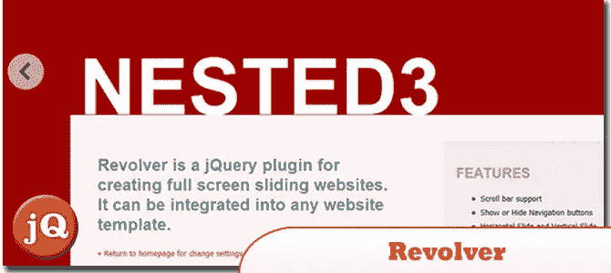
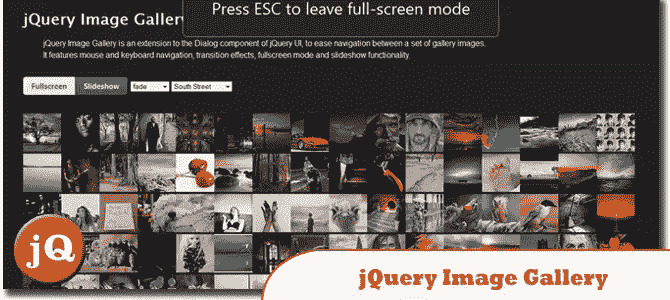
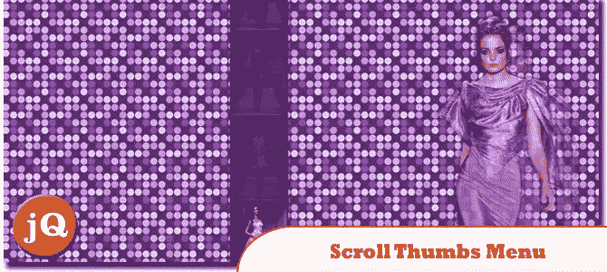
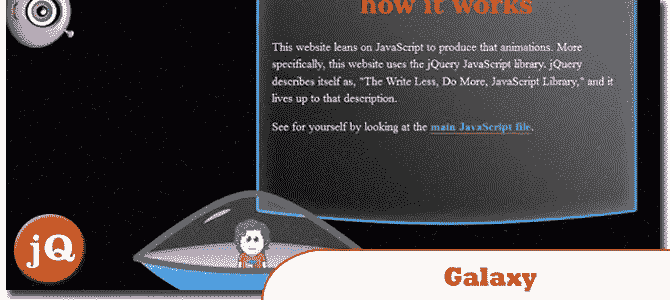
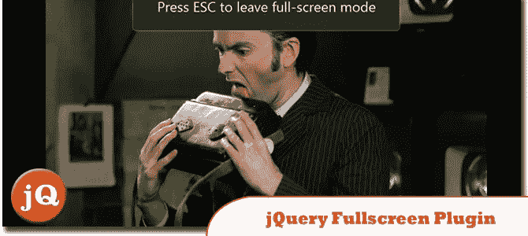
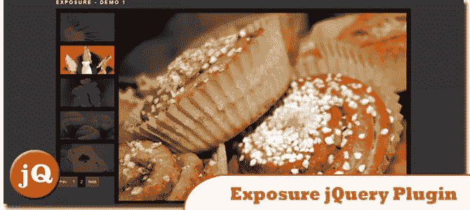
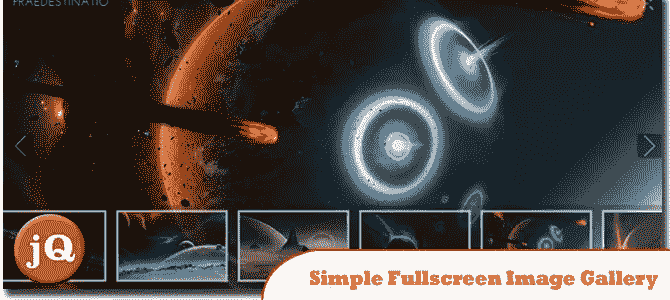
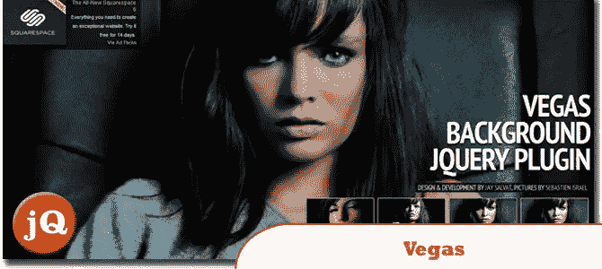
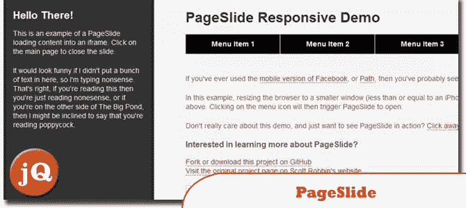
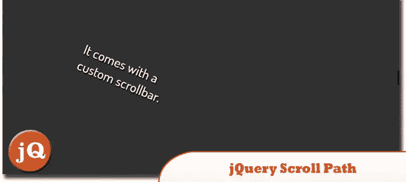

# 12 个 jQuery 全屏插件

> 原文：<https://www.sitepoint.com/jquery-fullscreen-plugins/>

让我们面对它，有时全屏网站是超级酷的，如果一个网站看起来平淡乏味，你认为访问者会停留多久？所以我们认为我们可以提供一些帮助，并与你分享这 12 个 jQuery 全屏插件,让你的网站具有响应性的全屏外观。这些 jQuery fullsreen 插件的集合将会给你的网站带来巨大的影响。尽情享受吧！

**相关帖子:**

*   [**100 个图片/内容的 jQuery 滑块**](http://www.jquery4u.com/plugins/100-jquery-sliders-part1/)
*   [**30 jQuery 响应式布局插件**](http://www.jquery4u.com/page-layout/30-jquery-responsive-layout-plugins/)

## 1.左轮手枪

一个用于创建全屏滑动网站的 jQuery 插件。它可以集成到任何网站模板。
 
[源+演示](http://2.s3.envato.com/files/27577254/index.html#/homepage)

## 2.全屏音乐播放器

一个非常简单的方法可以把任何无序的 MP3 列表变成一个漂亮的播放列表。
 
[来源](http://codecanyon.net/item/fullscreen-music-player/106710) [演示](http://codecanyon.net/item/fullscreen-music-player/full_screen_preview/106710)

## 3.jQuery 图像库

jQuery UI 对话框组件的扩展，用于简化一组图库图像之间的导航。
 
[源+演示](http://blueimp.github.com/jQuery-Image-Gallery/)

## 4.带有 jQuery 的可滚动拇指菜单

这个想法是将一个菜单固定在页面底部，当鼠标悬停在菜单项上时，会出现一个垂直的拇指堆栈。
 
[来源](http://tympanus.net/codrops/2010/05/10/scrollable-thumbs-menu/) [演示](http://tympanus.net/Tutorials/ScrollingThumbs/)

## 5.银河

只需点击上面的菜单项，无需使用 Flash 就可以缩放我的世界并了解更多关于网络动画的信息。
 
[源+演示](http://playground.adambecker.info/galaxy/#)

## 6.jQuery 全屏插件

例如，这对于视频或图像非常有用。不幸的是，浏览器目前只提供必要的方法和通常的特定于浏览器的前缀。
 
[源+演示](http://www.ailis.de/~k/archives/66-jQuery-Fullscreen-Plugin.html)

## 7.曝光 jQuery 插件

给你的图像一些体面的曝光。
 
[来源](http://exposureforjquery.wordpress.com/) [演示](http://exposure.blogocracy.org/demos/demo1.html?v=1.0)

## 8.自定义 Jimdo 模板的 jQuery 全屏插件

一个全屏背景/幻灯片 jQuery 插件，可以调整图像大小以填充浏览器，同时保持图像尺寸比例。
 
[来源](http://www.hembarevskyy.com/2012/07/05/jquery-fullscreen-plugin-for-custom-jimdo-template/) [演示](http://pro-photography.jimdo.com/)

## 9.简单的 jQuery 全屏图片库

用 jQuery 和 CSS 制作的全屏图库。图库具有各种模式的全屏图像和自定义缩略图滚动脚本。
 
[来源](http://manos.malihu.gr/simple-jquery-fullscreen-image-gallery) [演示](http://manos.malihu.gr/tuts/malihu-jquery-image-gallery/malihu-jquery-image-gallery.html)

## 10.Vegas 后台 jQuery 插件

Vegas 是一个 jQuery 插件，可以给你的网页添加漂亮的全屏背景。你甚至可以制作令人惊叹的幻灯片。
 
[来源](http://vegas.jaysalvat.com/) [演示](http://vegas.jaysalvat.com/demo/)

## 11.页面幻灯片

一个 jQuery 插件，可以滑动网页以显示额外的交互面板。
 
[来源](http://srobbin.com/jquery-plugins/pageslide/) [演示](http://srobbin.github.com/jquery-pageslide/)

## 12.jQuery 滚动路径

这是一个定义自定义滚动路径的插件。它使用画布风格的语法来绘制线条和弧线。
 
[源+演示](http://joelb.me/scrollpath/)

## 分享这篇文章