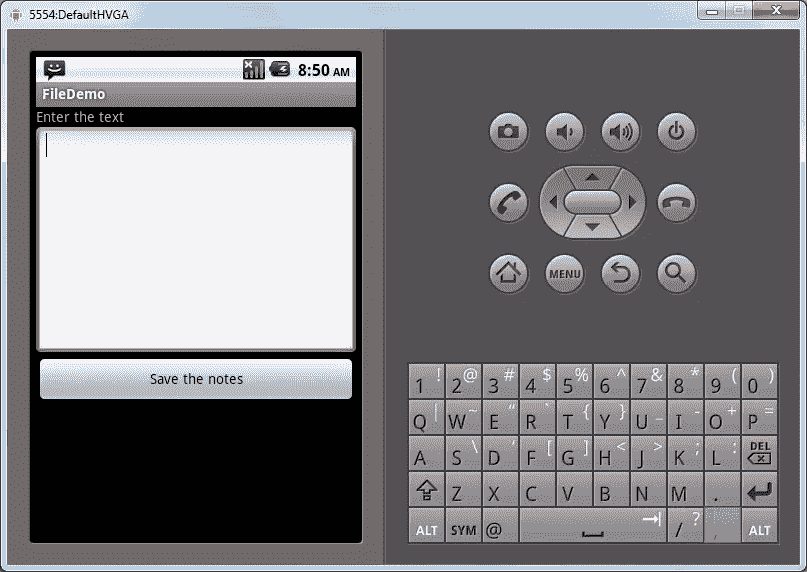
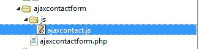
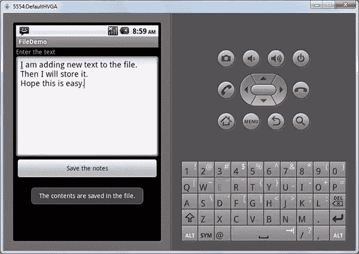
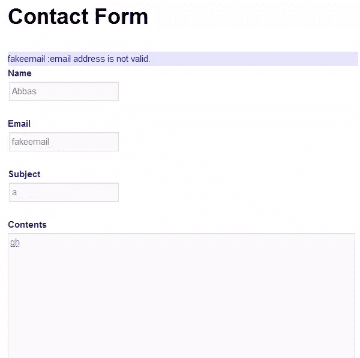
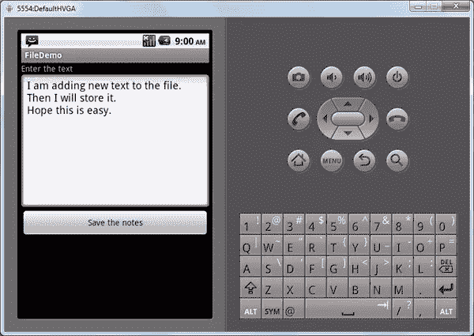

# 构建一个 WordPress 插件来创建一个 AJAX 联系人表单

> 原文：<https://www.sitepoint.com/building-a-wordpress-plugin-to-create-an-ajax-contact-form/>

除了为我们提供创建帖子和页面等功能，WordPress 还通过插件为增强网站功能提供了很好的支持。在这篇文章中，我们将看到如何在 WordPress 中创建一个简单的联系人表单插件，并通过 AJAX 发布数据。

## **创建插件**

让我们从创建一个插件开始。要在 WordPress 的 wp-contentplugins 文件夹中创建插件，为插件创建一个名为 ajaxcontactform 的文件夹。在里面，创建一个名为 ajaxcontactform.php 的文件，这将是我们插件的主文件。

在这个文件中，现在让我们把插件头如下:

```
<?php

/*

Plugin Name: Ajax Contact Form

Plugin URI:

Description:Uses a short code for contact form

Author: Abbas Suterwala

Version:

Author URI:

*/
```

WordPress 需要这个标题来识别插件。现在登录到你的 WordPress 安装的管理部分，如果一切正常，你应该能够在插件列表中看到你的 WordPress 插件，如下所示。让我们现在激活插件。



我们将使用 jQuery 来处理我们的 AJAX 请求。为此，让我们在 ajaxcontactform 文件夹中创建一个名为 js 的文件夹，您可以在其中创建一个 ajaxcontact.js 文件。这个文件将包含 AJAX 调用的代码。

我们的文件夹结构如下:



现在让我们定义一些将在插件中使用的基本变量，并将我们的 JavaScript 文件排队。我们将这样做:

```
define('ACFSURL', WP_PLUGIN_URL."/".dirname( plugin_basename( __FILE__ ) ) );

define('ACFPATH', WP_PLUGIN_DIR."/".dirname( plugin_basename( __FILE__ ) ) );

function ajaxcontact_enqueuescripts()

{

wp_enqueue_script('ajaxcontact', ACFSURL.'/js/ajaxcontact.js', array('jquery'));

wp_localize_script( 'ajaxcontact', 'ajaxcontactajax', array( 'ajaxurl' => admin_url( 'admin-ajax.php' ) ) );

}

add_action('wp_enqueue_scripts', ajaxcontact_enqueuescripts);
```

## 创建表单

现在让我们为联系人表单创建 UI。为我们的联系人表单创建 UI 的函数如下:

```
function ajaxcontact_show_contact()

{

?>

<form id="ajaxcontactform" action="" method="post"enctype="multipart/form-data">

<div id="ajaxcontact-text">

<div id="ajaxcontact-response" style="background-color:#E6E6FA ;color:blue;"></div>

<strong>Name </strong> <br/>

<input type="text" id="ajaxcontactname" name="ajaxcontactname"/><br />

<br/>

<strong>Email </strong> <br/>

<input type="text" id="ajaxcontactemail" name="ajaxcontactemail"/><br />

<br/>

<strong>Subject </strong> <br/>

<input type="text" id="ajaxcontactsubject" name="ajaxcontactsubject"/><br />

<br/>

<strong>Contents </strong> <br/>

<textarea id="ajaxcontactcontents" name="ajaxcontactcontents"  rows="10" cols="20"></textarea><br />

<a onclick="ajaxformsendmail(ajaxcontactname.value,ajaxcontactemail.value,ajaxcontactsubject.value,ajaxcontactcontents.value);" style="cursor: pointer"><b>Send Mail</b></a>

</div>

</form>

<?php

}
```

在这个函数中，我们为联系人表单插件创建了一个

<form>标签区域。在标签中，我们有姓名、电子邮件和主题的文本字段。我们使用了一个文本区域来显示联系表单的内容。</form>

然后我们创建了一个名为 Send mail 的链接，点击它将调用 ajaxformsendmail()函数。我们将在下面定义这个函数。在这个函数中，我们传递名称、电子邮件、主题和内容字段的值。

为了检查我们的 UI，我们可以从主题中的某个地方调用这个函数。如果我们调用主题中的函数，那么联系表单应该如下所示:



## AJAX 处理程序

现在让我们创建处理 AJAX 请求的函数。链接到该处理程序的$_POST 请求将发布用户输入的名称、电子邮件、主题和内容值。

下面是处理程序的代码:

```
function ajaxcontact_send_mail()

{

$results = '';

$error = 0;

$name = $_POST['acfname'];

$email =            $_POST['acfemail'];

$subject = $_POST['acfsubject'];

$contents = $_POST['acfcontents'];

$admin_email = get_option('admin_email');

if (!filter_var($email, FILTER_VALIDATE_EMAIL))

{

$results = $email." :email address is not valid.";

$error = 1;

}

elseif( strlen($name) == 0 )

{

$results = "Name is invalid.";

$error = 1;

}

elseif( strlen($subject) == 0 )

{

$results = "Subject is invalid.";

$error = 1;

}

elseif( strlen($contents) == 0 )

{

$results = "Content is invalid.";

$error = 1;

}

if($error == 0)

{

$headers = 'From:'.$email. "rn";

if(wp_mail($admin_email, $subject, $contents, $headers))

{

$results = "*Thanks for you mail.";

}

else{

$results = "*The mail could not be sent.”

}

}

// Return the String

die($results);

}
```

在处理程序中，我们首先从$_POST 变量中获取名称、电子邮件、主题和内容。然后，我们对数据进行一些验证。为了检查电子邮件是否是有效的地址，我们使用 PHP 函数 filter_var($email，FILTER_VALIDATE_EMAIL)来验证电子邮件地址。然后，我们对其他参数是否为空进行简单的验证。如果我们发现一个错误，我们就返回这个错误，这样 UI 就可以向用户显示一个错误消息。

如果验证失败，将会看到以下错误消息:



一旦基本验证完成，我们将通过函数 get_option('admin_email ')获得 WordPress 管理邮件。然后我们使用 WordPress 函数 wp_mail()，通过它邮件被发送到 WordPress admin。如果有错误，将设置错误消息，并显示给用户。

## 注册 AJAX 处理程序

现在我们的 AJAX 处理程序已经准备好了，让我们向 WordPress 注册 is，这样它就可以开始处理 AJAX 请求了。我们可以这样做:

```
// creating Ajax call for WordPress

add_action( 'wp_ajax_nopriv_ajaxcontact_send_mail', 'ajaxcontact_send_mail' );

add_action( 'wp_ajax_ajaxcontact_send_mail', 'ajaxcontact_send_mail' );
```

这基本上注册了我们的函数 ajaxcontact_send_mail()来处理到达 WordPress 的 AJAX 请求，其动作名为 ajaxcontact_send_mail。

## 发送 AJAX 请求

现在让我们编写 JavaScript 函数 ajaxformsendmail()，它将表单值作为输入。

该功能如下所示:

```
function ajaxformsendmail(name,email,subject,contents)

{

jQuery.ajax({

type: 'POST',

url: ajaxcontactajax.ajaxurl,

data: {

action: 'ajaxcontact_send_mail',

acfname: name,

acfemail: email,

acfsubject:subject,

acfcontents:contents

},

success:function(data, textStatus, XMLHttpRequest){

var id = '#ajaxcontact-response';

jQuery(id).html('');

jQuery(id).append(data);

},

error: function(MLHttpRequest, textStatus, errorThrown){

alert(errorThrown);

}

});

} 
```

在这个函数中，我们使用 jQuery。ajax 函数来发布我们的 AJAX 请求。我们使用已经设置好的 ajaxcontactajax.ajaxurl。我们将动作设置为‘ajaxcontact _ send _ mail ’,这样请求就会发送到我们的 AJAX 处理程序。我们也张贴所需的信息。

当请求成功时，调用 success:函数，在该函数中，我们设置来自请求处理程序的数据，并将其添加到

ajaxcontact-response。

如果 AJAX 请求失败，我们只显示一个带有错误的警告。

## 创建短代码

现在让我们创建一个短代码，这样我们就可以将我们的联系方式添加到任何页面或帖子中。我们首先创建一个如下的函数:

```
function ajaxcontact_shortcode_func( $atts )

{

ob_start();

ajaxcontact_show_contact();

$output = ob_get_contents();

ob_end_clean();

return $output;

} 
```

这个函数将首先启动输出缓冲，这样输出就不会直接打印到屏幕上。然后，我们基本上调用 ob_get_contents()函数，该函数包含联系人表单的代码。我们在一个变量中获取输出，清理缓冲区并返回输出。

为了从这个函数中创建一个短代码，我们执行以下操作:

```
add_shortcode( 'ajaxcontact', 'ajaxcontact_shortcode_func' );
```

现在我们可以创建一个单独的页面，并添加 shortcode [ajaxcontact]来显示表单。

我们完成的联系表将如下所示:



## 分享这篇文章