# 用 Photoshop 制作逼真的头发

> 原文：<https://www.sitepoint.com/create-realistic-hair-with-photoshop/>

在 Photoshop 中创建逼真的头发不是一件容易的事情。没有“头发”刷或即时头发按钮。关于创建逼真的头发，有一点是每个案例都是不同的。为一个场景创建的头发可能不会应用于下一个主题。虽然这个过程可能会令人望而生畏，但如果你遵循这些步骤，你将能够在 Photoshop 中快速轻松地创建逼真的头发。

你可以在这里下载样图[。我们将使用一些简单的技巧从头开始创建一个短发型。](http://www.sxc.hu/browse.phtml?f=download&id=618445)

[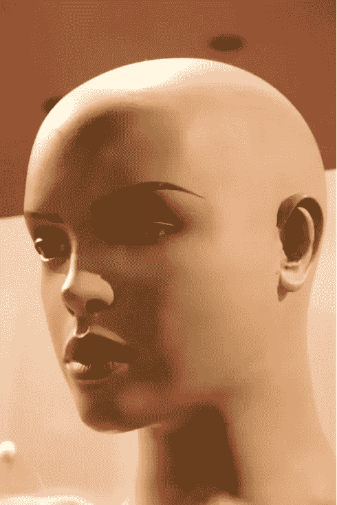](https://www.sitepoint.com/wp-content/uploads/2012/07/Screen-shot-2012-07-08-at-11.41.29-AM.png)

首先，我们需要把她从背景中提取出来。使用快速选择工具，单击并拖动人体模型头部，确保不要让任何背景进入选择。要添加到选区，只需单击要包含在选区中的区域。要从选区中移除图像的一部分，请按住 alt/option 并点按以移除它。

[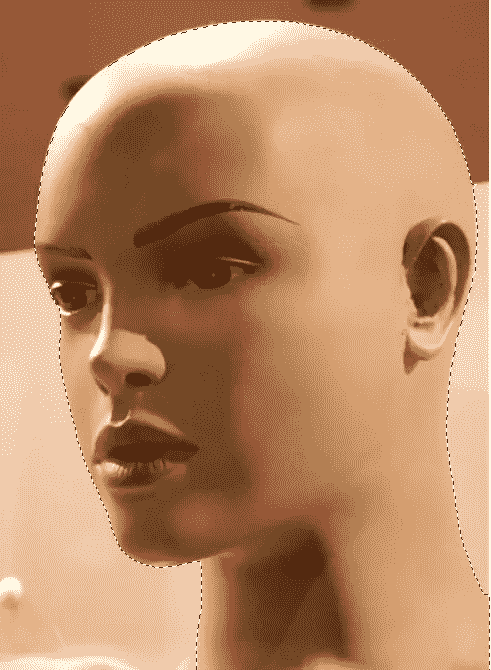](https://www.sitepoint.com/wp-content/uploads/2012/07/Screen-shot-2012-07-08-at-11.56.20-AM.png)

一旦你对选区满意了，点击顶部选项菜单中的调整边缘按钮来调整它。将平滑值一路向上凸起，因为蒙版显示选择是凸起的和不自然的。给选区添加 1.5 像素的羽化，然后点击去污按钮。选择使用图层蒙版导出到新图层，然后单击“确定”。

[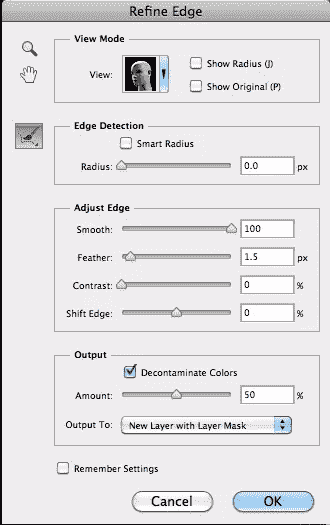](https://www.sitepoint.com/wp-content/uploads/2012/07/Screen-shot-2012-07-08-at-11.59.15-AM.png)

如果图像中有你不喜欢的区域，按住 alt/option 键点击图层蒙版，用黑色遮盖图像的一部分，用白色涂回区域。完成后，您可以保持图层不变，也可以右键单击遮罩图标，然后选择“应用遮罩”。

[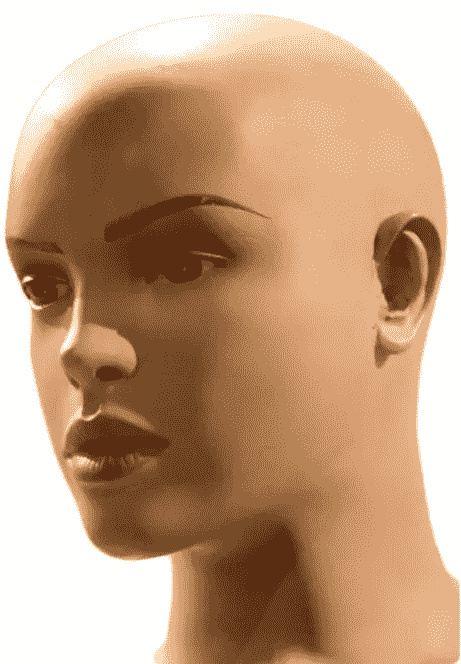](https://www.sitepoint.com/wp-content/uploads/2012/07/Screen-shot-2012-07-08-at-12.19.07-PM.png)

接下来，图像有点太窄，所以去“图像”>“画布大小”，改变宽度为 1400，有足够的空间来构建头发。在更严格的限制下工作会困难得多。

[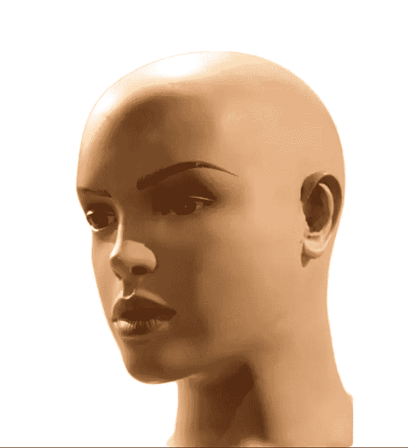](https://www.sitepoint.com/wp-content/uploads/2012/07/Screen-shot-2012-07-08-at-12.23.01-PM.png)

下一步创建一个新的空白层以上的头部层。选择钢笔工具，开始创建头发的基本形状。因为我们的主题将有一部分在她的头发上，我们将分三个阶段创建头发的基础:每一边一个，下面是可见的。每个部分都将在它自己的层上创建，这样我们可以不同地控制每个部分。

创建第一个部分来模拟下面的示例。要使圆形锚点变成锐角(以便可以变成锐角)，请按住 Alt/Option 键并单击要更改的锚点。在绘制路径时，您将执行此操作。一旦你创建了头发的右侧，用钢笔工具，选择一个中性的棕色作为你的前景色，并前往路径面板。单击面板底部的“用前景色填充路径”图标。

[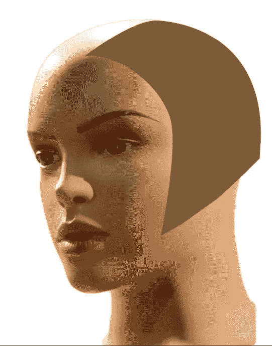](https://www.sitepoint.com/wp-content/uploads/2012/07/Screen-shot-2012-07-08-at-12.37.27-PM.png)

对于她的左侧头发，我们将再次使用钢笔工具创建整体形状。确保头发的部分是可见的，但是要尽量靠近头发右边部分的边缘，只露出一小部分头皮。在这一边，头发的下面将是可见的，所以我们将创建一个单独的层，这样我们就可以把它放在头部层。复制如下所示的整体形状，重复我们在头发右侧使用的路径面板中的步骤。

[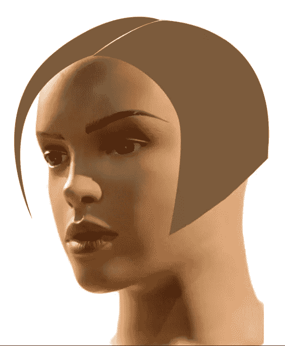](https://www.sitepoint.com/wp-content/uploads/2012/07/Screen-shot-2012-07-08-at-12.40.57-PM.png)

接下来，创建另一个新的空白层，但它的位置低于头部层，这样头发就消失在头部后面，增加了深度和真实感。像以前一样使用钢笔工具，沿着已经创建的头发轮廓，在底部给头发一个圆形边缘。确保你画的形状在头部后面消失。像以前一样，用我们的棕色底料填满它。

[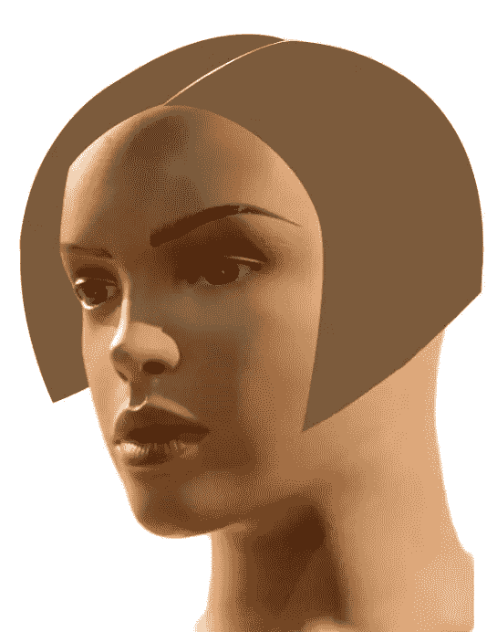](https://www.sitepoint.com/wp-content/uploads/2012/07/Screen-shot-2012-07-08-at-12.47.40-PM.png)

现在我们已经完成了基础形状，我们需要细化底部边缘，使它们看起来像自然的头发。没有任何现存的头发会有如此清晰完美的线条。选择涂抹工具，然后从选项栏的“预设”菜单中选择“飞溅 14px”画笔。选择头发右半部分的图层，放大到头发的底部边缘。向下刷，使边缘模拟许多头发。正是这些类型的不完美让你的作品看起来更真实。

[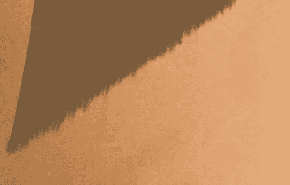](https://www.sitepoint.com/wp-content/uploads/2012/07/Screen-shot-2012-07-08-at-6.27.59-PM.png)

我们不需要对头发的左上部分做这一步，但是我们需要对主体头部后面消失的部分做这一步。重复上一步，向下刷以模拟单股头发。

[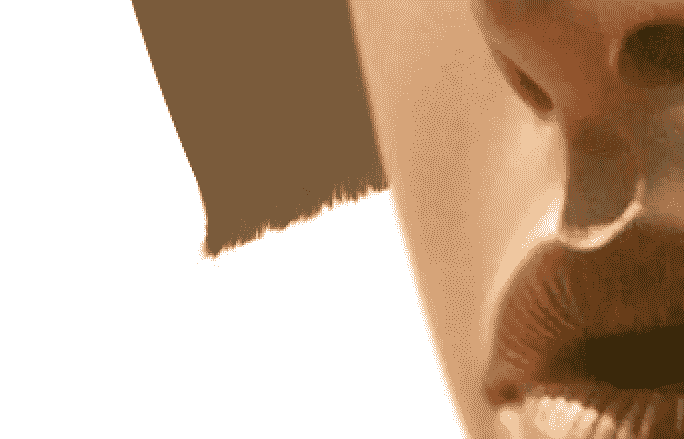](https://www.sitepoint.com/wp-content/uploads/2012/07/Screen-shot-2012-07-08-at-6.37.36-PM.png)

接下来，我们需要模拟头发。我们可以使用刷子来绘制单根头发，但用鼠标来做可能很困难，使用平板电脑仍然需要手工绘制每根头发。这可能需要大量的试验和错误，但有一个更简单的方法。选择包含头发的正确部分的层，并在其上创建一个新层。确保你的前景和背景颜色是最理想的黑色和白色。点击 Alt/Option + Delete，用你的前景色填充图层。然后，进入“过滤器”>“渲染”>“纤维”单击随机化，直到您对结果满意为止。确保您选择了一个整体明暗平衡的选项，然后单击“确定”。

[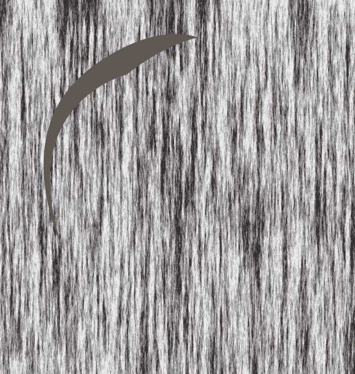](https://www.sitepoint.com/wp-content/uploads/2012/07/Screen-shot-2012-07-09-at-7.57.03-PM.png)

您可以右键单击一个图层并选择“创建剪贴蒙版”,或者可以在“图层”面板中的两个图层之间按住 Alt/Option 键单击，将纤维图层剪贴到下面的头发形状。然后点击 Command/Ctrl+“T”来变换纤维层。倾斜它，使纤维松散地跟随头发流动的方向。

[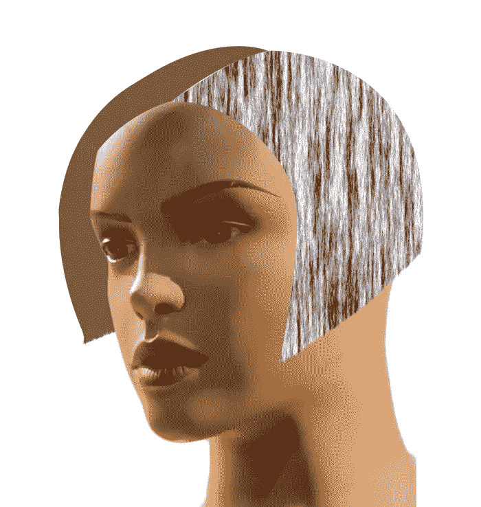](https://www.sitepoint.com/wp-content/uploads/2012/07/Screen-shot-2012-07-09-at-7.57.48-PM.png)

[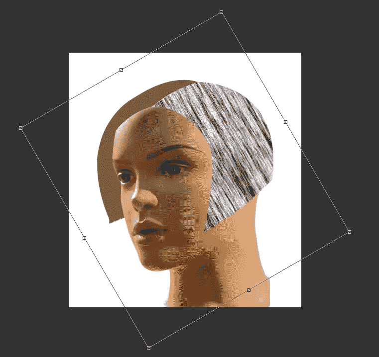](https://www.sitepoint.com/wp-content/uploads/2012/07/Screen-shot-2012-07-09-at-7.58.23-PM.png)

当图层处于变换模式时，右键单击画布并选择扭曲。然后，你可以塑造纤维来匹配头发的轮廓。弯曲贝塞尔手柄，可以操作任何网格线。这将使轮廓围绕头发的形状弯曲。

[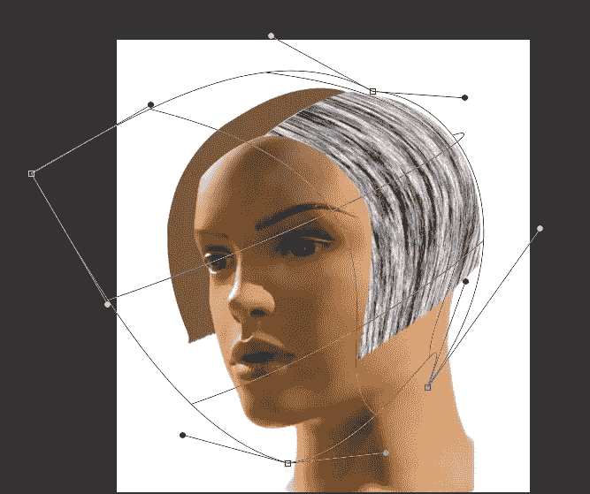](https://www.sitepoint.com/wp-content/uploads/2012/07/Screen-shot-2012-07-09-at-8.00.05-PM.png)

[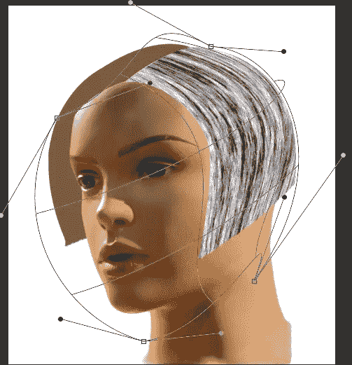](https://www.sitepoint.com/wp-content/uploads/2012/07/Screen-shot-2012-07-09-at-8.00.44-PM.png)

一旦你对纤维层的轮廓感到满意，设置混合模式为叠加，这将叠加深色，给头发一种低亮度的错觉。

[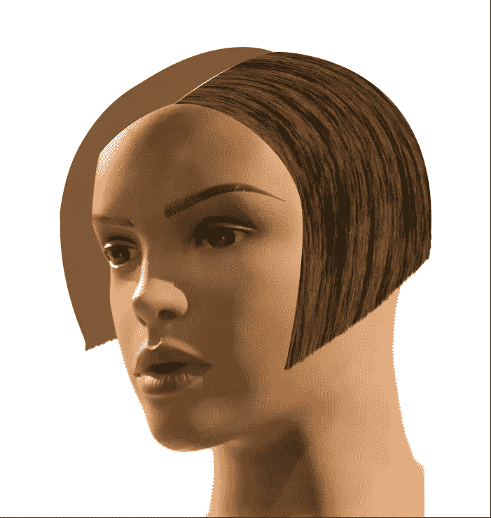](https://www.sitepoint.com/wp-content/uploads/2012/07/Screen-shot-2012-07-09-at-8.01.43-PM.png)

对头部后面的头发层和左侧的头发重复这个过程，以便头发在所有区域都具有一致的纤维纹理。

[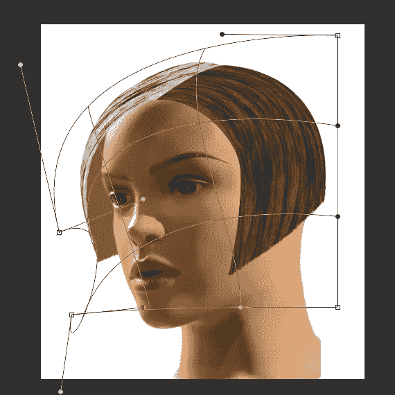](https://www.sitepoint.com/wp-content/uploads/2012/07/Screen-shot-2012-07-09-at-8.07.13-PM.png)

[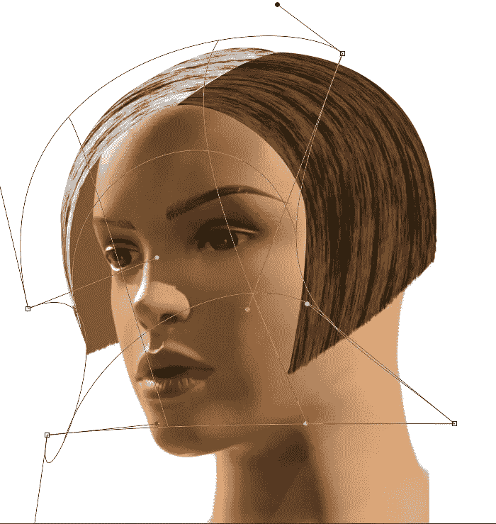](https://www.sitepoint.com/wp-content/uploads/2012/07/Screen-shot-2012-07-09-at-8.09.02-PM.png)

只要你令人信服地弯曲头发轮廓周围的纹理，网格或栅格的形状真的没有什么区别。如果它朝某个方向流动，就朝那个方向弯曲。

[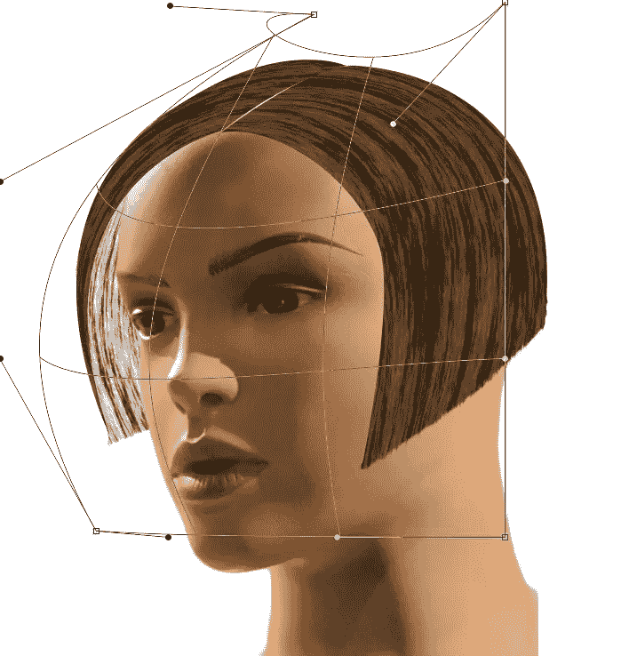](https://www.sitepoint.com/wp-content/uploads/2012/07/Screen-shot-2012-07-09-at-8.12.00-PM.png)

到目前为止，我们已经添加了纹理来模拟头发，但整体外观是平的。是时候添加光影了。首先，我们将从阴影开始，选择加深工具。确保你准备了一把大的软边刷。选择我们最初创建的棕色基层。因为我们的纹理层被设置为叠加，当我们加深棕色层时，阴影会显现出来。曝光设置为 50%左右，刷过头发的上部，靠近她的头发部分。你还需要刷左侧头发的下面，左侧头发的一部分，以及头发的底部边缘，但只是稍微刷一下。

[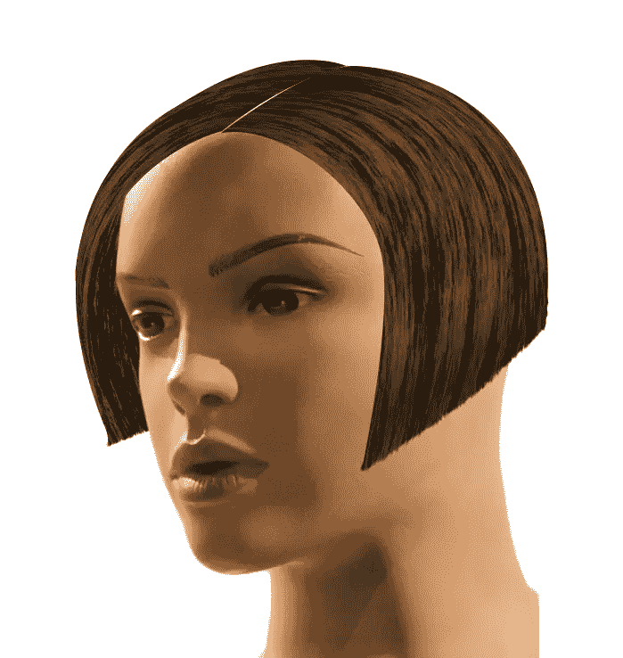](https://www.sitepoint.com/wp-content/uploads/2012/07/Screen-shot-2012-07-09-at-8.16.01-PM.png)

选择减淡工具，用软边笔刷在头发的中间区域上色，突出头发的高光。你一般要尽量匹配脸上发现的高光。

[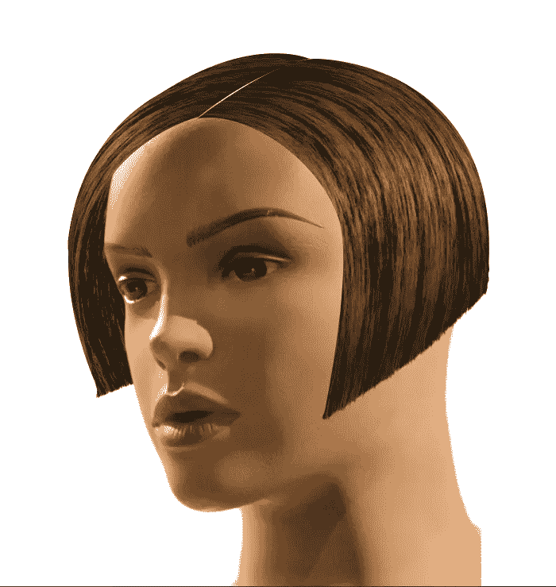](https://www.sitepoint.com/wp-content/uploads/2012/07/Screen-shot-2012-07-09-at-8.16.59-PM.png)

后面的头发看起来有点僵硬和扁平。选择原来的棕色形状层。选择涂抹工具和软边圆形笔刷，设置大小为 2px-5px。将强度设置为 50%，沿着头发的轮廓，从外向内快速刷动。

[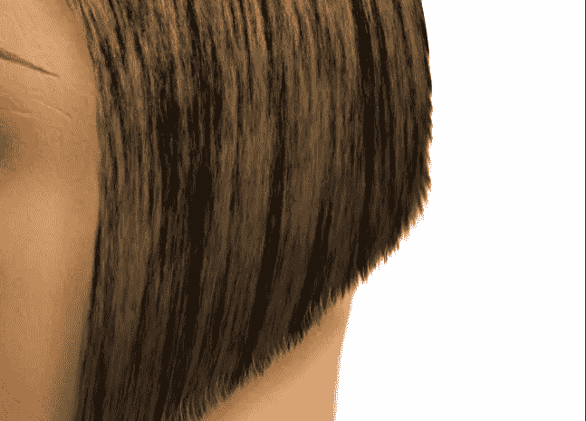](https://www.sitepoint.com/wp-content/uploads/2012/07/Screen-shot-2012-07-15-at-1.17.26-AM.png)

关于头发有一点不能令人信服，那就是它看起来像是贴在头顶上的。头发实际上会在脸部和头部本身投下轻微的阴影。在右侧头发层下面新建一个层。按住 Command/Ctrl 键单击头发层，使其形状成为选区，但确保下面创建的空白层处于活动状态。点击 Shift+Delete，用黑色填充选区。按 Command/Ctrl+ "D "取消选择形状。进入“滤镜”>“高斯模糊”，设置模糊量为 20px。

[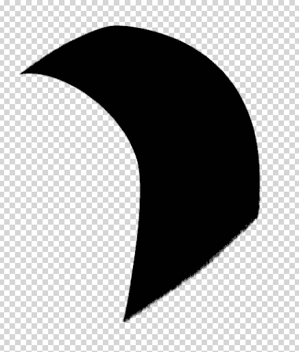](https://www.sitepoint.com/wp-content/uploads/2012/07/Screen-shot-2012-07-10-at-2.38.43-AM.png)

[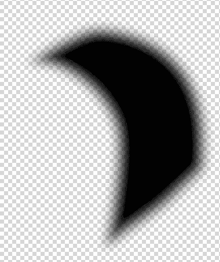](https://www.sitepoint.com/wp-content/uploads/2012/07/Screen-shot-2012-07-10-at-2.39.30-AM.png)

[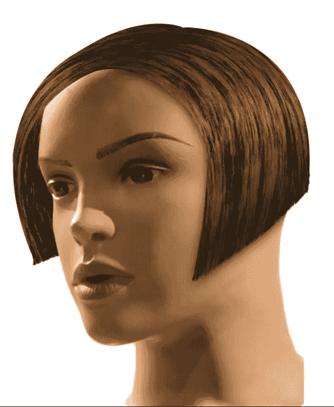](https://www.sitepoint.com/wp-content/uploads/2012/07/Screen-shot-2012-07-10-at-2.43.35-AM.png)

在我们为另一边制作阴影之前，我们需要消除模特前额的高光。选择克隆工具，克隆皮肤的中间色调颜色，填充高光区域直到她的发际线。按住 Option/Alt 键并点按以对某个区域进行采样，然后像画笔一样简单地在其中绘画。对不同的颜色区域进行取样，这样你就不会有大块的颜色，这样看起来会不现实。

[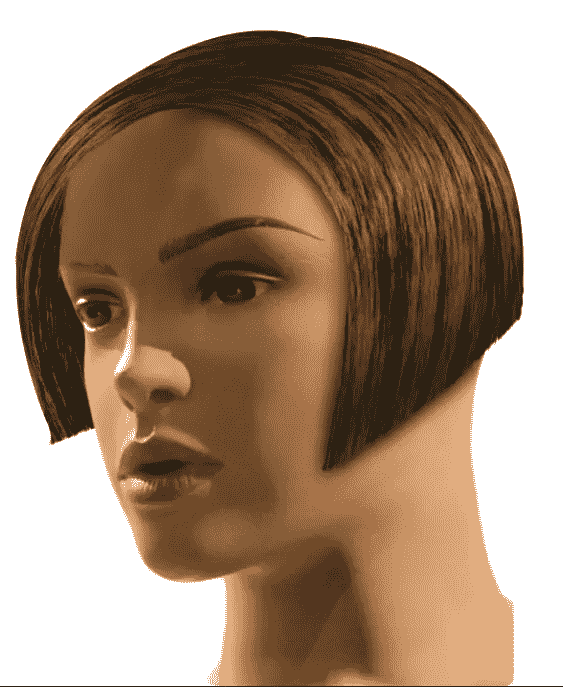](https://www.sitepoint.com/wp-content/uploads/2012/07/Screen-shot-2012-07-10-at-2.54.41-AM.png)

接下来，我们需要为左侧添加阴影。只需选择每个部分的基础头发形状层，创建一个新的层，并用黑色填充选择。选择移动工具后，使用箭头键将阴影向右微移，以便它们显示在脸上。

[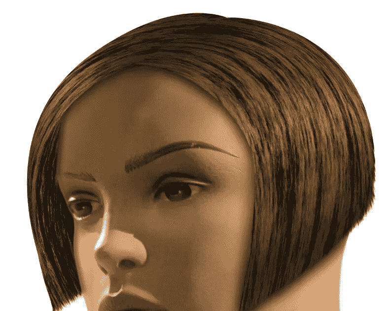](https://www.sitepoint.com/wp-content/uploads/2012/07/Screen-shot-2012-07-12-at-2.12.56-AM.png)

我们可以就此打住，但问题是头发通常不会这么尖，除非是在沙龙里做发型，或者是为了某种商业目的。接下来，我们将添加刘海和头发，以增加更多的真实感和生命。首先，我们需要创建刘海的大致形状。一个简单的整体形状，我们可以带走蒙版将是最好的，因为你总是可以调整一个黑色的蒙版来带走更多的东西，或者白色来增加像素信息回到图像中。

[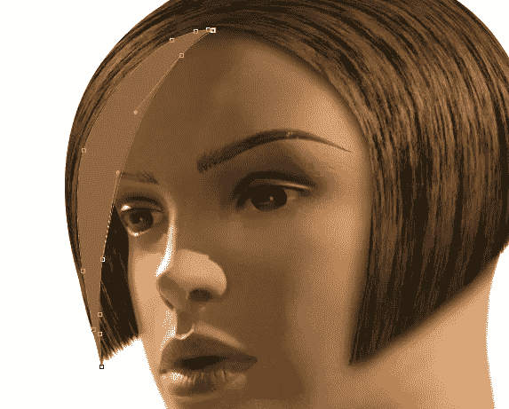](https://www.sitepoint.com/wp-content/uploads/2012/07/Screen-shot-2012-07-14-at-8.58.50-PM.png)

接下来，我们需要使用纤维再次创建纹理，就像之前一样。

[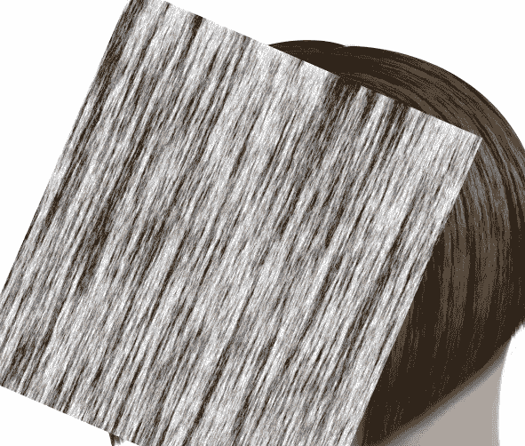](https://www.sitepoint.com/wp-content/uploads/2012/07/Screen-shot-2012-07-14-at-9.02.32-PM.png)

使用扭曲和变换方法将纤维塑造成发束。然后，设置混合模式为乘法。

[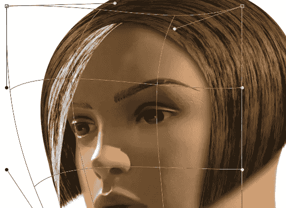](https://www.sitepoint.com/wp-content/uploads/2012/07/Screen-shot-2012-07-14-at-9.03.52-PM.png)

用减淡和软边笔刷添加光和阴影，就像我们之前创建的头发的其他部分一样。

[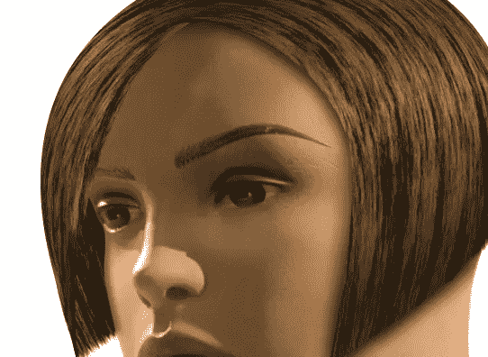](https://www.sitepoint.com/wp-content/uploads/2012/07/Screen-shot-2012-07-14-at-9.04.35-PM.png)

接下来，我们需要去除大块的头发来模拟刘海，以及这些头发是如何聚在一起的。为此，我们需要使用创建一个图层蒙版。在默认预设中选择可用的画笔预设。唯一的问题是它的角度不符合我们的头发。要解决这个问题，我们需要进入笔刷选项面板。

[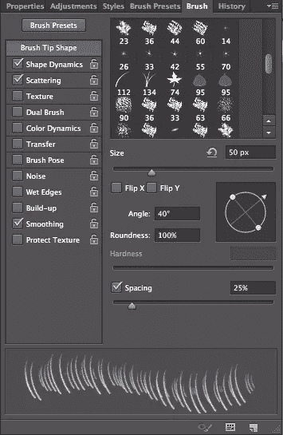](https://www.sitepoint.com/wp-content/uploads/2012/07/Screen-shot-2012-07-12-at-12.01.42-AM.png)

上面，我调整了笔刷本身的角度。这可能需要反复试验，但是你可以旋转笔刷的角度来匹配头发的轮廓。否则，保持笔刷的默认设置。确保笔刷硬度设置为，这样就不会模糊。你想要一把漂亮的硬边刷子。如果你不喜欢你的结果，你可以简单地用白色填充遮罩，然后再试一次。

[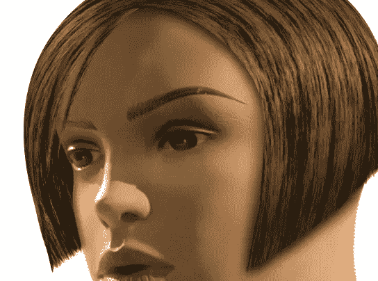](https://www.sitepoint.com/wp-content/uploads/2012/07/Screen-shot-2012-07-14-at-9.05.23-PM.png)

头发会投下阴影。要创建阴影，复制图层，甚至使用蒙版。让它们都保持原样，然后按住 Command/Ctrl 键单击底层。用黑色填充选区并将选区向右微移。图层蒙版不允许阴影显示，但这可以通过选择图层蒙版来解决。alt/Option-单击图层蒙版使其可见，并按 Command/Ctrl + "A "选择全部。然后，只需向右轻推蒙版，直到阴影变得可见。进入“滤镜”>“模糊”>“高斯模糊”稍微模糊一下阴影。

接下来，我们需要为另一边创建刘海。这将遵循我们在之前领域中使用的相同原则。创建头发的基本形状。

[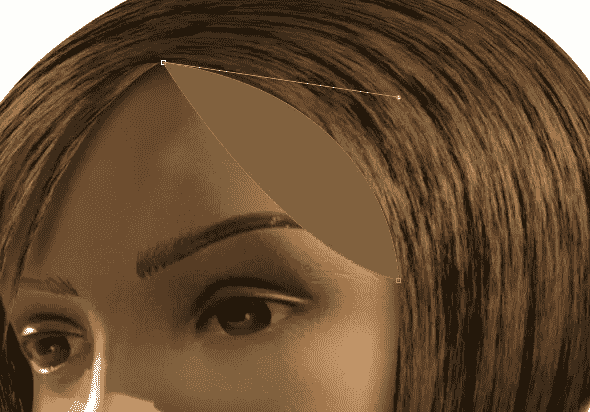](https://www.sitepoint.com/wp-content/uploads/2012/07/Screen-shot-2012-07-12-at-12.55.35-AM.png)

添加纹理层，并弯曲它，就像你在前面的头发部分所做的那样。

[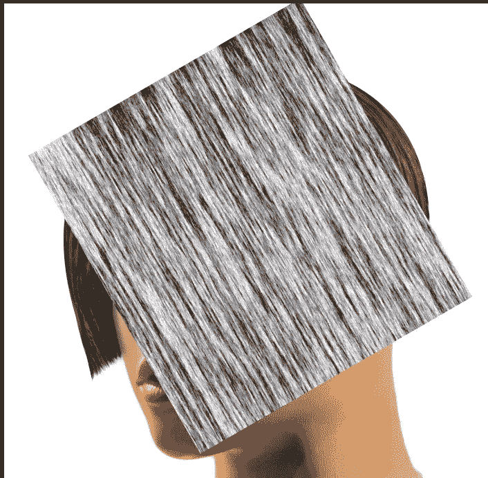](https://www.sitepoint.com/wp-content/uploads/2012/07/Screen-shot-2012-07-12-at-12.57.20-AM.png)

[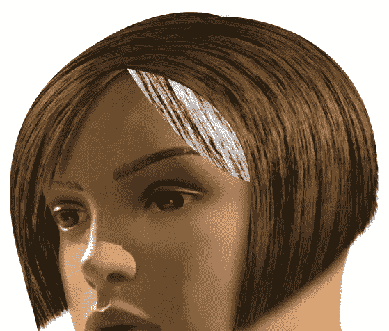](https://www.sitepoint.com/wp-content/uploads/2012/07/Screen-shot-2012-07-12-at-12.57.58-AM.png)

将纹理层设置为多重，在原来的棕色形状层上减淡和加深高光和阴影。确保它跟随它旁边的头发的光和阴影，以便它很好地流动在一起。

[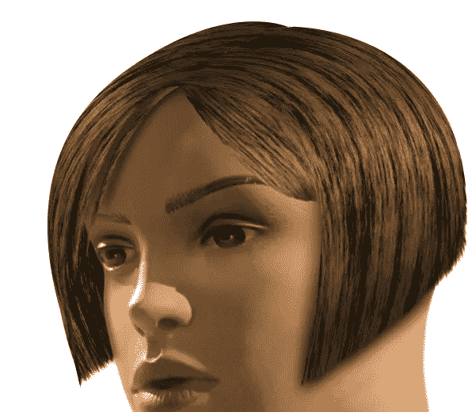](https://www.sitepoint.com/wp-content/uploads/2012/07/Screen-shot-2012-07-14-at-11.35.52-PM.png)

旋转笔刷面板中的笔刷，用它来遮盖刘海，就像 w 在头发左侧所做的那样。如果边缘太粗糙，选择涂抹工具，羽化锐利的边缘来混合粗糙的线条。

[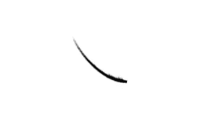](https://www.sitepoint.com/wp-content/uploads/2012/07/Screen-shot-2012-07-14-at-11.33.20-PM.png)

[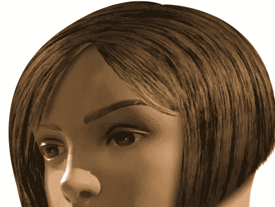](https://www.sitepoint.com/wp-content/uploads/2012/07/Screen-shot-2012-07-14-at-11.32.59-PM.png)

通过复制图层并在底部填充黑色来添加阴影。使用一个微妙的高斯模糊羽化阴影，并将其移动到左边，这样它就从头发下面伸出来了。不要忘记移动面具。

[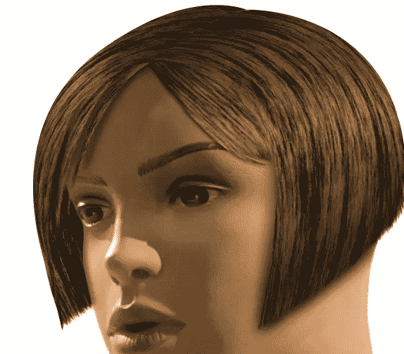](https://www.sitepoint.com/wp-content/uploads/2012/07/Screen-shot-2012-07-14-at-11.39.16-PM.png)

我们需要做的最后一件事是减少脸部周围头发的粗糙感，比如刘海本身，以及两侧的头发。这将使头发看起来更真实，不那么粗糙。用软边笔刷选择涂抹工具，设置强度为 30%，大小为 40px 左右。选择每个头发形状层(棕色基础层)，沿着粗糙的边缘刷。

[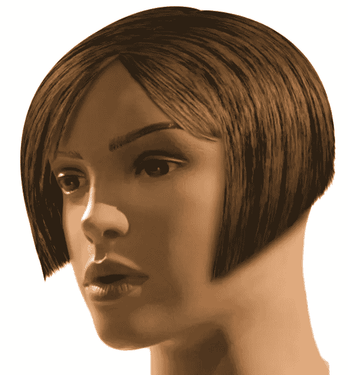](https://www.sitepoint.com/wp-content/uploads/2012/07/Screen-shot-2012-07-15-at-12.42.25-AM.png)

### 结论

在 Photoshop 中创建逼真的头发不是一件容易的事情，但是在很短的时间内，你可以创建出纤维状的，有光泽的头发，与你的主体的脸和头的轮廓相匹配。添加光线和阴影就像使用减淡和加深工具一样简单，使用变形模式中的扭曲选项可以很容易地将纹理弯曲成你想要的样子。添加阴影会增加头发的深度，同时使它看起来不那么“粘在一起”使用涂抹工具可以混合粗糙的边缘，帮助创建逼真的发梢。结合所有这些技术将允许你从头开始创造真实的头发。

## 分享这篇文章