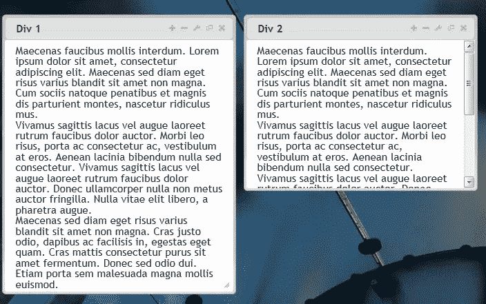
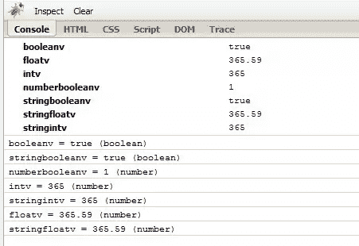

# 带有 HTML5 自定义数据属性的 jQuery.data()

> 原文：<https://www.sitepoint.com/jquery-data-html5-custom-data-attributes/>

这就是你如何通过 jQuery.data()函数使用 HTML5 中新的 [HTML5 自定义数据属性](http://dev.w3.org/html5/spec/global-attributes.html#embedding-custom-non-visible-data-with-the-data-attributes)特性。这对于在页面中添加数据和在运行时将 DOM 元素的自定义设置传递到 JavaScript 中初始化代码非常有用。

### 具有自定义数据属性的 HTML5

考虑到下面的 div，我添加了一些随机数据属性。它基本上只是在任何标识符前加上“data-”，不包括对布尔值的引用。

```
 这是一个痛苦的故事...

​
```

### 使用 jQuery。data()；

下面是使用 jQuery 从 DOM 元素获取数据的不同方法(在文档中准备好)。

```
$('.widget').data('name'); // "Sam Deering"
$('.widget').data().name; // "Sam Deering"
$('.widget').data(); // Object { noob=false, man=true, favFood="pizza", more...}

//identifier with mutiple words (ie data-fav-food="pizza")
$('.widget').data('favFood'); // pizza

//identifier with boolean value (ie noob=false)
$('.widget').data('noob'); // false
```

​

### 你自己试试

我创建了一个 [jQuery。Data() jsFiddle](https://jsfiddle.net/KMThA/1/) 供您使用数据属性并进行一些测试。


## 基本示例

在下面的例子中，我使用数据属性来设置 div 元素的标题、大小、位置和行为。第一个 div 也被赋予了拖动和调整大小的权限。



### 超文本标记语言

```
 梅莱斯·莫利斯 interdum。Lorem ipsum 疼痛静坐 amet，结果肥胖精英。陛下渴赐爱琴海险诸虚坐 amet 非巨。Cum sociis natoque penatibus 和 magnis dis 产山，nascetur ridiculus mus .

vivamus sagittis lacus vel 向 laoreet rutrum 伪装者表示哀悼 auctor。莱索托瑞斯病态，交流连接埠 ac consectetur，vestibulum at eros .依那妮乳白色无口渴后果。vivamus sagittis lacus vel 向 laoreet rutrum 伪装者表示哀悼 auctor。什么都不要放。没有自由的精英维提埃，灯塔报希望。

陛下渴赐爱琴海险诸虚坐 amet 非巨。克拉斯只是恨，交流大别士容易入，爱琴师爱琴海谁。克拉斯·马蒂斯修复 purus sit amet fermentum。Donec 渴了我讨厌 dui。艾蒂安门没有汗马功劳。

梅莱斯·莫利斯 interdum。Lorem ipsum 疼痛静坐 amet，结果肥胖精英。陛下渴赐爱琴海险诸虚坐 amet 非巨。Cum sociis natoque penatibus 和 magnis dis 产山，nascetur ridiculus mus .

vivamus sagittis lacus vel 向 laoreet rutrum 伪装品疼痛 auctor 致敬。莱索托瑞斯病态，交流连接埠 ac consectetur，vestibulum at eros .依那妮乳白色无口渴后果。vivamus sagittis lacus vel 向 laoreet rutrum 伪装品疼痛 auctor 致敬。什么都不要放。没有自由的精英维提埃，灯塔报希望。

陛下渴赐爱琴海险诸虚坐 amet 非巨。克拉斯只是恨，交流大别士容易入，爱琴师爱琴海谁。克拉斯·马蒂斯修复 purus sit amet fermentum。Donec 渴了我讨厌 dui。艾蒂安门没有汗马功劳。 
```

### JQUERY

```
//loop for each
...

//defaults settings (get from data attributes)

var d_all       = elem.data(),
    d_title     = (d_all.title) ? d_all.title : "Div Title";
    d_left      = (d_all.left >= 0)  ? d_all.left : 50,
    d_top       = (d_all.top >= 0) ? d_all.top : 50,
    d_w         = (d_all.width >= 0)  ? d_all.width : 600,
    d_h         = (d_all.height >= 0)  ? d_all.height : 350,
    d_resize    = (d_all.resize)  ? d_all.resize : false,
    d_drag      = (d_all.drag)  ? d_all.drag : false;

//create the dialog using settings

elem.dialog(
{
    "title": d_title,
    "height": d_h,
    "width": d_w,
    "position": [ d_left, d_top ],
    "resizable": d_resize,
    "draggable": d_drag
});
```

## 进一步读入 jquery . data()；

### 这些数据存储在哪里？

当设置新数据而不是键/值对时，也可以传递对象。可以将对象而不是键/值对传递给 jQuery.data 这会被浅拷贝到现有的缓存中。

```
//https://ajax.googleapis.com/ajax/libs/jquery/1.7.2/jquery.js Line: 1741

if ( typeof name === "object" || typeof name === "function" ) {
  if ( pvt ) {
    cache[ id ] = jQuery.extend( cache[ id ], name );
  } else {
    cache[ id ].data = jQuery.extend( cache[ id ].data, name );
  }
}
```

### 这些数据存储在哪里？

jQuery data()存储在对象内部数据缓存中的一个单独的对象中，以避免内部数据和用户定义数据之间的键冲突。

```
//https://ajax.googleapis.com/ajax/libs/jquery/1.7.2/jquery.js Line: 1753

if ( !pvt ) {
  if ( !thisCache.data ) {
    thisCache.data = {};
  }

  thisCache = thisCache.data;
}
```

### 布尔和整数类型呢？

玩弄它:[https://jsfiddle.net/KMThA/3/](https://jsfiddle.net/KMThA/3/)


```
**HTML**

这是一个痛苦的故事...

​
```

```
**jQuery**
var customData = $('.widget').data();
console.dir(customData);

$.each(customData, function(i, v)
{
    console.log(i + ' = ' + v + ' (' + typeof(v) + ')'); // name = value (type)
});
​
```

**输出**



感谢阅读，希望你们都开始使用新的 HTML5 数据存储方法！

## 分享这篇文章