# 把字体带出去:街头印刷的 30 个例子

> 原文：<https://www.sitepoint.com/taking-fonts-outside-30-examples-of-street-typography/>

街头艺术、街头印刷或印刷涂鸦——不管你怎么称呼它——是许多设计师研究的最激烈的艺术形式之一。阴谋的一部分是这些艺术家可支配的速度和有限的工具，更不用说艺术往往是非法的这一事实。街头艺术家不仅需要计划，而且他们需要执行独特的笔画来创建引人注目的图像，吸引用户，即使只是很短的时间。

这些例子着重于涂鸦中令人惊叹的印刷概念。注意这些街道印刷设计的动态颜色选择和比例！

* * *

### 月之光

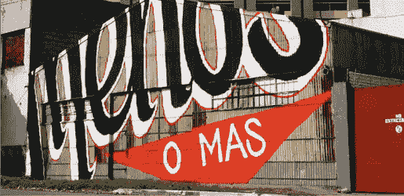

[来源](http://koikoikoi.com/2010/11/typography-graffiti-by-ripo/)

* * *

### 合适的

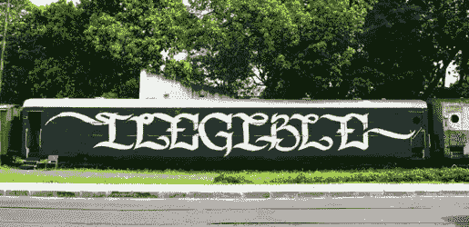

[来源](http://koikoikoi.com/2010/11/typography-graffiti-by-ripo/)

* * *

### 误解了

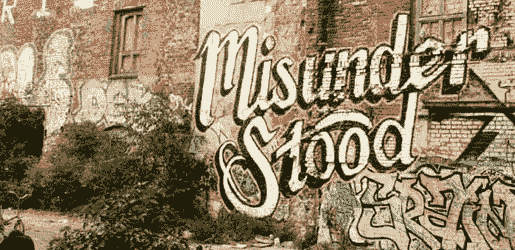

[来源](http://koikoikoi.com/2010/11/typography-graffiti-by-ripo/)

* * *

### 永恒的

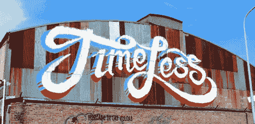

[来源](http://koikoikoi.com/2010/11/typography-graffiti-by-ripo/)

* * *

### Optimo

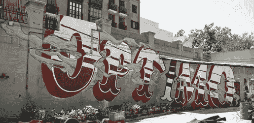

[来源](http://koikoikoi.com/wp-content/uploads/2010/11/lrg_madrid_optimo.jpg)

* * *

### 爱

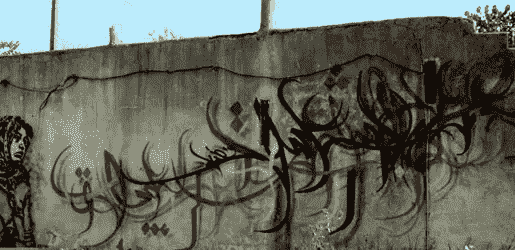

[来源](http://a1one.info/tanha/?portfolio=love-03)

* * *

### 朱诺

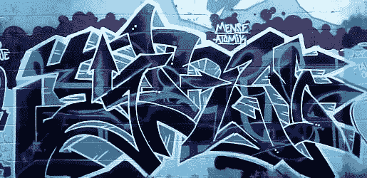

[来源](http://www.graffiti.org/miami/junq11.jpg)

* * *

### 寺院

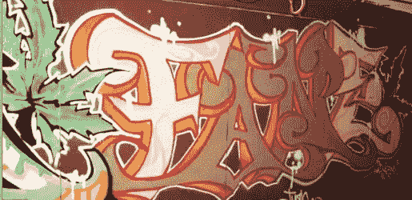

[来源](http://www.graffiti.org/miami/dws_fane.jpg)

* * *

### 第一次

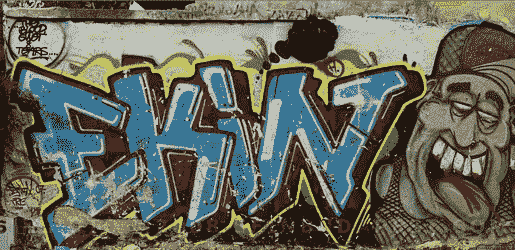

[来源](http://sfinbudapest.com/photos/0901/090116-graffiti1-LG.jpg)

* * *

### 夏令时

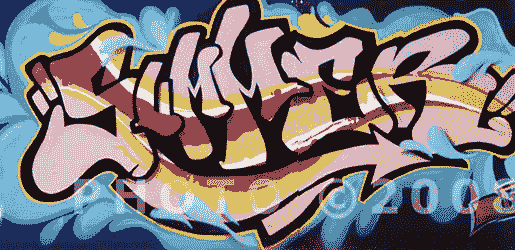

[来源](http://sfinbudapest.com/photos/0811/0811-graffiti6-LG.jpg)

* * *

### 走吧

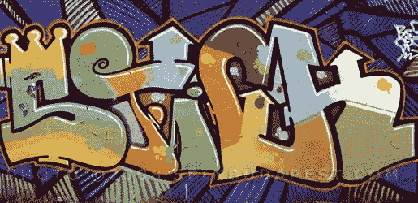

[来源](http://sfinbudapest.com/photos/0811/081129-graffiti1-LG.jpg)

* * *

### Sens

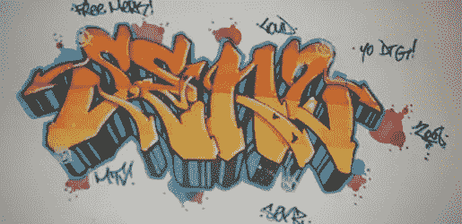

[来源](http://4.bp.blogspot.com/_36SFFFDlygA/TRfnhFTuNiI/AAAAAAAAKYo/Z_CRYym5EQ0/s400/graffiti-name-10.jpg)

* * *

### 涂写

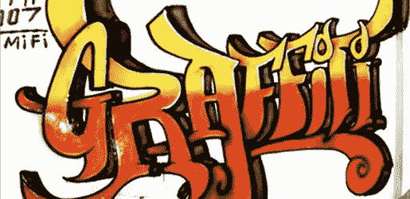

[来源](http://3.bp.blogspot.com/_36SFFFDlygA/TRfnGRhkAYI/AAAAAAAAKYQ/14Bkcjahs5A/s400/graffiti-name-7.jpg)

* * *

### 是

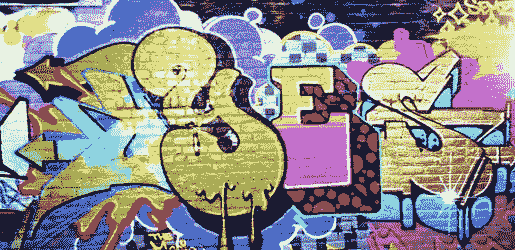

[来源](http://www.imgbase.inimg/safe-wallpapers/photography/graffiti/13679_graffiti.jpg)

* * *

### 嘿！嘿！

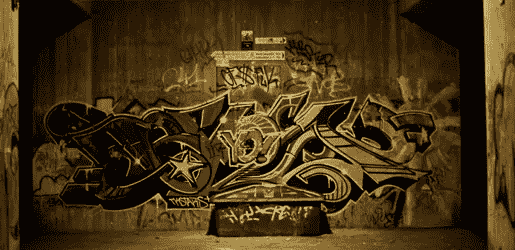

[来源](http://www.imgbase.inimg/safe-wallpapers/photography/graffiti/14500_graffiti.jpg)

* * *

### 药

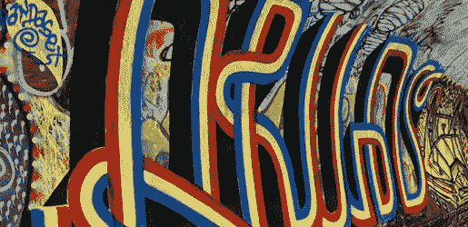

[来源](http://www.imgbase.inimg/safe-wallpapers/photography/graffiti/14509_graffiti.jpg)

* * *

### 堆

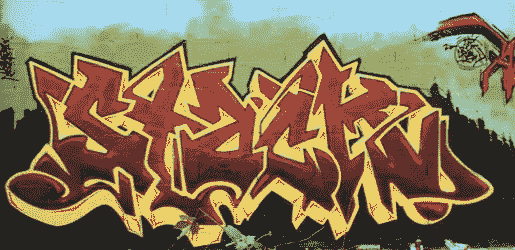

[来源](http://www.imgbase.inimg/safe-wallpapers/photography/graffiti/14509_graffiti.jpg)

* * *

### 切断

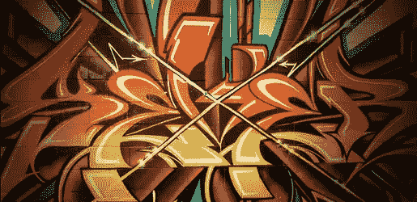

[来源](http://graffitialphabeto.com/14-funky-frisky-graffiti-wallpapers/colorful-wildstyle-frisky-graffiti-funky-wallpapers/)

* * *

### 灵魂

[来源](http://graffitialphabeto.com/14-funky-frisky-graffiti-wallpapers/soul-funky-frisky-graffiti-wallpapers/)

* * *

### 东南部

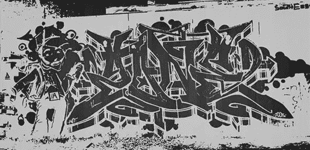

[来源](http://1.bp.blogspot.com/_36SFFFDlygA/TRvT43gwIzI/AAAAAAAAKlY/xC0ytJjkEEo/s1600/graffiti-wallpapers-42.jpg)

* * *

### 牙买加的

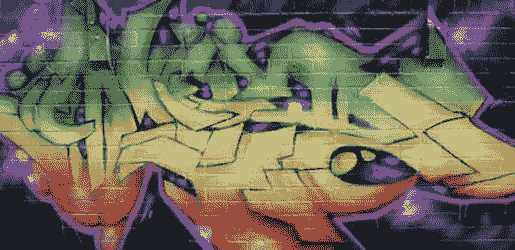

[来源](http://1.bp.blogspot.com/_36SFFFDlygA/TOxQa61TSNI/AAAAAAAAJKc/4nGj4ESKOrs/s1600/Graffiti-background-9.jpg)

* * *

### 即兴表演

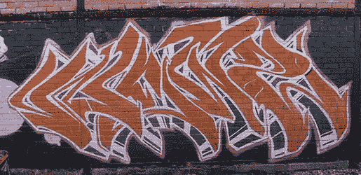

[来源](http://www.artgraffiti.info/news-freestyle-graffiti-murals/news-freestyle-graffiti-murals/)

* * *

### 优秀

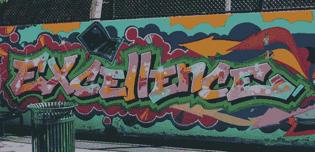

[来源](http://kidcityny.com/wp-content/uploads/2010/06/Excellence-Sign-Graffiti-Wall-of-Fame.jpg)

* * *

### 处理

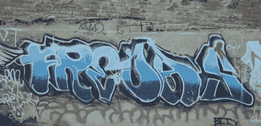

[来源](http://www.niceamazingpictures.com/r-graffiti-2-graffiti-32.htm)

* * *

### 狂野风格

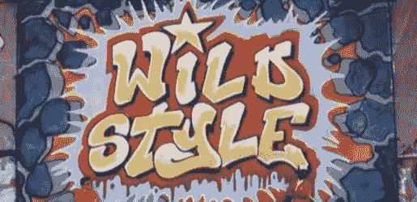

[来源](http://procuremultimedia.wordpress.com/2010/12/17/wildstyle-graffiti-fim-by-charlie-ahearn/)

* * *

### 哈兹克

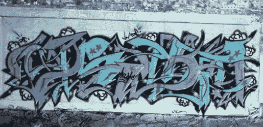

[来源](http://procuremultimedia.files.wordpress.com/2010/12/hazke0015.jpg)

* * *

### 迪姆

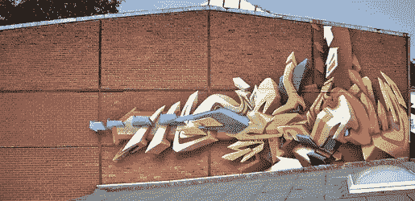

* * *

### 未来的房子

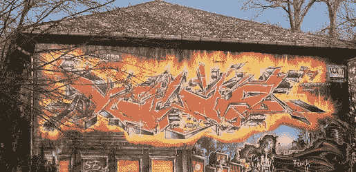

[来源](http://theartexpression.blogspot.com/2011/10/world-of-modern-graffiti.html)

* * *

这些是你最喜欢的吗？你有没有想要分享的字体涂鸦设计？你亲眼见过街头艺术中令人印象深刻的例子吗？

## 分享这篇文章