# 看看我们的新书——Photoshop CS6 解锁

> 原文：<https://www.sitepoint.com/look-inside-our-new-book-photoshop-cs6-unlocked/>

科里·哈夫莱刚刚为她之前的畅销书 *Photoshop 选集的第二版 *[Photoshop CS6 Unlocked，101 个技巧、诀窍和技术](https://www.sitepoint.com/blog/)—*添加了最后的润色。*

让我们看看这本书的内部，其中有第三章的摘录，向你展示了如何制作一个超级酷的闪亮的塑料按钮。交给你了，科里…

## 制作闪亮的塑料按钮

iPhone 界面带回了闪亮的塑料按钮外观，如图 3.23 所示。在这个解决方案中，您将学习如何制作自己的渐变按钮，从一个基本的渐变按钮开始。

 *图 3.23。一个闪亮的带图标的塑料按钮*

### 解决办法

1.  使用圆角矩形工具( **U** )创建一个圆角矩形矢量形状。选中矢量图层，点击**图层**面板底部的**添加图层样式**按钮，打开**图层样式**对话框；然后从出现的菜单中选择**渐变叠加…** 。将显示渐变叠加的选项——我们想要应用如图 3.24 所示的渐变叠加。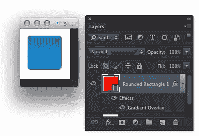图 3.24*。从渐变按钮*
    开始，点击**图层样式**对话框中的**渐变**补丁，调整你的渐变。这将调出**渐变编辑器**对话框。你会希望渐变在底部有一个明亮的颜色，在顶部有一个相同颜色的较暗版本。如图 3.25 所示，在 80%左右开始较暗的色标位置。 *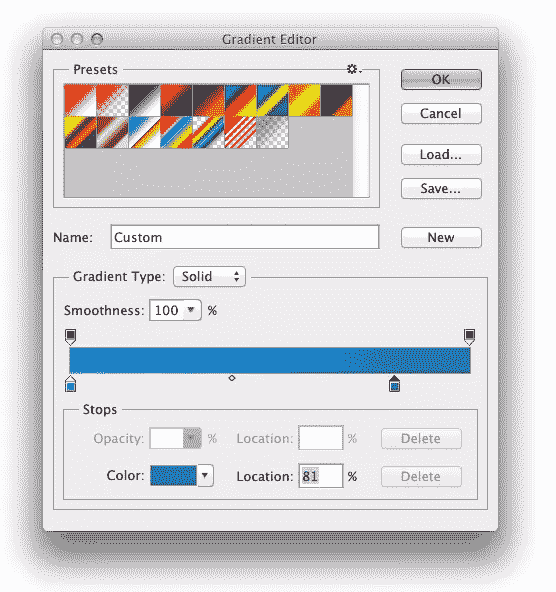图 3.25。操作您的渐变设置*
2.  现在我们将工作在高光层。通过输入**命令**–**J**(Windows 上的**Ctrl**–**J**)复制圆角矩形图层。在**图层**面板中，双击**渐变叠加**图层效果，弹出**图层样式**对话框；然后点按渐变色标以编辑渐变。使用底部色标将两个色标都更改为白色。然后，点击左上方的不透明度停止点，并将**不透明度**值更改为 50，如图 3.26 所示。点击**确定**，再次点击**确定**。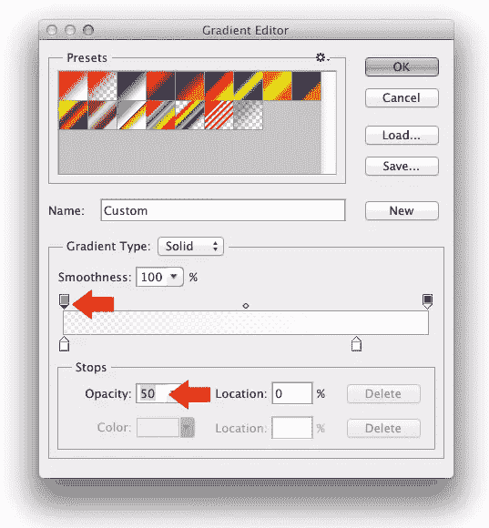 *图 3.26。编辑高光图层的渐变设置*
3.  选择删除锚点工具。单击图 3.27 中突出显示的底部两点，将其删除。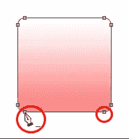 *图 3.27。删除锚点*
4.  切换到转换点工具，点击剩下的两个底部点，使它们变成角点，如图 3.28 所示。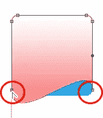 *图 3.28。转换锚点*
5.  使用直接选择工具( **A** )，选择转换后的点并移动它们，使它们位于按钮上方大约三分之二的位置，如图 3.29 所示。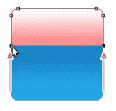图 3.29*。移动锚点*
6.  切换到添加锚点工具，点击新底边的中间，如图 3.30 所示，添加一个点。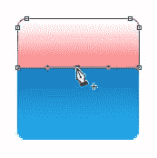 *图 3.30。添加另一个锚点*
7.  再次抓取直接选择工具( **A** )并向下拖动新的中心点刚好经过按钮的中心，如图 3.31 所示，形成一条曲线。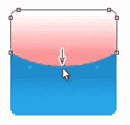图 3.31*。制作底部曲线*
8.  你图层的原始颜色可能会显示出来，所以在**图层**面板中把**填充**改为 0。稍微降低**的不透明度**；在图 3.32 中，我把它改成了 65%。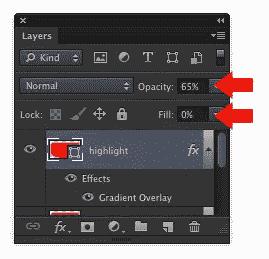图 3.32*。将填充更改为 0*
9.  你闪亮的塑料按钮现在可以在图 3.33 中看到。如果您决定在 Photoshop 中添加文本或图标，请应用轻微的阴影效果，以获得应用程序按钮的感觉。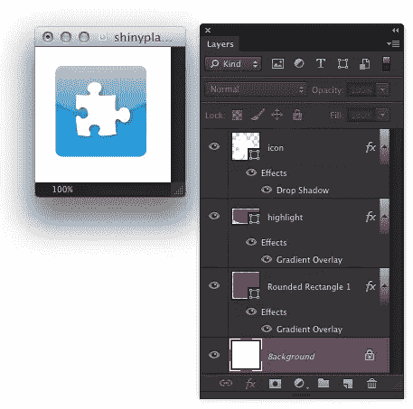 *图 3.33。带有图标的塑料按钮，以及制作它的**图层**面板*

### 讨论

通过使用矢量形状和图层样式创建渐变按钮，我们现在有了一个易于编辑的可缩放按钮。如果我们想改变它的颜色，我们所要做的就是改变图层样式中渐变和效果的色调。如果我们希望我们的按钮是不同的形状，我们可以使用直接选择工具( **A** )来修改矢量路径。这个解决方案演示了一个关于层的重要概念:即使当一个层的填充设置为 0%，层的样式仍然很明显！当您创建自己的效果时，您可能会发现这很有用。这项技术还有一个很酷的地方是，一旦你创建了第一个闪亮的塑料按钮，就很容易创建其他按钮——只需复制图层效果。

—

谢谢科里让我们看一看里面！想了解更多:如何做，例子和节省时间的建议，请查看《T1》一书的 400 多页的完整版本，其中包括:

*   **入门 CS6** :学习所有的基本技能和步骤
*   **设计背景**:制作无缝拼接和背景
*   创建按钮:设计一系列好看的图标
*   **处理文本:**处理文本，突出文本
*   **优化图像**:增强、组合和调整网页图像
*   **设计网站**:在 Photoshop 中设计一个完整的网站布局
*   **智能工作**:使用快捷方式和批处理命令节省时间

另外…所有令人兴奋的新 CS6 工具，包括:内容感知，模糊画廊，透视裁剪工具，等等。

[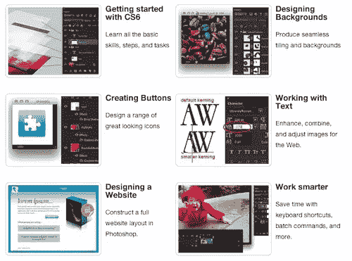](https://www.sitepoint.com/blog/) 
给自己抓一份，在评论里随意分享你的想法(如下)。

*   **[纸质书+数字电子包套装——售价 34 美元](https://www.sitepoint.com/blog/)** **(节省 50%)**
*   **[数字电子包(pdf、epub、mobi)——17 美元](https://www.sitepoint.com/blog/)(节省 42%)**

## 分享这篇文章