# 让 Adobe Bridge 成为您个人助理的 7 种方法

> 原文：<https://www.sitepoint.com/7-ways-to-make-adobe-bridge-your-personal-assistant/>

印刷设计师、网页设计师、网页开发人员、插图画家和摄影师都积累了大量的文件。Adobe 为所有这些不同的专业制作专门的软件，但是他们也有一个文件管理系统，同样很好地为所有这些专业服务。尽管 Adobe Bridge 是最容易被忽视的 Adobe 应用程序之一，但它很容易成为最有价值的软件，不管您的工作的具体性质如何。

Adobe Bridge 在帮助您组织所有图像、文档、代码片段、项目文件夹和其他媒体资产方面做得非常好。但是，它不仅仅是对你的文件进行分类。Adobe Bridge 提供了许多功能，可以轻松地将文件编译成文档，并导出图像和资源以供专业使用。这也是一个伟大的工具，查看大量的文件，并优先考虑他们，以满足您的需求。

### 量身定制 Bridge 的幻灯片，以完全满足您的需求

Adobe Bridge 提供了以全屏幻灯片显示方式查看文件的功能，并且您可以自定义幻灯片显示的行为，以使浏览媒体变得非常有条理和高效。当您需要查看文件，剔除不需要的文件，并选择最好的文件用于项目时，您可以突出显示一组文件/文件夹，然后进入“查看”>“幻灯片显示”，或者只需按 Command/Ctrl+“L”。您可以使用左右箭头键在文件组中向前或向后导航。要退出，只需按 Esc 键。下面是幻灯片如何出现在屏幕上的示例。它显示图像的大预览，以及文件的名称。

[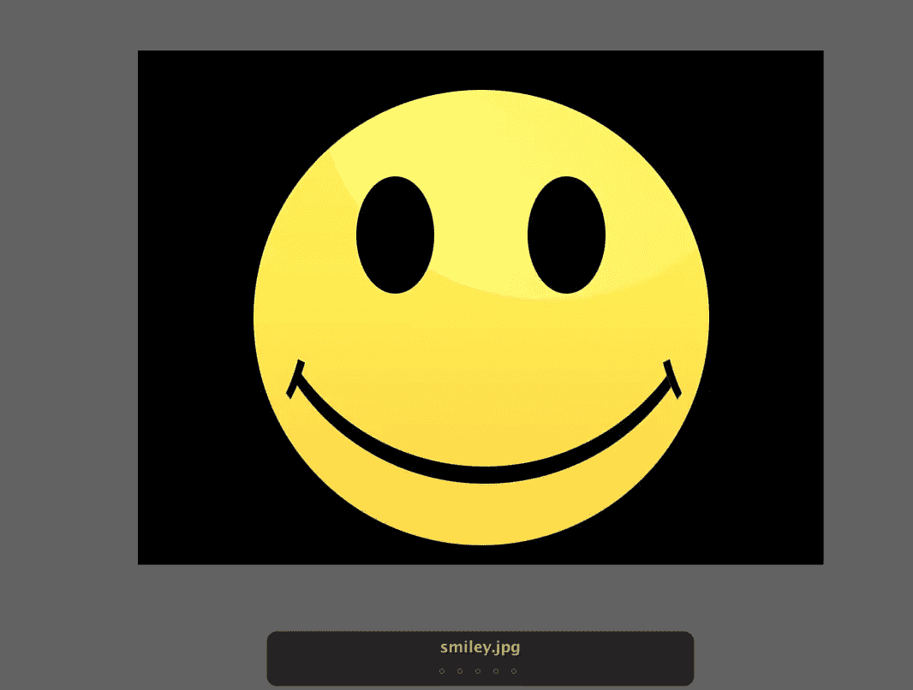](https://www.sitepoint.com/wp-content/uploads/2012/06/Screen-shot-2012-06-26-at-9.32.07-PM.png)

还有许多方法可以定制您的幻灯片。只需按 Shift+Command/Ctrl+“L”即可调出选项对话框。在这里，您可以设置每张幻灯片的持续时间，确定每张幻灯片之间的过渡，添加字幕，并设置速度。从该菜单中，您可以播放幻灯片来检查您的设置，或者只需点击“完成”

[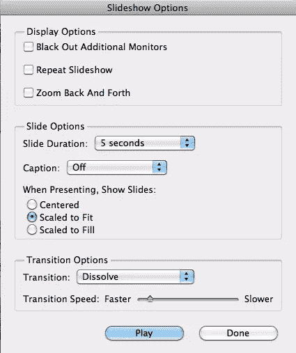](https://www.sitepoint.com/wp-content/uploads/2012/06/Screen-shot-2012-06-24-at-10.41.29-PM.png)

### 使用网络画廊快速发布大量文件

如果您想要将文件发布到 web 上使用，您可以轻松地将一组文件导出到 HTML、Flash 或气密图库中。当你想快速方便地把你的文件放在网上时，这是很好的选择。只需选择右上角的“输出”，然后选择“网络画廊”能够在几分钟内为你的文件创建一个 HTML 图像库并将它们上传到你的网站，对于各种职业和目的来说都是一个非常有用的特性。

[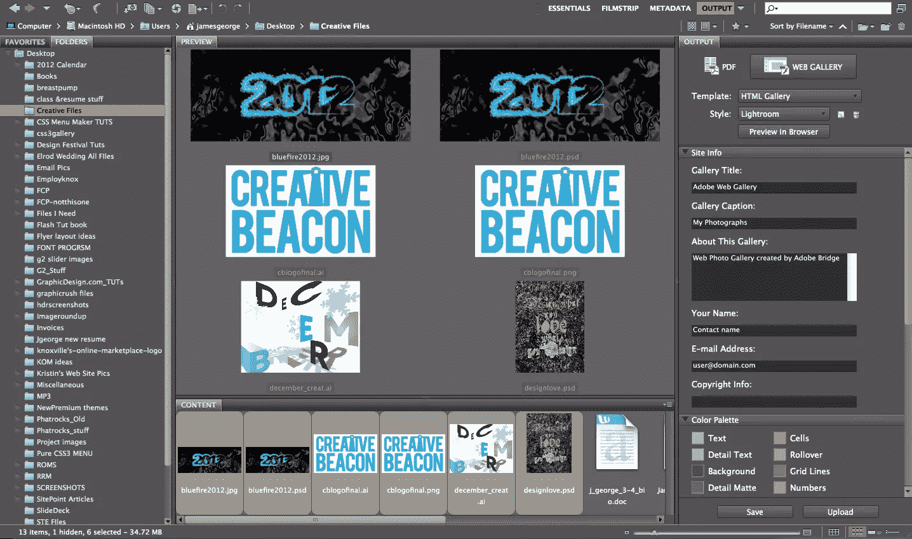](https://www.sitepoint.com/wp-content/uploads/2012/06/Screen-shot-2012-06-24-at-10.53.54-PM.png)

如果您想要自定义图库，除了想要创建的图库类型之外，您还有多种选择。有许多不同的选项可供选择，您可以使用您的姓名、自定义颜色、自定义图像大小和图库格式来自定义每个图库。这包括行数和列数。

[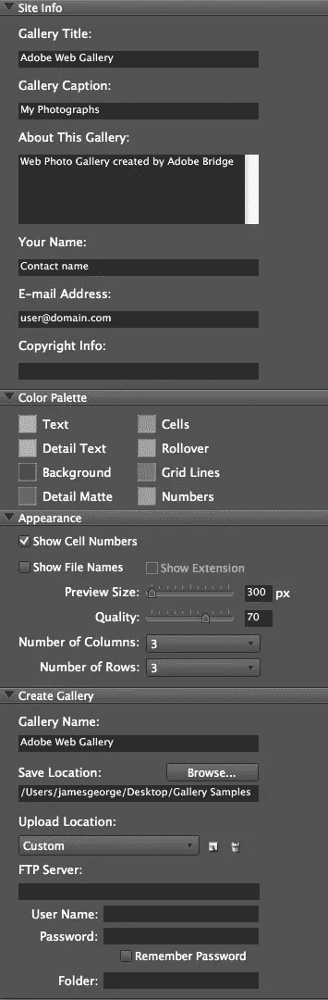](https://www.sitepoint.com/wp-content/uploads/2012/06/gallery-options.jpg)

Adobe 已经使它变得非常方便；您可以将图库导出到一个文件夹中，也可以输入您的 FTP 信息并将其直接上传到网站。下面是一个使用默认设置创建的 HTML 图库示例。

### 从图像批次组合全面的 PDF 文件

另一个节省时间的功能是从一组图像创建 PDF 文件的能力。如果你想给同事发几张照片或者一些不同的 logo 创意，这将会很有用。只需单击“输出”选项卡(就像您对网络画廊所做的那样)，但这一次，选择 PDF。右边一栏出现了各种各样的选项。这将允许您根据自己的目的自定义 PDF 的外观和感觉。

您可以创建联系表、2 联贺卡、美术垫，甚至三联画。这是非常方便的时候，介绍您的图像和艺术品。这个功能会让你的作品看起来更专业，而且不费吹灰之力。您可以将文档创建为您喜欢的任何分辨率和格式。该设置类似于 Photoshop 中的设置，可以控制大小、分辨率和背景。

[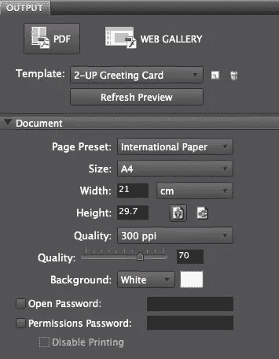](https://www.sitepoint.com/wp-content/uploads/2012/06/Screen-shot-2012-06-24-at-11.56.16-PM.png)

有很多方法可以完全按照您的要求定制 PDF。您可以影响布局、字体和颜色，也可以选择列数和行数以及它们之间的间距。最后，你还可以包括页码，如果你有多个页面，这是很方便的，你需要你的客户保持它们的顺序。

[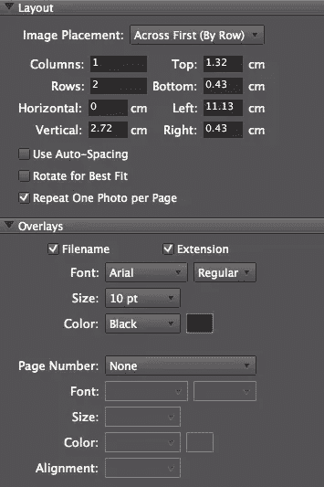](https://www.sitepoint.com/wp-content/uploads/2012/06/Screen-shot-2012-06-24-at-11.56.56-PM.png)

您可以添加自定义页眉和页脚(每个页眉和页脚中包含自定义文本)，您还可以包含分隔线，以便进一步自定义您的布局。添加您的公司名称、品牌或任何其他相关信息非常简单，您只需设置一次首选项。

[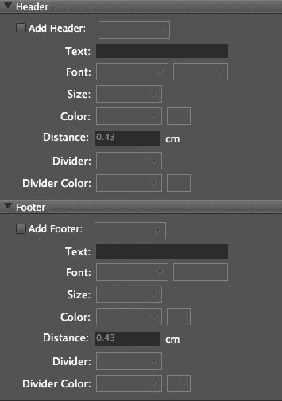](https://www.sitepoint.com/wp-content/uploads/2012/06/Screen-shot-2012-06-24-at-11.57.27-PM.png)

如果你是摄影师或设计师，你可以在下面的框中为你的作品添加自定义水印。您可以插入文本，也可以插入您自己的图像，通常是您的徽标，甚至可以控制水印的大小和不透明度等属性。这有助于确保您的客户不能简单地复制图像，以某种方式提取它并使用它而不支付您。

[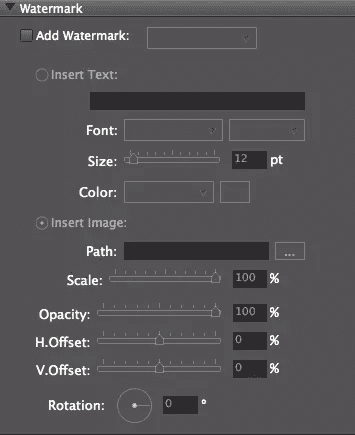](https://www.sitepoint.com/wp-content/uploads/2012/06/Screen-shot-2012-06-24-at-11.58.02-PM.png)

### 导出到社交媒体和第三方网站

如果您单击“Essentials”选项卡，您会在屏幕左侧看到不同的选项。其中一个选项是“导出”在这里，你可以将你的图像直接导出到脸书、Flickr 甚至备份硬盘上，只需将你的文件拖到这些图标上。你只需要你的登录信息，就可以快速方便地将图片发布到 Flickr 和脸书。

[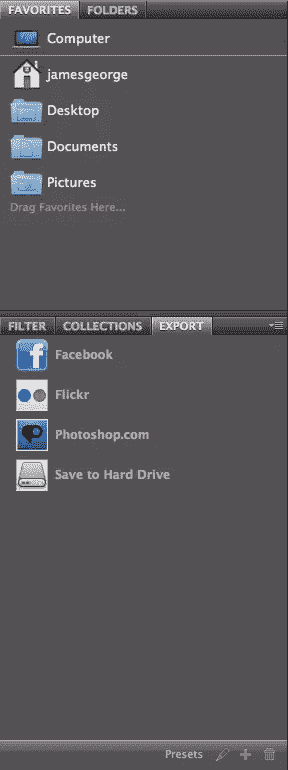](https://www.sitepoint.com/wp-content/uploads/2012/06/Screen-shot-2012-06-25-at-12.16.09-AM.png)

### 运行常见批处理过程

自动批量处理真的是得心应手，可以节省你很多时间。您可以直接在 Adobe Bridge 中运行批处理或处理多个文件，而不必浏览多个程序。只需突出显示要处理的文件或文件夹，转到“工具”，然后选择 Fireworks、Photoshop 或 Illustrator。Photoshop 中的大多数批处理都可以在 Bridge 中找到。

例如，如果您选择 Photoshop，则可以选择 Photomerge，或者可以批量运行 Photoshop 中的任何操作。这很方便，因为您可以在不离开 Bridge 的情况下处理几乎无限量的图像。

[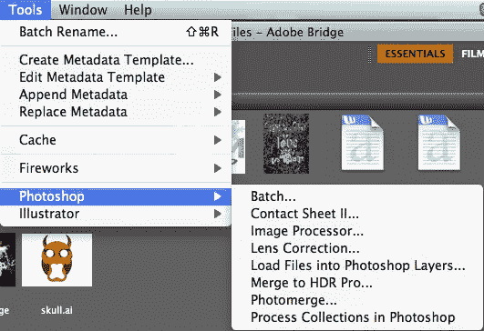](https://www.sitepoint.com/wp-content/uploads/2012/06/Screen-shot-2012-06-25-at-12.26.40-AM.png)

### 轻松查找文件

组织是伟大的，但如果你像我一样，我敢肯定你有过这样的情况，你被嘎吱嘎吱的时间，你不小心把你的文件保存在错误的地方，只是回来后不知道你把它放在哪里。Bridge 具有出色的搜索和过滤能力，因此如果您知道要查找的文件类型，您可以剔除不适用的文件类型。例如，如果您知道您正在查找 PSD 文件，您可以过滤您的搜索以仅包括 Photoshop 文档。这是一个巨大的时间节省寻找文件。

[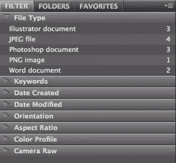](https://www.sitepoint.com/wp-content/uploads/2012/06/Screen-shot-2012-06-25-at-12.39.59-AM.png)

### 从您的 Adobe 产品中查找最近打开的文件

Adobe Bridge 将允许您在一个方便的菜单中查看所有 Adobe 产品的最新文件。它还显示了最近的文件夹。这是一种快速查找最近文件的方法，尤其是在您匆忙放错地方的情况下。您不必记住最新作品的文件路径；布里奇替你记住了。

[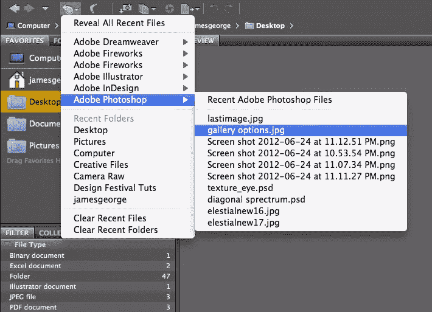](https://www.sitepoint.com/wp-content/uploads/2012/06/Screen-shot-2012-06-26-at-9.23.35-PM.png)

### 结论

Adobe Bridge 是一个方便的文件管理系统，适用于所有文件，无论是图像、Photoshop 文档、pdf、Illustrator 文件还是任何其他文件。Bridge 有很多特性，比如能够对文件进行排序、分类和组织，但它的功能远不止这些。您可以将图像导出到 web 上，编辑 PDF 文档，并在几秒钟内找到放错位置的文件，为已经非常棒的文件管理工具增添更多吸引力和实用性。

你花多少时间在土坯桥上？你是通过保持文件的完美组织来支持未来的自己，还是 Adobe Bridge 只是静静地坐在你的桌面上？

## 分享这篇文章