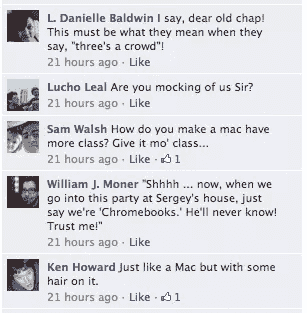
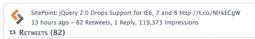

# 那一周你说了什么

> 原文：<https://www.sitepoint.com/what-you-said-in-the-week-that-was/>

欢迎来到我的下一期节目，告诉你上周你告诉我的事情。老实说，SitePoint 总部的团队在过去的几天里一直在进行创新静修(在火边喝红酒和打高尔夫球的间隙，我们低下头，想出了一些非常酷的东西，我们将在未来几个月内向你展示这些东西)，所以当谈到一般的社区玩笑时，我有点落后于 8 球，但我已经设法拼凑出了一些今天引起我注意的东西。

你们中的数百人聚集在一起与专家讨论 HTML5，会议非常棒。感谢所有参与的人，我希望在我们即将到来的会议上看到你们，在会上我们将与专家们讨论 CSS 布局。

本周的标题是这样的！你取笑我在脸书的 Macbook 系列产品。这是迄今为止最难判断的事情之一——以下是你找到的一些纯金样品:

twitter 本周完全是一个 Twitter，带着对 Internet Explorer 的标准鄙视。82%的人认为这个值得转发。

在论坛上，我们刚刚授予 scottymack 一个[金帖奖，奖励他在](https://www.sitepoint.com/forums/showthread.php?864948-A-Golden-Post! "Golden Post")[网络内容论坛](https://www.sitepoint.com/forums/forumdisplay.php?434-Web-Content "Web Content Forum")回答一个问题时超越了职责范围。他因为烦恼拿走了一本免费的书。

当谈到你希望我们做的事情时，我总是很想听听你的想法。Aaron Carney 为我们的脸书社区提出了这个很酷的建议。你认为呢?

这周最后一个问题是一个难题。下周我会在 Twitter 上发布一些赠品，所以如果你注册了，请确保你关注了 [@sitepointdotcom](https://twitter.com/#!/sitepointdotcom "SitePoint on Twitter") 。如果你不是，也许是时候你是了…)

总之，我走了。在外面小心点。

## 分享这篇文章