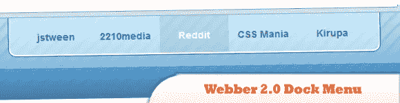
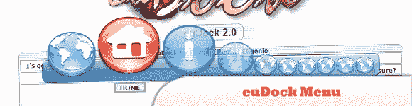
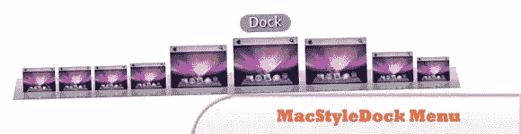
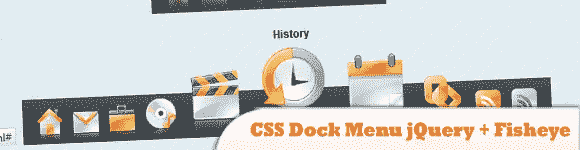
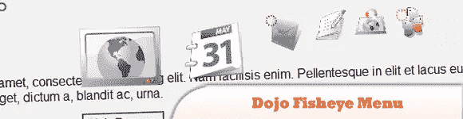
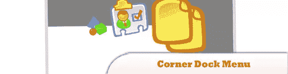

# 8 个 JS Dock 菜单插件

> 原文：<https://www.sitepoint.com/8-js-dock-menu-plugins/>

在过去的几年里，我们与你分享了大量的**导航和菜单插件**，但我们似乎永远也不会满足！今天是另一组，我们将重点放在“码头效果”导航菜单插件所有 JavaScript 编码的效果！大部分类似于苹果 Mac 图标 Dock 效果。很好。(我们就是吃不够…我们就是吃不够…)尽情享受吧！；)

**相关帖子:**

*   [**15 大 jQuery 导航菜单**](http://www.jquery4u.com/navigation/15-great-jquery-navigation/)

## 1.Webber 2.0 停靠菜单教程

在这个简短的教程中，我们将浏览创建 Webber 2.0 Dock 菜单的 CSS 和一点 JavaScript。

  
[源+演示](http://2210media.com/dock_menu/)

## 2.euDock 菜单

一个新的(跨平台)开源(LGPL)的 MacOsX dock bar 的 JavaScript 仿真。

  
[源+演示](http://eudock.jules.it/index-eudock2.0.php)

## 3.MacStyleDock 菜单

在 JavaScript 中实现这种效果很困难，但是 MacStyleDock 函数允许轻松实现这一特性。

  
[源+演示](http://safalra.com/web-design/javascript/mac-style-dock/)

## 4.CSS 停靠菜单 jQuery +鱼眼

如果你是一个巨无霸迷，你会喜欢这个 CSS dock 菜单。它是使用 jQuery 库和鱼眼组件从界面和我的一些图标。它有两个坞站位置:顶部和底部。

  
[来源](http://ndesign-studio.com/blog/css-dock-menu) [演示](http://www.ndesign-studio.com/demo/css-dock-menu/css-dock.html)

## 5.jQ 停靠菜单

一个 jQuery 插件，可以将图像转换成类似 Mac 的 Dock 菜单，图标可以在鼠标经过时展开！

  
[源+演示](http://www.wizzud.com/jqDock/)

## 6.图标停靠菜单

“码头效应”jQuery 插件。

  
[源+演示](http://icon.cat/software/iconDock/0.8b/dock.html)

## 7.Dojo Fisheye 菜单

一个基于 Dojo 库的鱼眼效果。一旦你学习了一些关于 djConfig 参数的东西，设置就很容易了。这个脚本的缺点是 dojo 小部件 JavaScript 的大小，如果您计划让这个 dojo 效果只分析代码并尝试删除一些代码。

  
[源+演示](http://www.ajaxdaddy.com/demo-dojo-fisheye.html)

## 8.角落停靠菜单

一个易于定制的 JavaScript 导航系统。你只需将鼠标移动到中间图标周围的一个小图标上，就可以移动 docker。

  
[源+演示](http://quicklydownload.com/programs/other/corner-dock/145825)

## 分享这篇文章