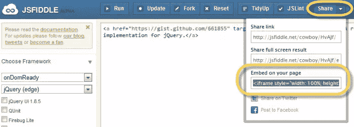

# 在您的网页上嵌入交互式 jsFiddle 片段

> 原文：<https://www.sitepoint.com/embed-jsfiddle-code-web-pages/>

我刚刚发现你可以在你的网页上嵌入交互式 jsfiddle 片段(不知道它已经存在多久了，但是我认为它值得一提！).这就是你在网页上嵌入交互式 jsFiddle 代码片段的方法。

### 说明

1.  去 jsfiddle.net 创建你的代码片段
2.  导航到菜单>共享>嵌入代码(嵌入在 iFrame 中)。
3.  将 iFrame 代码复制到您的网页 HTML 中

### 演示

这是一个 jsfiddle 嵌入的演示——很酷的事情是你可以在 js、css 等之间切换,**在页面上运行代码**,只需按下播放按钮！

[https://jsfiddle.net/cowboy/HvAJf/embedded/](https://jsfiddle.net/cowboy/HvAJf/embedded/)

快乐拨弄！

**您可能也对:**感兴趣

*   [隐藏你的 jQuery 源代码](http://www.jquery4u.com/security/hide-jquery-source-code/)
*   [类别 Jquery 代码片段中的帖子](http://www.jquery4u.com/category/snippets/)

## 分享这篇文章