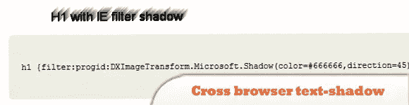
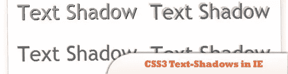
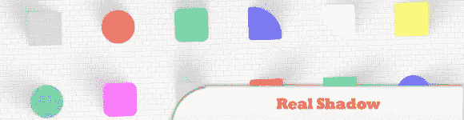
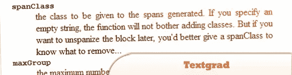
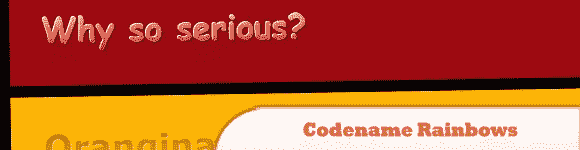
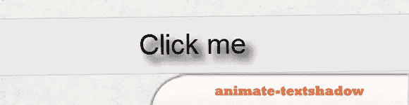
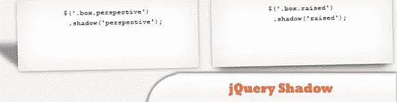
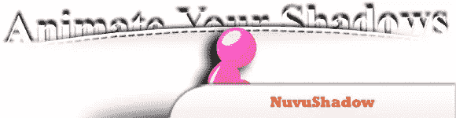
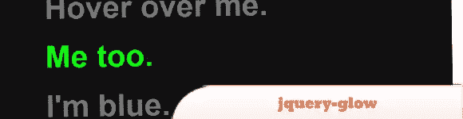

# 10 个 jQuery 鼠标/文本阴影插件

> 原文：<https://www.sitepoint.com/10-jquery-mouse-text-shadow-plugins/>

正如你可能知道的，文本阴影主要是一个 CSS3 属性，它允许你在文本后面显示一个阴影。如果你是一个时尚型的人，那么你可能想在你的网站上使用这种文本阴影效果，你很幸运，因为 jQuery 可以帮助你！这里有一些非常漂亮的 jQuery 鼠标/文本阴影插件专门为你准备的！尽情享受吧！

**相关岗位:**

*   [**10 新派 CSS3 文字效果与网页排版教程**](http://www.jquery4u.com/dynamic-css-2/10-nouveau-css3-text-effect-web-typography-tutorials/)
*   [**10 IE CSS3 和 HTML5 现代浏览器模仿**](http://www.jquery4u.com/browser-tweaks/10-ie-modern-css3-html5-tips/)

## 1.jQuery 花式阴影插件

一个非常简单的 jQuery 插件，它使用 CSS 文本阴影和框阴影功能来根据当前鼠标位置改变阴影方向。

  
[来源](http://www.ralphharrer.at/blog/artikel/jquery-fancy-drop-shadow-plugin)
[演示](http://www.ralphharrer.at/demos/fancy-drop-shadow/)

## 2.(几乎)跨浏览器文本阴影

Text-shadow 是一个简洁的 CSS3(实际上是 CSS2)属性，允许你在文本后面显示阴影。

  
[源+演示](http://kilianvalkhof.com/2008/design/almost-cross-browser-text-shadow/)

## 3.一个 jQuery 插件，用于在 Internet Explorer 中创建 CSS3 文本阴影

jQuery 插件，你可以把它应用到一个元素上，让它自动为你做所有的工作，同时仍然在 IE6，IE7 和 IE8 中工作。

  
[源+演示](http://www.nealgrosskopf.com/tech/thread.php?pid=61)

## 4.真实阴影:一个用于创建真实阴影的 jQuery 插件

它的作用是给一个元素一个阴影，根据鼠标光标的位置改变它的属性。

  
[来源](http://blogfreakz.com/tutorial/real-shadow-a-jquery-plugin-for-creating-realisitc-shadows/)
[演示](http://indamix.github.com/real-shadow/)

## 5.Textgrad:一个 jQuery 文本渐变插件

它包含四个适用于选择的函数:spanize、unspanize、textgrad 和 textscan。(2022 年更新:不再提供)

## 6.代号彩虹

这在大型网站或动态内容上特别有效，因为为每个实例创建图像是不切实际的。

  
[来源](http://labs.dragoninteractive.com/rainbows.php)
[演示](http://labs.dragoninteractive.com/rainbows_demo.php)

## 7.js–用 jQuery 制作动画 CSS 文本阴影

是一个简单、轻量级的 jQuery 插件，它允许你使用 jQuery 的常规。动画方法。

  
[源+演示](http://www.alexpeattie.com/projects/animate-textshadow/)

## 8.jQuery 影子插件

一个 jQuery 插件，用于创建各种类型的投影。

  
[来源](https://github.com/sydlawrence/jQuery-Shadow#readme)
[演示](http://syddev.com/jquery.shadow/)

## 9.努武阴影

文本和方框阴影动画 jQuery 插件。

  
[来源](http://www.behance.net/gallery/NuvuShadow-TextBox-Shadow-Animation-jQuery-Plugin/1629597)
[演示](http://nuvushadow.nrcstudios.info/)

## 10.jquery-glow

添加当你悬停在元素上时使元素“发光”的功能。对于支持文本阴影 CSS 属性的浏览器，您还可以添加一个光环。

  
[来源](https://github.com/nakajima/jquery-glow#readme)
[演示](http://nakajima.github.com/jquery-glow/)

## 分享这篇文章