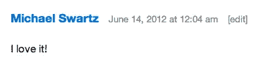
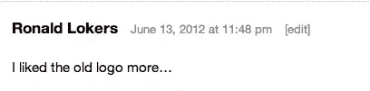
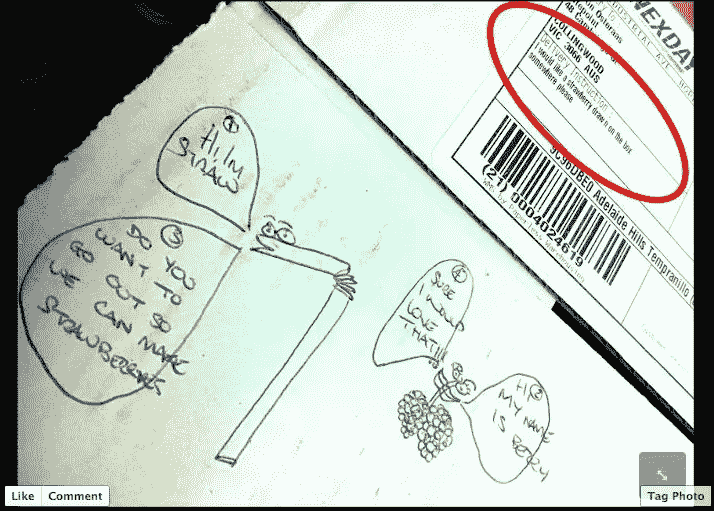

# 这就是你上周的表现

> 原文：<https://www.sitepoint.com/this-is-how-you-rolled-last-week/>

我回来看你每周社区综述的第三部分。这就是你此刻所谈论的…

首先是一个大问题。经过几个月的血汗和泪水，我们上周推出了我们的新标志。Alex 和 Harley 不仅在更新标志本身上做了出色的工作，他们还整理了一篇非常棒的文章，概述了他们经历的过程。正如品牌重塑的一贯方式，你们中的一些人喜欢它

你们中的一些人不太喜欢它。

很公平——你不可能一直取悦所有的人。只要你仍然喜欢我们的内容，那么我们可以带着一点负面情绪生活。

不幸的是，由于亚马逊上周五的故障，我无法运行我的每周“Caption This！”这里是 sitepoint.com，但我们的[脸书](http://www.facebook.com/sitepoint "SitePoint on Facebook")朋友做得很好，乔恩·爱德华兹用右边的这个条目赢得了我的心:

本周推特上的事情相当平静。你们一定都忙于工作。我试图通过免费赠送我们最新发布的一款游戏《jQuery:忍者新手》第二版来挑起事端，这条推文的获胜者是 [@D_mitar](http://twitter.com/D_mitar "D_mitar on Twitter") :

我需要一本在沙滩上看的轻喜剧，jquery ninjas 听起来很合适

如果脸书的喜好是可以肯定的，那么你在过去几周最喜欢的帖子就是我们的前在线编辑亚伦·奥斯特拉斯(他上周五离开我们去找了一份新工作)让我们的周五送酒员跳过的那些圈。几周前，他让他画恐龙，上周事情变得更加愚蠢。看看这个。

在这一点上，我将结束这一周的工作，但下周我会带着更多的社区滑稽动作回来。再见。

## 分享这篇文章