# 在 Photoshop CS6 中创建有趣的抽象背景

> 原文：<https://www.sitepoint.com/create-interesting-abstract-backgrounds-in-photoshop-cs6/>

Photoshop 是创建和编辑图像的绝佳工具。特别是 Photoshop CS6 有一些令人印象深刻的新功能，可以让你轻松地创建各种抽象背景。与其在网上搜索很合适的背景或者浏览库存摄影库，不如考虑自己制作背景；你会惊讶于所涉及的时间和技术是如此之少。

### 将糟糕的照片变成有用的散景背景

下面的图像很不寻常，我无法想象它有什么特别的用途，但是使用 Photoshop CS6，我们可以在几分钟内将这张不实用的图像转换成有用的散景背景。下次你有一些有趣的(偶然的)颜色或图案的“一次性”照片时，用散景背景代替。

[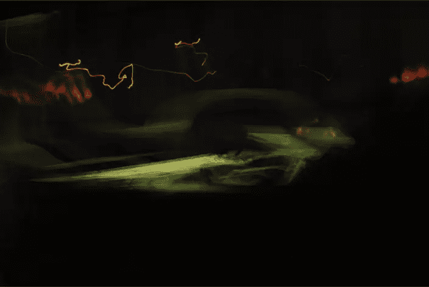](https://www.sitepoint.com/wp-content/uploads/2012/06/Screen-shot-2012-06-04-at-9.06.39-PM.png)

CS6 中新的模糊设置是 Photoshop 滤镜库的真正资产。上面的图像真的很暗，有一点光，这是一个理想的散景效果。这种效果，去“滤镜”>“模糊”>“场模糊”，会弹出一个对话框。

[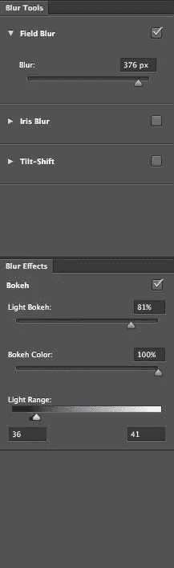](https://www.sitepoint.com/wp-content/uploads/2012/06/Screen-shot-2012-05-29-at-10.22.49-PM.png)

场模糊不同于其他模糊滤镜，因为它是为了模仿摄影中的自然镜头模糊。选中“场模糊”复选框，并将滑块增加到一个较高的值。目的是模糊亮区，直到没有明显的颜色区域。由于这张图片太暗，我将光散景量设置为较高的值。散景色会增强模糊图像中的颜色，并对其进行着色。

这种散景技术的一个关键部分是底部的光线范围滑块。你可以增加光散景和散景的颜色值到任何你想要的值，无论你尝试什么组合，都不会产生散景的效果。灯光范围才是真正创造效果的地方。关于这个滑块需要了解的关键信息是，无论您将值移动到哪里，滑块的黑点和白点都需要彼此紧挨着。结果如下所示:

[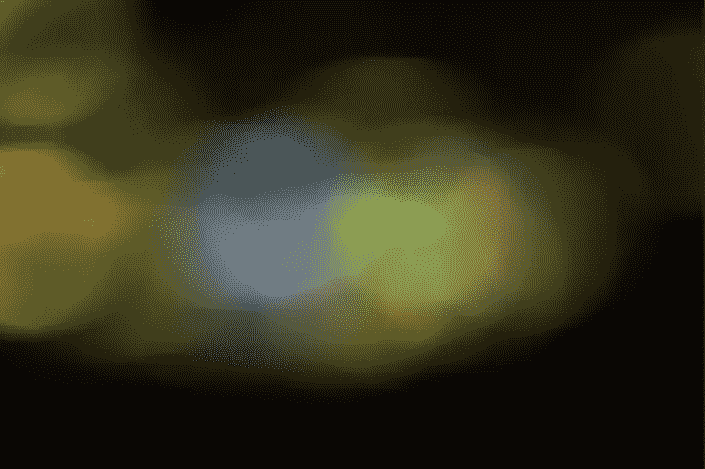](https://www.sitepoint.com/wp-content/uploads/2012/06/Screen-shot-2012-06-11-at-1.19.57-AM.png)

### 将一张*好的*照片变成有用的背景

我们的第一个例子是从一张拍得很差的照片开始的，所以让我们用稍微好一点的图像来尝试一些类似的技术。下面的图像有点模糊，但颜色很好。你可能通常会从散景背景示例中删除一张像这样的照片，但是在 Photoshop CS6 中，我们可以将它变成一个漂亮的背景。

[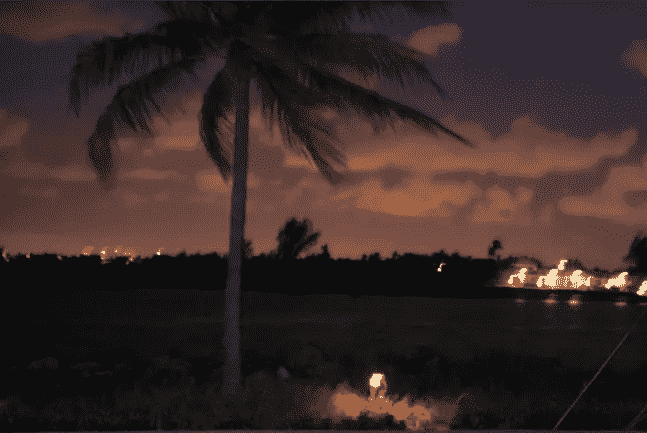](https://www.sitepoint.com/wp-content/uploads/2012/06/Screen-shot-2012-06-11-at-1.35.56-AM.png)

在单列选框工具或单行选框工具之间进行选择。单击从一边到另一端颜色范围很广的区域。正如你在下面看到的，选择右边是因为灯光，给选择的颜色带来变化。

[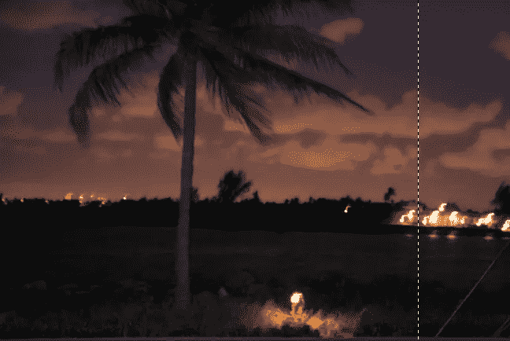](https://www.sitepoint.com/wp-content/uploads/2012/06/Screen-shot-2012-06-11-at-1.42.54-AM.png)

选择处于活动状态时，按 Command/Ctrl+“T”进入变换模式，并抓住左右中间手柄，在整个画布上拖动每一端。这创造了一个有趣的线性效果，你可以用在任何照片上，不管它的质量如何。

[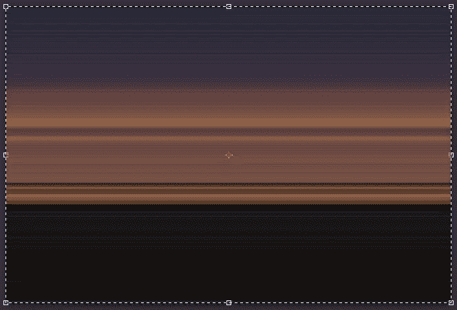](https://www.sitepoint.com/wp-content/uploads/2012/06/Screen-shot-2012-06-11-at-1.57.43-AM.png)

### 用自定义笔刷创建有用的背景

在 Photoshop 中，你不必从一张好照片、一张不太好的照片或任何照片开始创建一个纯色背景。让我们只用自定义笔刷和空白画布来创建一个。

在 Photoshop 中创建新文档。我们示例的尺寸是 1024 x 768 像素。新建一个图层，选择渐变工具。点击渐变图标，弹出选项对话框。创建一个从#27324c 开始到#133146 结束的线性渐变。将渐变工具沿对角线从左上角拖到右下角。

[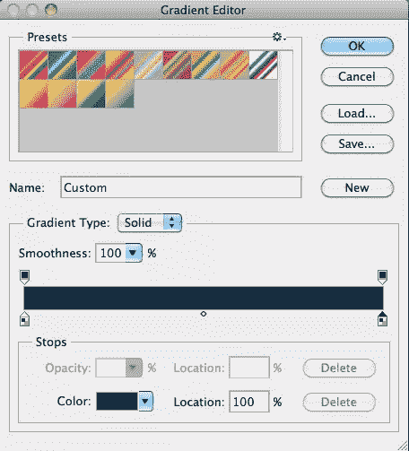](https://www.sitepoint.com/wp-content/uploads/2012/06/Screen-shot-2012-06-11-at-2.38.35-AM.png)

选择画笔工具，并选择一个软边画笔大小约为 50 像素。单击选项栏中的“画笔”面板图标来控制画笔的不同选项。

[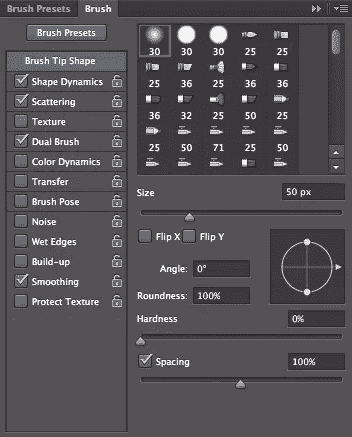](https://www.sitepoint.com/wp-content/uploads/2012/06/Screen-shot-2012-06-11-at-2.45.41-AM.png)

转到形状动态选项卡，并确保大小抖动设置为 100%。关闭控制，并将最小直径设置为 5%到 10%之间的值。

[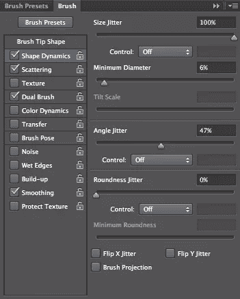](https://www.sitepoint.com/wp-content/uploads/2012/06/Screen-shot-2012-06-11-at-2.54.17-AM.png)

接下来，单击散射选项卡，将散射设置为两个轴，并将散射值设置为 1000%。你可以从预览中看到球体是分散的。你应该经常检查预览，以充分了解你的价值观是如何被可视化的。

[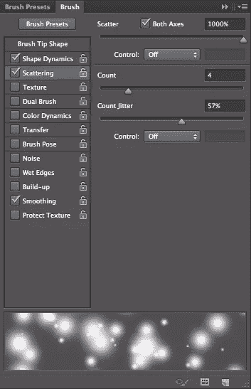](https://www.sitepoint.com/wp-content/uploads/2012/06/Screen-shot-2012-06-11-at-10.57.23-AM.png)

选择双画笔，并选择一个软边 30 像素画笔。你实际上是在将画笔本身相乘。结果是一个密集的闪光画笔。当我们用这种画笔绘画时，结果应该是各种各样的闪光效果。有些看起来很小很远，而另一些则很大很模糊，增加了我们工作的深度和广度。

[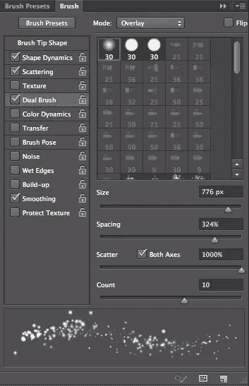](https://www.sitepoint.com/wp-content/uploads/2012/06/Screen-shot-2012-06-11-at-11.07.05-AM.png)

创建一个新层，用白色作为前景色，点击并拖动画布，你应该会得到一个分散的发光效果。火花应该从大到小，看起来是随机的。如果有太裸露的区域，那么你可以单击并填充这些区域。随意地尝试几次，直到你从你的自定义笔刷中得到你想要的分布。

[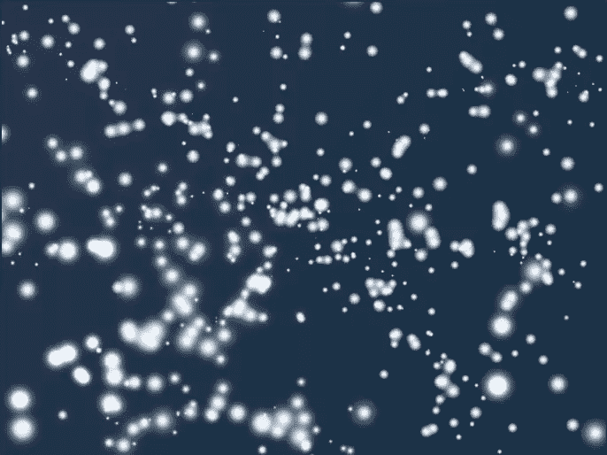](https://www.sitepoint.com/wp-content/uploads/2012/06/Screen-shot-2012-06-11-at-11.17.42-AM.png)

双击图层，调出图层样式选项。您在这里选择的颜色将取决于您的背景颜色，但效果本身应该大致相同。选择一个内部发光，并选择一种颜色来补充你的背景色。我选了#00e4ff。设置大小为 1px，混合模式改为强光。

[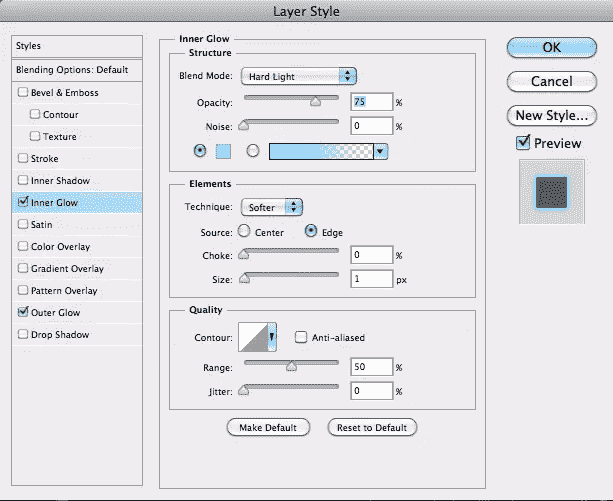](https://www.sitepoint.com/wp-content/uploads/2012/06/Screen-shot-2012-06-11-at-11.27.41-AM.png)

然后，选择外发光，选择一个比我们之前选择的颜色更鲜艳的颜色。我选了#00c5fe。保留 5px 的大小，设置混合模式为强光。使用这些设置，您应该会看到类似于下面所示的效果:

[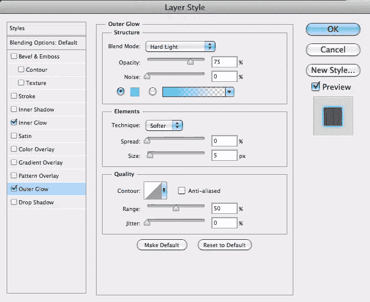](https://www.sitepoint.com/wp-content/uploads/2012/06/Screen-shot-2012-06-11-at-11.31.06-AM.png)

[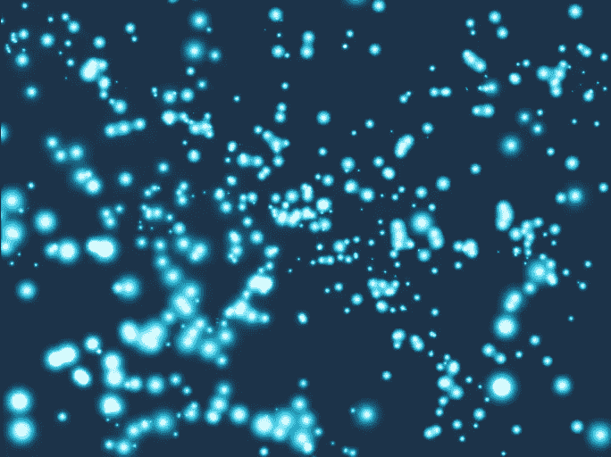](https://www.sitepoint.com/wp-content/uploads/2012/06/Screen-shot-2012-06-11-at-11.32.14-AM.png)

### 创建一个对角线光谱效果

这个背景效果很有趣，而且制作起来非常简单。创建一个新的文件，并用黑色填充。

接下来，新建一个图层，前景色设置为默认的黑白选项，点击“滤镜”>“渲染”>“云彩”您可以重复按 Command/Ctrl + "F "来重复筛选，直到获得您喜欢的结果。

[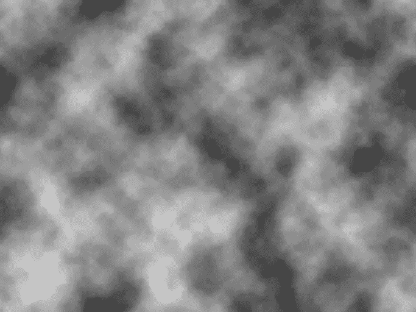](https://www.sitepoint.com/wp-content/uploads/2012/06/Screen-shot-2012-06-17-at-3.22.36-AM.png)

效果太亮了，所以接下来我们将创建一个图层蒙版。在图层蒙版上，再次运行云滤镜，然后到“滤镜”>“渲染”>“差异云”这将创建一个更强的面具，使多云的效果更加微妙和融合。

[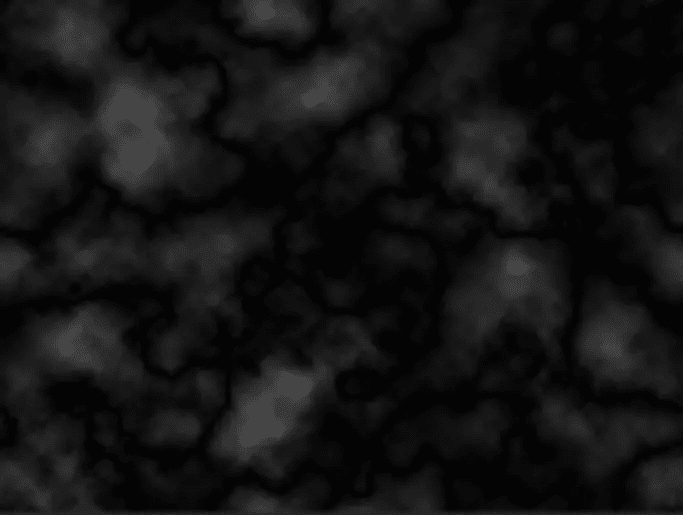](https://www.sitepoint.com/wp-content/uploads/2012/06/Screen-shot-2012-06-17-at-3.26.08-AM.png)

接下来，进入“滤镜”>“模糊”>“运动模糊”当对话框出现时，设置角度为 45 度，强度大约为 200 像素。这将创建一个很好的对角线模糊效果。

[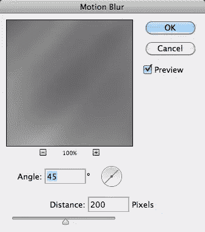](https://www.sitepoint.com/wp-content/uploads/2012/06/Screen-shot-2012-06-17-at-3.27.44-AM.png)

[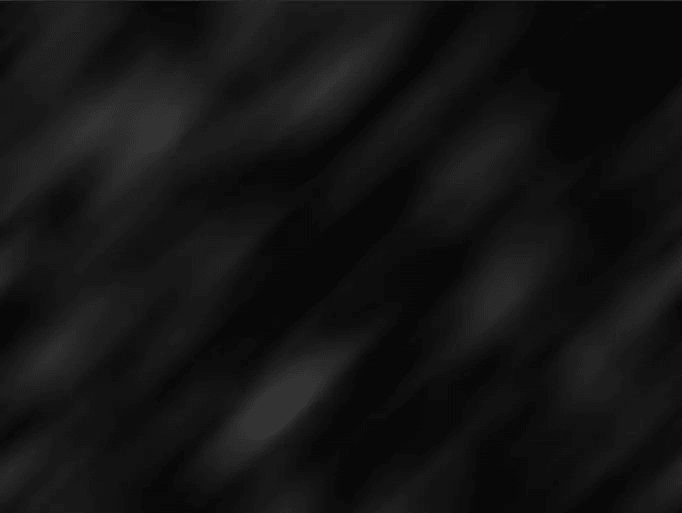](https://www.sitepoint.com/wp-content/uploads/2012/06/Screen-shot-2012-06-17-at-3.27.59-AM.png)

创建一个新层，选择你的渐变工具。转到选项栏并单击以编辑渐变。选择一个好的光谱梯度，有很多不同的颜色变化。您可以创建自己的预设或选择一个预设。

[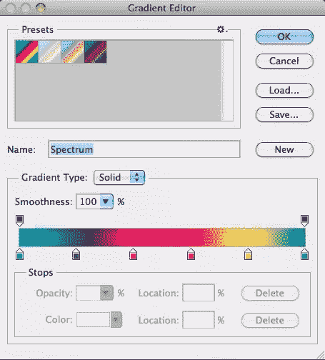](https://www.sitepoint.com/wp-content/uploads/2012/06/Screen-shot-2012-06-17-at-3.34.51-AM.png)

单击并拖动以在整个文档中绘制渐变。从左上角开始，拖到右下角。你的渐变应该是这样的:

[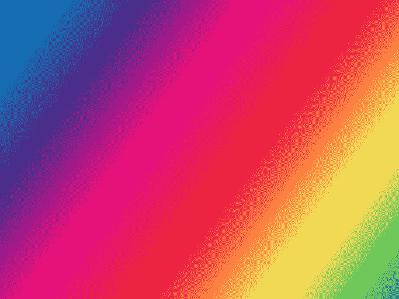](https://www.sitepoint.com/wp-content/uploads/2012/06/Screen-shot-2012-06-17-at-3.36.51-AM.png)

下面是将光谱渐变图层的混合模式分别改为叠加和叠加后的两个最佳结果。

相乘:

覆盖图:

[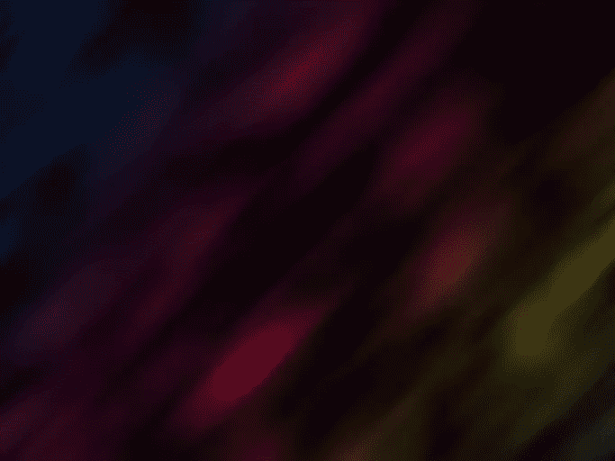](https://www.sitepoint.com/wp-content/uploads/2012/06/Screen-shot-2012-06-17-at-3.41.27-AM.png)

### 结论

你可以在网上搜索几个小时，为你的作品寻找合适的背景，或者你可以通过从头开始创建一个自定义背景来节省大量时间。可能性是无穷的，它会让你的作品更加独特。您可以创建您想要的外观，使用否则无用的照片，并整合颜色，特别适合您的设计。

你还有其他创造背景的技巧吗？

## 分享这篇文章