# 2012 年最佳新字体(迄今为止)

> 原文：<https://www.sitepoint.com/the-best-new-fonts-of-2012-so-far/>

我喜欢字体！毫无疑问，浏览大量新字体是我最大的时间杀手之一(仅次于脸书)。从创意的角度来看，字体是我设计的主要驱动力。通常，我会在寻找其他设计元素之前先寻找合适的字体。

这个系列包括一些最近进入 2012 年字体的作品，引起了我的注意。这些设计从干净的无衬线到华丽的衬线，甚至还有一些好看的脚本字体。将它们作为一个整体来研究(并与旧字体进行比较)可以揭示一些新兴的排版趋势。

并非所有这些都是免费的，但所有这些新字体都值得仔细看看。让我知道你把哪些加入你的收藏！

* * *

### 侏罗山

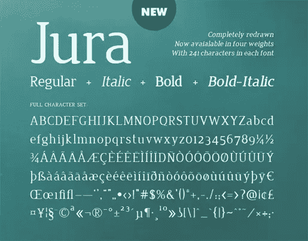

[来源](http://www.tenbytwenty.com/jura.php)

* * *

### 涂鸦字体

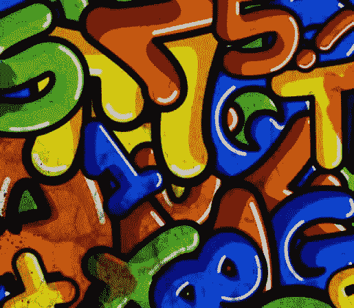

[来源](http://www.behance.net/gallery/The-Graffiti-Font-%28Free%29/2843205)

* * *

### 半粗体

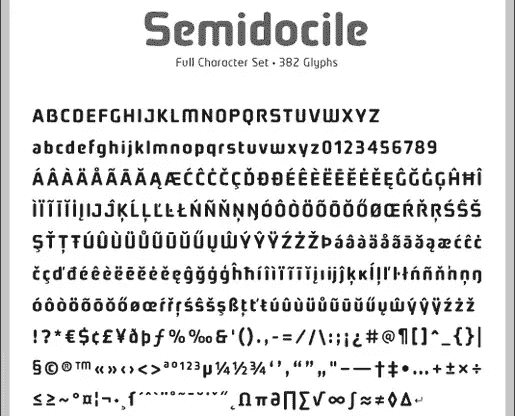

[来源](http://www.johnthecreative.com/stiffupperglyph/semidocile/)

* * *

### glegoo

[来源](http://www.google.com/webfonts/specimen/Glegoo)

* * *

### 鸡屁股

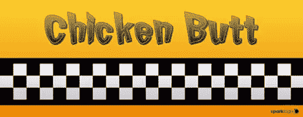

[来源](http://www.sparklogix.com/chicken-butt-free-font-download/)

* * *

### 每次都很美

[来源](http://www.fontspace.com/kimberly-geswein/beautiful-every-time)

* * *

### 阿雷格里亚

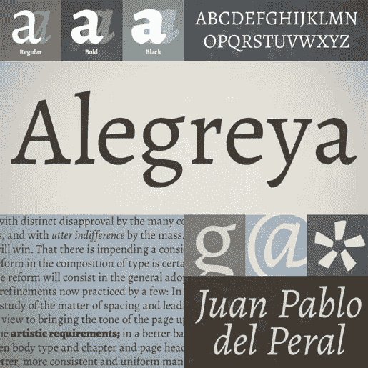

[来源](http://www.fontsquirrel.com/fonts/alegreya)

* * *

### 飞碟 BB

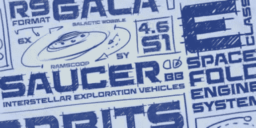

[来源](http://www.1001fonts.com/font_details.html?font_id=3672)

* * *

### Hagin

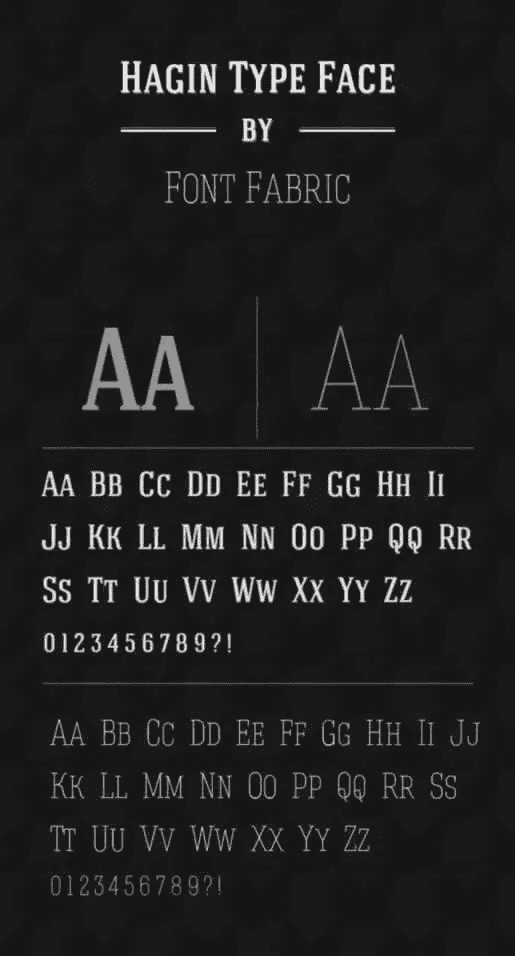

[来源](http://www.fontfabric.com/hagin-free-font/)

* * *

### 介绍

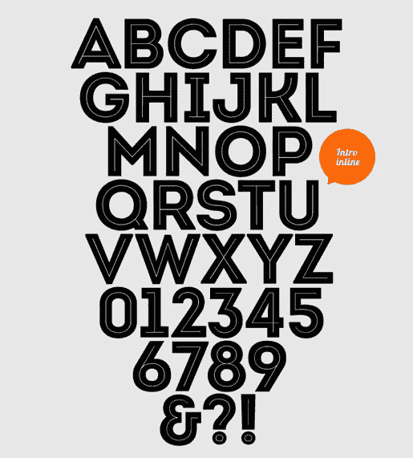

[来源](http://fontfabric.com/intro-free-font/)

* * *

### 存档免费字体

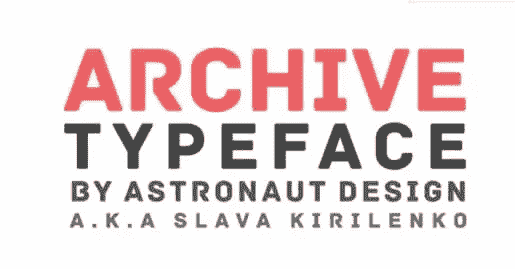

[来源](http://fontfabric.com/archive-free-font/)

* * *

### 星光大道

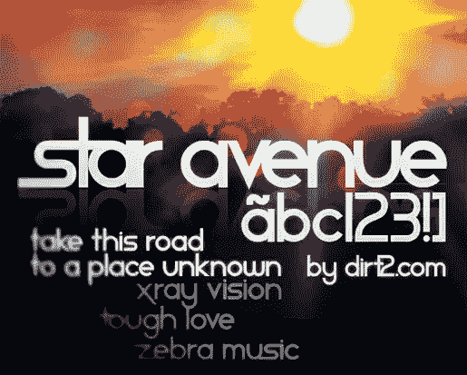

[来源](http://www.dafont.com/star-avenue.font)

* * *

### 斯坦纳

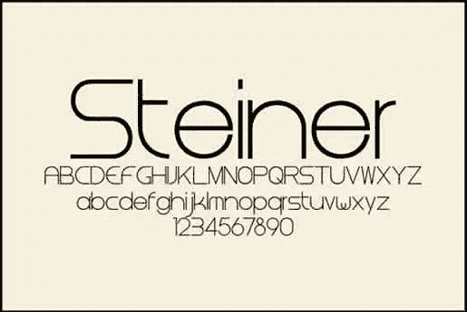

[来源](http://www.dafont.com/font.php?file=steiner)

* * *

### Scriptina

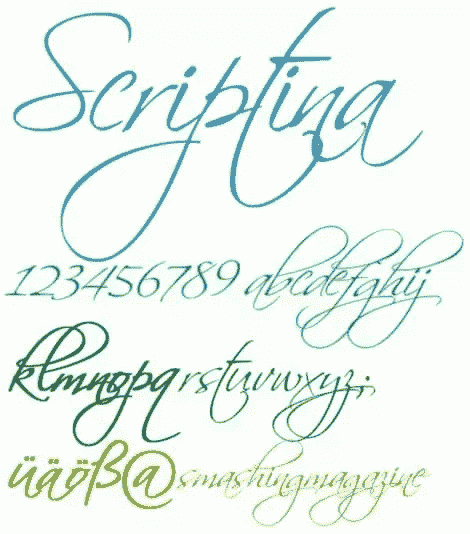

[来源](http://www.dafont.com/scriptina.font)

* * *

### 罗威

[来源](http://www.theleagueofmoveabletype.com/raleway)

* * *

### 萨吉诺

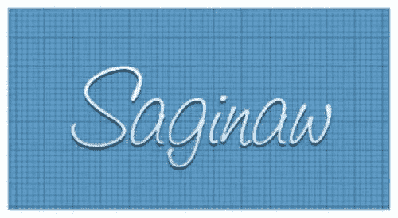

[来源](http://www.fontcubes.com/Saginaw.font)

* * *

### 布兰登怪诞

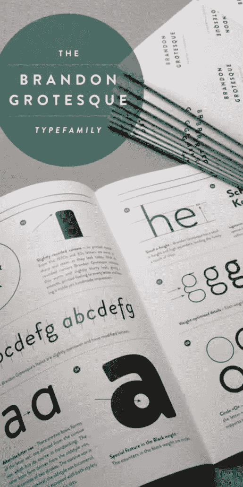

[来源](http://www.behance.net/gallery/Brandon-Grotesque-%28Typefamily%29/457520)

* * *

### 很棒的共鸣

[来源](http://www.fontspace.com/typesetit/great-vibes)

* * *

### 瑞典脚本演示

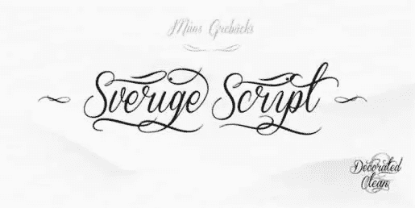

[来源](http://www.fontspace.com/m%C3%A5ns-greb%C3%A4ck/sverige-script-demo)

* * *

### 连续出版物

[来源](http://www.fontspace.com/kc-fonts/serial-publication)

* * *

### 涂鸦盒

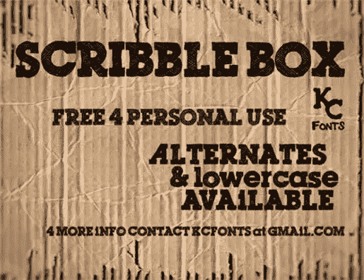

[来源](http://www.fontspace.com/kc-fonts/scribble-box)

* * *

### 印花税法案混乱

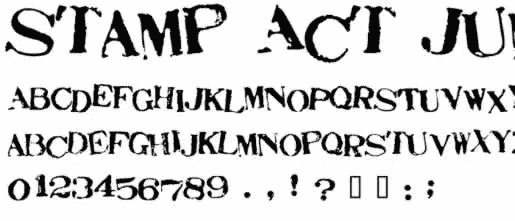

[来源](http://mafonts.com/font/s/font-stamp-act-jumbled-2345.html)

* * *

### Benguiat Bk BT 粗斜体

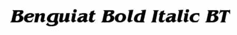

[来源](http://mafonts.com/font/b/font-benguiat-bold-italic-bt-2448.html)

* * *

### ＯＰＴIＭＵＭ的复数

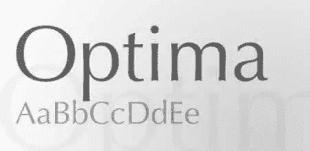

[来源](http://mafonts.com/font/o/font-optima-19762.html)

* * *

### 贝尔纳

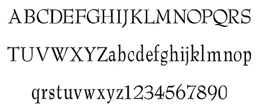

[来源](http://fonts.simplythebest.net/fonts/Barnard.html)

* * *

### 反政府人员

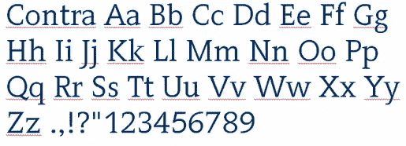

[来源](http://fonts.simplythebest.net/fonts/Contra.html)

* * *

### 儿童第一版

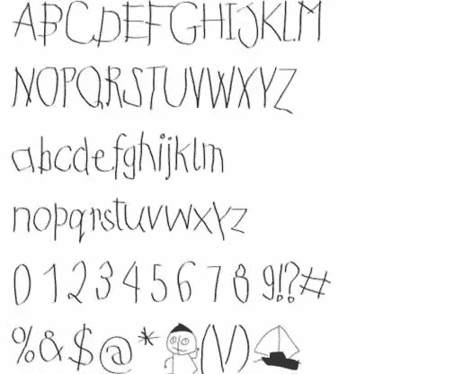

[来源](http://fonts.simplythebest.net/fonts/Kids_First_Print_Font.html)

* * *

### 马头杆

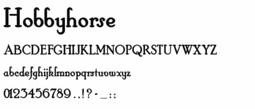

[来源](http://fonts.simplythebest.net/fonts/hobbyhorse.html)

* * *

### 布拉德利免费

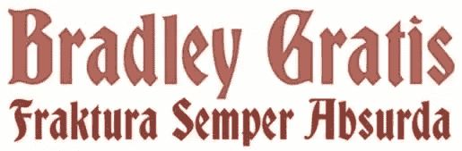

[来源](http://fonts.simplythebest.net/fonts/bradley_gratis.html)

* * *

### 仙黛尔·古古

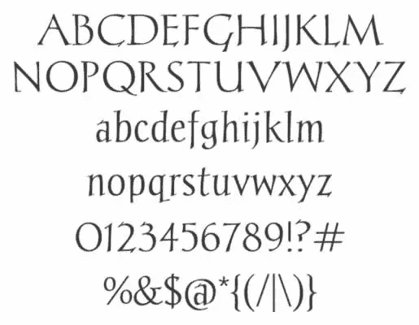

[来源](http://fonts.simplythebest.net/fonts/Chantelli_Antiqua.html)

* * *

### Peterbuilt v.1

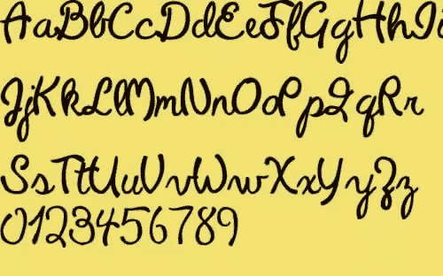

[来源](http://www.1001fonts.com/font_details.html?font_id=3589)

* * *

*上面有你喜欢的字体吗？你认为这个系列有任何排版趋势吗？还有其他值得注意的新字体吗？*

## 分享这篇文章