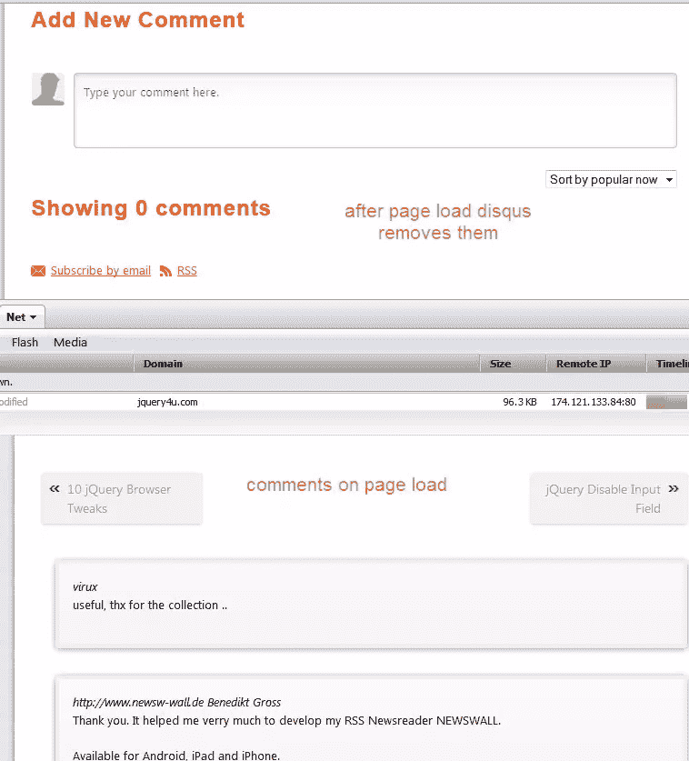
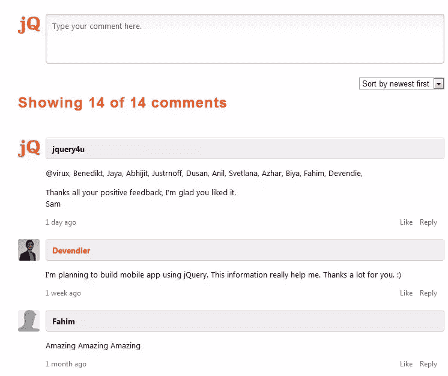

# 隐藏我的评论

> 原文：<https://www.sitepoint.com/wordpress-disqus-js-hiding-comments/>

你可能已经注意到，我已经将 Disqus 评论引擎整合到博客中，让人们更容易评论文章，也让我自己更容易管理和回复文章。然而，我确实遇到了一个问题，似乎所有以前的评论(从 WordPress 导入的旧评论)都加载到了页面上，但没有显示出来。如果你仔细观察，你会发现评论已经清晰地加载到页面中，但是没有显示出来。

它只说“0 条评论”。

### 没用！！！

根据调查**，看起来 Disqus 插件与 W3 总缓存**(和 W3 超级缓存)插件有冲突。我试着用 WordPress 插件自动导入评论，但是没用。然后我试着把从 WordPress 手动导出的**作为 WXR 文件，直接导入到 Diqus**:disqus.com/admin/tools/import/platform/wordpress/*中，它工作了*！:)

登录 WordPress，点击>工具>导出>所有内容(这将包含你所有的文章、页面、评论、自定义字段、术语、导航菜单和自定义文章)。

### 起作用了！！！

## 分享这篇文章