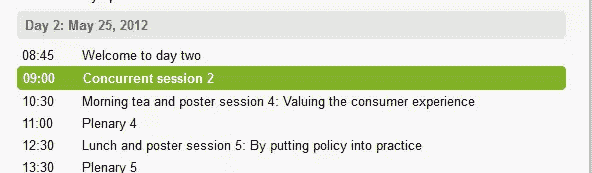
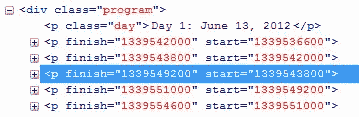

# jQuery 基于当前日期时间突出显示元素

> 原文：<https://www.sitepoint.com/jquery-highlight-element-based-current-date-time/>

这是我写给**的一个小 jQuery 函数，根据当前日期和时间**(使用日期时间戳)向元素添加一个选定的类。想法是设置一个当前显示的当前会话，如下面的截图所示。




## $.dateTimeHighlightNow()函数

```
/**
  * $.dateTimeHighlightNow()
  * Author: Sam Deering
  * Adds/removes a selected class on elements based on the current date and time.
  * usage: $('.program p').dateTimeHighlightNow();
  */
jQuery.fn.dateTimeHighlightNow = function()
{
    return this.each(function()
    {
        var datetimestamp = Math.round(new Date().getTime() / 1000)
            elem = $(this),
            start = elem.attr('start'),
            finish= elem.attr('finish');

            log('datetimestamp = '+datetimestamp);

        if (start  datetimestamp)
        {
            elem.addClass('selected');
            log(elem);
        }
        else
        {
            elem.removeClass('selected');
        }

    });
};
```

## 用法:

```
$('.program p').dateTimeHighlight();
```

你的 HTML 代码应该是这样的:


进一步的用法可能是每 1 分钟左右运行一次自动刷新事件:

```
/* monitor for auto change of current active session based on date/time */
setInterval(function()
{
    //run every minute
    $('.program p').dateTimeHighlight();
}, 60000);
```

## 更进一步的想法

*   PHP 时间戳在服务器端执行(你的服务器系统时钟)。
*   JavaScript 时间戳在客户端(您的 pc 系统时钟)执行。
*   进一步检查将客户端的时区设置转换到服务器，以突出显示当前会话(这是我可能会在不久的将来实现的东西，请继续关注)。

## 分享这篇文章