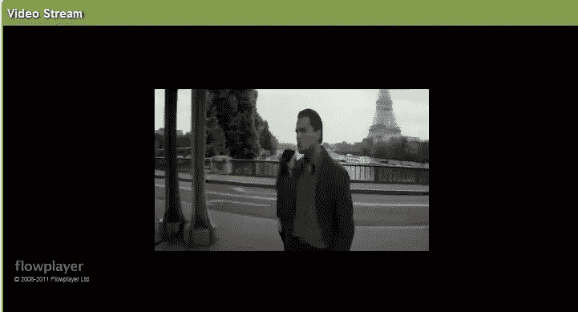

# 缩放 Flowplayer 视频剪辑

> 原文：<https://www.sitepoint.com/scaling-flowplayer-video-clip/>

这里有一些在 Flowplayer 视频剪辑上可以使用的各种缩放方法的例子。非常直接，但视觉效果很好，尤其是当你在调整配置时。缩放选项有**原始、一半、适合、缩放**，这定义了视频在视频屏幕上的缩放方式。

### 缩放:原始

*orig:* 使用文件中编码的尺寸。如果视频对于可用空间来说太大，则使用“适合”选项缩放视频。

### 缩放:一半

*半:*半尺寸(保留长宽比)

### 缩放:适合

*适合:*通过保留文件元数据中编码的纵横比来适合窗口。

### 缩放:缩放

*缩放:*缩放视频以填充所有可用空间。忽略元数据中的维度。这是默认设置。

## 分享这篇文章