# 在 Photoshop 中创建一个风格化的冰淇淋甜筒

> 原文：<https://www.sitepoint.com/create-a-stylized-ice-cream-cone-in-photoshop/>

实践是磨练你的 Photoshop 技能的最佳方式，我相信我们都已经对常见的基本任务进行了足够的实践，例如裁剪公司头像、在文档设计中建立边距和填充，以及为有力的营销文案添加阴影。让我们尝试一个更不寻常的、不会每天都出现在你办公桌(或收件箱)上的任务，而不是练习同样的旧任务。本教程主要是 Photoshop 的钢笔工具中的一个练习(毕竟，不幸的是，一旦我们完成了，我们就不能吃冰淇淋了)。我们将使用各种钢笔工具过滤器和图层样式来磨练你的钢笔工具实力。

让我们看看我们的最终结果:

### 

### 第一步

在 Photoshop 中创建一个宽度为 600 像素、高度为 700 像素的新文档。

[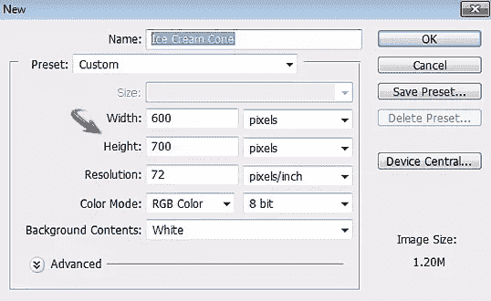](https://www.sitepoint.com/wp-content/uploads/2012/05/115.jpg)

### 第二步

将#e3a55d 设置为您的前景色。现在，选择钢笔工具，点击选项栏中的“图层”选项，绘制如下所示的圆锥形状。

[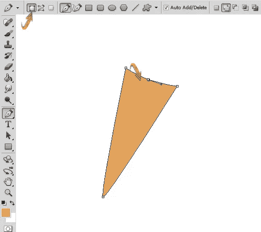](https://www.sitepoint.com/wp-content/uploads/2012/05/24.jpg)

点击这个圆锥图层，进入“图层”>“图层样式”>“混合选项”使用下面提供的设置。你也可以通过双击锥形图层打开图层样式窗口。

[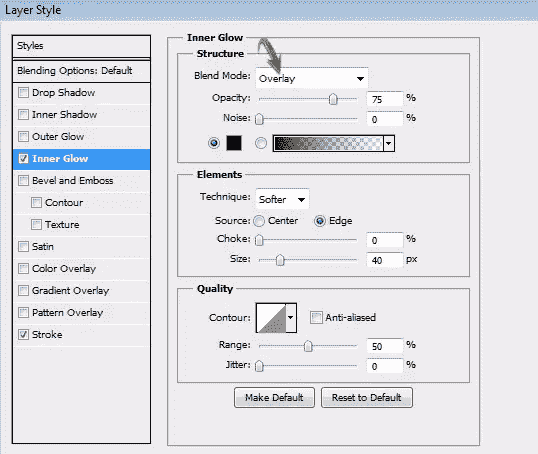](https://www.sitepoint.com/wp-content/uploads/2012/05/2b1.jpg)

[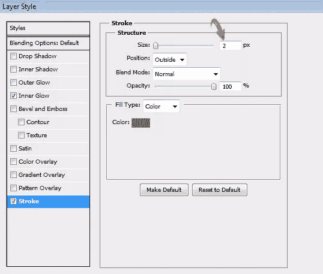](https://www.sitepoint.com/wp-content/uploads/2012/05/2c.jpg)

[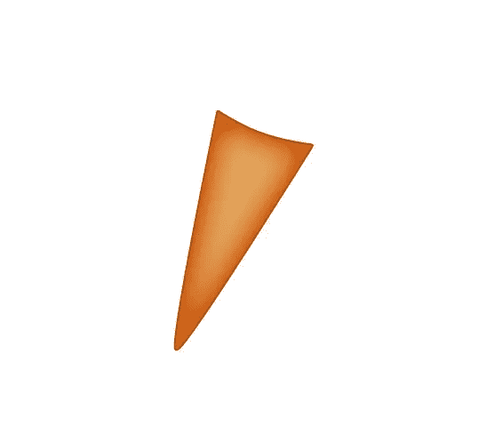](https://www.sitepoint.com/wp-content/uploads/2012/05/2d.jpg)

### 第三步

接下来，我们将为甜筒饼干创建条纹。首先，选择#f5c28a 作为你的颜色，然后选择 3px 大小的“硬圆刷”。现在，选择钢笔工具，从顶部的选项栏中选择“路径”,画一条稍微弯曲的线，如下图所示。之后，点击右键，选择“笔画路径”>“笔刷”然后，按“Delete”去掉路径。

[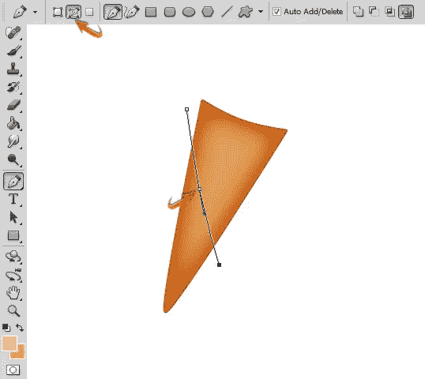](https://www.sitepoint.com/wp-content/uploads/2012/05/34.jpg)

双击这个新的线条图层，使用下面的设置来投射阴影。

[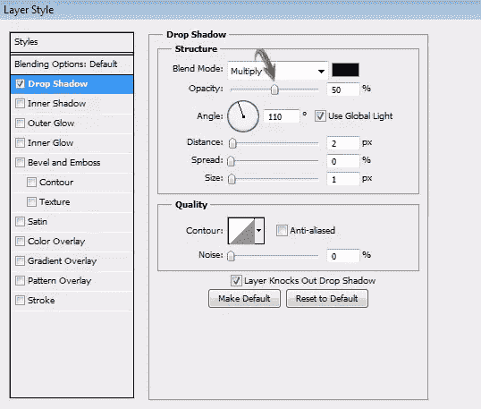](https://www.sitepoint.com/wp-content/uploads/2012/05/3b.jpg)

### 第四步

现在，我们需要这一行的几个副本。为此，将移动工具放在线上，然后按 Alt 键。你会注意到双箭头。现在简单地拖动这条线一点。重复此步骤以获得所需的线条副本。

[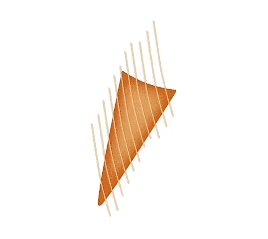](https://www.sitepoint.com/wp-content/uploads/2012/05/45.jpg)

收集所有的条纹层到一个组，复制这个组，然后到“编辑”>“变换”>“水平翻转”之后，按 Ctrl + "T "激活自由变换工具。倾斜这些重复的条纹组，形成华夫饼干筒常见的十字形图案。

[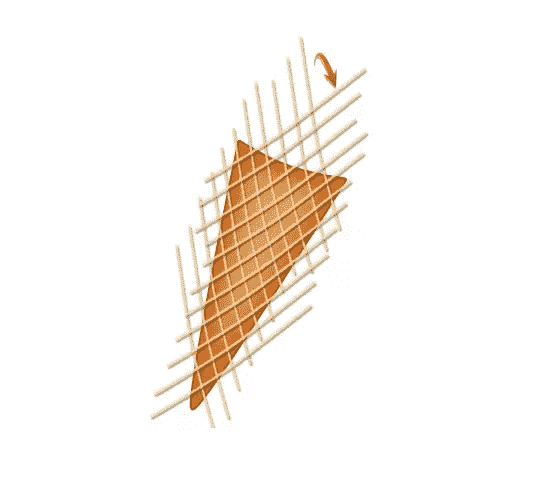](https://www.sitepoint.com/wp-content/uploads/2012/05/4b1.jpg)

将两个“锥形条纹”组合并在一起。您可以通过按住 Shift 键选择组，然后右键单击打开选项窗口并选择“合并层”来完成此操作一旦你完成了，点击合并层，然后按 Ctrl +锥层的缩略图。现在，点击图层面板底部的“添加图层蒙版”图标。

[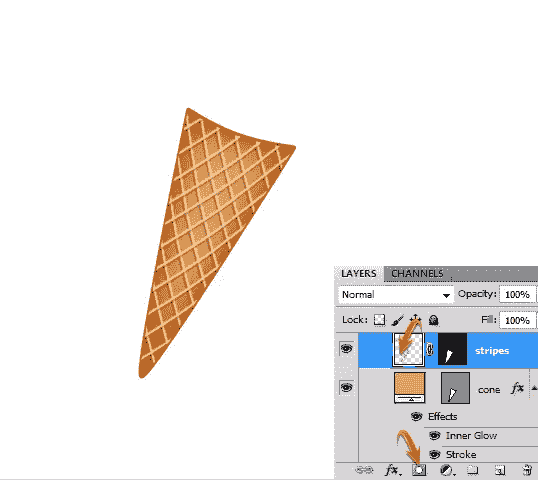](https://www.sitepoint.com/wp-content/uploads/2012/05/4c.jpg)

### 第五步

现在，我们将继续创建不同口味(和不同颜色)的冰淇淋勺。选择钢笔工具的“形状层”选项来绘制如下所示的形状。使用#ffeb8a 作为颜色。

[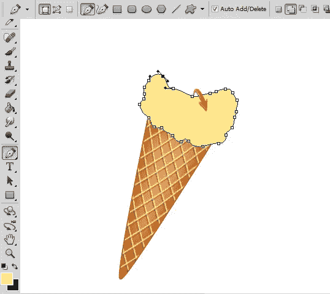](https://www.sitepoint.com/wp-content/uploads/2012/05/53.jpg)

双击勺子层，使用下面的设置为冰淇淋添加内部发光。

[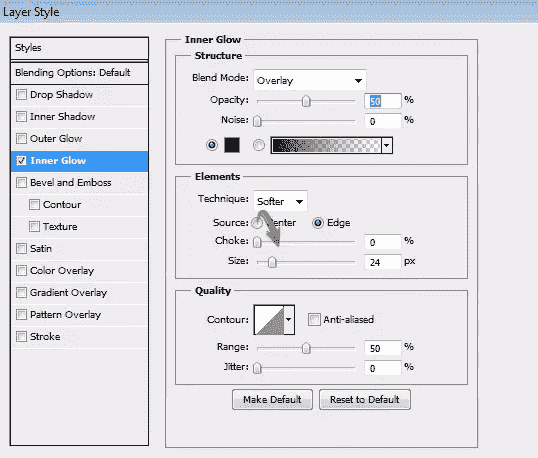](https://www.sitepoint.com/wp-content/uploads/2012/05/5b.jpg)

### 第六步

接下来，使用钢笔工具在勺子上画一些阴影和高光。你可以粗略地、不精确地接近这一步，以获得冰淇淋的适当瑕疵。我用#fec22b 做阴影，用#fbfec6 做高光。完成后，右键单击勺子层，选择“复制图层样式”，右键单击其余的形状层，并选择“粘贴图层样式”应用相同的内部发光效果。

[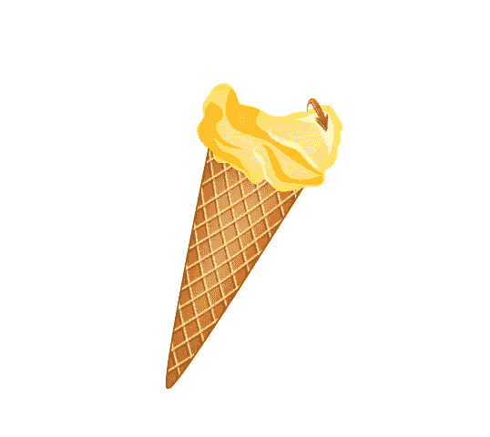](https://www.sitepoint.com/wp-content/uploads/2012/05/63.jpg)

### 第七步

合并所有组成冰淇淋勺的图层，然后进入“滤镜”>“艺术”>“调色刀”使用以下设置。

[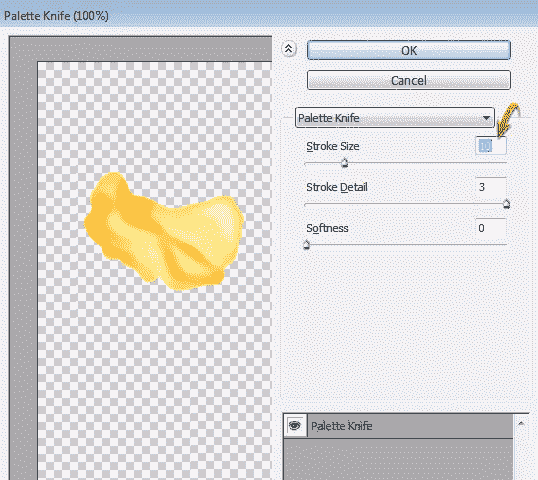](https://www.sitepoint.com/wp-content/uploads/2012/05/73.jpg)

[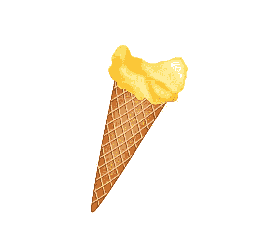](https://www.sitepoint.com/wp-content/uploads/2012/05/7b.jpg)

### 第八步

复制勺子层，使用“颜色叠加”将它变成黑色，将这个层的混合模式改为“叠加”，然后将其不透明度降低到 40%。将这一层放在原来的勺子层下面；向下拖动一点，进入“滤镜”>“模糊”>“高斯模糊”高斯模糊使用 1.5 像素的值。您可以擦除不想要的阴影区域。

[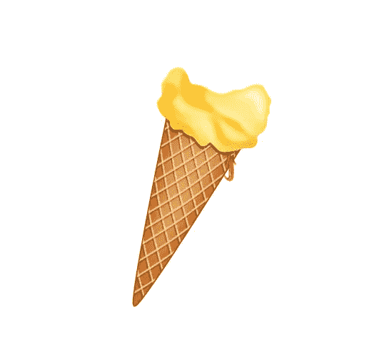](https://www.sitepoint.com/wp-content/uploads/2012/05/83.jpg)

### 第九步

您可以使用第 5 步到第 8 步中的相同技术创建更多的勺子。尽可能多加些勺子。减少每个新勺子的整体尺寸将使圆锥体看起来平衡。

[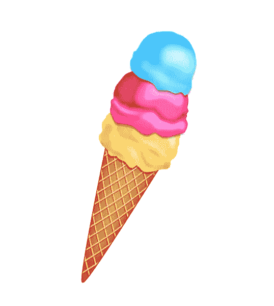](https://www.sitepoint.com/wp-content/uploads/2012/05/93.jpg)

### 第十步

现在，我们将在冰淇淋勺上制作巧克力糖浆。使用钢笔工具以#753700 为你选择的颜色画出下面的形状。

### 步骤 11

双击新添加的巧克力糖浆层，对“缎面”使用以下设置

[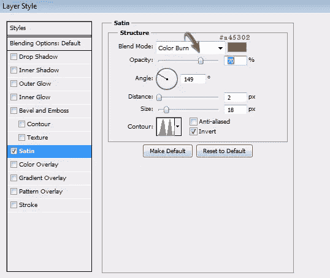](https://www.sitepoint.com/wp-content/uploads/2012/05/116.jpg)

[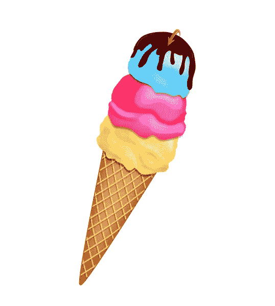](https://www.sitepoint.com/wp-content/uploads/2012/05/11b.jpg)

### 步骤 12

对于额外的浇头(和额外的钢笔工具练习)，我们将在巧克力上创建粉点。设置任何明亮的色调作为你的前景和背景色，我用红色和黄色。然后，在画笔面板中使用这些设置。

[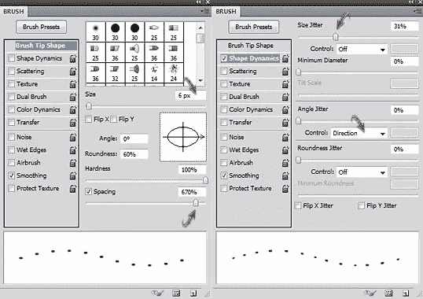](https://www.sitepoint.com/wp-content/uploads/2012/05/124.jpg)

[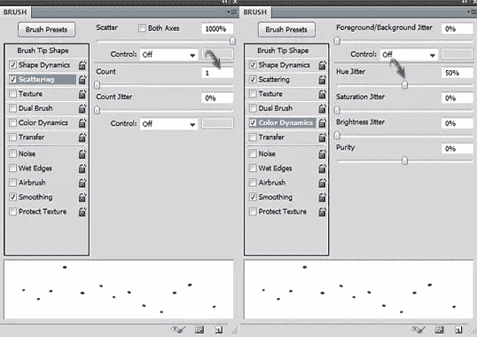](https://www.sitepoint.com/wp-content/uploads/2012/05/12b1.jpg)

如下图所示使用笔刷。小心地在冰淇淋上画你的画笔，应该会在你的冰淇淋上均匀地、多彩地洒上……嗯……点点。

[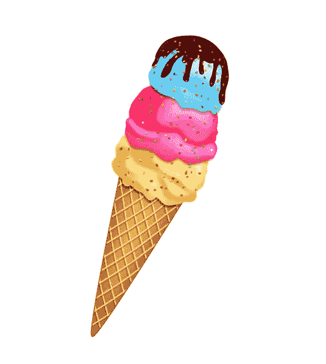](https://www.sitepoint.com/wp-content/uploads/2012/05/12c.jpg)

### 第十三步

接下来，我们将创建一个樱桃放在顶部。设置#ce6d80 为你的前景色。选择椭圆工具画一个圆。然后，使用“添加锚点工具”添加锚点，并调整如下圆的形状。完成后，复制这一层，使用自由变换工具稍微减小新副本的大小，并将其颜色更改为#d6030c。现在，选择椭圆选框工具，填充#710000，在樱桃顶部形成凹陷区域。之后，进入“滤镜”>“模糊”>“高斯模糊”，使用 1px 的值应用一个模糊效果。

[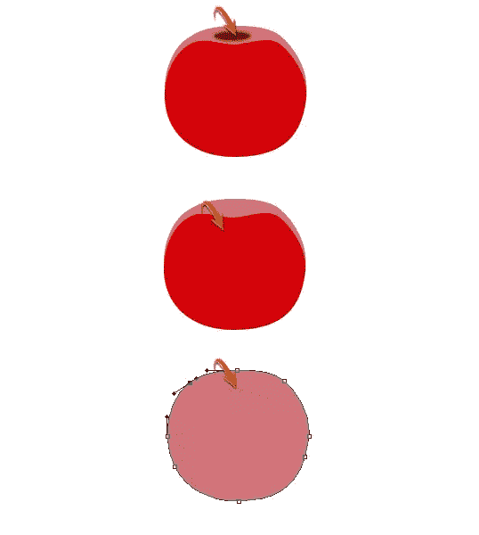](https://www.sitepoint.com/wp-content/uploads/2012/05/133.jpg)

### 步骤 14

使用以下设置添加一个内部发光的所有层组成你的樱桃。

[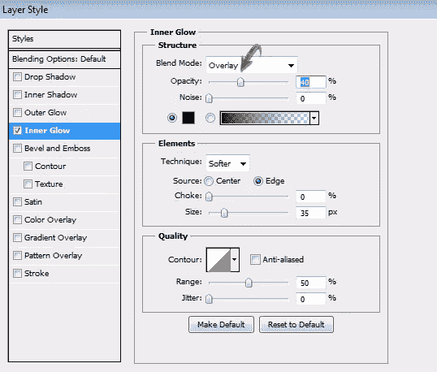](https://www.sitepoint.com/wp-content/uploads/2012/05/143.jpg)

现在，用#c9c770 和#b9824a 作为你的颜色，用你的钢笔工具画一个樱桃梗。

[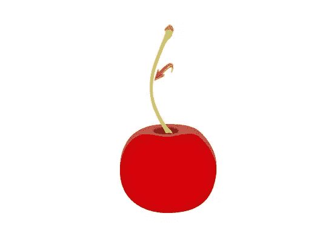](https://www.sitepoint.com/wp-content/uploads/2012/05/14b1.jpg)

### 第十五步

给樱桃茎一些纹理和特征，点击绿色茎层，应用下面的图层样式设置。

[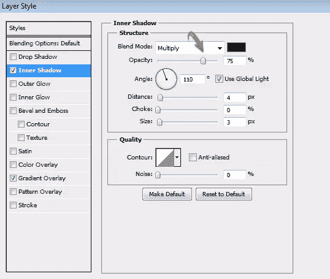](https://www.sitepoint.com/wp-content/uploads/2012/05/153.jpg)

[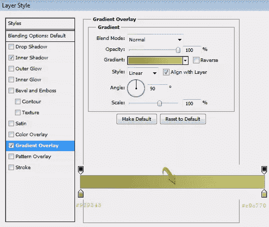](https://www.sitepoint.com/wp-content/uploads/2012/05/15b.jpg)

使用这些设置为茎顶端的棕色帽子的内部发光。

[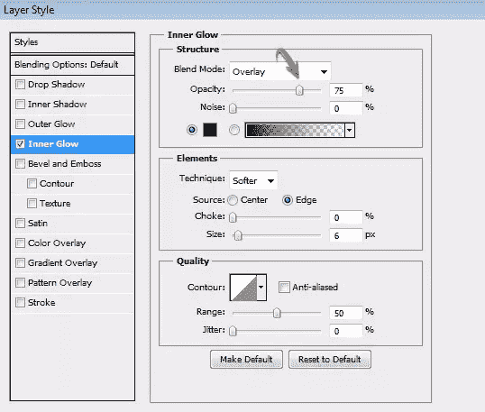](https://www.sitepoint.com/wp-content/uploads/2012/05/15c.jpg)

[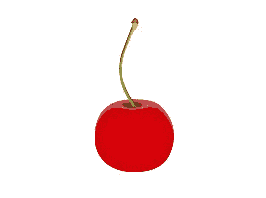](https://www.sitepoint.com/wp-content/uploads/2012/05/15d.jpg)

### 第十六步

创建几个亮点，选择软圆刷工具，并适用于一个新的层。改变这一层的混合模式为“柔光”

[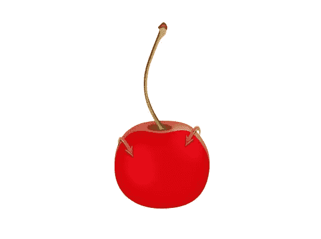](https://www.sitepoint.com/wp-content/uploads/2012/05/162.jpg)

合并所有层形成樱桃在一起，并根据需要使用自由变换工具减少樱桃的大小。以一个角度把它很好地放在冰淇淋上。擦掉樱桃的下缘，给人一种它嵌在冰淇淋里的印象(没有双关语)。

[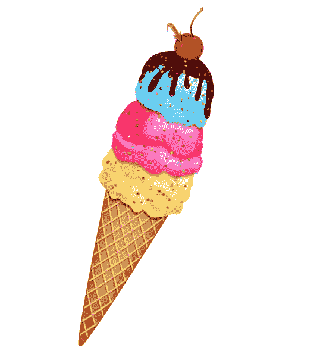](https://www.sitepoint.com/wp-content/uploads/2012/05/16b.jpg)

[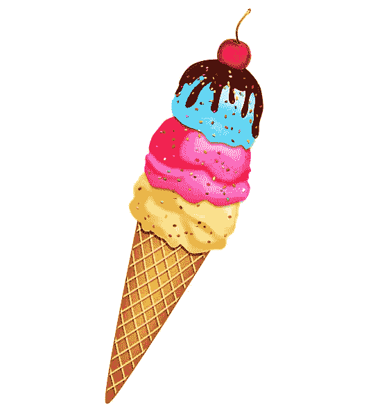](https://www.sitepoint.com/wp-content/uploads/2012/05/16c.jpg)

### 步骤 17

收集所有的层形成你的冰淇淋甜筒到一个新的组，并复制这个组。现在，合并复制的组。缩小它的大小，并使用自由变换工具将其排列成一个角度。现在，使用步骤 8 中的相同技术为冰淇淋甜筒创建阴影。我的影子如下图所示。

[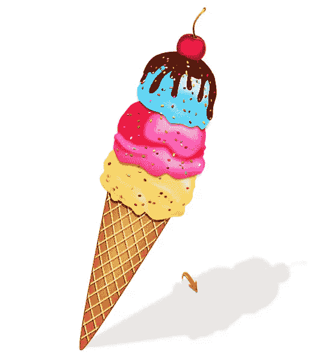](https://www.sitepoint.com/wp-content/uploads/2012/05/172.jpg)

### 步骤 18

现在，我们将创建一个微妙的背景。将#e7e7e7 和#ffffff 分别设置为前景色和背景色。创建一个新层，用油漆桶工具填充它。然后，进入“过滤器”>“渲染”>“纤维”

[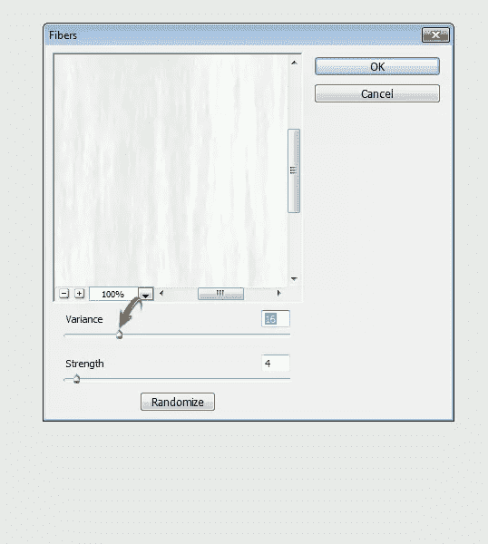](https://www.sitepoint.com/wp-content/uploads/2012/05/182.jpg)

### 步骤 19

接下来，进入“滤镜”>“扭曲”>“玻璃”使用以下设置。

[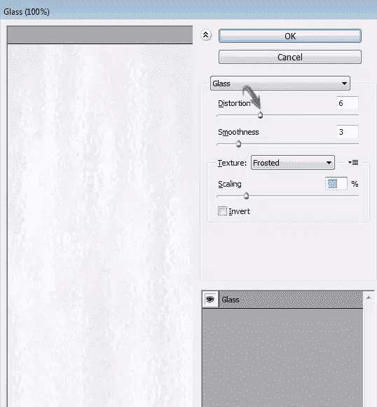](https://www.sitepoint.com/wp-content/uploads/2012/05/192.jpg)

### 步骤 20

最后，点击图层面板底部的图标“创建新的填充或调整图层”，然后选择“曲线”使用这些设置来调整音调。

[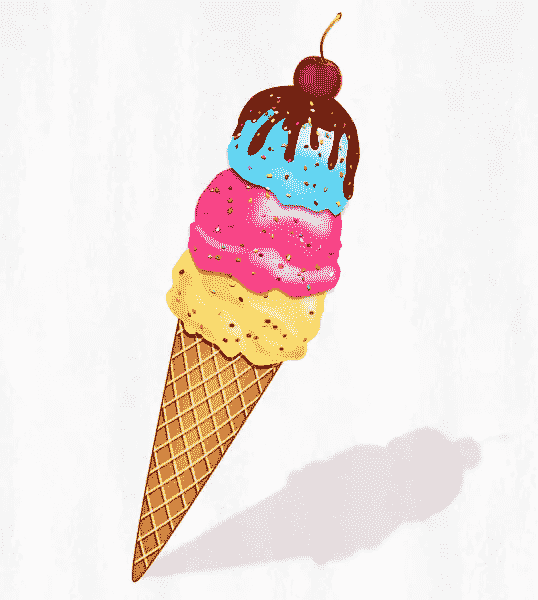](https://www.sitepoint.com/wp-content/uploads/2012/05/Final-result3.jpg)

那都是男生。希望你喜欢这个教程，提高你的钢笔工具技能，并学到一些有用的东西。不要忘记分享你的想法，可能还有你的冰淇淋。玩得开心，享受你的冰淇淋吧！

## 分享这篇文章