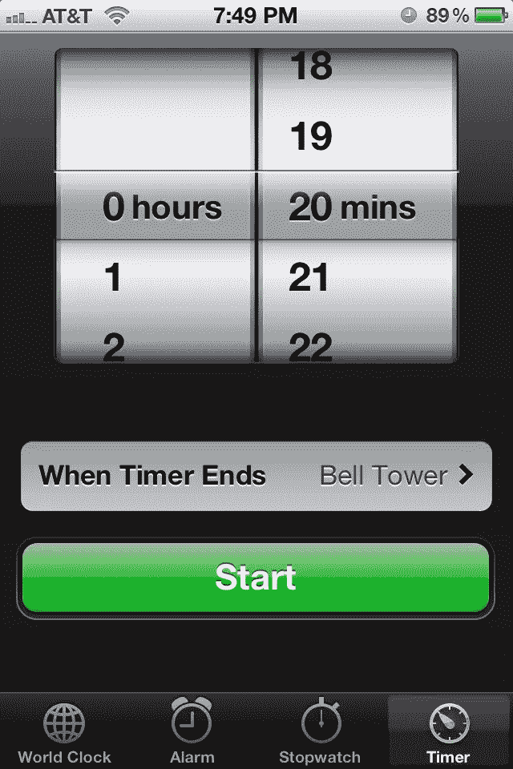

# 你(你应该)遵循 iOS 人机界面指南吗？

> 原文：<https://www.sitepoint.com/do-you-and-should-you-follow-the-ios-human-interface-guidelines/>

iOS 开发者很可能非常熟悉[苹果的 iOS 人机界面指南](http://developer.apple.com/library/ios/#documentation/UserExperience/Conceptual/MobileHIG/Introduction/Introduction.html)(被亲切地称为“HIG”)。本质上，这些指南是一份冗长、详细、全面的文档(可查看和下载[此处](http://developer.apple.com/library/ios/#documentation/UserExperience/Conceptual/MobileHIG/Introduction/Introduction.html))，它非常精确地定义了一个直观的 iOS 应用程序界面应该是什么样子，以及在应用程序的内部工作中应该使用什么功能和编程方法。简而言之，这是一个指南，它定义了如何以正确的*方式*构建一个 iOS 应用……至少苹果是这样认为的。

### 人机界面指南提供了什么？

从应用程序用户的角度来看，这些界面指南的影响表现为常见的按钮、转盘和熟悉的滑动手势和菜单。遵循人机界面指导方针的应用程序看起来好像是苹果公司开发的。在某种程度上，他们是。苹果软件开发工具包(SDK)旨在提供资源，帮助你实现你的想法，SDK 和指南一起工作，在遵循它们的所有应用程序之间建立一致性。如果你曾经第一次打开一个新安装的应用程序，并且非常熟悉它的界面元素，你可能会使用一个严格遵循 *HIG* 的应用程序。

任何 iOS 设备自带的股票应用程序(如你所料)都是遵循 HIG 的界面的典型例子。

从应用程序开发人员的角度来看，这些指南可以帮助您找到复杂界面问题的解决方案，并解决涉及如何显示内容、如何接受用户输入以及根据您的目的使用哪些常见界面元素的难题。尽管我们都认为我们的应用是独一无二的、前所未有的、革命性的，但是你可以通过遵循标准的设计指南来满足你的界面需求。这几乎肯定会帮助你的应用程序通过苹果严格的应用程序审批流程，正如苹果在指南中所建议的那样，这可能会导致更高的评级、更多的应用程序销售和更满意的用户:

> “人们喜欢感觉像是专门为设备设计的 iOS 应用程序。例如，当一个应用程序很适合设备屏幕，并对人们知道的手势做出反应时，它提供了人们正在寻找的许多体验。此外，尽管人们可能不知道人机界面设计原则，如直接操作或一致性，但他们可以判断应用程序何时遵循它们，何时不遵循它们。当你开始设计一个 iOS 应用程序时，一定要了解是什么让基于 iOS 的设备独一无二，并学习如何融入 HI 设计原则，以便你能提供人们会欣赏的用户体验。”

### HIG 有负面影响吗？

遵循这些接口指南显然有一些强大的优势，但也可能有值得考虑的缺点。显然，你将与数以千计的其他应用程序共享一个共同的外观和感觉，这使得让你的应用程序脱颖而出的任务变得相当困难。用于典型的应用目的(列表应用、社交媒体应用、笔记应用等。)通常每个用途都有几十个甚至更多的 app，也就是说你只能通过你如何设计界面来区分你的。如果你和你的所有同行都严格遵循同样的指导方针，你的应用程序可能会惊人地相似，这给用户提供了很少的多样性，让应用程序商店挤满了几乎相同的选项，最终稀释了你的努力。

很难忽视那些不遵守这些界面准则的大获成功的应用程序。像《愤怒的小鸟》和《T2 水果忍者》这样无处不在的游戏拥有极高的收视率，并且已经在《T4》卖出了数百万份拷贝，但是它们显然完全背离了《HIG 》,创造了自己的界面来代替苹果风格的设计。这些和其他“无 HIG”应用程序的流行和成功的部分原因可能是它们对指南的偏离使它们以一种有形的、立即可感知的方式变得不同。

很难说你是否应该接受并遵循苹果对每个 iOS 项目的人机界面指导方针。优势是显而易见的，但也有一些突出的应用程序取得了巨大的成功，却完全忽视了直观的苹果风格设计的“规则”。

你严格遵守苹果公司的人机界面指南吗？你认为跟随他们会给你的应用带来直观的熟悉感和用户友好性吗？或者，它是否会迫使您构建一个外观和功能与其他许多应用程序相似的“通用”应用程序？

## 分享这篇文章