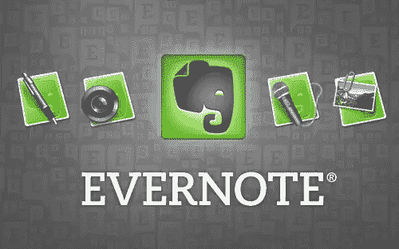
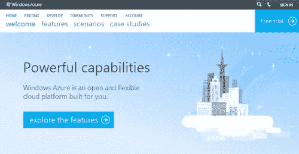
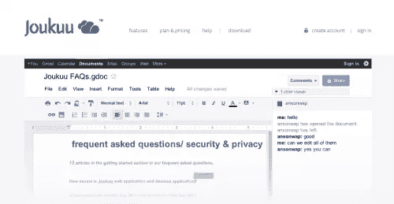
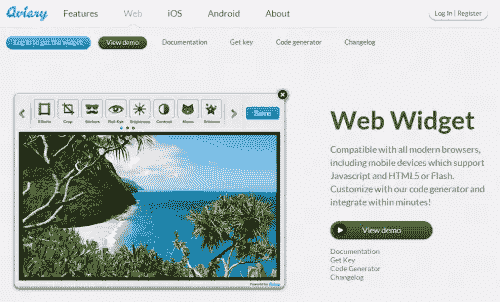
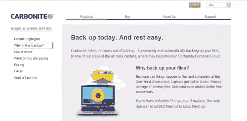
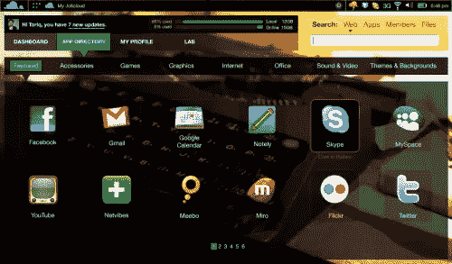

# 30 个创新的云网络应用

> 原文：<https://www.sitepoint.com/30-innovative-cloud-web-apps/>

云已经永远改变了用户存储数据、使用应用程序和项目协作的方式。您不再需要冒着数据丢失的风险，或者要求所有用户在他们的本地机器上安装相同的软件。相反，使用带有云处理和数据存储的 web 应用程序可以实现更快、更安全的计算，这实际上正在改变公司的业务方式。

由于云的力量，公司正在不断挑战云的极限，甚至重新定义云应用程序。虽然典型的云存储和同步应用仍然广受欢迎，但也有其他云应用用于项目管理、音乐制作和流媒体、会计和协作。

在这篇文章中，你会发现 30 个精选的云应用展示了云的一些独特的可能性。我相信你会发现它们很有用，甚至可能会启发你构建自己的应用来挑战云的极限。

## Evernote

Evernote 是一套为记笔记和存档而设计的软件和服务。“笔记”可以是一段格式化的文本、完整的网页或网页摘录、照片、语音备忘录或手写的“墨迹”笔记。笔记也可以有文件附件。

## 铸造

使用易于使用的个人财务工具和计算器管理您的预算。跟踪消费并监控您的网上银行账户

## DropBox

Dropbox 是一项免费服务，可以让你将照片、文档和视频带到任何地方，并轻松分享。永远不要再给自己发邮件了！

## Desk.com

Desk.com 是一个简单的、社会化的、移动的、价格合理的客户服务和支持服务台，位于云中。

## ZumoDrive

ZumoDrive 是所有媒体的混合云存储。您可以使用喜爱的应用程序从任何地方访问您的音乐、照片和文档。你不必思考，或再次同步你的文件，它只是工作。ZumoDrive 的混合云存储也意味着您永远不必担心空间不足。

## FluffyApp

一个小小的 Windows 应用程序，让您快速轻松地共享文件、链接和屏幕截图。听起来像任何旧的上传者？

## windows azure

Windows Azure 是一个为您构建的开放、灵活的云平台…探索一切可能:网站、企业应用、移动设备等等。

## 印度诺

InDinero 将理财顾问的力量带到了互联网上，这是企业在线理财发展最快的方式。

## Waze

Waze 是一款适用于 iphone 或 android 的免费移动导航应用，允许司机构建和使用实时地图、实时交通更新和即时路线导航，这些都存储在云中，由用户管理。

## Spotify

Spotify 是一种数字音乐服务，让你通过他们的云平台免费发现和聆听音乐。

如果你升级你的账户，有很多非常酷的功能可以解锁。

## 声音云

Soundcloud 可以让你上传音乐文件并在线播放。Soundcloud 提供了一个小工具，当它嵌入到网站时，可以播放特定的音乐或录音。

## 邮件黑猩猩

MailChimp 的免费电子邮件营销服务。使用我们简单的工具设计、发送和跟踪 HTML 电子邮件活动。

## Box.net

全球超过 100000 家公司采用协作工具。Box 简化了在线文件存储，取代了 FTP，并连接了在线工作区中的团队。

## Audiobox.fm

你云中的媒体库。随时随地存储、流式传输和管理您的媒体库！

## LogMeIn

从 LogMeIn 远程访问进入并离开。通过访问台式机和笔记本电脑、PC 或 Mac，享受在任何地方工作的自由。

## Joukuu

跨多个帐户管理、共享和跟踪基于云的备份文件的最简单方式！支持谷歌文档、Dropbox、Box.net、Sugarsync

## ZenDesk

帮助台软件和支持票软件。全球数千家公司使用的基于网络的客户支持软件。

## MozyHome

MozyHome 的优势。在线备份和文件同步。MozyHome 现在拥有在线备份和 Mozy Stash 文件同步这两个世界的优点。

## SendGrid

了解为什么越来越多的开发人员选择 SendGrid 的 SMTP 中继服务来发送由 web 应用程序触发的事务性电子邮件。立即注册一个免费帐户。

## 好极了

Hojoki 通过提供一个通用的新闻源和一个私人工作空间来管理和跟踪一切，帮助你让所有的云应用程序作为一个整体工作。

## Apptivo

Apptivo 是您成长的 SAAS 平台，为中小型企业提供免费软件服务。

## CloudApp

CloudApp 可以让你分享图片、链接、音乐、视频和文件。它是这样工作的:选择一个文件，把它拖到菜单栏，剩下的就交给我们了。我们为您提供了一个自动复制到剪贴板的短链接，您可以使用它与同事和朋友分享您的上传内容。

## 触发器

Toggl 是一个在线时间跟踪工具。它的特点是 1-click 时间跟踪，并帮助你看到你的时间去了哪里。有免费版和付费版。

## 招标

招标支持组织您的客户服务，以便您可以专注于提供尽可能最好的服务。

## 鸟舍

适用于网络和移动应用的更好的照片编辑解决方案。开发者:用我们华丽的编辑工具升级你的应用。让照片编辑成为您工作流程中无缝的一部分。只需几行代码即可在几分钟内嵌入 Aviary。

## 碳元素

Carbonite 在线备份简单、安全且无限制。它可以自动备份你电脑或 Mac 上的文件。无风险试用 15 天。

## 直播时间

LiveMinutes 是一个免费的协作会议服务，专注于文档共享，但它带有视频聊天、屏幕共享和自动报告的实时注释。

## Photoshop Express

Photoshop 是如此强大的图形编辑工具，但对许多人来说也贵得令人望而却步。但幸运的是，它有一个云版本，叫做 Photoshop Express！

## 乔利云

Jolicloud 带来了当今云计算的所有优势，使您的上网本成为您所有其他计算机和移动设备的自然延伸。

## 苹果 iCloud

iCloud 储存您的内容，因此您始终可以从 iPad、iPhone、iPod touch、Mac 或 PC 访问它。它让您可以即时访问您的音乐、应用程序、最新照片等。此外，它还能让您所有设备上的电子邮件、联系人和日历保持最新。不需要同步。不需要管理。

[一排灯泡图像](http://www.shutterstock.com/cat.mhtml?lang=en&search_source=search_form&version=llv1&anyorall=all&safesearch=1&searchterm=innovation&search_group=&orient=&search_cat=&searchtermx=&photographer_name=&people_gender=&people_age=&people_ethnicity=&people_number=&commercial_ok=&color=&show_color_wheel=1#id=63128581&src=60a768c5122d2f1bc34e8b9f158bfd28-1-1)通过 Shutterstock

## 分享这篇文章