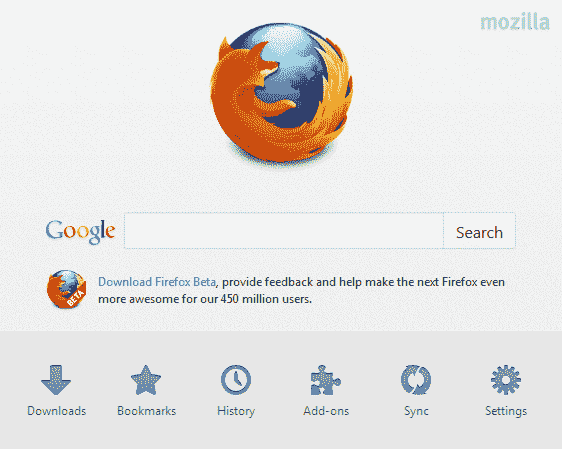
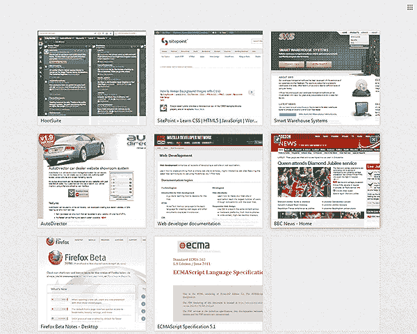

# 火狐 13 的新功能

> 原文：<https://www.sitepoint.com/firefox-13-whats-new/>

又到升级时间了。在版本 12 中相对较小的更新之后，Mozilla 推出了一个新的 Firefox 版本，增加了新的功能。该版本将于 2012 年 6 月 6 日自动更新。

让我们来看看一些新玩具…

## 新主页

Firefox 主页现在提供对书签、下载、插件和选项的快速点击访问:



我怀疑 Mozilla 品牌的应用商店会在某个时候出现。

就我个人而言，我通常不会使用主页并将它们设置为 *about:blank* 。但这很有用，我多年来第一次使用浏览器的默认主页！

## 类似快速拨号的新标签页

Firefox 的新标签页显示了你最常访问的九个页面。这项功能已经在 Opera、Chrome、Safari 和 IE9 中使用了好几年:



Mozilla 的实现是合理的，尽管我觉得它有点古怪。例如，您需要重新启动浏览器来刷新新的选项卡页面。与其他浏览器不同，通过单击右上角的图标可以很容易地隐藏页面网格。

## 按需标签

启动浏览器时，Firefox 只加载活动标签。单击之前浏览会话中的所有其他选项卡时，会加载这些选项卡。

这个选项在一些版本中已经可用，但是现在默认情况下是启用的。它显著改善了 Firefox 的启动时间。

## 平滑滚动

平滑滚动是我通常禁用的另一个功能，因为有些实现很糟糕。Mozilla 在 Firefox 13 中默认启用了这一功能，这无疑是一个进步。

## 重置 Firefox 按钮

流氓附加组件或主题曾经给你带来过问题吗？如果是这样，你可以在帮助>故障排除信息中找到一个新的“重置 FireFox”按钮(在 Firefox 的地址栏中输入“关于:支持”)。

重置按钮创建一个新的配置文件，并迁移您的书签，密码，历史记录，cookies 和表单数据。插件、主题、搜索引擎和主页设置都被取消，这可能会解决 99%的问题。

## SPDY 协议支持

火狐现在支持谷歌的实验性 SPDY 协议(读作*“SPeedDY”*)，该协议旨在减少网页的延迟。在测试中，页面加载时间减少了高达 64%。

SPDY 不太可能影响您的日常开发任务，但是如果您感兴趣，您可以[查看文档](http://www.chromium.org/spdy)。

## 页面检查器更新

页面检查器现在提供伪类锁定。最好用一个例子来说明这一点:

1.  将鼠标悬停在任何 CSS 菜单中的子项目上。
2.  右键单击并选择“检查元素”。页面检查器将会打开，但子菜单会消失，因为它是由悬停/聚焦激活的。
3.  元素名称将出现在浏览器窗口的左上角。您可以右键单击它以锁定:活动、:悬停或:焦点状态来查看应用的样式。

其他页面检查器更新包括:

*   无效的 CSS 属性标有警告标志。
*   检查器现在会记住您是否在上一个会话中打开了样式边栏。
*   右键单击 HTML 窗格中的任何标签都可以复制内部或外部 HTML 代码。
*   在 3D 视图中单击“f”会将元素带回到视图中。

## 新 CSS3:无效的伪类

Firefox 13 引入了:invalid 伪类，通常应用于数据不正确的表单元素，例如

```
 <style>
:invalid {
	background-color: #fdd;
}
</style>
<form>
	<label for="email">Your email:</label>
	<input id="email" type="email" required="required" />
	<button type="submit">Submit</button>
</form> 
```

Firefox 已经支持:valid::required 和:optional (not :required)伪类。这些现在可以在除 IE9 之外的所有现代浏览器中使用。

火狐 13 是一个伟大的升级。浏览器速度依然很快，提供了大量的功能，插件的痛苦终于成为遥远的记忆。

## 分享这篇文章