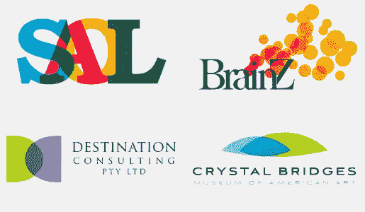
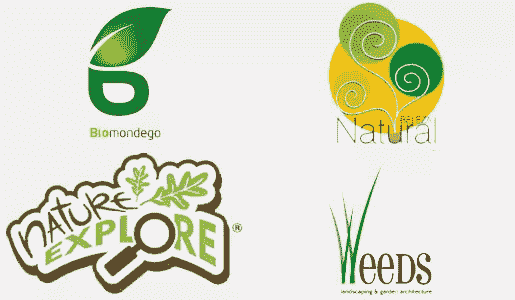
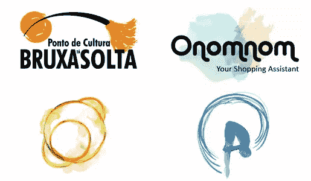
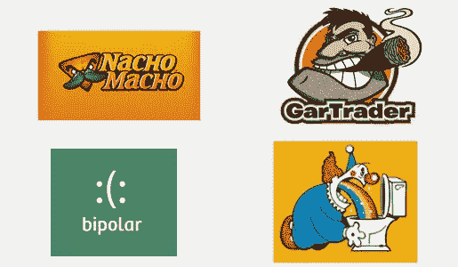

# 到目前为止，2012 年标志趋势

> 原文：<https://www.sitepoint.com/2012-logo-trends-so-far/>

你吃过一包 Kool-Aid 吗？嗯，我去过，感觉很棒。这是一个超级浓缩的味道爆发，更不用说一个有趣的活动来改变任何一天的节奏，只需要一个提振。

徽标很像库尔援助包。它们是浓缩的设计概念，被压缩成一个小图标、字符或排版概念。如果你想进行一项有趣的设计研究，只需回顾标志趋势。我就是这么做的。

我很好奇标志设计领域会发生什么。我考虑的几个标志比较老，但它们代表了我发现的最新标志趋势。也就是说，我看到了很多透明、自然、画笔和角色设计。

所以，下面是我在今年的标志设计中发现的共同线索。

### 透明徽标

*从左上依次为: [Soal](http://cargocollective.com/stefanromanu/Logos-Signs-Symbols) ， [BrainZ](http://www.fridgecreative.co.uk/branding/Brainz.htm) ，[目的地](http://www.d-c.com.au/)，[水晶桥](http://crystalbridges.org/)*

这组标志展示了使用透明元素创建标志的增长趋势。有时这种类型是透明的，但大多数时候是其他设计元素，如 Crystal Bridges 徽标所示，该徽标试图创建一个有机的外观，同时还具有两个重叠叶子形状的透明度。

正如 Soal 徽标所示，结果是通过重叠过程引入了新的颜色——可能有很多新颜色。水晶桥和目的地以三色设计结束，但 Soal 和 BrainZ 以许多变化结束。

使用这种方法时必须小心，以免产生过多的颜色。当然，这很大程度上取决于品牌本身。我个人喜欢这种趋势，并且可以找到更复杂的例子。不过，像任何效果一样，我更喜欢谨慎应用，而不是过度使用；尤其是涉及到 logo 设计的时候。

* * *

### 自然标志

*左上起:[生物奇观](http://logofaves.com/wp-content/uploads/2008/11/biomondgo_3.jpg)、[贝莱萨自然](http://www.brandsoftheworld.com/logo/beleza-natural)、[自然探索](http://www.arborday.org/explore/)、[杂草](http://stocklogos.com/logo/weeds-landscaping-gardening)*

我热爱自然，融入自然主题的标志设计趋势令我兴奋不已。显然，你的品牌必须有利于这一概念，但如果是这样，那么利用优势，将你的品牌与自然联系起来。

我想指出自然标志中的几个趋势。就像 BioMondego 的标志一样，大量的渐变显示了出来。这相对于过去 50 年来说是新的，但在过去的 5-10 年里就不那么新了，因为越来越多的徽标几乎只显示在计算机显示器上。

漩涡、螺旋和卷发是我见过的另一个子趋势，如 Beleza Natural 标志所示。无论是树叶缠绕，树枝卷曲，还是模仿藤蔓的字体，我在最近的 logo 参赛者身上看到了很多这样的形状。

“自然探索”的标志有点复古，但它整合了许多美好的品质，所以我想把它包括在内。在许多方面，这是一个非常传统的标志:两种颜色，简单的形状，使用一个图标元素(放大镜)来代替一个或多个字母。复古风格的盾徽标志又回来了。

Weeds 标志是一个很棒的极简主义概念，尽管它确实有几种绿色。这个概念，虽然仍然是一个股票的形象，是自然标志的极简主义趋势的代表，只有小，简单的印刷元素被使用。

* * *

### 笔触

*从左上起:[布鲁克萨·塔索尔塔](http://www.brandsoftheworld.com/logo/bruxa-ta-solta)、[奥诺诺姆](http://shoponomnom.blogspot.com/2012/04/making-logos.html)、[配音](http://www.flickr.com/photos/dublab/5396441673/)、[假摔](http://lauratrevey.blogspot.com/2010/07/diving-logo-watercolor-painting.html)*

笔触和类似水彩画的效果的使用正在增加，我绝对是一个粉丝。我喜欢这些设计带给餐桌的各种颜色选择和质感。此外，您仍然可以保持简单的笔触，例如在 Bruxa Tá Solta 徽标中，只有两种颜色。所有的纹理都在那里，它吸引着我。

相反，你有褪色的水彩设计，如 Onomnom 标志。这些无形的概念是独一无二的，因为它们脱离了传统的基于形状的设计，但它们也很容易辨认。这是一个正在扩展的有趣概念，我希望在未来几年看到这种趋势得到完善，因为更多的标志设计师尝试给抽象的形状带来一种身份。

Dublab 有一种类似咖啡环的效果，加上那些奇妙的颜色和细节，让我看了两次。这是一个更传统的基本形状的例子，但也使用了笔触。这个设计不是对称的，甚至也不是平衡的，但这最终可能是一件好事；这种一笔带过的趋势的一部分与不完美有关。

最后，但并非最不重要的，是潜水标志，这是一个颜色，运动和纹理的美妙例子。实际上，一开始我以为是字母“A ”,但在品牌的背景下，潜水员变得清晰，所有其他元素都清晰可见。这代表了使用笔触和各种纹理的印象主义标志设计的趋势。一旦你观察到潜水员和痕迹运动轨迹，这个标志就变得非常有思想和聪明。

* * *

### 基于角色的/有趣的标志

从左上开始:[纳乔马乔](http://dailydesigninspiration.com/logos/alan-oronoz/nacho-macho/)、[加蒂德](http://coghillcartooning.com/cartooning/portfolio/cartoon-logos/cigar-man-cartoon-character-logo)、[双极](http://logopond.com/gallery/detail/44495)、[帕亚索](http://www.brandsoftheworld.com/logo/payaso-clown-0)

虽然这种趋势是真实的，但这些例子更多的是为了好玩。越来越多的公司选择基于角色的标志。有时，这个角色完全独立于主角色工作。想想皮尔斯伯里:他们有标准的蓝色标志，但他们也有他们的面团男孩走来走去说话。

Nacho Macho 和 GarTrader 标志是优质插图和字符标志的优秀范例。人物可以在很大程度上设定一个品牌的基调和情绪，这些可以很好地告诉你它是怎样的。角色标识的趋势可能是发展最快的趋势——我喜欢它。在类似上述的概念中，几乎没有模仿；这些设计真是独一无二。

双极标志是行动中的经典极简主义，非常精彩。人物(或者是人物？)几乎毫不费力地表达了这个概念。这种极简主义的人物标识方式已经存在一段时间了，但我在最近几个月看到了它的几种表现形式。

最后，呕吐小丑只是简单的滑稽，但它也是更广泛的滑稽标志趋势的一部分。在这些情况下，品牌试图让你发笑，创造一种友好的联系，并为你的体验定下基调。

* * *

谈到最近的标志，你看到了设计行业的哪些趋势？你在客户要求你生产的产品中发现了什么模式吗？你喜欢还是讨厌我发现的一些趋势？

## 分享这篇文章