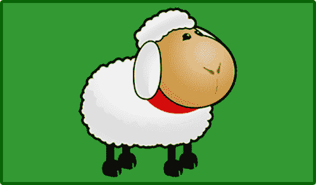

# 如何用 CSS3 调整背景图片的大小

> 原文：<https://www.sitepoint.com/css3-background-size-property/>

在 CSS2.1 中，应用于容器的背景图像保持固定尺寸。幸运的是，CSS3 引入了`background-size`属性，允许背景被拉伸或挤压。如果你使用响应式网页设计技术来创建一个模板，这是非常理想的。

定义尺寸标注有多种方式— [**查看 CSS3 背景尺寸演示页面**](https://blogs.sitepointstatic.com/examples/tech/background-size/index.html) 。

## 绝对尺寸调整

长度测量可以使用:

```
background-size: width height;
```

默认情况下，宽度和高度设置为`auto`，保留原始图像尺寸。

我们可以使用像素、em、cm 等绝对度量将图像调整到新的大小。如果需要的话，纵横比将会改变。因此，如果我们的背景图像是 200×200 像素，下面的代码保持该高度，但宽度减半:

```
background-size: 100px 200px;
```

如果只定义了一个长度，则假定它是宽度。高度设置为`auto`，图像将保持其纵横比，即

```
background-size: 100px;
/* is identical to */
background-size: 100px auto;
```

这段代码将把我们 200×200 的图像缩放到 100×100 像素。

## 使用百分比相对调整大小

如果使用百分比，尺寸基于包含的元素— **而不是**图像的大小，例如

```
background-size: 50% auto;
```

因此，背景图像的宽度取决于其容器的大小。如果我们的容器宽度是 500 像素，我们的图像将被调整为 250×250。

使用百分比对于响应式设计非常有用。调整 [**演示页面**](https://blogs.sitepointstatic.com/examples/tech/background-size/index.html#width) 的大小，发现尺寸如何变化。

## 缩放至最大尺寸

`background-size`属性也接受一个`contain`关键字。这将缩放图像，使其适合容器。换句话说，图像将按比例放大或缩小，但宽度和高度不会超过容器的尺寸:

```
background-size: contain;
```



## 填充背景

`background-size`也接受`cover`关键字。图像被缩放以适合整个容器，但是，如果具有不同的纵横比，图像将被裁剪:

```
background-size: cover;
```


## 调整多个背景的大小

可以使用以相同顺序应用的逗号分隔的值列表来调整多个背景的大小，例如

```
background: 
	url("sheep.png") 60% 90% no-repeat,
	url("sheep.png") 40% 50% no-repeat,
	url("sheep.png") 10% 20% no-repeat #393;
background-size: 240px 210px, auto, 150px;
```

## 浏览器兼容性

所有浏览器的最新版本都支持不带前缀的`background-size`。

IE8 和更低版本不支持该属性。你可以[使用 IE 过滤器来模拟包含和覆盖](http://msdn.microsoft.com/en-us/library/ms532920%28v=vs.85%29.aspx)，但是如果不使用其他元素后面的真正的`img`来调整背景图片的大小是不可能的。很乱；我推荐优雅的退化。

## 简化符号

W3C CSS 背景和边框模块 3 级规范声明`background-size`可以用速记`background`符号定义在`background-position`之后。没有一个浏览器支持这个选项，所以现在，`background-size`必须被定义为一个单独的属性。

[**查看 CSS3 背景尺寸演示页面……**](https://blogs.sitepointstatic.com/examples/tech/background-size/index.html)

*让你的 CSS 技能更上一层楼，我们的书 [CSS Master，第二版](https://www.sitepoint.com/premium/books/css-master-2nd-edition/?utm_source=blog)，作者 Tiffany b . Brown——涵盖 CSS 动画、过渡、变换等等。*

## 分享这篇文章