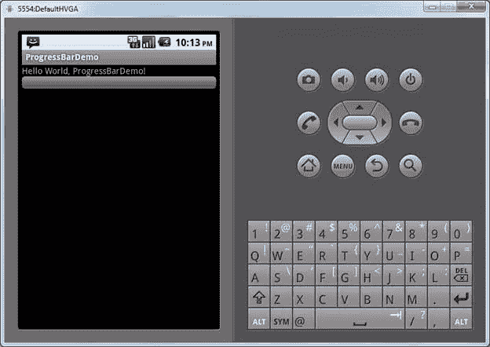
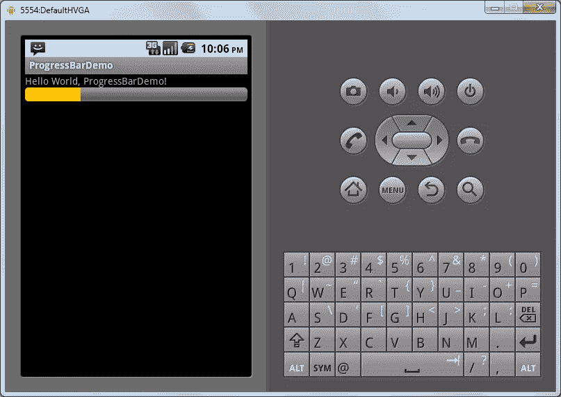
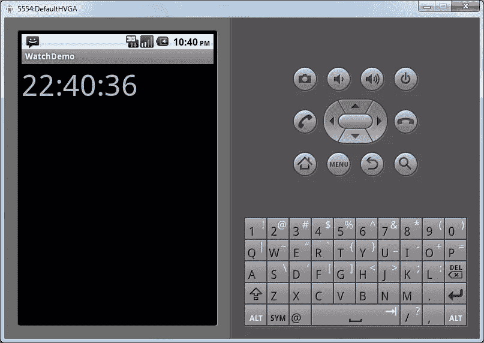
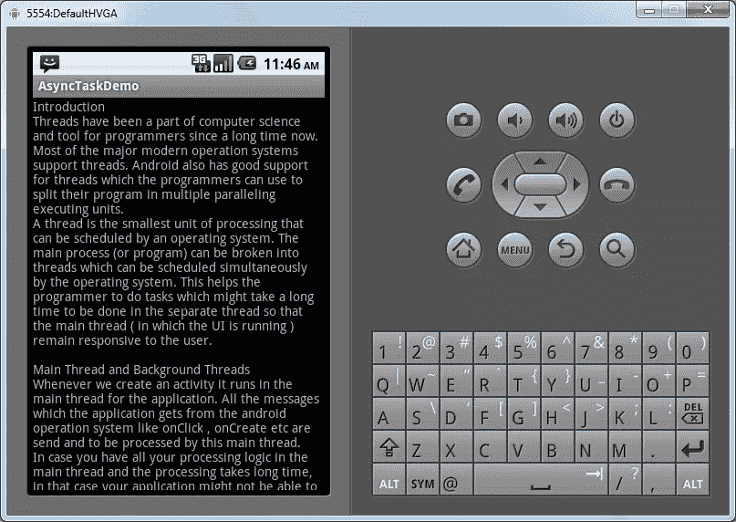

# 理解和利用 Android 中的线程

> 原文：<https://www.sitepoint.com/understanding-and-utilizing-threads-in-android/>

几十年来，线程一直是计算机科学的重要组成部分，也是程序员的通用工具。大多数现代操作系统都支持线程，Android 也不例外。Android 对线程的支持使程序员能够将他们的程序分成多个并行执行命令和指令的单元。

一个*线程*是操作系统可以调度的最小处理单元。你的应用程序的主进程(或程序)可以被分解成线程，这些线程可以被操作系统同时调度。这种方法有助于程序员在单独的线程中处理较长的进程，这样主线程(UI 在其中运行)就能保持快速响应用户。

### 主线程和后台线程

每当我们创建一个活动时，默认情况下它在应用程序的主线程中运行。Android 操作系统发出的所有命令(如 onClick、onCreate 等。)被发送到这个主线程并由其处理。

但是，如果您将所有的处理逻辑都包含在主线程中，您的应用程序可能不会忙到无法响应 Android 操作系统发送的消息。这甚至可能使你的应用程序完全没有反应，这将促使 Android 显示“应用程序没有反应”的警告，并强制关闭你的应用程序。

为了防止这个问题，最好在一个单独的后台线程中而不是在主线程中执行所有可能需要很长时间的任务。这将使主线程能够自由地响应 Android 操作系统发送的用户输入。

这种方法的一个显著缺点是 UI 不能从后台线程更新，它必须从主线程更新。但是，只要提前做一点规划，这个问题就很容易解决。

### 使用线程创建一个显示进度条的程序

为了演示线程的多功能性，我们将创建一个简单的程序，显示一个后台线程并将信息传递给一个处理程序，该处理程序将更新进度条。

#### 添加进度条

Android 有一个进度条小部件，可以在 UI 中使用它来显示 UI 中的进度。

我们将通过在标准 layout.xml 文件中添加*<进度条>* 标签来添加进度条。

以下是 layout.xml 文件:

```
<?xml version="1.0" encoding="utf-8"?>

<LinearLayout xmlns:android="http://schemas.android.com/apk/res/android"

android:orientation="vertical"

android:layout_width="fill_parent"

android:layout_height="fill_parent"

>

<TextView

android:layout_width="fill_parent"

android:layout_height="wrap_content"

android:text="@string/hello"

/>

<ProgressBar android:id="@+id/progress"

style="?android:attr/progressBarStyleHorizontal"

android:layout_width="fill_parent"

android:layout_height="wrap_content" />

</LinearLayout>
```

在上面的例子中，我们添加了一个 ID 为“progress”、样式为 horizontal 的“ProgressBar”来显示一个水平进度条。

下面是该活动的 onCreate 方法:

```
@Override

public void onCreate(Bundle savedInstanceState) {

super.onCreate(savedInstanceState);

setContentView(R.layout.main);

PrgBar=(ProgressBar)findViewById(R.id.progress);

}
```

在上面的例子中，我们创建了进度条的实例，并将其存储在变量“PrgBar”中。

如果我们现在运行该程序，我们应该能够看到以下内容:



#### 添加处理程序

如前所述，我们不能从后台线程更新 UI，所以我们必须创建一个处理程序，它将在主线程中运行，但从后台线程接收消息。

要创建处理程序，我们需要创建“handler”类的一个实例，并覆盖 handleMessage 函数，如下所示:

```
Handler handler=new Handler() {

@Override

public void handleMessage(Message msg) {

PrgBar.incrementProgressBy(5);

}

};
```

如你所见，我们选择了将进度条的值增加 5。

### 创建线程

接下来，我们声明“AtomicBoolean”来启动和结束活动中的线程。

```
AtomicBoolean ContinueThread = new AtomicBoolean(false);
```

然后，我们使用 onStart 方法创建线程。该方法将如下所示:

```
void onStart() {

super.onStart();

PrgBar.setProgress(0);

Thread background=new Thread(new Runnable() {

public void run() {

try {

while(ContinueThread.get()) {

Thread.sleep(1000);

handler.sendMessage(handler.obtainMessage());

}

}

catch (Throwable t) {

}

}

});

ContinueThread.set(true);

background.start();

}
```

使用这种方法，我们将进度条的值设置为 0。然后，我们通过向它传递 class 的实例来创建一个新线程，该实例实现了 run()方法。在 run 方法中，我们有一个“while”循环，它将一直持续到 AtomicBoolean ContinueThread 为 true。

在 while 循环中，我们让一个线程休眠 1 秒钟，然后向处理程序发送一条消息，这将增加 ProgressBar 的值。

在 onStart 结束时，我们将 ContinueThread 的值设置为 true，然后启动后台线程。

#### 当活动停止时停止线程

要停止线程，我们只需要在活动的 onStop 方法中将 ContinueThread 设置为“false”。

```
public void onStop() {

super.onStop();

ContinueThread.set(false);

}
```

如果我们运行该程序，您将看到进度条更新，如下图所示。



### 为数字手表创建程序

现在，为了进一步开发我们对线程的使用，我们将创建一个小型的数字手表程序。

#### 创建活动和文本视图

要创建一个数字手表，首先我们需要创建一个活动。在 activities 主布局中，声明一个 TextView。我们将增加文本视图的字体大小，以便手表中的数字清晰可见。

下面是主 layout.xml 文件:

```
<?xml version="1.0" encoding="utf-8"?>

<LinearLayout xmlns:android="http://schemas.android.com/apk/res/android"

android:orientation="vertical"

android:layout_width="fill_parent"

android:layout_height="fill_parent"

>

<TextView

android:id="@+id/txtWatch"

android:textSize="50dp"

android:layout_width="fill_parent"

android:layout_height="wrap_content"

android:text="@string/hello"

/>

</LinearLayout>
```

#### 创建显示当前时间的函数

现在，我们要写一个函数在文本视图上显示当前时间。该功能如下所示:

```
public void displayCurrentTime()

{

Date dt = new Date();

int hours = dt.getHours();

int minutes = dt.getMinutes();

int seconds = dt.getSeconds();

String curTime = hours + ":" + minutes + ":" + seconds;

Watch.setText(curTime);

}
```

在上面的例子中，我们创建了一个新的“Date”对象，它用当前时间初始化。

然后，我们从该对象中读取小时、分钟和秒，并将其传递给 Textiew。

我们将使用下面的函数调用 onCreate 函数并显示当前时间:

```
@Override

public void onCreate(Bundle savedInstanceState) {

super.onCreate(savedInstanceState);

setContentView(R.layout.main);

Watch=(TextView)findViewById(R.id.txtWatch);

displayCurrentTime();

}
```

在我们之前创建的处理程序的 handleMessage 函数中，我们将添加以下内容:

```
Handler handler=new Handler() {

@Override

public void handleMessage(Message msg) {

displayCurrentTime();

}

};
```

#### 创建线程

现在，在 onStart 函数中，我们将创建一个每秒向主线程发送一条消息的线程。然后，主线程将更新 TextView，以便它显示当前时间。

onStart 功能如下:

```
public void onStart() {

super.onStart();

Thread background=new Thread(new Runnable() {

public void run() {

try {

while(ContinueThread.get()) {

Thread.sleep(1000);

handler.sendMessage(handler.obtainMessage());

}

}

catch (Throwable t) {

}

}

});

ContinueThread.set(true);

background.start();

}
```



### 异步任务

Android 通过对开发人员隐藏创建后台线程的过程，提供了一种在后台执行复杂且耗时的任务的便捷方式。这是由 AsyncTask 类完成的。

要创建一个 AsyncTask，只需创建一个继承自 AsyncTask 的子类，然后覆盖它的一些默认方法。AsyncTask 类将负责创建后台线程，并且它还会在不再需要线程时释放并销毁该线程。我们只需在 AsyncTask 的子类上调用 execute 方法。

#### 创建异步任务以在后台读取文件

现在，我们将创建一个简单的程序，使用 AsyncTask 在后台线程中读取文件。

代码如下:

```
package asyncTaskDemo.com;

import java.io.BufferedReader;

import java.io.IOException;

import java.io.InputStream;

import java.io.InputStreamReader;

import android.app.Activity;

import android.os.AsyncTask;

import android.os.Bundle;

import android.widget.TextView;

public class AsyncTaskDemo extends Activity {

private TextView txtContent;

/** Called when the activity is first created. */

@Override

public void onCreate(Bundle savedInstanceState) {

super.onCreate(savedInstanceState);

setContentView(R.layout.main);

txtContent = (TextView) findViewById(R.id.txtContent);

ReadFileTask task = new ReadFileTask();

task.execute();

}

public InputStream openResourceFile(int id)

{

return getResources().openRawResource(id);

}

private class ReadFileTask extends AsyncTask<Void, Void, String> {

@Override

protected String doInBackground(Void... UnUsed) {

String response = "";

String str="";

StringBuffer buf = new StringBuffer();

InputStream is = openResourceFile(R.drawable.textfile);

BufferedReader reader = new BufferedReader(new InputStreamReader(is));

if (is!=null) {

try {

while ((str = reader.readLine()) != null) {

buf.append(str + "n" );

}

is.close();

} catch (IOException e) {

e.printStackTrace();

}

}

response = buf.toString();

return response;

}

@Override

protected void onPostExecute(String result) {

txtContent.setText(result);

}

}

}
```

这里我们在 UI 中有一个 TextView，我们将在它上面显示文件的内容。该文件将使用单独的线程在后台读取。在 onCreate 方法中，我们简单地获取 TextView 并将其存储在类的成员变量中。最后，我们创建一个 AsyncTask 类的实例并执行它。

#### 异步任务参数

在将子类声明为 AsyncTask 时，我们还可以声明将传递给子类中不同方法的参数类型。这些参数将覆盖默认值。

在 ReadFileTask 类中，我们使用了 void、void 和 string，因此 void 将是传递给 doInBackground 函数的参数，void 将是传递给 onProgressUpdate 函数的参数，string 将是传递给 onPostExecute 函数的参数。

```
private class ReadFileTask extends AsyncTask<Void, Void, String>
```

#### 异步任务的方法

现在，我们将覆盖 AsyncTask 的 doInBackground 方法，该代码将在后台线程中运行。这里，我们只是在 drawable 文件夹中打开一个文件，逐行读取它，并将其存储在一个字符串缓冲区中。

然后，我们覆盖 onPostExecute 方法，该方法将在后台线程完成在设备屏幕上显示文件的任务时被调用。

如果我们现在运行该程序，输出将如下所示:



### 结论

开发人员总是不得不在我们的 Android 应用中执行复杂而耗时的任务。如果这些任务没有被分割成单独的线程，它们可能会导致我们的应用程序挂起、冻结、崩溃，或者只是运行缓慢、效率低下。使用独立线程的好处大于坏处，所以你应该经常使用它们来制作快速、反应灵敏、防崩溃的 Android 应用。

## 分享这篇文章