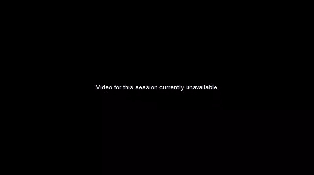
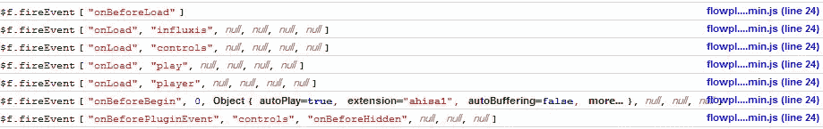

# 使用 Flowplayer 调试和捕获错误

> 原文：<https://www.sitepoint.com/debugging-catching-errors-flowplayer-video/>

这就是你如何**调试 flowplayer 中的设置并捕捉播放器/流错误**。使用 Flowplayer 编写 JavaScript 代码时，必须在播放器中打开调试功能，这样才能看到触发了哪些事件(它们在 Firebug 控制台中输出)。然后，您可以区分播放器配置错误和流错误。




**相关帖子:**

*   [**Flowplayer 动态视频大小**](http://www.jquery4u.com/flowplayer/flowplayer-dynamic-video-size/)
*   [**使用 jQuery 嵌入电影使用 Flowplayer**](http://www.jquery4u.com/flowplayer/jquery-embed-movie-flowplayer/)

### 打开调试

要打开调试，只需将它添加到播放器配置中。

```
debug: true
```



### 典型错误

```
200 Stream not found, NetStream.Play.StreamNotFound, clip: '[Clip]
201, Unable to load stream or clip file, connection failed> netConnectionURL is not defined, clip: '[Clip] 'null''
```

这是一个 Flowplayer 事件列表，我们现在可以看到我们可以使用哪些事件来优化播放器。

```
$f.fireEvent ["onBeforeLoad"]
flowpl....min.js (line 24)
$f.fireEvent ["onLoad", "influxis", null, null, null, null]
flowpl....min.js (line 24)
$f.fireEvent ["onLoad", "controls", null, null, null, null]
flowpl....min.js (line 24)
$f.fireEvent ["onLoad", "play", null, null, null, null]
flowpl....min.js (line 24)
$f.fireEvent ["onLoad", "player", null, null, null, null]
flowpl....min.js (line 24)
$f.fireEvent ["onBeforeBegin", 0, Object { autoPlay=true, extension="ahisa1", autoBuffering=false, more...}, null, null, null]
flowpl....min.js (line 24)
$f.fireEvent ["onBeforePluginEvent", "controls", "onBeforeHidden", null, null, null]
flowpl....min.js (line 24)
$f.fireEvent ["onPluginEvent", "controls", "onHidden", null, null, null]
flowpl....min.js (line 24)
$f.fireEvent ["onConnect", 0, null, null, null, null]
flowpl....min.js (line 24)
$f.fireEvent ["onBegin", 0, Object { autoPlay=true, extension="ahisa1", autoBuffering=false, more...}, null, null, null]
flowpl....min.js (line 24)
$f.fireEvent ["onMetaData", 0, Object { autoPlay=true, extension="ahisa1", autoBuffering=false, more...}, null, null, null]
flowpl....min.js (line 24)
$f.fireEvent ["onStart", 0, Object { autoPlay=true, extension="ahisa1", autoBuffering=false, more...}, null, null, null]
flowpl....min.js (line 24)
$f.fireEvent ["onResized", 0, null, null, null, null]
flowpl....min.js (line 24)
$f.fireEvent ["onBufferFull", 0, null, null, null, null]
flowpl....min.js (line 24)
$f.fireEvent ["onResized", 0, null, null, null, null]
```

### 捕获误差

在 Flowplayer 中捕获错误并向用户显示消息的示例。

```
//on player object
onError: function()
{
    statusElem.html("Live stream not active.");
}
```

### 错误代码

下面是对 Flowplayer 中不同错误代码的快速解释。

| One hundred | 插件初始化失败 |
| Two hundred | 找不到流 |
| Two hundred and one | 无法加载流或剪辑文件 |
| Two hundred and two | 剪辑中指定的提供程序未加载 |
| Three hundred | 播放器初始化失败 |
| Three hundred and one | 无法加载插件 |
| Three hundred and two | 调用插件外部方法时出错 |
| Three hundred and three | 无法加载样式表或背景图像等资源 |

## 分享这篇文章