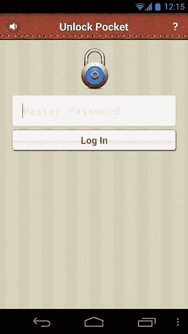
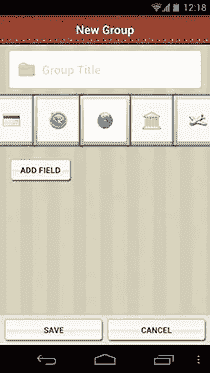
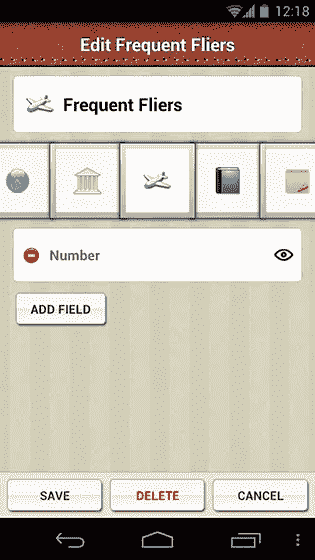
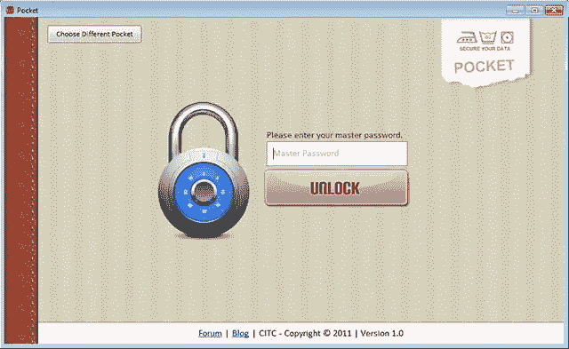
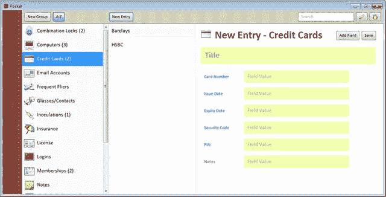
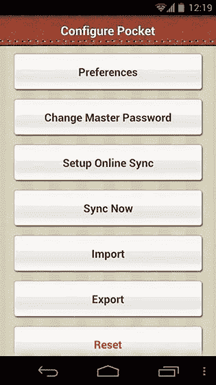
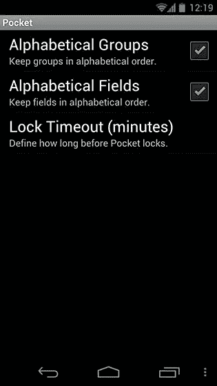
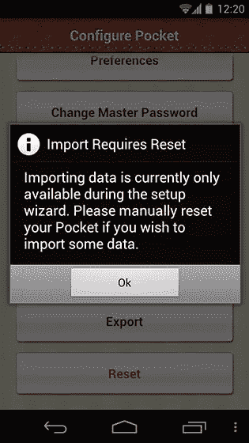
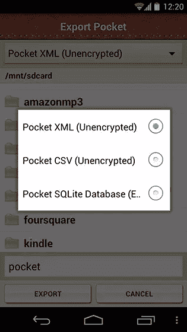

# 使用 Pocket for Android 安全存储密码和其他敏感数据

> 原文：<https://www.sitepoint.com/securely-store-passwords-and-other-sensitive-data-with-pocket-for-android/>

对我来说，跟踪登录凭证和账号等敏感信息曾经是一个巨大的挑战。在我的笔记本电脑、台式机、智能手机、iPad 和 Chromebook 之间，我很难记住我与客户一起使用的所有不同网站和服务的每个密码和登录信息。而且，当我出差时，有时这意味着我将不得不在酒店或访问受限的客户处使用电脑。我需要的是一个可以在智能手机上存储我的密码和其他重要信息的应用程序。

Pocket(不要与最近审查的阅读应用程序 [Pocket](https://www.sitepoint.com/make-the-most-of-your-time-offline-save-articles-videos-and-images-for-later-viewing-with-pocket/#fbid=qNYNdXzbGnf) 混淆)是一款 Android 应用程序，它可以让你安全地将所有敏感数据存储在手机上，并自动云备份到 [Dropbox](https://www.dropbox.com/) 。虽然有类似的应用程序，如 [KeePassDroid](https://play.google.com/store/apps/details?id=com.android.keepass) 和 [MobileKnox](https://play.google.com/store/apps/details?id=de.javawi.mobileknox) ，但 Pocket 值得一试，因为它的直观设计和出色的可用性。

* * *

* * *

### 首轮放映

当您第一次开始使用 Pocket 时，安装向导会引导您完成安装，其中包括一些关于 Pocket 及其工作方式的信息。Pocket 使用行业标准 [AES-256 算法](https://en.wikipedia.org/wiki/Advanced_Encryption_Standard)加密您的数据，确保您的信息安全无虞。你的密码——一个简单的文本密码——不会存储在你的设备上，而是作为一个 [SHA-512 散列](https://en.wikipedia.org/wiki/SHA-2)。(如果您设置了与 Dropbox 的在线同步，此哈希也会储存在那里。)Pocket 还会在短暂的超时时间(默认为两分钟)后锁定程序，并清除剪贴板以确保您的数据受到保护。你不必设置与 Dropbox 的在线同步，但如果你想在多个 Android 设备上使用你的 Pocket 数据库，这是必要的。

继续安装时，您可以创建新的 Pocket 数据库，从 Dropbox 导入数据，或者从 SD 卡导入数据。启动一个新的 Pocket 数据库并创建一个密码(4+字符)。完成后，您将被带到主屏幕。

* * *

 

* * *

### 主屏幕

首先，Pocket 将在应用程序中为您创建以下默认组:*银行账户*、*汽车*、*密码锁*、*电脑*、*信用卡*、*电子邮件账户*、*常旅客*、*眼镜/隐形眼镜*、*接种疫苗*、*保险*、*执照*如果您发现这些组中没有需要的，只需长按任意一行，就可以删除它们。大多数组不包含任何字段，因此您可以根据想要存储的信息创建自己的字段。**

在我们开始添加和编辑组和字段之前，让我们看看主屏幕的其余部分。轻按左上方的绿色“@”符号将显示“关于”屏幕。您可以将这里的应用升级到无广告版本，查看任何常见问题，浏览[Pocket 用户论坛](https://pocket-for-android.1047292.n5.nabble.com/)，查看使用 Pocket 的条件条款。屏幕底部的三个按钮允许您添加新组，调出设置菜单，并搜索您的所有组。要手动锁定 Pocket 数据库，请从屏幕底部拖动锁定栏(见下文)。如果设置了在线同步，Pocket 数据库将在锁定时自动同步。

* * *

 

* * *

#### 添加和编辑组和字段

向 Pocket 添加组很简单；只需点击主屏幕底部的*添加组*按钮。(您也可以长按任意组，并从上下文菜单中选择“编辑”来编辑当前组。)键入组名，选择 35 个可用图标中的任何一个，然后点击“添加字段”按钮添加新字段。点击每个字段最右侧的眼睛图标，选择字段的可见性。被屏蔽的字段将显示为星号，您可以点击眼睛图标来显示文本。(正如你在下面看到的，我创建了一个名为“常旅客”的类别来记录我所有的航空公司奖励计划。)Pocket 还在密码字段中包含了一个密码生成器，可以让您创建最长为 30 个字符的字母数字密码。

* * *

* * *

还有一个 [Pocket Desktop 应用程序](https://timothyjc.blogspot.com/2010/12/wallet-for-android.html)，你可以在任何 Windows、Mac 或 Unix 机器上查看和编辑你存储的数据。桌面应用程序只有在 Pocket 应用程序上有在线同步设置的情况下才能工作，因为它确实使用机器的本地 Dropbox 目录来同步数据。您可以在 Pocket Desktop 应用程序上执行在移动应用程序上可以执行的所有操作，包括添加和编辑组和字段。

* * *

* * *

### 设置

点击主屏幕底部的*配置*按钮，调出设置菜单。在*首选项*下，您可以更改组或字段的字母顺序，并更改 Pocket 锁定和同步前的超时时间。回到主设置页面，您可以更改主密码、设置在线同步(以防您在设置期间没有设置)、强制同步 Pocket 数据库、导入或导出 Pocket 数据库或重置应用程序。

* * *

 

* * *

### 缺点

Pocket 有很多很棒的功能，但是它也有很多缺点。虽然 [Dropbox](https://www.dropbox.com/) 作为在线同步选项很棒，但它是*唯一可用的*同步选项。如果能选择同步到 [Box](https://play.google.com/store/apps/details?id=com.box.android&hl=en) 或 [Google Drive](https://play.google.com/store/apps/details?id=com.google.android.apps.docs&hl=en) 就太好了，特别是因为在线同步对于在多个 Android 设备上使用 Pocket 以及进行干净的自动备份至关重要。

Pocket 也有近一年没有更新了，根据 Pocket 用户论坛的[消息，开发者自 2012 年 1 月以来一直没有回复用户的询问。很难说开发商有没有放弃这个项目(希望没有！)，但这是一个值得关注的原因，因为如果您遇到问题，似乎没有一个积极的支持渠道。](https://pocket-for-android.1047292.n5.nabble.com/)

* * *

 

* * *

说到口袋用户表单，一些用户遇到了与 Dropbox 同步的问题。Pocket 的其他问题主要围绕安全性和数据导出。虽然 Pocket 使用复杂的算法来保护您的数据，但任何数据都可以使用文本密码来访问。这并不是一个巨大的缺点，但是解锁应用程序的一些不同选项，如 T2 人脸检测或 T4 手势会增加一层安全性。

导入任何数据都有点问题，因为没有指定导入格式(我假设它是通过在线同步完成的)。我在 Pocket 用户论坛上搜索了一下，发现可以导入以前的 Pocket 数据库(加密的 SQLite 数据库或未加密的 XML)或者导入一个 KeePass CSV 文件。导入数据库的唯一方法是通过移动 Pocket 应用程序；您不能使用 Pocket Desktop 应用程序进行导入。

### 结论

Pocket 使用强大的加密功能存储重要的凭证，并可以轻松地与 Dropbox 同步。它设计良好，学习速度很快，相应的 Pocket Desktop 应用程序是一个很好的补充。该应用程序几乎一年没有任何主动更新，所以当你遇到任何问题时，在获得开发者支持方面，你的里程数可能会有所不同。

* * *

Pocket 可以在 Google Play 上免费获得，需要 Android OS v2.6 或更高版本才能运行。从下面的谷歌 Play 商店链接或点击提供的 Google Play 徽章下载该应用程序。

[下载口袋(安卓版)](https://play.google.com/store/apps/details?id=com.citc.wallet&hl=en)

## 分享这篇文章