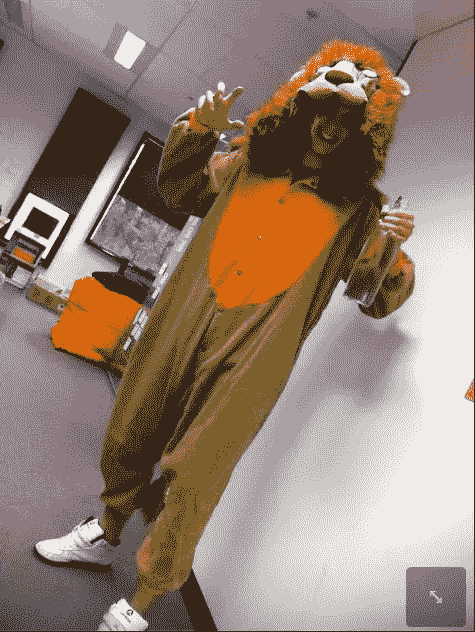

# 说出那张照片的名字

> 原文：<https://www.sitepoint.com/name-that-pic-2/>

如果你上周错过了，我们正在举办每周字幕比赛，每周五开始(在我们这一地区)，整个周末都在进行。如果你是我们[脸书社区](http://www.facebook.com/sitepoint "SitePoint Facebook page")的一员，那么你已经有机会思考这个问题了。

前提很简单——把你的标题创意贴在评论区，我会根据自己的判断选出几个获胜者。(提示:越蠢越好。)获奖者将于周一选出并公布。

这是本周的照片:

来自[脸书](http://www.facebook.com/sitepoint "SitePoint Facebook page")的获奖作品是*“哦，伙计，这不是毛茸茸的派对吗？”* [你可以在这里看到其余的条目。](https://www.facebook.com/photo.php?fbid=10151200211473712&set=a.178852413711.158463.119345668711&type=1&theater "Facebook entries") **最好的两个参赛作品(在我看来)将为自己赢得现实世界的 [HTML5 & CSS3 的数字副本。注册发表评论时，不要忘记填写您的电子邮件地址(如果您赢了，我可以联系您——它不会用于任何其他目的)。](https://www.sitepoint.com/books/htmlcss1/ "HTML5 & CSS3 For The Real World")**

## 分享这篇文章