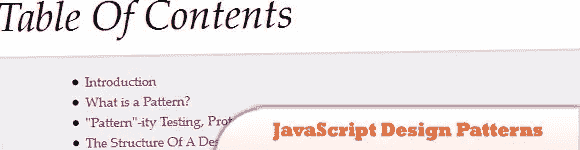
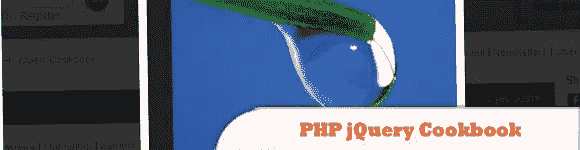
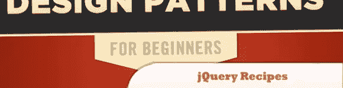
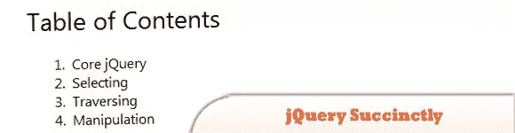
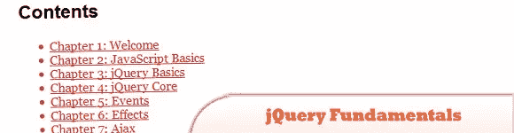
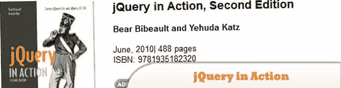

# 十大免费 jQuery 电子书

> 原文：<https://www.sitepoint.com/top-10-free-jquery-ebooks/>

让我们通过下载面向开发者的 jQuery 电子书来学习一些 jQuery。增强您的编程能力和知识。电子书是很好的参考资料，尤其是在学习新语言的基础知识时，包括数据和编程模式。有些链接指向第三方网站，所以在下载电子书之前，请务必阅读任何版权声明。尽情享受吧！

**相关帖子:**

*   [**10 jQuery 分页插件**](http://www.jquery4u.com/plugins/10-jquery-pagination-plugins/)
*   [**8 jQuery 图书插件**](http://www.jquery4u.com/plugins/8-jquery-book-plugins/)

## 1.jQuery for Dummies

了解 jQuery 如何让您的网页或博客脱颖而出！

[下载](http://uploading.com/files/b3e33896/0470584459.rar/)

## 2.学习 JavaScript 设计模式

这本电子书《学习 JavaScript 设计模式》是在知识共享署名-非商业性-无衍生作品 3.0 下发布的。在任何编程语言中，它们都是令人兴奋和令人着迷的话题。

  
[来源](http://addyosmani.com/resources/essentialjsdesignpatterns/book/)

## 3.jQuery API CHM 文件

这本电子书是关于 CHM 格式的 jQuery 文档。

  
[下载](http://roshanbh.com.np/ebooks/jQuery-1.2-v1.zip)

## 4.PHP jQuery 食谱

这本电子书包含了使用 PHP 和 jQuery 构建 web 应用程序时可能出现的问题的全面解决方案。

  
[下载](http://uploaded.to/file/tttu02hm/1504379472.rar)

## 5.jQuery 菜谱:一种解决问题的方法

设计模式是软件开发中常见问题的可重用解决方案，是一个非常有用的工具。

  
[下载](http://uploaded.to/file/zncusfow/jQuery%20Recipes.pdf)

## 6.jQuery 简洁地

是中级和高级 jQuery 开发的简单快速入门指南。

  
[来源](http://www.syncfusion.com/downloads/resources/ebooks/jquery)

## 7.jQuery 基础知识

这是一本关于 jQuery 的开源书籍，最初由 Rebecca Murphey 编写，于 2010 年发布。2011 年。

  
[来源](http://jqfundamentals.com/book/index.html)

## 8.jQuery:忍者新手

这本电子书深入而有趣，涵盖了 9 章 390 页的 jQuery。

  
[来源](https://www.sitepoint.com/books/jquery1/samplechapters.php)

## 9.jQuery 运行中

是对 jQuery 的快速介绍，将把您的 JavaScript 编程提高到一个新的水平。这是对最畅销的第一版的深入重写，提供了对最新 jQuery 和 jQuery UI 版本的深入和实用的报道。

  
[下载](http://www.manning.com/bibeault2/SampleCH1.pdf)

## 10.jQuery 51 提示和技巧

JoeStagner 编写的关于 jQuery 和 ASP.NET 控件的 51 个技巧和窍门。

  
[下载](http://hotfile.com/dl/44189289/bd892ac/51.Tips.Tricks.and.Recipes.with.jQuery.and.ASP.NET.Controls.zip.html)

## 分享这篇文章