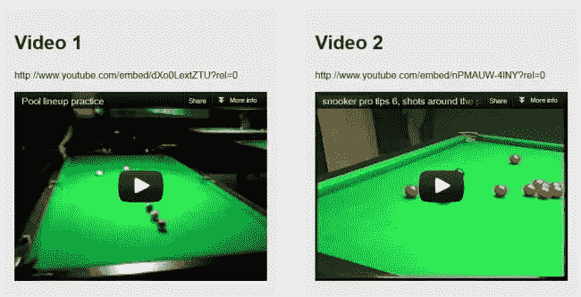
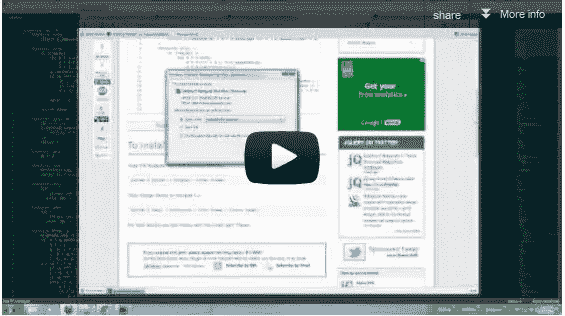

# 提高 jQuery 的 5 个快速技巧

> 原文：<https://www.sitepoint.com/5-quick-tips-improve-jquery/>

今天我想和大家分享一个快速提高 jQuery 的 5 个技巧。享受吧。

## 1.熟悉一些常见的 jQuery 错误

 
我的博客上有一篇帖子更新了成堆的 jQuery 错误，是什么导致了它们以及常见 jQuery 错误的[解决方案](http://www.jquery4u.com/errors/common-jquery-errors/)。下次你的朋友让你检查他们不知道的 JavaScript 错误时，给他们留下深刻印象。

## 2.学习新的 JavaScript 对象模式

 
看看 [JavaScript 模块模式](http://www.jquery4u.com/articles/jquery-plugin-module-pattern/)以及如何使用它来保持你的私有 API 与公共 API 的分离。这是比简单的 JavaScript 命名空间更好的方法。

## 3.学习一些速记 JavaScript

 
学习一些快速的 [JavaScript 速记编码技巧](http://www.jquery4u.com/javascript/shorthand-javascript-techniques/)来加快变量声明和逻辑运算等事情的速度。

## 4.了解如何分析 HTTP 请求

 
学习如何[分析 Http 请求](http://www.jquery4u.com/testing/http-request-net-panel-httpfox-fiddler2/)使用 Firebug NetPanel 或 Http fox 来检查 js 文件和其他包含的 HTTP 请求，以加快页面加载速度。

## 5.开始使用 Sublime 2 IDE

 
在我看来 Sublime 2 文本编辑器是 web 开发尤其是 JavaScript 的首席，所以[安装 Sublime 2](http://www.jquery4u.com/editors/setup-sublime-2-text-editor/) 并开始使用。

**另见:**

*   [**始终安全使用 console . log**](http://www.jquery4u.com/snippets/safe-console-log/)
*   [**Firebug console . log 的轻量级包装器**](http://www.jquery4u.com/snippets/lightweight-wrapper-firebug-console-log/)

## 分享这篇文章