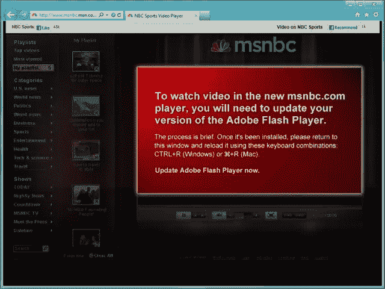
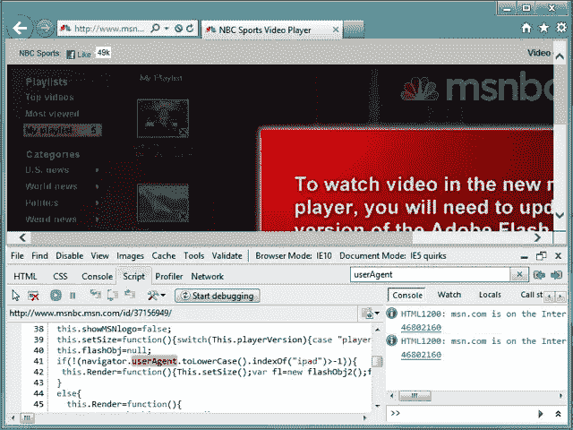
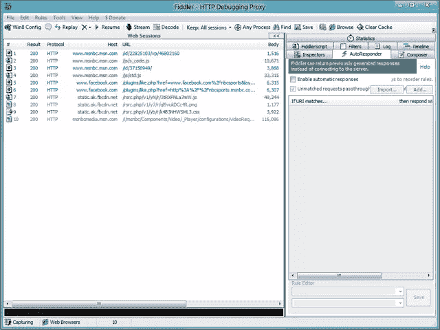
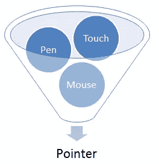

# iOS 到 IE10 Metro:构建跨浏览器无插件体验

> 原文：<https://www.sitepoint.com/ios-to-ie10-metro-building-cross-browser-plugin-free-experiences/>

如果你已经为 iPad 建立了一个无插件的浏览体验，一些改变将为 Windows 8 上新的 [IE10 无插件体验做好准备。随着越来越多的浏览器采用无插件方法，现在是开始考虑这个问题的好时机。我将通过编写在所有现代浏览器中都运行良好的代码，用几个步骤向您展示如何做到这一点。](http://blogs.msdn.com/b/ie/archive/2011/08/31/browsing-without-plug-ins.aspx)

今天，我们将为富媒体体验 [MSNBC 无插件体验](http://www.msnbc.msn.com/id/22825103/vp/46802160#46802160)。它分为两件事:样式和脚本。

为了修改 MSNBC 的文件，我将使用名为 Fiddler 的代理应用程序。你可以从 http://fiddler2.com 下载这个工具。这个工具允许我修改远程文件，就好像它们在本地机器上一样。如果您可以直接访问您自己的站点，您可以忽略 Fiddler，直接处理您的文件。Fiddler 提供了一个很好的方法来测试变化，而没有破坏你的站点的风险。

## 步骤 1:为现代浏览器声明标准模式和有效标记

为了使用我们将在下面使用的 HTML5 元素，你首先需要确保你在标准模式下操作。一种方法是在文档顶部包含 HTML5 doctype:

```
<!DOCTYPE html>

```

## 步骤 2:更新你的 CSS 供应商前缀

随着新功能的提出、更新和标准化，CSS 语言正经历着许多变化。为了让开发人员了解这些新特性，浏览器供应商通常通过前缀属性提供实验性实现。

负责任地使用供应商前缀的一个关键部分是确保每个供应商的前缀都包含在您的站点中，以提供最广泛的功能支持。在许多情况下，尤其是在构建一个以 iPad 为中心的网站时，您可能会只关注`-webkit`属性，而忽略针对其他浏览器的前缀，如`-o`、`-ms`和`-moz`。这样做的最终结果是，你极大地限制了可以呈现你的无插件站点的目标设备，并为其他现代浏览器的用户提供了降级的体验，其中许多浏览器可以提供同样吸引人的功能。

例如，我们在 MSNBC 上找到以下[:](http://www.msnbc.msn.com/id/45230852/a12)

```
background: -webkit-gradient(
  linear,
  left top,
  left bottom,
  color-stop(1, rgba(192,192,192,.6)),
  color-stop(0.5, rgba(0,0,0,.6))
);

```

随着 HTML5 无插件体验趋势的增长，扩展这些规则以提供其他主要浏览器的供应商前缀也很重要:

```
background: -webkit-linear-gradient(
  top, rgba( 0, 0, 0, 0.0 ) 0%, rgba( 0, 0, 0, 0.6 ) 50% );
background: -moz-linear-gradient(
  top, rgba( 0, 0, 0, 0.0 ) 0%, rgba( 0, 0, 0, 0.6 ) 50% );
background: -ms-linear-gradient(
  top, rgba( 0, 0, 0, 0.0 ) 0%, rgba( 0, 0, 0, 0.6 ) 50% );
background: -o-linear-gradient(
  top, rgba( 0, 0, 0, 0.0 ) 0%, rgba( 0, 0, 0, 0.6 ) 50% );
background: linear-gradient(
  top, rgba( 0, 0, 0, 0.0 ) 0%, rgba( 0, 0, 0, 0.6 ) 50% );

```

虽然更加冗长，但对广泛浏览器功能支持的好处肯定超过了额外的输入。此外，有许多很棒的工具可以分解这种工作负载，例如 [SASS](http://sass-lang.com/) 和 [Compass](http://compass-style.org/) 、[-无前缀](http://leaverou.github.com/prefixfree/)，甚至是即将发布的 Visual Studio 2011 中的 [CSS 片段](http://www.asp.net/web-forms/videos/visual-studio-vnext/visual-studio-vnext-videos-css-editor-snippets)。

此外，如果您主要使用 JavaScript，并且希望节省时间来确定您的客户端浏览器支持哪些特性，请查看 IEBlog 上的[使用供应商前缀进行编程的最佳实践](http://blogs.msdn.com/b/ie/archive/2011/10/28/a-best-practice-for-programming-with-vendor-prefixes.aspx)中的说明。

## 步骤 3:消除浏览器嗅探方法

有两种方法可用于确定用户浏览器和设备的功能。不幸的是，有一种方法比较流行，那就是浏览器嗅探。该方法包括检查导航器对象的某些模式或值:

```
if ( navigator.userAgent.indexOf("iPad") > -1 ) {
  // Load HTML5 Experience
} else {
  // Load Flash Experience
}

```

上面的代码在用户代理字符串中查找值“iPad ”,如果找到，就提供一个无插件的 HTML5 体验。否则，它会假设您在安装了 Flash 的设备上。这将导致非 iPad 用户在禁用插件的情况下浏览时体验不佳，即使他们的浏览器能够处理 HTML5 功能。

以下是查找 Internet Explorer 版本的尝试:

```
if ( tests.IE ) {
  j = /msie.(d.d+)/i;
  k = navigator.userAgent.match(j)[1];
}

```

测试用户代理字符串是否有试图以版本号为目标的模式。这种模式寻找一个数字，后跟一个句点，再后跟任意数量的附加数字。虽然此测试将找到类似“MSIE 8.0”和“MSIE 9.0”的值，但它不会识别将自己标识为“MSIE 10.0”的最新版本的 Internet Explorer，因为在句点之前应该只有一个数字。

这些只是浏览器嗅探不是最佳实践的几个例子。用户代理字符串不是不可变的——它是一个读写值，很容易被插件甚至用户更改。大多数现代浏览器都具备从其开发工具中轻松更改该值的能力，一些用户利用这一点绕开开发不完善的网站。

如果我们禁用插件，或者从没有 Flash 的设备/浏览器访问 MSNBC，我们会希望它尝试无插件的体验。不幸的是，事实并非如此。我们没有看到 HTML5 体验，而是被要求下载 Flash。这是因为该网站将用户分为两类:iPad 用户或支持 Flash 的用户。



### 特征检测

不要试图通过嗅探用户代理字符串来猜测浏览器的能力(这最终会让你失败)，直接在浏览器中实际测试功能要明智得多。如果您想测试浏览器通过 HTML5 传递视频和音频的能力，您可以尝试通过 JavaScript 创建这些元素，看看浏览器是否理解它们。这种做法被称为*特征检测*:

```
if ( !!document.createElement(“video”).canPlayType ) {
  // Load HTML5 Video
} else {
  // Load Flash Video
}

```

在上面的例子中，我们首先测试新创建的`video`标签上是否存在`canPlayType`方法。我们使用双重否定将响应转换为布尔值。如果浏览器理解什么是`video`元素，那么`canPlayType`方法就会出现。如果浏览器不知道视频元素，那么`canPlayType`方法将不存在。如果这个测试通过，我们加载我们的 HTML5 视频。如果测试没有通过，我们尝试加载闪存。这里可以进行更深入的特征检测，因为 Flash 可能不在机器上，或者可能被禁用。

功能检测是确定浏览器功能的首选方法，因为不需要猜测。如果浏览器通过了正确构建的测试，它绝对支持您想要使用的功能。

有许多很棒的工具可以为你提供特性测试。一旦这种提供 40 多种测试的工具成为 [Modernizr](http://www.modernizr.com/) 。这个工具创建了一个名为“`Modernizr`”的全局对象，其中包含了您的测试结果。使用 Modernizr，测试 HTML5 视频支持非常容易:

```
if ( Modernizr.video ) {
  // Load HTML5 Video
}

```

MSNBC 参与了浏览器嗅探，以查看访问该页面的设备是否是 iPad。我们的第一步是删除浏览器嗅探代码，并替换为功能检测代码。

在修改浏览器嗅探代码之前，我们首先需要找到它。在 Internet Explorer 中，按 F12 将弹出我们的[开发者工具](http://msdn.microsoft.com/en-us/library/gg589512(v=vs.85).aspx)。在工具中，打开脚本选项卡并搜索“userAgent”。该搜索将在站点的所有脚本文件中找出该属性名称的任何实例。我们对 http://www.msnbc.msn.com/id/37156949/的[第 41 行的结果感兴趣。](http://www.msnbc.msn.com/id/37156949/)



现在我们知道我们想要编辑什么，我们可以打开 Fiddler 并加载我们的流量。打开 Fiddler 后，在 MSNBC 页面上执行一次硬刷新(在 IE 中为 Ctrl+F5)。这导致 Fiddler 中列出了所有的页面会话。



仔细看，你会发现我们的资源是第三个。接下来，我们可以为这个会话文件设置一个[自动回复器](http://fiddler2.com/Fiddler2/help/AutoResponder.asp),这样无论何时请求它，都会用一个定制文件代替服务器的响应:

1.  右键单击此会话，并从上下文菜单中选择“解码选定的会话”。
2.  选择右侧的自动回复标签。
3.  点按“自动回复”标签中的“启用自动回复”注记格。
4.  将选定的会话从左侧面板拖到“自动回复”选项卡中。

此时，您的自动回复标签中应该有一个条目，包含以下规则:

*   如果 URI 匹配:EXACT:http://www . msnbc . MSN . com/id/37156949/
*   然后回答:*200-SESSION_3

右键单击自动回复器中的条目，并选择*编辑回复*。在随后的弹出窗口中，切换到 SyntaxView 选项卡，在这里我们将找到该文件的源代码。正如所料，第 41 行包含我们的浏览器嗅探代码:

```
if ( !(navigator.userAgent.toLowerCase().indexOf("ipad")>-1) ){
  // Flash Experience
}

```

我们不测试`userAgent`的内容，而是寻找对 HTML5 `video`标签的支持。将上述条件转换为以下条件:

```
if ( !document.createElement("video").canPlayType ) {
  // Flash Experience
}

```

这个测试检查我们是否不能使用`video`元素。如果`canPlayType`返回未定义，它将被转换为 true，并进入第一个代码块，设置 Flash 体验。

## 步骤 4:更新触摸和指针事件

Safari 支持触摸事件模型和鼠标事件模型。Internet Explorer 10 将触摸、鼠标和手写笔事件组合成一个称为`pointer`的抽象项目。事实上，Internet Explorer 10 是第一款适用于所有设备的所有输入类型的浏览器。这种抽象大大减少了确定应该绑定到哪个事件模型以及如何检测用户交互的工作量。然后通过 MSPointer 事件处理该指针。如果需要，可以通过访问`pointerType`属性来确定指针的类型。



由于 Internet Explorer 不支持苹果专有的事件模型，该模型包括像`touchstart`、`touchmove`和`touchend`这样的触摸事件，MSNBC 的事件监听器需要修改，以监听像`MSPointerDown`、`MSPointerUP`和`MSPointerMove`这样的 MSPointer 事件。

由于事件模型实现的不同，请使用类似 Modernizr 的功能检测工具或类似这样的代码来针对所有主要事件模型:

```
if (window.navigator.msPointerEnabled) {
  myCanvas.addEventListener("MSPointerMove", paint, false);
} else {
  myCanvas.addEventListener("mousemove", paint, false);
  myCanvas.addEventListener(“touchmove”, paint, false);
}

```

MSNBC 只支持触摸事件，我们需要改变这一点，以便碰巧使用鼠标的访问者仍然可以与页面进行交互。我们的活动在 http://www.msnbc.msn.com/id/43662671/15 举行:

```
document.addEventListener("touchstart", touchHandler, false);
document.addEventListener("touchmove", touchHandler, false);
document.addEventListener("touchend", touchHandler, false);

```

我们将对此进行更新，以包括 MSPointer 事件:

```
if (window.navigator.msPointerEnabled) {
  document.addEventListener("MSPointerDown", touchHandler, false);
  document.addEventListener("MSPointerMove", touchHandler, false);
  document.addEventListener("MSPointerUp", touchHandler, false);
} else {
  document.addEventListener("touchstart", touchHandler, false);
  document.addEventListener("touchmove", touchHandler, false);
  document.addEventListener("touchend", touchHandler, false);
  document.addEventListener("mousedown", touchHandler, false);
  document.addEventListener("mousemove", touchHandler, false);
  document.addEventListener("mouseup", touchHandler, false);
}

```

首先，我们检查指针的存在。由于 MSPointer 覆盖了鼠标、手指和笔，所以除了它们之外，我们不需要其他任何东西。如果必要的话，我们可以提供触摸和鼠标事件。

接下来，我们需要在[http://www.msnbc.com/id/44937131/](http://www.msnbc.com/id/44937131/)中为这些事件类型创建案例。目前，MSNBC 从以下方面着手:

```
if ( event.type == "touchstart" ) {
  /* Start drag logic */
} else
if ( event.type == "touchmove" ) {
  /* Drag logic */
} else
if ( event.type == "touchend" ) {
  /* Complete drag logic */
}

```

我们将对此进行修改，以监听所有已注册的事件类型:

```
if ( event.type.match( /(down|start)$/i ) ) {
  /* Start drag logic */
} else
if ( event.type.match( /move$/i ) ) {
  /* Drag logic */
} else
if ( event.type.match( /(up|end)$/i ) ) {
  /* Complete drag logic */
}

```

上面使用了`match`方法和一系列正则表达式来确定引发了哪个事件。如果引发的事件以不区分大小写的“down”或“start”结束，我们开始拖动代码。如果事件以不区分大小写的“移动”结束，我们将执行实际的拖动逻辑本身。最后，如果事件以不区分大小写的“up”或“end”结束，我们将结束拖动事件。注意:其他事件也可能在这里被捕获，比如`onresizeend`和`keyup`。请务必在您的项目中考虑这一点。

以上是 Ted Johnson 在[中的解决方案在所有浏览器](http://blogs.msdn.com/b/ie/archive/2011/10/19/handling-multi-touch-and-mouse-input-in-all-browsers.aspx)中处理多点触摸和鼠标输入的实现。

拖动逻辑本身最初依赖于`event.targetTouches` [触摸列表](https://developer.mozilla.org/en/DOM/TouchList)。Internet Explorer 中不存在此成员。拖动逻辑试图从*触摸列表*中的第一个项目收集`pageX`和`pageY`属性，但是，在 Internet Explorer 中，这些值是直接在`event`对象上找到的:

```
var curX = event.targetTouches[0].pageX;

```

使用逻辑运算符`OR`，我指示`curX`只要`event.pageX`出现在`event`对象上，就保存`event.pageX`的值。如果未找到该属性，请在`targetTouches`列表中查找:

```
var curX = event.pageX || event.targetTouches[0].pageX;

```

如果没有找到`event.pageX`，我们回过头来将`targetTouches[0].pageX`的值赋给我们的变量。

另一个需要记住的重要事项是，这个站点最初会对`touchmove`做出响应。当触摸播放列表时引发此事件时，代码会尝试根据您的触摸移动来重新定位播放列表。当谈到触摸时，没有徘徊——你要么触摸，要么不触摸。

现在我们已经将鼠标事件绑定到这个逻辑中，我们已经引入了悬停的可能性。因此，当`touchmove`位于播放列表上方时，它可以自由地重新定位我们的播放列表，我们不想对`mousemove`做同样的事情。事实上，我们只想让`mousemove`事件在鼠标按键被按下时重新定位播放列表。

如需进一步阅读，以及如何针对所有浏览器的示例，请参见[在所有浏览器中处理多点触摸和鼠标输入](http://blogs.msdn.com/b/ie/archive/2011/10/19/handling-multi-touch-and-mouse-input-in-all-browsers.aspx)。

## 测试两种体验

回想一下我们之前的特性检测，我们如何首先检查用户浏览器中是否支持 HTML5 视频。如果是，我们给他们 HTML5。如果不是，我们给他们闪光。测试我们工作的一个简单方法是使用不支持 HTML5 特性的浏览器或文档模式。这很容易用 Internet Explorer 来测试:

1.  按 F12 显示开发人员工具
2.  将您的文档模式更改为 Internet Explorer 7 标准
3.  刷新页面

如果我们的特征检测条件写得正确，您现在应该正在观看基于 Flash 的演示。将你的[文档模式](http://blogs.msdn.com/b/ie/archive/2010/06/16/ie-s-compatibility-features-for-site-developers.aspx)切换回 Internet Explorer 9 标准(或者“标准”,如果你使用 IE10 的话),会让你回到 HTML5 的体验。

## 搞定它！

希望这篇文章有助于定义允许你的 iOS 站点在 IE10 Metro 和其他无插件环境中正常工作的变化类型。通过纳入最佳实践(如功能检测)并负责任地使用供应商前缀来获得出色的新功能，您应该能够为您的用户提供出色的体验，无论他们使用的是哪种浏览器或设备。为了帮助在其他无插件环境中进行测试，请下载 Internet Explorer 10(目前仅在 Windows 8 CP 中提供)并立即开始测试！

## 分享这篇文章