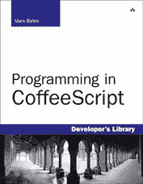

# 与马克·贝茨关于如何学习 CoffeeScript 的对话

> 原文：<https://www.sitepoint.com/a-conversation-with-mark-bates-about-how-to-learn-coffeescript/>

马克的最新著作是由艾迪森-卫斯理出版社出版的

我早就听说马克·贝茨是一位出色的公众演说家，但直到三月份在 T2 的会议上，我才有机会亲自发现这一点。他做了一个名为[用 Jasmine](http://www.slideshare.net/markykang/testing-rich-client-side-apps-with-jasmine) 测试富客户端应用的精彩演讲，讲述了如何使用 Jasmine 和其他工具测试在客户端使用 [CoffeeScript](http://coffeescript.org/) 的 web 应用。这是信息丰富，娱乐和发人深省。尽管我是一名经验丰富的 Ruby 开发人员，但我从未花时间去学习如何在我的应用程序中正确使用 CoffeeScript。但是听了马克的话，看到他的例子，我受到了启发；我心想:“这是我需要尽快学会和使用的东西。”

几周后，当我有机会亲自采访 Mark 时，我非常兴奋——这是开始学习 CoffeeScript 的最佳方式！首先，我花时间读了他的书《用 CoffeeScript 编程》，这本书非常棒，非常有帮助。然后我们花了大约一个小时谈论 CoffeeScript:它是如何发明的，还有哪些语言启发并影响了 CoffeeScript，Ruby 开发者应该如何开始学习它，测试等等……我在这里输入了我们谈话的要点。如果您是一名 Ruby 开发人员，并且有兴趣了解更多关于 CoffeeScript 的知识，那么您将有机会听到一位知名开发人员、作者和思想领袖关于如何入门的观点。

## 谁是马克·贝茨？

马克·贝茨

Mark Bates 是总部位于波士顿的开发和咨询公司 Meta42 Labs 的创始人和首席架构师。他从 1996 年开始开发 web 应用程序。自从发现 CoffeeScript 以来，他已经成为其编程社区的领导者，在世界各地的高规格会议上向用户组进行演示和演讲，如 RubyConf、RailsConf 和 jQueryConf。他是《用 Ruby 进行分布式编程》和《用 CoffeeScript 进行 T2 编程》这两本书的作者。

问:嗨，马克，谢谢你今天早上和我聊天…

你很幸运我醒着！我今天早上不小心吃了几片泰诺，事实上我现在能直直地坐着真是太棒了…

## 铁路公司

问:我听说你在 4 月 23 日的 RailsConf 上为 Rubyist 做了一个很棒的演讲 [CoffeeScript。怎么样了？会议总的来说怎么样？](http://www.slideshare.net/markykang/coffeescript-for-the-rubyist)

谈话进行得很顺利，受到了极好的接待。这让我有了一个很好的时间段，第一天的早上，大多数人都很清醒，当然喝醉可能会有助于我的演示！从会议期间，甚至在回家的飞机上向我走来的人来看，我一定做了一些正确的事情，因为我确信我已经改变了一些看法。

整个会议非常好。DHH 提出的主题是进步。继续展望未来，学习新技术，作为一名开发人员不断成长。CoffeeScript 在主题演讲中被高调提及，在我看到的许多其他演讲中也被多次提及。我想说，我听到更多的人讨论 CoffeeScript、Backbone 和 Ember，而不是 Rails 本身。真正展示了人们的发展方向。

## 你应该使用 CoffeeScript 吗？

问:有些人更喜欢“纯”JavaScript 语法，不喜欢预编译的想法。使用 CoffeeScript 是个好主意吗？

老实说，我会对他们说:“好吧，如果你想继续这样写下去，随你便。”我认为这与我从 Java 转向 Ruby 的原因非常相似。Ruby 显然有一些 Java 没有的特性，Java 有一些 Ruby 没有的特性——所有语言都有。我可以用 Java 编写 web 应用程序，就像我可以用 Ruby 一样…

问:我们都曾经这样做过…

但是我更喜欢用 Ruby 写，因为我可以写更少的代码来做同样的事情。这就是我对 CoffeeScript 的感觉。

问:CoffeeScript 代码是否也有一些美丽或优雅的地方？

哦，是的——同样，Java 到 Ruby 也是如此。我可以写更少的代码；它要干净得多，也更容易阅读；比较好维护。我听到很多人说他们讨厌 CoffeeScript 有空格的事实。我总是对他们说:“你是如何格式化你的 JavaScript 的？”无论如何你都应该这样做——你应该很好地格式化你的代码。在这一点上，空白的重要性实际上变成了无关紧要的空白，因为你已经在这么做了。

## 应该先学 CoffeeScript，还是 JavaScript？

问:我应该先学 JavaScript，再学 CoffeeScript 吗？我记得在 Boston.rb 会议上，Wyatt Greene 在你之前做了另一个很棒的演讲，从 Ruby 到 JavaScript 的 T2。他说的一件事是，在开始学习 CoffeeScript 之前，他想先彻底学习 JavaScript。你认为这是个好主意吗？

我觉得这是一个必须要有的想法。在我的书中，有很多地方，我真的向读者推荐:“把书放下——先去读一些关于 JavaScript 的东西，然后再回来”,如果他们不知道的话。你知道它在做什么是非常重要的。你会从 CoffeeScript 中学到一些关于 JavaScript 的真正有趣的东西；我当然有。这让我成为了一名更好的 JavaScript 开发人员，但我首先是一名 JavaScript 开发人员。

问:做一名临时的 JavaScript 开发人员可以吗？或者在尝试学习 CoffeeScript 之前，真的需要彻底了解它吗？

您至少应该是一名中级 JavaScript 开发人员，因为其中的一些概念会让人觉得有点毛骨悚然，而 CoffeeScript 会让您远离这些东西。如果你是初学者，你并不真正理解是什么使一个函数成为一个函数，或者回调是如何工作的，或者原型是如何工作的，你应该先温习这些。

问:……因为 CoffeeScript 可能会让人更难理解？

不会更难，但它把一切都抽象化了。了解 JavaScript 能做什么以及如何做，意味着您可以真正利用 CoffeeScript 提供的更多优势。

问:我想，不彻底学习 JavaScript 会更容易。

没错。我可以看到人们很容易地跳入 CoffeeScript 并生成一些非常酷的代码，而不知道它真正生成的是什么。一旦它产生了他们不理解的东西，那就真的会咬他们的屁股，你知道吗？当他们不明白为什么范围不正确时。或者，为什么一件事不等于另一件事他们缺乏 JavaScript 真的会伤害他们。

## 你将如何学习 CoffeeScript？

问:如果你是 Rails 开发人员或某种 Ruby 开发人员，学习 CoffeeScript 的正确方法是什么？

我希望阅读我的书《用 CoffeeScript 编程》将是学习它的一个好方法。对于 Ruby 爱好者来说，这本书里有一点点 Ruby，但是我想让每个人都能接触到它，而不仅仅是 Ruby 爱好者。在前三章中，我使用 Node.js 来构建示例应用程序，原因有两个:

1.  因为 Node.js 和 CoffeeScript 经常被链接在一起，你会看到很多 Node 应用程序都是用 CoffeeScript 编写的。
2.  因为我可以用 CoffeeScript 写后端。这是一个很好的方法，可以深入研究这门语言，并看到正在使用的语言的真实例子。

问:我觉得那真的很酷！我一直对自己说:“我真不敢相信我在用 CoffeeScript 编写服务器！”

耶！挺酷的。在这本书里，我们用同一种语言，用 CoffeeScript 写服务器和前端，我觉得这很有趣，也很酷。但如果我用 Rails 来做，那么我会疏远 PHP 人、Python 人、Java 人，而且没有必要用不同的语言来写，因为我可以用书上的语言来写，这是一个非常有趣的练习。

对于 Rails 人员来说，这非常简单。你启动 Rails，对 CoffeeScript 的支持就在那里。就开始用吧。

问:我想这就是我的处境:我是一名 Rails 开发人员，但我不是 CoffeeScript 专家。我在这里或那里使用它；它只是有点工作。再说一遍，这几乎太简单了——你真的不需要花时间去深入学习它。

使用 Rails 很容易开始使用 CoffeeScript，并达到您认为自己了解它并且非常了解它的程度。它并不是一种可怕的大语言；这其实很简单。但是在这种语言中有很多非常酷的隐藏的小东西。

问:如果我是一名 Rails 开发人员，我应该安装 Node.js 并按照你在书中介绍的方式学习吗？或者仅仅在资产管道内部使用它也可以吗？

我认为仅仅在资产管道内部使用它是可以的。使用它比玩它更重要。这就是我对任何语言的感觉。我不是通过构建修补玩具小应用程序来学习语言的，我是通过在实际应用程序中使用它来学习的。我就是这样学习的:不成功便成仁。如果你正在开发一个应用程序，并且需要 JavaScript，那么就开始使用 CoffeeScript 吧！您可以在同一个应用程序中混合使用普通的 JavaScript 和 CoffeeScript 文件。通过真实地使用 CoffeeScript，你将会学到更多关于 coffee script 或任何语言的知识，而不是仅仅通过创建一个小的“待办事项”应用程序。你开始说:“我真的需要学习如何做 X，Y 和 Z 来解决这个问题。”

问:所以你必须了解 X、Y 和 z。

完全正确；这不是人为的问题。你的企业需要这项功能，你必须学会如何去做。

## CoffeeScript 的起源

问:CoffeeScript 的灵感来自哪里？是受了露比的启发吗？还是靠 Python？它的根在哪里？

它的灵感来源于这两者，以及 Lisp、Smalltalk 和任何令杰里米·阿什肯纳斯兴奋的东西。这就是为什么如果你看它，它看起来像一堆不同的语言。它有 Python 的重要空白，还有一些像@符号和类定义这样非常 Rubyesque 的东西。杰瑞米最初写这篇文章是因为他读过[马克-安德烈·库尔诺耶](http://macournoyer.com/)的[如何创建你自己的超赞编程语言](http://createyourproglang.com/)。他读了这本书，开始修改它。CoffeeScript 的最初实现是在 Ruby 中——最初的编译器。

问:现在都是 C 代码了，还是什么？

不，都是用 CoffeeScript 写的！

问:是用 CoffeeScript 本身写的？听起来像 Rubinius…

是啊。没错。这是那些总是让我震惊的事情之一。Rubinius 让我大吃一惊，它是一个用 Ruby 编写的 Ruby 实现，运行在 Ruby 上。我永远也不会知道，当有人启动 Rubinius 服务器时，世界是如何不发生内爆的。

有了编译器之类的东西，就简单多了，因为你用别的东西写第一个编译器，然后你就有语言来写下一个编译器。第一个编译器是用 Ruby 编写的。但是后来他用 Ruby 编写了 X 版本，然后用 CoffeeScript 的 X 版本编写了 CoffeeScript 编译器。如果你[去 github](https://github.com/jashkenas/coffee-script) ，里面都是 CoffeeScript！

问:对于 Rubinius 来说，如果你不确定某些东西是如何工作的，比如“String.slice 方法是如何工作的？”–你可以去看看 Ruby 的源代码。

是的，有了 CoffeeScript，一切都在 CoffeeScript 中。如果你想知道 CoffeeScript 中的类支持是如何工作的——你只需要阅读 CoffeeScript 的源代码，就可以在那里看到。它实际上是非常可读的源代码。例如，它比 Ruby 源代码更容易接近。

## ember . js vs backbone . js

问:我想问你关于[ember . js](http://emberjs.com/)vs backbone . js 的问题，我不知道那是不是一个争议；它们是不同的东西。你说过你经常使用 Backbone——我很好奇为什么？你试过 Ember 吗？两者有什么区别？

在某些方面，他们大相径庭。我认为更好的比较应该是 Backbone.js vs. [Spine](https://spine.github.io/) 或 [Knockout](http://knockoutjs.com/) 。我非常喜欢 Backbone——我发现它非常简单，易于使用和理解。这对我很有意义。Backbone 让你创建模型、集合和视图来管理你的 HTML，处理发生在这些模型和集合上的事件，动态地调用函数，比如说，在更新后重新渲染。

Ember 采用了一种不同的方法，他说你必须以一种特定的方式标记你的 HTML。如果你这样做了，那么属性的自动更新就会自动发生。如果我正确地标记了我的

# ,它有一个用户的名字，并且在我的用户对象中我改变了那个用户的名字，那么这个

# 标签将会被更新，而不需要我做任何其他的事情。

问:所以在 Backbone 中你需要自己更新吗？

没错。但是我认为 Ember 的更新既圆滑又危险。

问:因为它可能会在你意想不到的时候发生？

有时，不管出于什么原因，您可能不想更新页面上的元素。我也反对在我的页面上添加额外的标记，如果我不需要的话，这也是我不喜欢 Knockout 的原因之一。Knockout 几乎完全通过向 HTML 添加额外的数据元素来工作。如果你想改变某件事，最终你会得到所有这些额外的收入。

我喜欢 Backbone 的一点是，它减少了我必须放入的标记数量。我不再那么需要 id，甚至不再需要类名，只是为了找到一个特定的元素。它们都被限定了视图的范围。如果您正确地编写了视图，您可以对列表元素进行一般搜索；您不需要担心确保它是一组正确的列表元素。

事实上，我很快就要写一本新的主干电子书了。

问:太棒了！顺便问一下，你是怎么开始写书的？令人印象深刻的是你已经出版了两本…

我开始写作是因为在热水浴缸里灌醉了奥比·费尔南德斯！Obie 在 RubyConf 2008 上看过我关于分布式编程的演讲，我们和 [Hashrocket](http://hashrocket.com/) 的人在热水浴缸里闲逛，我们喝了几杯，我向他们提到，在我的演讲之后，有几个人问我在哪里可以获得更多关于分布式编程的信息。然后 Obie 告诉我，他是 Addison-Wesley 的 Ruby 系列编辑，分布式编程将是一个很好的书籍主题……然后就开始了。

## 测试 CoffeeScript

问:你想告诉读者我三月份在 Boston.rb 看到的演示吗？我惊讶于即使是 Boston.rb 的成员也没有做太多的 JavaScript 测试…

在那次演讲中，有 100 个人在场，我问在座的人:“有多少人测试他们的 Ruby 代码？”100 个人举起了手。这很能说明 Ruby 社区的情况。然后我问房间里的人:“有多少人写 JavaScript 代码？”每个人又一次举起了手。然后我问“有多少人测试他们的 JavaScript 代码？”只有 6 个人举了手。

问:相信我，我不是其中之一。

这只是一个可怕的数字。那个房间里只有 6%的 Ruby 开发人员测试他们的 JavaScript？而且都是写 JavaScript 的！那么为什么可以测试 Ruby 而不测试 JavaScript 呢？

问:在我看来，我认为原因是 JavaScript 是这个家族发育不良的小继子，没有人真正把它当回事。在过去的几年里，大多数人没有写多少 JavaScript 这里只有几行用于验证的代码，一点 Ajax，等等。所以我在回答你的问题——你应该回答问题！但是现在人们突然意识到:“我可以只用 JavaScript 编写大型应用程序。”

我还认为有人担心 JavaScript 太难测试。如果它需要在浏览器中运行，我该怎么做呢？我如何测试 DOM 交互？我该如何测试 AJAX？

问:对于有这种恐惧的 ruby 爱好者来说…人们应该做些什么来学习如何测试他们的 JavaScript？

这是一个很好的问题！有很多很好的资源:看看茉莉、看看摩卡、看看柴。有很多非常棒的库，类似于你已经用来测试 Ruby 的库。

问:是的，在你的演讲中，我很惊讶茉莉看起来有多像 RSpec。

没错。摩卡和柴也是一样:他们看起来很像上海世博会。

我感到非常惊讶的一件事是，如果我有时间和兴趣，我可能会坐下来尝试为 Rails 4 编写一个大的 pull 请求，因为 Rails 没有包含 JavaScript 的测试工具。

当他们在 Rails 3.1 中引入 asset pipeline 和 CoffeeScript 时——我认为 CoffeeScript 降低了 JavaScript 测试的门槛，因为它感觉起来更自然，就像你在编写 Ruby 一样——他们为什么不包括测试工具呢？那件事在我心中很重要。从很早的时候开始，Rails 就有一个测试框架，并且非常强调:“看看测试你的代码有多容易。”

问:老实说，这是它流行的一个重要原因——因为它一开始就存在。

…因为这很容易做到。Rails 让这变得非常容易。老实说，在我写 Java 的这些年里，问我写了多少个 Java 单元测试！这不是很多；我不会骗你的！Rails 出现了，哇，出现了 Test::Unit，我并不喜欢它，但它就在那里，就在那里，我可以很容易地开始测试。

所以为什么这个团队从来没有为 JavaScript 开发测试工具让我很惊讶。我在 Boston.rb 演示的东西应该在框架里面。每次 Rails 生成这样一个。咖啡文件，它会为你生成一个测试。

## 谢谢！

马克，谢谢你的宝贵时间！

没问题，谢谢帕特。

## 分享这篇文章