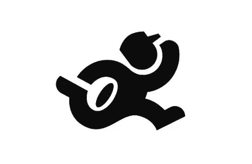
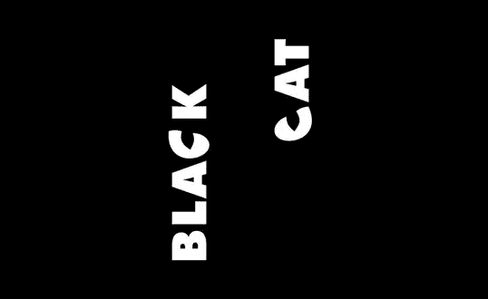
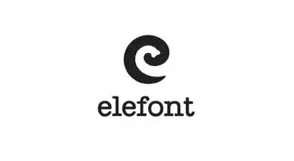

# 拥抱设计中的负空间:值得欣赏的技巧和例子

> 原文：<https://www.sitepoint.com/embracing-negative-space-in-your-designs-white-space-tips-to-consider-and-examples-to-admire/>

设计师通常将负空间(或“空白空间”)视为不完整设计的标志，或者需要用… *某物*填充的空间。你的简单设计作品看起来已经很出色了，但是如果你注意到有大量的空白空间，你可能会被迫加入一些外围的修饰，这些修饰并不能真正增强设计。虽然最终结果可能看起来更完整或彻底的工作，但现实是，这些最后一分钟添加到设计中的内容通常纯粹是为了占用空间。

虽然负空间本质上是空的，但它可以加强你设计中的简单感，甚至为一些创造性的、聪明的设计想法提供机会(我们将在本文后面谈到其中的一些)。信不信由你，拥有大量“留白”的设计可能是客户的最爱，也是设计师的骄傲。不要成为一个悲观主义者，将你的负空间设计视为“半空”；使用空白本身比用细节填充要有效得多。

我承认我没有尽可能有效地使用负空间，或者尽可能经常地使用负空间，也许你也没有。要完全理解它，我们先从定义开始。负空间(或白色空间)是您的作品中设计元素之间的空白空间。无论你是创建一个标志，设计一个传单，还是组装一个网站，负空间对你的设计是必不可少的。负空间或空白空间(我会交替使用)有助于在项目中创造和谐的平衡，并有助于防止元素看起来过于混乱。一个人回避消极空间的主要原因是因为他们不知道如何利用它。下面，我提供了一些可以考虑的建议(和一些值得钦佩的例子),让你拥抱消极空间的积极。

### 规划

规划你的消极空间是很重要的，尤其是如果你像我一样，你宁愿直接跳进去，让灵感在适当的时候击中你。虽然规划会消耗掉我们可以用来设计的时间，但如果你想创造一个有效留白的设计，这是完全必要的。无论你是用传统方式还是数字方式来勾画想法，你都希望对你想要创造的东西有一些预先计划好的想法。关注每个元素的位置。指定一个正方形或长方形作为每个设计元素的占位符，而不是把所有东西都画出来。即使你决定不坚持这个位置，你也能在做任何实际的设计之前看到你会占用多少空间。

当规划你的位置时，试着以一种连贯的方式安排设计元素。根据大小摆放总是一个好主意，它有助于防止混乱，防止某些元素因为占据太多空间而失去平衡。不要用信息、标识和设计填满你所有的空白空间，不管它有多诱人。确保给每一个元素一些喘息的空间，这样观众就可以从容地欣赏一切。记住，如果你是为一个产品设计，把它放在最中心的位置，因为它应该是你项目的焦点。

### 简单

还记得吻(保持简单，愚蠢)的方法吗？这也完全适用于设计领域。这些年来，极简设计变得越来越流行，这很大程度上与简单设计带来的清晰度有关。极简设计最大限度地利用了负空间，在网页设计和标志设计中经常受到青睐。

保持你的设计简洁并利用这些美妙的空白空间的一个好方法是问问你自己你的设计中哪些元素是不必要的。仔细检查设计，决定哪些可以扔掉、删减或替换。这样做不仅会大大减少你通常使用的空间，而且还会保持你的设计简单、清晰和友好。考虑对您使用的设计资产做同样的事情；如果你不需要花哨的艺术品或高度细致的纹理，那么就不要把它们融入到你的作品中。你可以通过使用彩色背景来弥补复杂细节的缺失。

### 不同的

负空间是一个很好的分隔元素，因为它会自动在你的设计中创造平衡。正如我之前所说的，当谈到计划时，你会想要给你的元素一些喘息的空间。不管你的设计是否使用了彩色背景，空白可以很容易地将不相关的信息或图形分开。它不只是作为一个分离器；它还强调了设计中的填充元素，并使它们从背景中脱颖而出。

### 大小

大小可能是负空间最容易掌握的方面。不要只是接受设计中每个元素的大小，而是有意识地决定每个元素的大小，以及应该使用多少空白。元素不一定要大小相等或者有等量的空白，但是任何不对称或者不平衡都应该经过深思熟虑和有意识的选择。大小相等、间距相等的元素可以传达力量和静止，而白色空间或大小的不相等通常可以传达运动或能量。

## 空白示例

下面是负空间的三个显著用途。尽管只是一些简单的形状，这些标志是聪明的，有思想的，不需要任何修饰。

### 奥格登管道公司

这个标志(由 [Astuteo](http://astuteo.com/) 设计)将简单和聪明罕见地结合在一起。请注意，水管工拿着一个完全由空白组成的柱塞。

### 黑猫

黑猫标志(由[彼得·瓦斯瓦里](http://creattica.com/creatives/peter-vasvari/15689)设计)提供了白色空间的另一种创造性使用(或者，在这种情况下，*黑色*空间)。注意他的眼睛所识别的背景中隐含的猫。

### elefont

上面由 [Logomotive](https://www.logomotive.net) 设计的 elefont 标志呈现了一个看似简单的小写“e”，但仔细观察会发现一个由负空间制成的大象鼻子，这重申了他们品牌中的文字游戏。

### 结论

不管你多么想填满你设计的整个空间，努力不要这样做。负空间一点也不消极，它可以让你的设计看起来更加专业和有思想。但是，一定要小心使用；过多的空间会让你的设计看起来很无聊，让你看起来像一个懒惰且没有创造力的设计师。有效利用负空间有无穷无尽的好处(容易阅读、更复杂的设计、积极的接受、更好的吸引力)，你应该有希望停止回避负空间，正面拥抱它。希望我已经平息了你对设计中的负面空间的恐惧，你正在创造一些优秀的设计项目。

你有什么令人印象深刻的负空间用法可以分享吗？你是否发现深思熟虑地使用空白比仅仅填充画布能产生更好的效果？

## 分享这篇文章