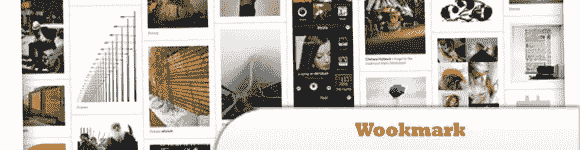
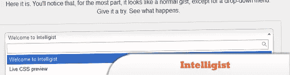
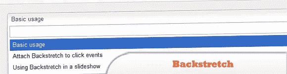
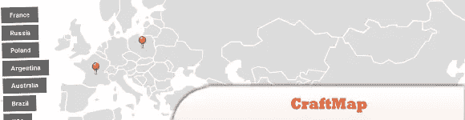
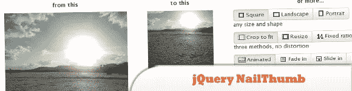
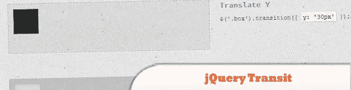
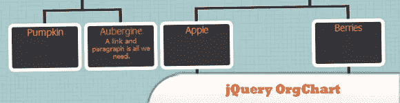

# 最近发布的 jQuery 插件

> 原文：<https://www.sitepoint.com/released-jquery-plugins/>

正如 jQuery 社区一直期待的那样，我们今天为您提供的编译是一些令人印象深刻的好的最近发布的 jQuery 插件。尽情享受吧！

**相关帖子:**

*   [**jQuery 和新 HTML5 要领**](http://www.jquery4u.com/html/jquery-html5-essentials/)
*   [**有趣的 JavaScript，jQuery &网上随机网页开发——2012 年 3 月**](http://www.jquery4u.com/random/interesting-javascript-jquery-random-web-dev-net-march-2012/)

## 1.搜索记忆

是用于按需搜索的 jQuery 插件。

  
[来源](http://www.egrappler.com/jquery-plugin-for-on-demand-search-box-seacrhmeme/)
[演示](http://www.egrappler.com/searchMeme/index.htm)

## 2.伍克马克

是一个创建动态多栏布局的插件。它在动态列网格中布局一系列元素。

  
[源+演示](http://www.wookmark.com/jquery-plugin)

## 3.智能学家

是一个插件，使用 GitHub gists 可以很容易地在页面内共享和演示代码。

  
[源+演示](http://srobbin.com/jquery-plugins/intelligist/)

## 4.非终点直道

是一个简单的插件，允许你添加一个动态调整大小的背景图片到任何页面。

  
[源+演示](http://srobbin.com/jquery-plugins/backstretch/)

## 5.工艺地图(以前的移动地图)

是一个轻量级的(只有 6kb)，完全可配置的插件，通过在上面叠加动态元素将一个简单的图像转换成功能图。

  
[来源](http://www.jscraft.net/plugins/craftmap.html)
[演示](http://www.jscraft.net/demo/plugins/craftmap/)

## 6.jQuery NailThumb

让您用一行代码轻松地从高分辨率图像创建缩略图，没有任何失真。

  
[源+演示](http://www.garralab.com/nailthumb.php)

## 7.bgStretcher

是一个插件，允许你添加一个大的图像(或一组图像)到你的网页背景，并会按比例调整图像大小以填充整个窗口区域。

  
[源+演示](https://web.archive.org/web/20120305175807/www.ajaxblender.com/bgstretcher-2-jquery-stretch-background-plugin-updated.html)

## 8.阿迪波利

是一个简单的插件，给你时尚的图像悬停效果。它可以定制许多可用的选项，开始效果，悬停效果，等等。

  
[源+演示](http://jobyj.in/adipoli/)

## 9.jQuery Transit

为 jQuery 创建超级平滑的 CSS3 转换和过渡。

  
[源+演示](http://ricostacruz.com/jquery.transit/)

## 10.jQuery 组织图表

是一个插件，允许你在一个易读的树状结构中使用嵌套元素来呈现结构。

  
[来源](http://th3silverlining.com/2011/12/01/jquery-org-chart-a-plugin-for-visualising-data-in-a-tree-like-structure/)
[演示](https://dl.dropbox.com/u/4151695/html/jOrgChart/example/example.html)

## 分享这篇文章