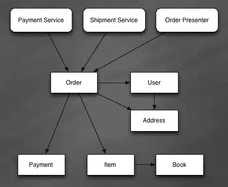
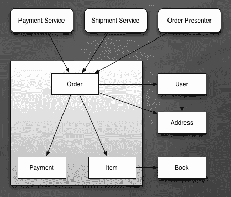

# Rails 开发者的 DDD。第 3 部分:集料。

> 原文：<https://www.sitepoint.com/ddd-for-rails-developers-part-3-aggregates/>

## 我以前为 Rails 开发人员写的关于 DDD 的文章

在第 1 部分中，我谈到了使用分层架构来处理领域复杂性。我展示了一些典型的违反分层体系结构的情况，并给出了一些关于如何修复它们的建议。

在第 2 部分，我开始谈论领域驱动设计的构建模块。我写过实体和值对象之间的重要区别。我还就如何在 Rails 中实现值对象给出了一些建议。

## 总计

这一次，我想进入领域驱动设计的另一个构建模块。我想谈谈总量。

我们以前都经历过这种情况:

你从精心设计的对象组开始。所有的对象都有明确的职责，它们之间的所有交互都是显而易见的。然后，您必须考虑额外的需求，比如事务、与外部系统的集成、事件生成。满足所有这些要求并且不使所有的对象相互连接是一项艰巨的任务。通常情况下，数据库挂钩、条件验证和远程调用都是临时添加的。结果是对象之间有了更多的联系。因此，对象组的边界变得模糊，实施不变量变得更加困难。还记得那些你在想“也许我需要重新加载这个对象”的情况吗这表明您的对象是相互关联的，您无法自信地推理您的代码。相反，你只是猜测。

对于所描述的情况，定义聚合是一个很好的补救方法。

*   “聚合是一组相关联的对象，这些对象在数据更改时被视为一个单元。”(参见[资源](#resources))
*   聚合由一些实体和值对象组成，其中一个被选为聚合的根。
*   所有外部引用都被限制到根。聚合之外的对象只能保存对根的引用。
*   通过根访问聚合的其他成员。因此，(聚合之外的)任何人都不应该持有对这些对象的引用。
*   由于所有外部对象只能引用根，所以实施不变量变得更加容易。
*   聚合有助于减少系统中对象之间的双向关联数量，因为只允许存储对根的引用。这大大简化了设计，并减少了对象图中盲目更改的数量。

## 例子

这听起来可能太抽象了，所以我想给你看一个例子。我要做一个网上书店的模型。该模型的主要职责将是销售和运输书籍。希望这个例子能让聚合的定义更加清晰，并展示如何在 Rails 中实现它们。

### 素描

这是一个草图，展示了将形成模型的所有类。

如你所见，我有:

*   实体:订单、项目、用户、帐簿、付款
*   值对象:地址
*   服务:运输服务、付款服务
*   视图:订单演示者

### 定义聚合边界

现在，在我完成草图绘制后，我可以建立聚合边界并选择根。

有一些经验法则可以使用:

*   形成父子关系的实体最有可能形成一个集合。在这种情况下，父类成为根。
*   语义上彼此接近的实体也是形成聚合的良好候选。例如，Book 和 Payment 彼此之间没有明显的联系。将它们放在一个集合中是不方便的。另一方面，顺序和项目密切相关。因此，我们应该考虑将它们放在一个集合中。
*   如果必须在一个事务中修改两个实体，它们应该是同一个聚合的一部分。

注意:
这些规则应该只是帮助你开始。在你的第一个草图之后，你应该查看所有需要维护的不变量，并基于它们最终确定你的聚合边界。

您可能已经猜到了，订单和商品构成了一个集合。我们还应该包括哪些其他实体？包含图书没有太大意义，因为我很容易想象客户在没有订单的情况下使用图书(例如，您可能需要显示商店中所有可用图书的列表)。
将用户包含在订单的同一个聚合中也不是最好的主意。想象一下，如果用户成为根用户，你将不得不通过用户本身访问用户的所有订单。此外，同时更新同一个用户的两个订单也很棘手。显然，书和用户都不应该是集合的一部分。

支付类的情况不同。从概念上讲，支付是订单的重要组成部分。此外，您不能同时为订单付款和修改订单。就这样决定了，报酬成为总额的一部分。

具有已定义边界的更新草图:

### 履行

让我们从代码开始。首先，让我们定义 Book 和 User 类: