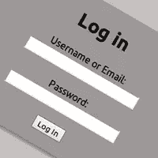

# Rails:从头开始的用户/密码认证，第一部分

> 原文：<https://www.sitepoint.com/rails-userpassword-authentication-from-scratch-part-i/>

## 

*(注:本文附带的源代码可以在[这里](https://github.com/RubySource/rails_simple_user_auth)找到。)*

今天我们将从头开始学习如何在 Rails 应用程序中实现简单的用户认证。我们将研究最佳实践，以帮助避免常见的、通常代价高昂的错误。

* * *

## 用户认证简介

受密码保护的操作是大多数 web 应用程序的常见功能，只允许注册用户使用有效的密码。这被称为“用户认证”，许多 Rails 应用程序都需要它。让我们从用户认证过程如何工作的一个简单场景开始。

*   **注册:**创建新用户。这个用户将使用用户名、密码(将在数据库中加密)、电子邮件等进行注册。
*   **登录:**允许用户使用有效的用户名和密码登录。身份验证过程通过匹配数据库中的用户名和密码进行，只有当给定的信息与记录的值成功匹配时，才允许用户访问受保护的操作。否则，用户将再次被重定向到登录页面。
*   **访问限制:**在登录后创建一个会话来保存经过验证的用户 ID，因此只需在当前会话中检查*用户 ID* 就可以轻松地完成其他受保护操作的导航。
*   **注销:**允许用户注销，并将会话文件中已认证的 *userID* 设置为零。

* * *

## 生成用户模型和控制器

首先，让我们创建名为 *User_Auth* 的应用程序。我们使用 mysql 作为我们的数据库: