# 在 Photoshop 中进行复杂选择

> 原文：<https://www.sitepoint.com/making-complex-selections-in-photoshop/>

在 Photoshop 中进行精确选择是每个设计师都需要的基本技能。作为一名平面设计师，你会发现自己使用选择来[从背景中移除对象](https://www.sitepoint.com/remove-background-photoshop/)以放置在广告中。作为一名网页设计师，你可能会提取一张图片并把它放在一个没有背景的网站上。如果你是一名摄影师，你可能会选择删除图像中的瑕疵或其他不想要的特征。你绕不过去；每个人都使用选择，如果你做了很好的选择，你会得到很好的工作。

那么，当你有一些用正常的选择工具极难选择的东西时，你会怎么做呢？作为基本的选择工具，您可以使用选框工具、套索工具、魔棒工具和快速选择工具。这些并不总是奏效；你没有一个真正精确的工具来进行复杂的选择。

即使使用遮罩和通道，您也无法始终如一地进行精确选择。当然，你可以提炼你的选择，羽化它，并花很多时间在它上面，但这种方法既不容易也不一致。注意下面的图片(你可以从[这里](http://www.pixmac.com/picture/back/000054875255)下载)，在微妙的背景上有一个女人。这可能不会被认为是一个非常复杂的选择，但头发很难提取到自己的层。

[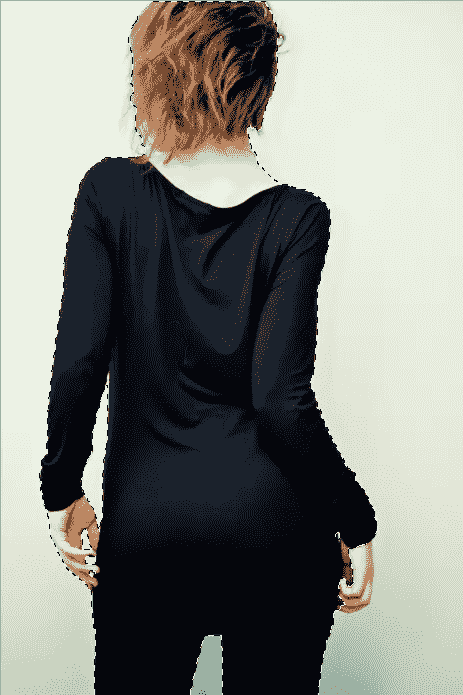](https://www.sitepoint.com/wp-content/uploads/2012/04/Screen-shot-2012-04-23-at-7.49.43-PM.png)

您可以尝试快速选择工具，它可以很好地选择图像的大部分，但使用这种方法很难进行更精细的选择。问题是头发。这束头发太细了，用标准的选择工具很难选择。

[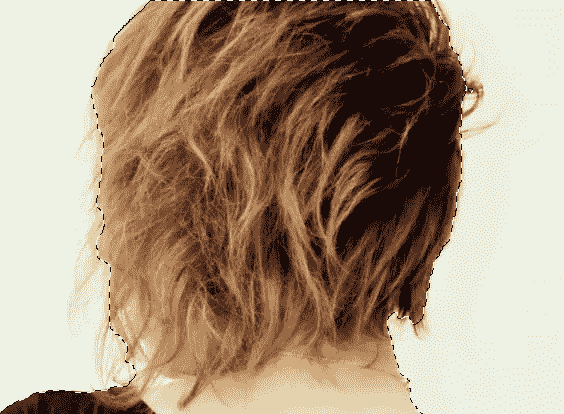](https://www.sitepoint.com/wp-content/uploads/2012/04/Screen-shot-2012-04-23-at-8.22.53-PM.png)

精炼面具来拯救。在示例中，我使用快速选择工具进行了选择。这很好地选择了图像的大部分，但现在我们要细化我们的选择。在 Photoshop 中，当您进行选择时，您的选择工具的选项菜单应该提供一个按钮，上面写着“调整蒙版”单击该按钮以打开“调整蒙版”对话框。

[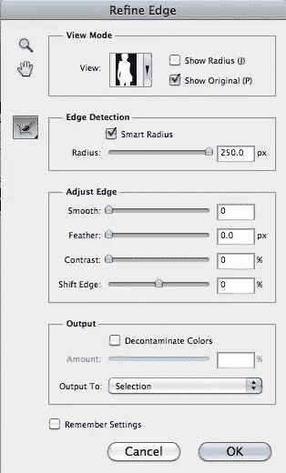](https://www.sitepoint.com/wp-content/uploads/2012/04/Screen-shot-2012-04-23-at-8.52.10-PM.png)

“优化蒙版”菜单是优化选区的最佳工具之一。您有许多查看遮罩的选项:

*   **行军蚁**，这是你的基本选择观。
*   **叠加**，与快速蒙版模式相同的视图。
*   黑色上的**，在你的视野中给你很多对比，看起来就像一个普通的图层蒙版。**
*   **在白色**上，与相反的背景形成相同的对比。
*   **黑色&白色**，当您试图查看图像中想要从选区中添加和减去的明暗区域时，它可以帮助您将选区与背景区分开来。
*   **在图层上**，显示你的底层图层。
*   **显示图层**，显示正常背景。

[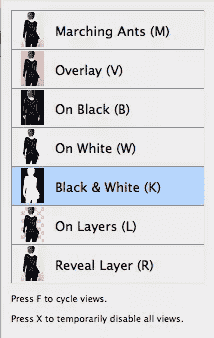](https://www.sitepoint.com/wp-content/uploads/2012/04/Screen-shot-2012-04-23-at-8.52.22-PM.png)

每个视图都有自己的目的，但是最好的对比视图必须是黑色上的**，白色**上的**，以及黑色&白色**上的**。这个对话框非常方便，因为您可以通过按“F”键在每个视图之间轻松切换。你可以在下面的例子中看到，我们的选择是好的，但头发束不包括在选择中。**

[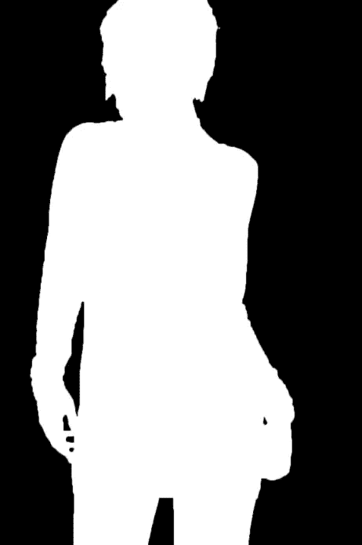](https://www.sitepoint.com/wp-content/uploads/2012/04/Screen-shot-2012-04-23-at-9.26.13-PM.png)

我们可以通过使用智能半径滑块来解决这个问题。仅仅通过使用这个滑块，我们就可以进行更精细和精确的选择。我把它一直推到 250 像素，这样做的结果如下所示:

[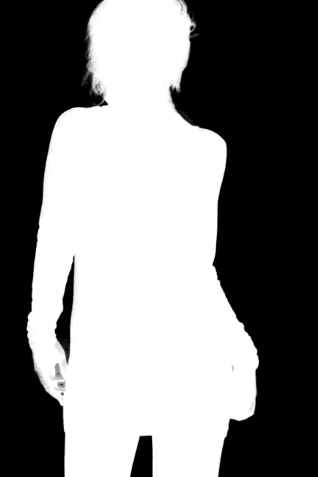](https://www.sitepoint.com/wp-content/uploads/2012/04/Screen-shot-2012-04-23-at-9.31.02-PM.png)

这个滑块做得很好，但是仍然有几缕头发没有包含在选区中，使得我们的图像不完整。我们希望我们的图像看起来尽可能自然，所以我们需要包括这些。“调整蒙版”对话框的左侧有一个笔刷，您可以使用它来增加或减少选区。按住 shift 键添加到选区，按住 alt/option 键从选区中减去。如果您需要不同的视图，请使用“F”键在不同的视图之间切换。

[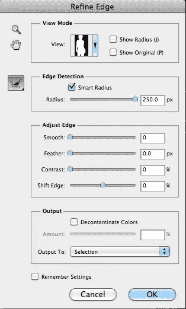](https://www.sitepoint.com/wp-content/uploads/2012/04/Screen-shot-2012-04-23-at-9.37.45-PM.png)

我们的选择看起来很棒，比以前更详细。当我们在不同的视图中循环时，我们可以看到我们想要包含在选择中的头发。许多人会说这是一个非常好的选择，但现在，如果你去看黑色上的**，你可以看到一个围绕着这个女人身体和头发的浅色轮廓。你也可以在下面看到手的周围有一些重影。使用画笔添加这些细节。**

[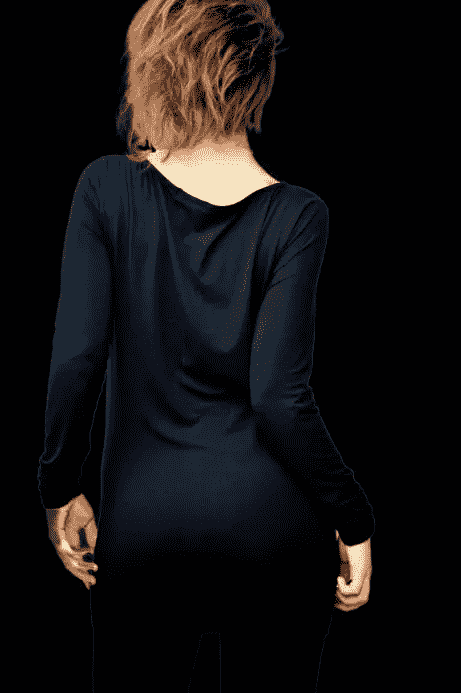](https://www.sitepoint.com/wp-content/uploads/2012/04/Screen-shot-2012-04-23-at-9.52.53-PM.png)

[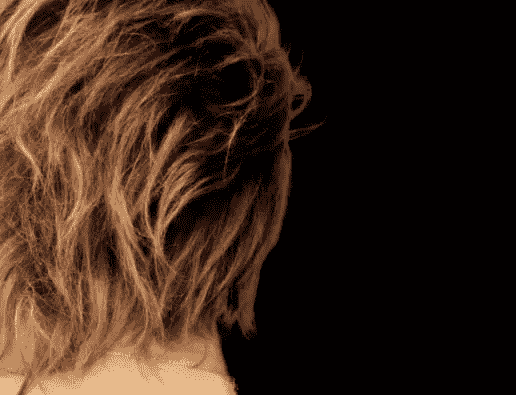](https://www.sitepoint.com/wp-content/uploads/2012/04/Screen-shot-2012-04-23-at-9.53.26-PM.png)

[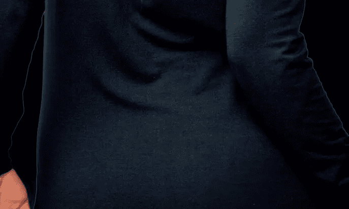](https://www.sitepoint.com/wp-content/uploads/2012/04/Screen-shot-2012-04-23-at-9.53.49-PM.png)

这叫边缘。你可以浏览并删除所有内容，或者尝试缩小你的选择，但这可能会影响你的形象，使你的选择变得更糟而不是更好。“优化边缘”菜单中的最佳选项是底部的“输出”选项。如果选择去污颜色，可以向右移动滑块并移除边缘。

[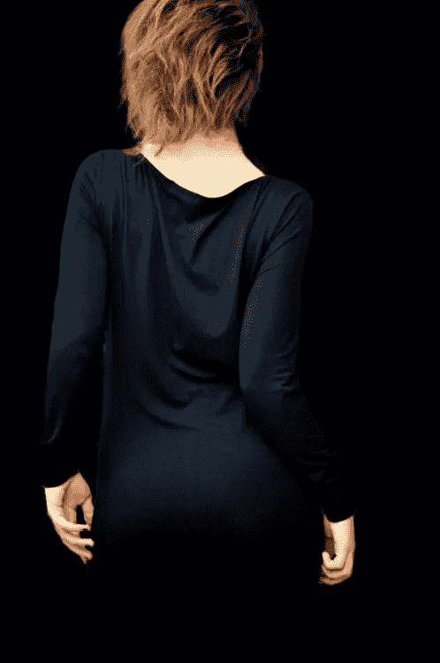](https://www.sitepoint.com/wp-content/uploads/2012/04/Screen-shot-2012-05-08-at-9.18.02-PM.png)

您也可以选择*如何输出*。您可以选择“使用图层蒙版新建图层”、“新建图层”、“新建文档”或“使用图层蒙版新建文档”。如果您仍然需要在当前文档中保留它，请选择使用图层蒙版创建一个新图层。这使您能够进一步细化图层蒙版。当你完成了你的优化，右键单击图层蒙版图标，并选择应用蒙版。

[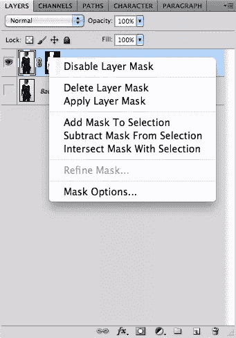](https://www.sitepoint.com/wp-content/uploads/2012/04/Screen-shot-2012-04-23-at-10.59.52-PM.png)

随着图像的提取，现在你可以把它放在任何你想要的背景上。使用您的复杂和专业级别的选择，您可以将它们转换为遮罩，并从背景中遮罩和提取任何对象。我在提取的图像下面添加了这个背景纹理，结果如下图所示。

[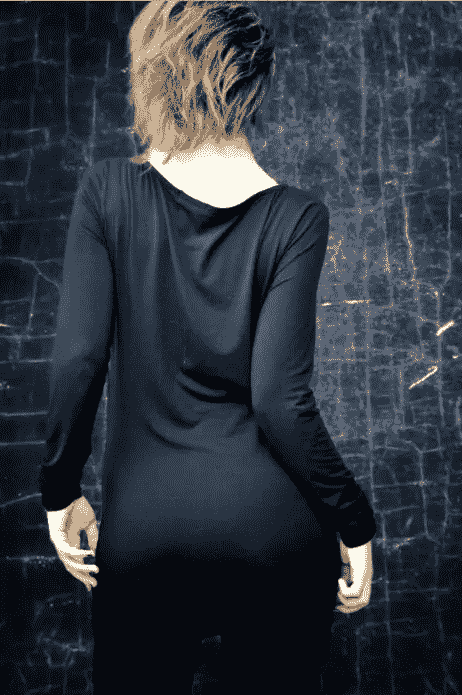](https://www.sitepoint.com/wp-content/uploads/2012/04/Screen-shot-2012-05-08-at-9.39.20-PM.png)

你可能认为你需要大量的对比来实现，但事实上，你不需要。这是一个蒲公英的样本图片，你可以在这里找到。图像没有太多的对比，背景和主体的色调非常相似。

粗略地挑选一下蒲公英。这不一定要精确，但是尽可能多地选择主图像。我用了快速选择工具，花了大约 3 秒来做这个选择。

[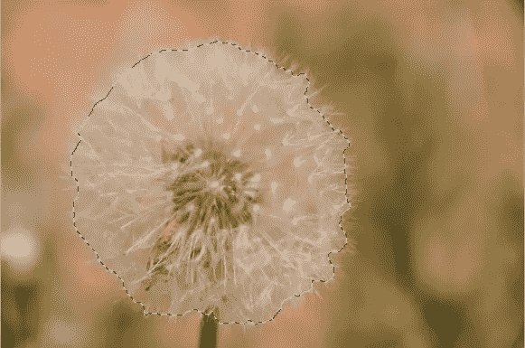](https://www.sitepoint.com/wp-content/uploads/2012/04/Screen-shot-2012-04-23-at-11.27.01-PM.png)

然后，我简单地打开智能半径和颠簸的价值一路上升。

[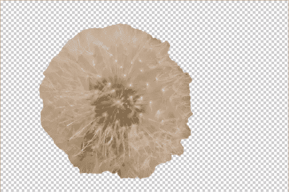](https://www.sitepoint.com/wp-content/uploads/2012/04/Screen-shot-2012-04-23-at-11.27.16-PM.png)

为了去掉背景中的额外内容，比如场地其余部分的绿色，我使用了去污颜色，并一路向上提升数值。我将选区导出为自己图层上的蒙版，瞧！

[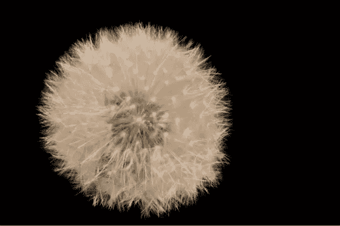](https://www.sitepoint.com/wp-content/uploads/2012/04/Screen-shot-2012-04-23-at-11.27.46-PM.png)

“优化边缘”和“优化蒙版”设置可以处理简单或困难的选择，并使复杂选择的过程变得更加容易。这些技巧可以使您的 Photoshop 选择更快、更容易、更好。

## 分享这篇文章