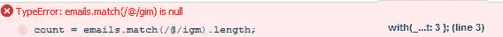

# 字符串计数中的 jQuery 字符串

> 原文：<https://www.sitepoint.com/jquery-string-string-counting/>

如何**统计一个字符串**(字符子集/正则表达式/通配符)在另一个字符串中出现的次数。

## 方法 1–使用正则表达式匹配

```
var emails = 'sam@jquery4u.com,admin@jquery4u.com,someone@jquery4u.com',
    count = emails.match(/@/igm).length;
console.log(count);
//output: 3
```

警告你使用。没有匹配的正则表达式上的长度函数将导致空错误。




```
var emails = '',
    count = emails.match(/@/igm).length;
console.log(count);
//output: TypeError: emails.match(/@/gim) is null
```

如果在赋值前检查计数不为空，它不会出错，如果没有计数，它会给你 0。

**工作版本(空证明):**

```
var emails = 'sam@jquery4u.com,admin@jquery4u.com,someone@jquery4u.com',
    regex = /@/igm,
    count = emails.match(regex),
    count = (count) ? count.length : 0;

console.log(count);
//output: 3
```

## 方法 2–使用 indexOf() Pos 函数

```
function occurrences(string, substring){
    var n=0;
    var pos=0;

    while(true){
        pos=string.indexOf(substring,pos);
        if(pos!=-1){ n++; pos+=substring.length;}
        else{break;}
    }
    return(n);
}
count= occurrences(emails,'@');
console.log(count);
//output: 3
```

## 分享这篇文章