# 2011 年至今的 30 个伟大的 3D 图形设计

> 原文：<https://www.sitepoint.com/30-great-3d-graphic-designs-from-2011-to-present/>

近年来，3D 平面设计呈现出全新的面貌。由于它能够使图形跃出页面，它也成为几乎所有设计领域中最受欢迎的效果之一。电影、网页设计和广告牌是 3D 图形设计的常见宿主，但 3D 在海报设计甚至小册子印刷中也非常普遍。

3D 图形的一个新兴趋势是 3D 排版的发展。你会在下面的集合中看到一些例子。但是最近在角色设计方面发生了巨大的飞跃，3D 建模似乎已经进入了超现实主义。从角色设计到 3D 环境的开发，以下收集了过去一年中发布的一些最伟大的作品。

* * *

### emciem 的 Cade Bot

[来源](http://emciem.deviantart.com/art/Cade-Bot-283640845)

* * *

### 23L“Cusitrin”

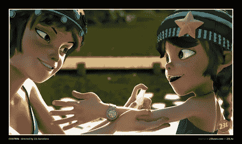

[来源](http://www.behance.net/gallery/Cusitrin/3144214)

* * *

### 相框-蒂尔·诺瓦克:“亚瑟·圣诞”

[来源](http://www.anisecond.com/artikel/set-design-f%FCr-arthur-weihnachtmann-hightech-bescherung/382.html)

* * *

### 迈克·坎波的《空气中的运动》

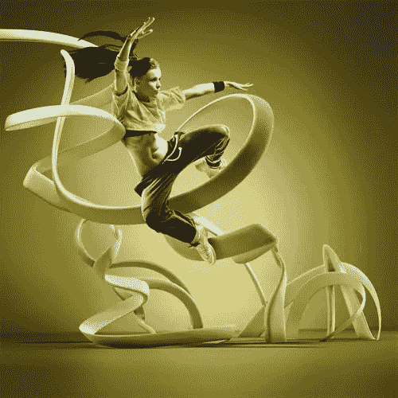

[来源](http://www.behance.net/gallery/MOTION-IN-AIR/3211177)

* * *

### 威尔逊·奈落设计的 LLY 建筑标志

[来源](http://wilson-naraku.deviantart.com/art/LLY-building-logo-249240223)

* * *

### 克里斯·拉布罗伊《纽约的夏日街道》

[来源](http://www.behance.net/gallery/Summer-Streets-NYC/1340797)

* * *

### 杨光(2011 年最佳 3D 艺术家)

[来源](http://www.graphic-design-blog.com/2011/12/guang-yang-who-was-voted-best-3d-artist.html)

* * *

### 卡洛斯·奥尔特加“智者富尔亨修斯”

[来源](http://stroggtank.cgsociety.org/gallery/842251/)

* * *

### PSD Tuts+–快速提示动作文本效果教程

* * *

### Piotr Buczkowski 解读有线标志

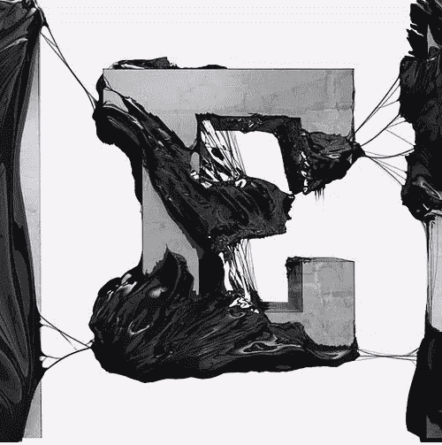

[来源](http://www.behance.net/gallery/Wired-Logo-Interpretation/2444829)

* * *

### Mark Gmehling 的雀巢/ Hepar 水

[来源](http://www.behance.net/gallery/NESTL-HPAR/1706019)

* * *

### JarrodHasenjager 的卧室项目

[来源](http://jarrodhasenjager.deviantart.com/art/The-Bedroom-Project-262115378)

* * *

### Max Kostenko 为 megafone 网站创作的角色

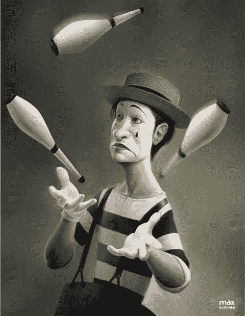

[来源](http://www.behance.net/gallery/Characters-and-illustrations/3231265)

* * *

### Deino3330 造成的 3DPV 细菌污染

[来源](http://deino3330.deviantart.com/art/3DPV-Bacterial-Contamination-283005230)

* * *

### Iansdesignthingy

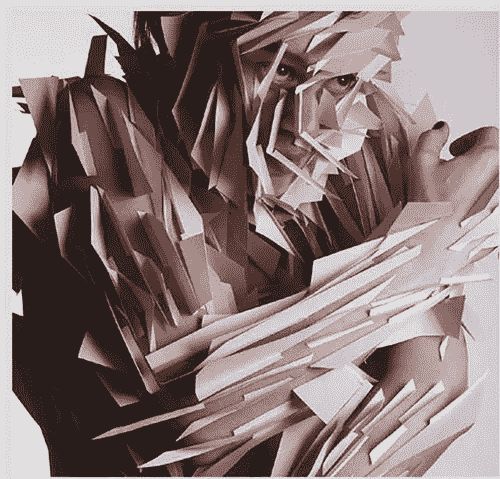

[来源](http://iansdesignthingy.wordpress.com/2012/02/03/raw-color-invertuals-3/)

* * *

### CG4TV 动画工作室

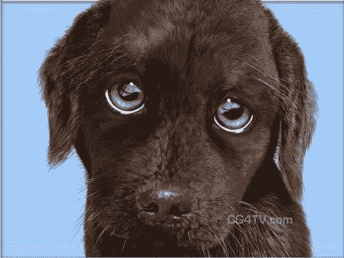

[来源](http://3danimation.e-spaces.com/outdoor_print.htm)

* * *

### 行为网络

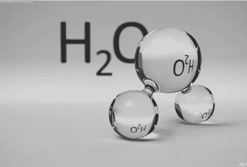

[来源](http://www.behance.net/gallery/3D-Graphic-Design-Illustrative-CGI/1838599)

* * *

### 由 megatama 设计的 GEELATIC

[来源](http://megatama.deviantart.com/art/GEELATIC-Street-Sport-Car-Concept-full-view-284279984)

* * *

### 用 PSD Tuts+制作节日鸡尾酒

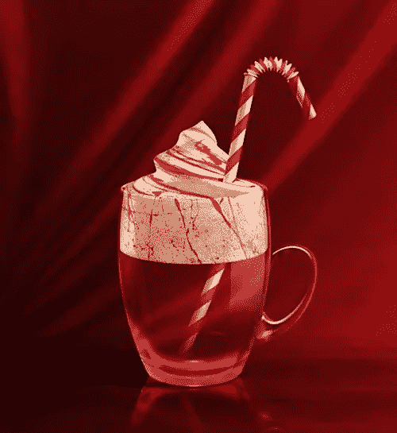

[来源](http://psd.tutsplus.com/tutorials/3d/festive-cocktail-photoshops-3d/)

* * *

### 额尔丹博客

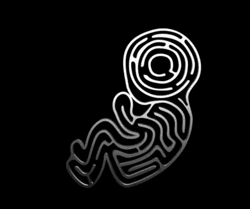

[来源](http://enedan.wordpress.com/)

* * *

### 克朗塔克的《池塘》

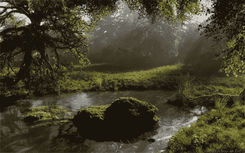

[来源](http://klontak.deviantart.com/art/The-pond-285352255)

* * *

### 奥利维尔·韦贝克

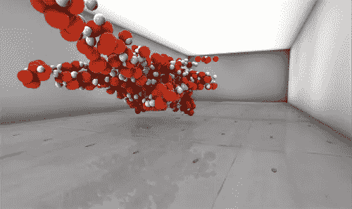

[来源](http://olivierverbeke.wordpress.com/2011/05/22/art-gallery-render-test/)

* * *

### Kode Logic《机甲沙加特》

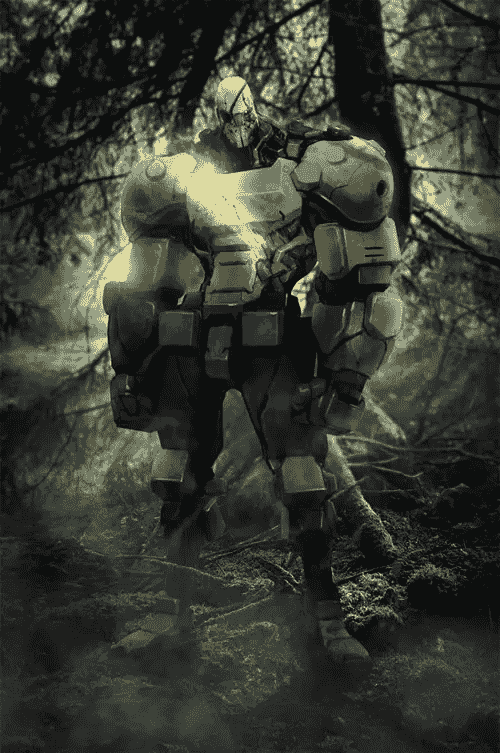

[来源](http://www.behance.net/gallery/Mecha-Sagat/2583427)

* * *

### 芬尼安·麦克马努斯的“意识”

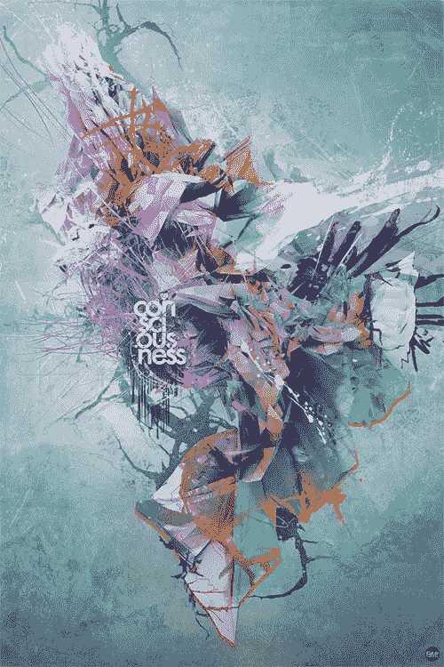

[来源](http://www.behance.net/gallery/Heartsurge-Exhibit-D/2588859)

* * *

### 伊戈洛奇卡的复仇

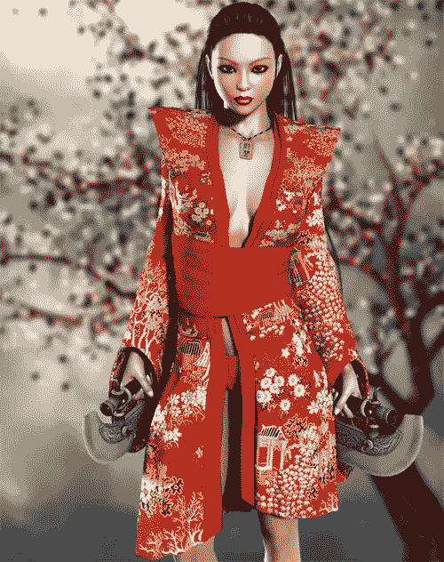

[来源](http://igolochka.deviantart.com/art/Onryos-Vengeance-272284390)

* * *

### 何塞·保罗的《诺亚方舟》

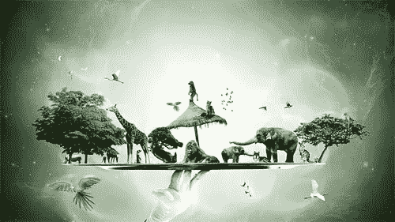

[来源](http://zepaulocreation.blogspot.com/2011/11/noahs-board.html)

* * *

### mmxi by driving udin salech(由驾驶人 salech)

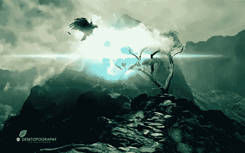

[来源](http://www.behance.net/gallery/MMXI-Desktopography-2011/2584023)

* * *

### 普利茅斯版画由比列利斯设计

[来源](http://www.behance.net/gallery/Plymouth-Prints-Design/3027081)

* * *

### 马基·达基的 CMYK

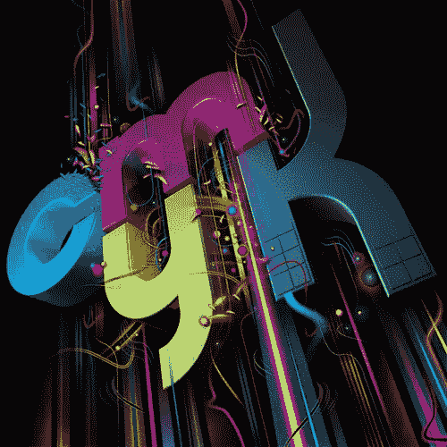

[来源](http://www.behance.net/gallery/Various-Type-Designs/360647)

* * *

### 为什么不是尼克·安利

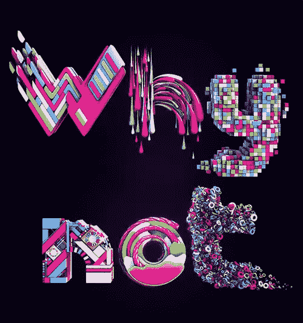

[来源](http://www.behance.net/gallery/Why-not/818398)

* * *

这些当中哪些是你最喜欢的？我错过的 2011 年和 2012 年初的任何伟大的 3D 图形？

## 分享这篇文章