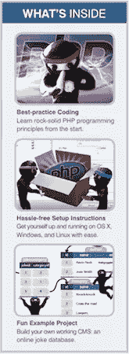

# 先睹为快凯文·杨克的新书《PHP & MYSQL:忍者新手》

> 原文：<https://www.sitepoint.com/sneak-peek-of-kevin-yanks-new-php-mysql-book/>

凯文·杨克又成功了！他刚刚完成了他的畅销书的 2012 年新版本(*建立你自己的数据库驱动的网站，第四版*)，现在的标题是-*PHP&MySQL:忍者新手。*而且，今天你可以:

*   **先睹为快**(节选自第三章——*介绍 PHP* )
*   **[预订](#pre-order)** ，最高可节省 50%

Now let’s jump into the excerpt from the book. Over to you Kev …

## PHP 简介

PHP 是一种**服务器端语言**。这个概念可能有点难以理解，尤其是如果你只设计过使用客户端语言如 HTML、CSS 和 JavaScript 的网站。

服务器端语言类似于 JavaScript，它允许嵌入很少的内容

程序(脚本)转换成网页的 HTML 代码。当执行时，这些程序可以让你比 HTML 更好地控制浏览器窗口中显示的内容。JavaScript 和 PHP 的关键区别在于加载网页的阶段，在这个阶段执行这些嵌入式程序。

从 web 服务器下载网页(嵌入式程序和所有程序)后，web 浏览器会读取并执行像 JavaScript 这样的客户端语言。相比之下，像 PHP 这样的服务器端语言是由 web *服务器*在将网页发送到浏览器之前运行的。客户端语言允许您控制页面在浏览器中显示后的行为，而服务器端语言允许您在页面发送到浏览器之前动态生成定制页面。

一旦 web 服务器执行了嵌入在 web 页面中的 PHP 代码，结果将代替页面中的 PHP 代码。浏览器在接收页面时看到的都是标准的 HTML 代码，因此得名“服务器端语言”让我们回头看看第 1 章中的 today.php 例子:

```
<!DOCTYPE html>
<html lang="en">
<head>
<meta charset="utf-8">
<title>Today&rsquo;s Date</title>
</head>
<body>
<p>Today&rsquo;s date (according to this web server) is
<?php 
echo date('l, F jS Y.'); 
?> 
</p>
</body>
</html>
```

除了之间的一行是 PHP 代码之外，大部分都是普通的 HTML。标志着它的结束。web 服务器被要求解释这两个分隔符之间的所有内容，并在将网页发送到请求浏览器之前将其转换为常规的 HTML 代码。浏览器将显示以下内容:

注意，PHP 代码的所有符号都消失了。在它的位置出现了脚本的输出，看起来就像标准的 HTML。这个例子展示了服务器端脚本的几个优点:

```
<!DOCTYPE html>
<html lang="en">
<head>
<meta charset="utf-8">
<title>Today&rsquo;s Date</title>
</head>
<body>
<p>Today&rsquo;s date (according to this web server) is
Sunday, April 1st 2012\. </p>
</body>
</html>
```

注意，PHP 代码的所有符号都消失了。在它的位置出现了脚本的输出，看起来就像标准的 HTML。这个例子展示了服务器端脚本的几个优点:

### 没有浏览器兼容性问题

PHP 脚本由 web 服务器单独解释，因此不需要担心访问者的浏览器是否支持您使用的语言特性。

### 对服务器端资源的访问

在上面的例子中，我们根据 web 服务器将日期放入 web 页面。如果我们使用 JavaScript 插入日期，我们只能根据运行 web 浏览器的计算机来显示日期。当然，还有更多利用服务器端资源的令人印象深刻的例子，比如插入从 MySQL 数据库中提取的内容(*提示，提示…* )。

### 减轻了客户端的负载

JavaScript 会显著延迟网页的显示(尤其是在移动设备上！)，因为浏览器必须先运行脚本，然后才能显示网页。使用服务器端代码，这一负担被传递给 web 服务器，您可以根据应用程序的需要(并且您的钱包可以承受)来构建 web 服务器。

## 基本语法和语句

任何了解 JavaScript、C、C++、C#、Objective-C、Java、Perl 或任何其他 C 派生语言的人都会非常熟悉 PHP 语法。但是如果这些语言对你来说不熟悉，或者你是编程新手，就没有必要担心。

一个 PHP 脚本由一系列命令或**语句**组成。每条语句都是一条指令，web 服务器必须遵循这条指令才能执行下一条指令。PHP 语句和前面提到的语言一样，总是以分号(；).

这是一个典型的 PHP 语句:

```
echo 'This is a <strong>test</strong>!';
```

这是一个 echo 语句，用于生成发送到浏览器的内容(通常是 HTML 代码)。echo 语句只是获取给定的文本，并将其插入到页面的 HTML 代码中包含它的 PHP 脚本的位置。

在这种情况下，我们提供了一个要输出的文本字符串:“这是一个**测试**！”。注意，文本字符串包含 HTML 标签(**和**)，这是完全可以接受的。因此，如果我们将这条语句放到一个完整的网页中，结果代码如下:

```
<!DOCTYPE html>
<html lang="en">
<head>
<meta charset="utf-8">
<title>Today&rsquo;s Date</title>
</head>
<body>
<p><?php echo 'This is a <strong>test</strong>!'; ?></p>
</body>
</html>
```

如果您将此文件放在 web 服务器上，然后使用 web 浏览器请求它，您的浏览器将收到以下 HTML 代码:

```
<!DOCTYPE html>
<html lang="en">
<head>
<meta charset="utf-8">
<title>Today&rsquo;s Date</title>
</head>
<body>
<p>This is a <strong>test</strong>!</p>
</body>
</html>
```

我们前面看到的 today.php 示例包含一个稍微复杂一些的 echo 语句:

```
echo date('l, F jS Y.');
```

该语句不是给 echo 一个简单的文本字符串来输出，而是调用一个名为 date 的内置函数并向*传递一个文本字符串:“l，F，jS，y”。您可以将内置函数想象成 PHP 知道如何完成的任务，而无需您详细说明。PHP 有许多内置函数，可以让您做任何事情，从发送电子邮件到处理存储在各种类型的数据库中的信息。*

当你在 PHP 中调用一个函数——也就是让它做它的工作——你就被说成是在**调用**那个函数。大多数函数**在被调用时都会返回值**；然后，PHP 的行为就好像您实际上只是在代码中输入了返回值。在这种情况下，我们的 echo 语句包含对 date 函数的调用，该函数以文本字符串的形式返回当前日期(其格式由函数调用中的文本字符串指定)。因此，echo 语句输出函数调用返回的值。

您可能想知道为什么我们需要用括号((…))和单引号(“…”)将文本字符串括起来。和在 SQL 中一样，引号在 PHP 中用来标记文本字符串的开始和结束，所以引号的存在是有意义的。括号有两个用途。首先，它们表明 date 是一个您想要调用的函数。其次，它们标记了您希望提供的一系列**参数**的开始和结束，以便告诉函数您希望它做什么。

对于 date 函数，您需要提供一个文本字符串来描述您希望日期显示的格式。稍后，我们将查看采用多个参数的函数，并用逗号分隔这些参数。我们还会考虑不带任何参数的函数。这些函数仍然需要括号，即使它们之间没有任何内容需要键入。

—

太棒了，谢谢凯文的分享！

好消息是，在这本书的 500 多页中，有很多像这样更实用的例子。其中包括:

*   教程:简单易懂的教程，带有可下载的代码示例
*   **安装:**PHP&MySQL 在 Windows、Mac OS X、Linux 上的说明
*   **PHP 编码**:学习正确的 PHP 语法
*   **数据库设计**:掌握 SQL 数据库设计
*   **面向对象编程**(OOP):OOP 原理速成班。
*   **构建 CMS** :创建 CMS 的分步指南。
*   **购物车**:从零开始开发电商购物车。
*   **最新技术**:针对 Windows 7、Mac OS X Lion，以及 PHP、MySQL、phpMyAdmin、XAMPP、MAMP、HTML5 的最新版本进行了更新。

立即订购您的副本:

*   **[纸质书+数字电子包套装——售价 34 美元](https://www.sitepoint.com/blog/)** **(节省 50%)**
*   [数字电子包(pdf、epub、mobi)–17 美元](https://www.sitepoint.com/blog/) **(节省 42%)**

就是这样。享受吧，一如既往，我们希望听到你所有的想法和评论。

## 分享这篇文章