# Adobe Photoshop CS6 的最佳新功能

> 原文：<https://www.sitepoint.com/the-best-new-features-of-adobe-photoshop-cs6/>

Photoshop CS6 有一些很棒的新功能，设计师一定会喜欢。从 CS4 或 CS5 升级简单直接，新工具直观、实用，对各种设计目的非常有帮助。

Adobe 在他们最新的 Photoshop 版本上投入了大量的时间和精力。因此，有数百项改进。这里列出了 Photoshop CS6 中几个最值得注意的新增功能，而不是试图一一列出。

### 内容感知移动

这是 Photoshop CS6 最令人印象深刻的新增功能之一。在下面的样本图像中，你可以在这里找到，我们有一个从地下冒出来的工业结构。使用快速选择工具进行选择。您也可以简单地选择内容感知移动工具(位于污点修复画笔工具下),并使用它进行选择。

[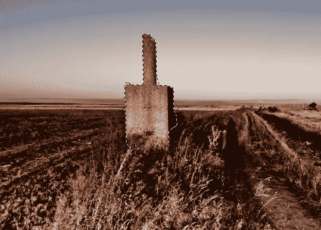](https://www.sitepoint.com/wp-content/uploads/2012/04/Screen-shot-2012-04-22-at-5.48.04-PM.png)

做出选择后，请确保选择了内容感知移动工具，只需将您的选择移动到您想要的位置。Photoshop CS6 逐字填写其余部分。即使你有一点残留(如下所示)，简单地在问题区域周围做一个选择，并使用内容感知填充来清理它。这是对内容感知库的一个很好的补充。

[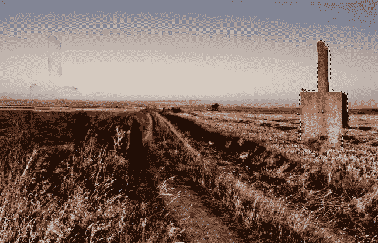](https://www.sitepoint.com/wp-content/uploads/2012/04/Screen-shot-2012-04-22-at-5.48.28-PM.png)

[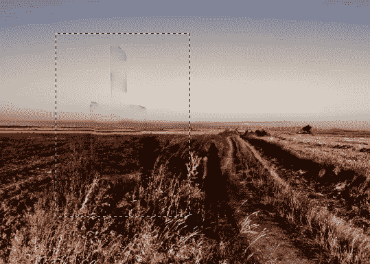](https://www.sitepoint.com/wp-content/uploads/2012/04/Screen-shot-2012-04-22-at-5.48.45-PM.png)

[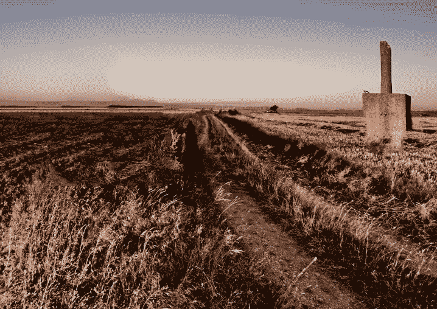](https://www.sitepoint.com/wp-content/uploads/2012/04/Screen-shot-2012-04-22-at-5.49.01-PM.png)

### 新的模糊滤镜

#### 视场模糊

实地模糊是一个很好的过滤器，让你的照片看起来真实模糊。它不像高斯模糊、径向模糊或运动模糊，但它很微妙，看起来像从真实相机中获得的相同的真实场模糊。在此下载样图[。复制你的图层，进入“滤镜”>“模糊”>“实地模糊”](http://www.pixmac.com/picture/city/000080778541)

[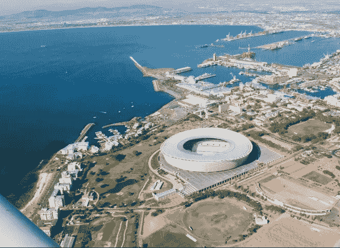](https://www.sitepoint.com/wp-content/uploads/2012/04/Screen-shot-2012-04-22-at-9.20.57-PM.png)

[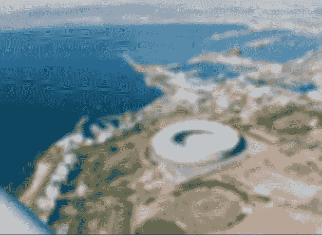](https://www.sitepoint.com/wp-content/uploads/2012/04/Screen-shot-2012-04-22-at-9.21.13-PM.png)

这并不需要太多，因为我只设置了模糊效果为 15px 来得到上面显示的结果。您也可以将大头针添加到不同的区域，以控制哪些区域模糊以及场模糊的程度。

[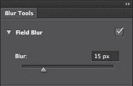](https://www.sitepoint.com/wp-content/uploads/2012/04/Screen-shot-2012-04-22-at-9.22.08-PM.png)

所有三个新的模糊滤镜的一个很大的功能是中间的便利转盘，它允许你调整两个滤镜上的模糊位置，并通过转盘手动增加模糊量。这增加了一个直观的触摸，让您可以轻松地调整您的图像口味。

[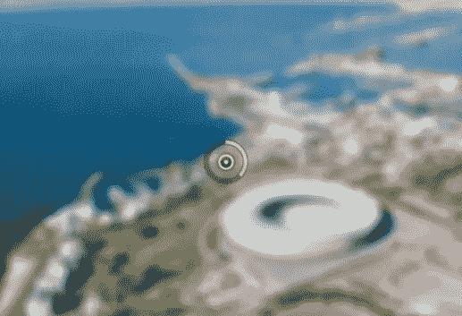](https://www.sitepoint.com/wp-content/uploads/2012/04/Screen-shot-2012-04-22-at-9.22.34-PM.png)

您也可以添加一个图层蒙版到模糊层，并在您想要有焦点的区域外绘制模糊效果。

#### 虹膜模糊

虹膜模糊将模糊添加到图像的每个部分，除了焦点。虹膜模糊通过让您精确控制焦点区域的形状以及羽化量而脱颖而出。

[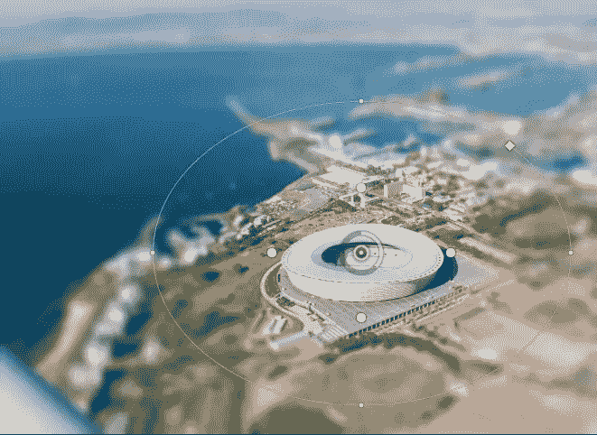](https://www.sitepoint.com/wp-content/uploads/2012/04/Screen-shot-2012-04-22-at-9.34.14-PM.png)

菱形控制焦点区域的形状。拖出来是方的，往中心拖是圆的。圆圈周围的小点旋转焦点区域，也使该区域变薄或变圆。

[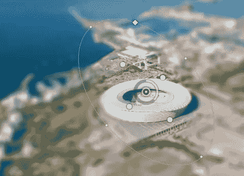](https://www.sitepoint.com/wp-content/uploads/2012/04/Screen-shot-2012-04-22-at-9.43.19-PM.png)

内圆控制应用于图像和模糊区域之间过渡的羽化程度。

#### 倾斜移位

倾斜移位最近在摄影师中变得流行起来。这个概念包括拍摄一个有建筑物或人的场景的俯视图，并添加模糊以使物体看起来很小。这意味着看起来好像你正在使用一个微距设置的相机来拍摄场景。

[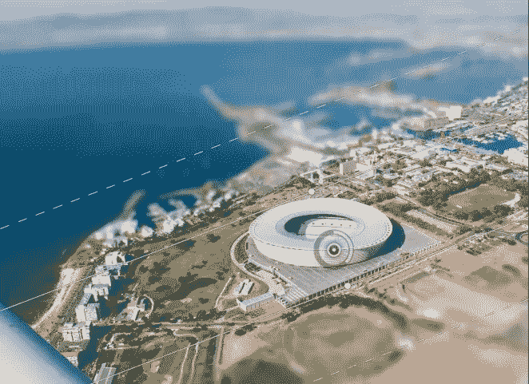](https://www.sitepoint.com/wp-content/uploads/2012/04/Screen-shot-2012-04-22-at-9.47.39-PM.png)

控制非常简单。这些线条决定了蓝色的倾斜角度以及间距的宽度。“扭曲”设置控制边缘周围的扭曲量。

[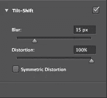](https://www.sitepoint.com/wp-content/uploads/2012/04/Screen-shot-2012-04-22-at-9.48.07-PM.png)

[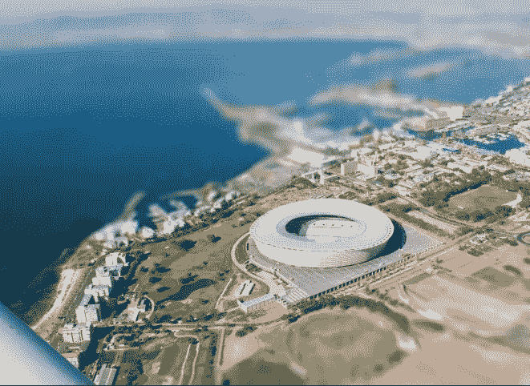](https://www.sitepoint.com/wp-content/uploads/2012/04/Screen-shot-2012-04-22-at-9.48.33-PM.png)

### 界面

Photoshop CS6 的整体外观已经过彻底检查。整个界面都被调暗了，看起来很棒。与以前的 Photoshop 界面相比，它使您的图像更加突出，使您可以更多地关注图像，而不是 Photoshop 窗口。对比似乎有所帮助(至少在我看来)，但如果你不喜欢新的外观，你可以在偏好范围内改变它。

[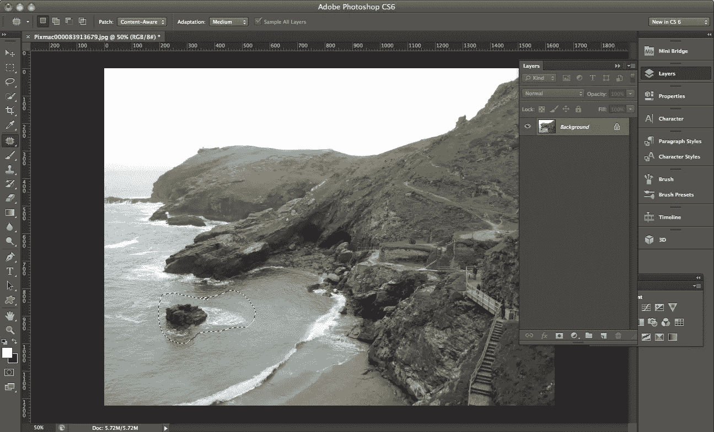](https://www.sitepoint.com/wp-content/uploads/2012/04/Screen-shot-2012-04-23-at-11.57.37-PM.png)

#### 内容感知补丁

我喜欢这个新增加的东西。CS5 的补丁工具很好用，但是 CS6 的要好得多。在 CS5，这种技术有时会奏效，但有时会彻底破坏形象。现在，修补工具可以设置为内容感知，因此您可以简单地选择并拖动它到您想要修补的颜色或纹理区域，它将填充信息。

你可以从[这里](http://www.pixmac.com/picture/rocky/000083913679)下载下面的样本图片。我想删除左边的孤独的岩石和泡沫。

只需选择修补工具，并在您想要移除的区域周围进行选择。检查下拉菜单中的内容感知选项，并将您的选择拖动到没有泡沫的水域。

[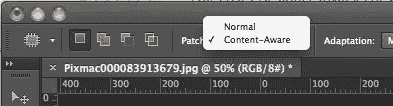](https://www.sitepoint.com/wp-content/uploads/2012/04/Screen-shot-2012-04-24-at-12.04.33-AM.png)

当您放开时，Photoshop 会使用您移动了修补工具的内容区域来重建该区域。CS6 做得很好。

#### 裁剪工具

这种对裁剪工具的增强绝对是不可思议的。有时候是一些小事很重要。Adobe 在裁剪工具中添加了一系列预设来节省您的时间。您可以将裁剪工具覆盖设置为黄金比例、黄金螺旋、三角形、对角线和网格。

[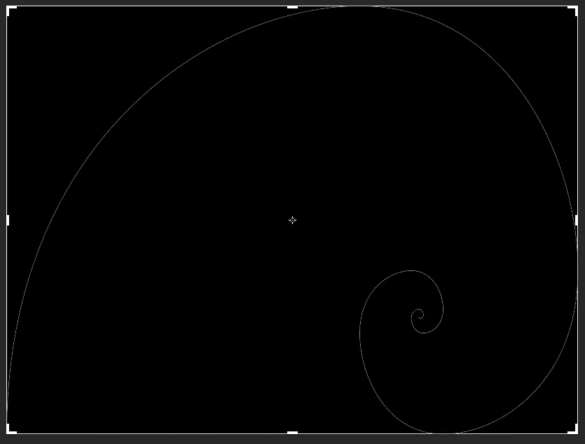](https://www.sitepoint.com/wp-content/uploads/2012/04/Screen-shot-2012-04-24-at-12.15.27-AM.png)

[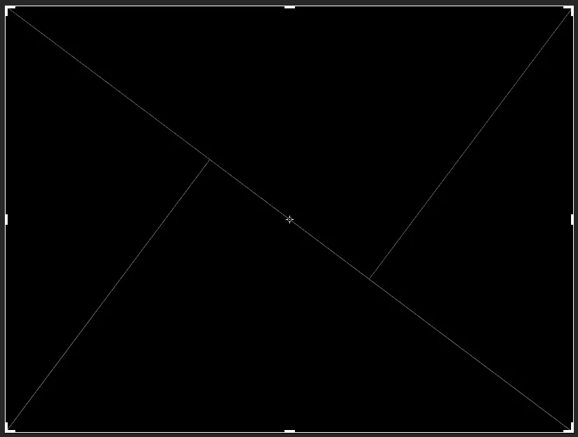](https://www.sitepoint.com/wp-content/uploads/2012/04/Screen-shot-2012-04-24-at-12.15.44-AM.png)

约束预设是另一个很好的补充。它们集成了许多常见的照片大小预设，因此您可以以正确的比例和纵横比裁剪您的图像。裁剪工具是我们所有人每天都在使用的东西，这肯定会节省我们的时间。

[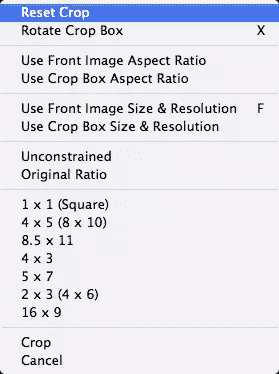](https://www.sitepoint.com/wp-content/uploads/2012/04/Screen-shot-2012-04-24-at-12.16.53-AM.png)

#### 向量形状

Photoshop 中最好也是期待最久的一个新增功能是*矢量*。矢量不再是由矢量蒙版构成的；它们是真正的矢量形状。您可以像处理任何其他矢量化图像一样处理它们，而不会丢失细节或质量。

[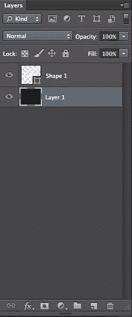](https://www.sitepoint.com/wp-content/uploads/2012/04/Screen-shot-2012-04-24-at-1.38.10-AM.png)

您还可以添加虚线，使形状更加灵活。

您也可以通过添加或减去当前形状来制作自定义形状，或者每次在新图层上制作形状。你现在也可以合并矢量，而不必先栅格化它们，这是非常了不起的。

#### 排序层

任何曾经处理过 150 层 Photoshop 文件的人都会告诉你，找到你想要的东西是一件痛苦的事情。你可能有 15 个图层组，有些是扩展的，有些不是，你必须翻转你的图层面板来找到你要找的图层。这可能是一种真正的痛苦，尽管我想说我总是在组织我的层，但我不是。

这一次，Adobe 集成了一个让我高兴得跳起来的功能。这将是图层面板的新结构。它看起来还是一样的，但是在顶部有图标，你可以点击它来查看不同类型的层。您可以只查找像素层(图像)、调整层、文本层、形状层和智能对象层。这是非常方便和巨大的时间节省。您也可以基于特定标准搜索图层。您可以按种类、名称、效果、模式、属性和颜色搜索图层。

[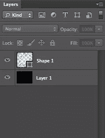](https://www.sitepoint.com/wp-content/uploads/2012/04/Screen-shot-2012-04-24-at-2.02.23-AM.png)

[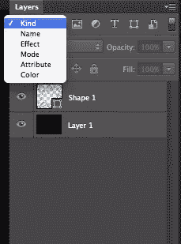](https://www.sitepoint.com/wp-content/uploads/2012/04/Screen-shot-2012-04-24-at-2.02.32-AM.png)

### 结论

Create Suite 的最新版本包含了很多功能，Photoshop CS6 也不例外。他们不仅添加了新的过滤器和功能来简化您的工作，还添加了行业特定的功能来节省大量时间并提高生产率。通过标准进行图层排序和搜索，以及裁剪预设等功能绝对令人惊叹。如果你有一段时间没有升级，或者你正考虑购买 Photoshop 来满足你的图像处理需求，Photoshop CS6 不会让你失望。

你看过 Photoshop CS6 了吗？你怎么想呢?

## 分享这篇文章