# 30 个 jQuery 响应布局插件

> 原文：<https://www.sitepoint.com/30-jquery-responsive-layout-plugins/>

一些最有用的 jQuery 响应式布局插件的详细列表，这些插件被设计者用来为他们的网站设计响应式布局。响应式布局在网页设计领域相对较新，并且由于移动网页设计的流行和屏幕分辨率的提高而变得越来越流行。尽情享受吧！

**相关帖子:**

*   [**10 个 jQuery 插件，帮助快速响应布局**](http://www.jquery4u.com/page-layout/10-jquery-plugins-responsive-layouts/)

## 1.jquery-quickfit

将文本放入其周围容器的一种快速而肮脏的方法。

 [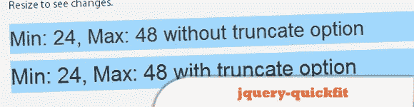](https://github.com/chunksnbits/jquery-quickfit) 
[来源](https://github.com/chunksnbits/jquery-quickfit) [演示](http://chunksnbits.github.com/jquery-quickfit/)

## 2.小屏幕的下拉菜单

五个简单的步骤网站有一个简洁的响应设计。当浏览器窗口较窄时，右上角的菜单会从典型的菜单链接转换为下拉菜单。使用 jQuery，本教程将向您展示如何重新创建它。

 [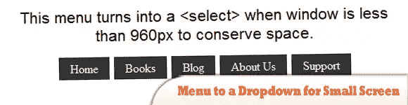](http://css-tricks.com/convert-menu-to-dropdown/) 
[来源](http://css-tricks.com/convert-menu-to-dropdown/) [演示](http://css-tricks.com/examples/ConvertMenuToDropdown/)

## 3.双重拍摄

根据浏览器宽度动态更新图像的 src。从你的 HTML 中的一个小的、移动友好的图像开始。Doubletake 将在必要时使用一组定义的断点来更新映像 src。

 [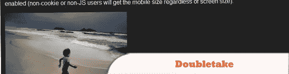](http://www.grahambird.co.uk/lab/doubletake/) 
[来源](http://www.grahambird.co.uk/lab/doubletake/) [演示](http://filamentgroup.com/examples/responsive-images-new/demos/A-Default/demo.html)

## 4.ResponsiveSlides.js

一个很小的 jQuery 插件，使用“ul”中的图像创建一个响应幻灯片。它适用于各种浏览器，包括 IE6 及以上的所有 IE 版本。

 [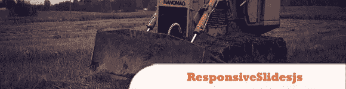](http://responsive-slides.viljamis.com/) 
[源+演示](http://responsive-slides.viljamis.com/)

## 5.jQuery 响应缩略图库

该插件允许我们定义 2 个不同大小的图像，只需设置一个断点宽度，它就会根据屏幕的大小决定显示哪个图像。

  
[源+演示](http://johnpolacek.github.com/ResponsiveThumbnailGallery/)

## 6.rllightbox

是一个 jQuery UI mediabox，可以显示多种类型的内容，如图像、YouTube 和 Vimeo 视频。它有许多独特的功能，如全景和实时调整大小，像其他 jQuery UI 小部件一样，它是 ThemeRoller ready。

 [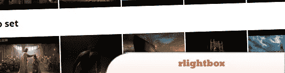](http://ryrych.github.com/rlightbox2/) 
[来源](http://ryrych.github.com/rlightbox2/) [演示](http://ryrych.github.com/rlightbox2/)

## 7.同位素

是一个 jQuery 插件，用于智能的动态布局，这是单靠 CSS 无法实现的。您可以使用 jQuery 选择器轻松隐藏和显示项目元素，并使用排序对项目元素进行重新排序。

 [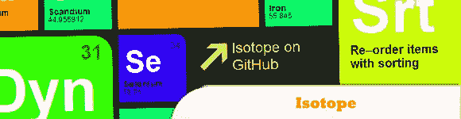](http://isotope.metafizzy.co/index.html) 
[源+演示](http://isotope.metafizzy.co/index.html)

## 8.使用 jQuery 的自动图像蒙太奇

当考虑到某些限制时，如使用全屏时的窗口大小、填充所有可用空间的正确图像编号或使用中的图像大小，以类似蒙太奇的方式排列图像可能是一项具有挑战性的任务。

  
[来源](http://tympanus.net/codrops/2011/08/30/automatic-image-montage/) [演示](http://tympanus.net/Development/AutomaticImageMontage/)

## 9.wmuSlider

这是一个易于设置的响应图像滑块插件。它有导航和分页控制，动画和触摸支持。

  
[源+演示](http://brice.lechatellier.com/code-design/wmuslider/)

## 10.平视网格

抬头网格是一个用于浏览器内网站开发的响应式覆盖网格。它的创建是为了相对容易地适应响应式网页设计的需求。

  
[源+演示](http://bohemianalps.com/tools/grid/)

## 11.适应性媒体

你为什么使用适应性媒体？你的以桌面为中心的图像加载缓慢，而且对于像手机这样的小屏幕设备来说，对你的访问者来说是昂贵的。这就是为什么；您可以为不同的屏幕尺寸创建多个图像，并使用自适应媒体加载它们。

 [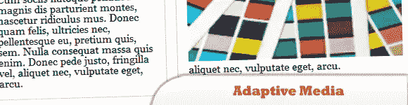](https://web.archive.org/web/20120413151716/http://www.yusufakyol.com:80/adaptivemedia/adaptivemedia.html) 
[来源](https://web.archive.org/web/20120413151716/http://www.yusufakyol.com:80/adaptivemedia/adaptivemedia.html) [演示](https://web.archive.org/web/20120412060826/www.yusufakyol.com/adaptivemedia/bordered.html)

## 12.Hoverizr

一个微小的响应 jQuery 插件，可以在任何目标图像的上面(或下面)输出处理过的图像，并有 3 个内置效果:灰度、模糊和颜色反转。

 [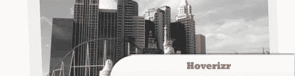](http://www.iliasiovis.com/hoverizr/) 
[源+演示](http://www.iliasiovis.com/hoverizr/)

## 13.廷尼夫足球俱乐部

在小屏幕上浏览时，将“用列表创建的导航”转换为选择下拉列表。它还会自动选择当前页面，并为该项添加 selected="selected"。

 [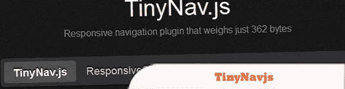](http://tinynav.viljamis.com/) 
[源+演示](http://tinynav.viljamis.com/)

## 14.HTML 中的自适应图像

检测访问者的屏幕大小，并自动创建、缓存和交付设备适当的网页嵌入 HTML 图像的缩放版本。

 [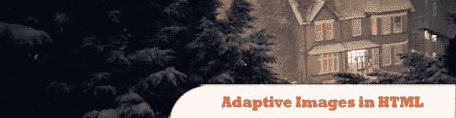](http://adaptive-images.com/) 
[源+演示](http://adaptive-images.com/)

## 15.动态旋转木马

为响应式布局构建的 carousel 插件。

 [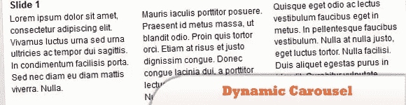](https://github.com/Wilto/Dynamic-Carousel) 
[源+演示](https://github.com/Wilto/Dynamic-Carousel)

## 16.响应菜单

这也是一个简单的 jQuery 插件，用于将基于列表的导航转换为移动设备和低浏览器宽度的选择元素。

 [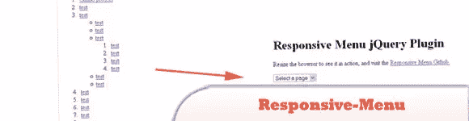](https://github.com/mattkersley/Responsive-Menu) 
[源+演示](https://github.com/mattkersley/Responsive-Menu)

## 17.照片滑动

这是一个 jQuery 移动插件，用于创建专门针对移动设备的图片库。它提供了一个直观的界面，使得与移动网站上的图像进行交互成为可能。

  
[源+演示](http://www.photoswipe.com/)

## 18.scrolldeck.js

有了这个插件，你可以很容易地制作出反应灵敏的幻灯片/演示/登陆页面网站。它包括 scrollorama 提供的漂亮简单的动画。

  
[源+演示](http://johnpolacek.github.com/scrolldeck.js/)

## 19.触摸转盘

是一款移动友好的轻量级 jQuery 内容滚动器，支持移动和桌面的触摸导航。可用作旋转木马、横幅旋转器和图像库。

 [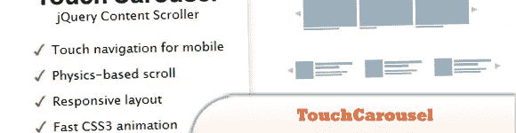](http://codecanyon.net/item/touchcarousel-jquery-content-scroller-and-slider/896401?ref=aliqayyum786) 
[来源](http://codecanyon.net/item/touchcarousel-jquery-content-scroller-and-slider/896401?ref=aliqayyum786) [演示](http://dimsemenov.com/plugins/touchcarousel/)

## 20.使用 jQuery 和 CSS3 的响应性水平布局

这个想法是使每个面板都可以单独滚动，并在单击或从菜单中选择一个内容面板后，在视口的左侧显示该面板的动画。

 [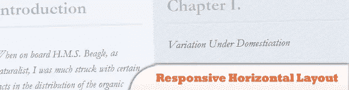](http://magazine.nuefolio.com/2012/04/responsive-horizontal-layout-with-jquery-css3/) 
[来源](http://magazine.nuefolio.com/2012/04/responsive-horizontal-layout-with-jquery-css3/) [演示](http://tympanus.net/Tutorials/ResponsiveHorizontalLayout/)

## 21.Responsly.js

包含一组响应窗口小部件和响应图像滑块是其中之一。这是一个相当简单的滑块，具有键盘导航、间隔、自动启动和上一页导航功能。

 [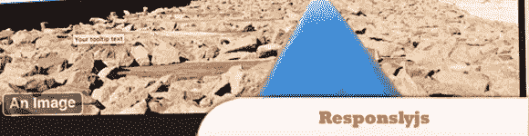](http://dmmalam.github.com/Responsly.js/) 
[源+演示](http://dmmalam.github.com/Responsly.js/)

## 22.照相机

Camera slideshow 是一个基于 Diapo slideshow 的开源项目，但增加了其他功能，如响应、公共方法、皮肤、缓解和更多过渡。

 [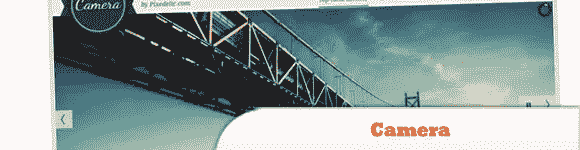](http://www.pixedelic.com/plugins/camera/) 
[源+演示](http://www.pixedelic.com/plugins/camera/)

## 23.UnoSlider

一个完全响应的、支持触摸的、移动优化的 jQuery slider 插件。

  
[源+演示](http://unoslider.heroku.com/)

## 24.FlexSlider(弹性滑动器)

一个反应灵敏的滑块，带有一系列可定制的设置。它支持回调 api，触摸滑动，自定义导航选项，你可以在幻灯片中使用任何 html 元素。

 [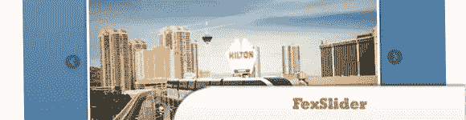](http://www.woothemes.com/flexslider/) 
[来源](http://www.woothemes.com/flexslider/) [演示](http://www.woothemes.com/flexslider/flexslider-demo/)

## 25.瑞士

一个轻量级的移动滑块，具有 1:1 的触摸运动，抗边界，滚动防止，旋转/调整大小和完全不可知的库。

  
[源+演示](http://swipejs.com/)

## 26.蓝莓

一个实验性的开源 jQuery image slider 插件，它是专门为流畅的/响应性的 web 布局而编写的。

  
[源+演示](http://marktyrrell.com/labs/blueberry/)

## 27.断点. js

XOXCO 的黑客和设计师的项目。它为您的响应式设计定义了断点。当浏览器进入或退出断点时，Breakpoints.js 将触发自定义事件。

 [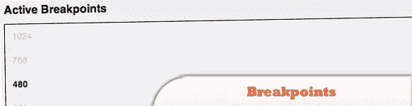](http://xoxco.com/projects/code/breakpoints/) 
[源+演示](http://xoxco.com/projects/code/breakpoints/)

## 28.jQuery 砌体

jQuery 的动态布局插件。这是 CSS 浮动的另一面。而浮动在水平和垂直方向排列元素。

 [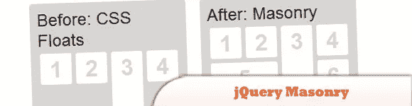](http://masonry.desandro.com/) 
[源+演示](http://masonry.desandro.com/)

## 29.jQuery 响应式 Web

一个 jQuery 插件，通过根据操作系统、浏览器和分辨率向 BODY 类添加动态类，帮助设计更具响应性和适应性的网站。

 [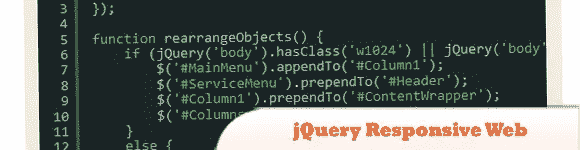](http://stild.com/code/jquery-responsive-web/) 
[源+演示](http://stild.com/code/jquery-responsive-web/)

## 30.回复 JS

一个轻量级的 jQuery 插件，为网页设计者提供了构建响应网站的工具。它通过 HTML5 数据属性，提供了基于断点和服务图像动态交换代码块的语义方法。

  
[源+演示](http://responsejs.com/)

## 分享这篇文章