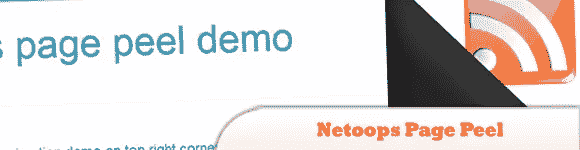
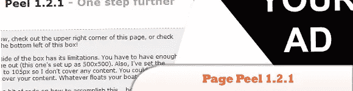
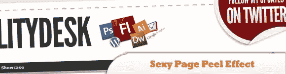
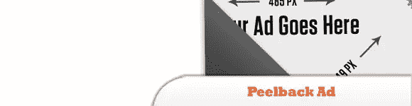

# 10 个 jQuery 页面剥离插件

> 原文：<https://www.sitepoint.com/10-jquery-page-peel-plugins/>

【2016 年 5 月更新:本帖中的部分插件和演示已经不存在，因此已经删除了它们的链接。帖子将会更新新的链接。

我相信你已经看到了 jQuery 页面剥离的效果，看起来就像打开的一本书的一页。这种效果可以应用于网站，例如显示广告、公告、内容、功能、溢价等。以前这些效果是在 Flash 中开发的，现在我们可以简单地使用 jQuery 库来简化它。检查下面的一些插件和教程，并剥离一些乐趣！；)

**相关帖子:**

*   [**20 个类似 Flash 的 jQuery 插件**](http://www.jquery4u.com/plugins/20-flash-like-jquery-plugins/)
*   [**10 jQuery 用户界面插件**](http://www.jquery4u.com/user-interface/10-jquery-user-interface/)

## 1.网络页面剥离

这个网页剥离是用来显示广告，吸引博客访客，他们可能会点击广告，你的收入增加。

  
[来源](http://netoopsblog.blogspot.in/2012/03/pagepeel-jquery-effect-blogger.html)
[演示](http://noop-demo-pagepeel.blogspot.com.au/)

## 2.jQuery 页面剥离 1.2.1

你必须有足够的空间来显示整页(这一页设置为 500×500)。

  
[Demo](http://www.smple.com/pagePeel/)

## 6.如何在 WordPress 中创建页面剥离广告

为你的 wordpress 站点创建页面剥离 Adv 非常简单。在本教程中了解如何操作。

  
[源+演示](http://pcandweb.com/tutorials/how-to-create-page-peel-advertisement-wordpress.html)

## 7.性感页面剥离效果教程& jQuery 插件

使用一些简单的 jQuery 代码，你可以剥开网站的一角，看到下面的信息，就像广告一样。

  
[源+演示](http://usabilitydesk.com/sexy-page-peel-effect-tutorial-jquery-plugin/)

## 9.免费 jQuery 页面剥离脚本

要使用这个脚本，您需要编辑 peel.js 文件，并将您想要使用的链接和图像路径放入其中。

  
[来源](http://www.smartredfox.com/2008/12/corner-page-peel-advert-with-jquery/)
[演示](http://www.smartredfox.com/test/index.htm)

## 10.jQuery 对等广告

这是一个 jQuery 插件，用于向页面添加“peelback”或“peelaway”广告。

  
[来源](https://github.com/robflaherty/jQuery-Peelback)
[演示](http://www.ravelrumba.com/code/demos/jquery-peelback/demo/)

## 分享这篇文章