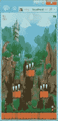
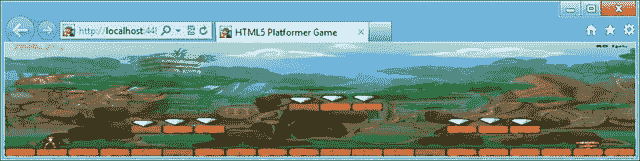
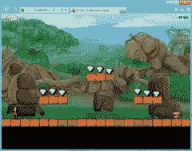
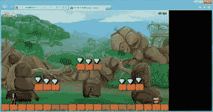
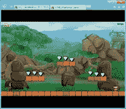
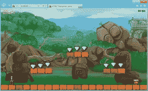
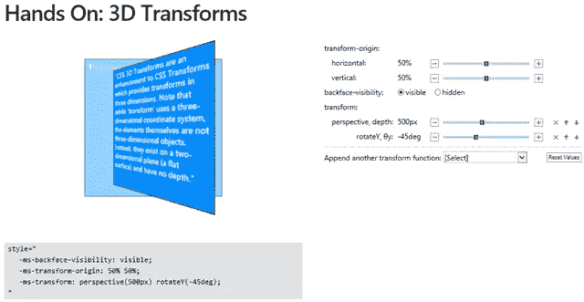

# 现代化你的 HTML5 画布游戏

> 原文：<https://www.sitepoint.com/modernize-your-html5-canvas-game/>

像 Internet Explorer 10 这样的现代浏览器正在实现一些有趣的 HTML5 功能的稳定版本，包括**离线应用编程接口(API)、拖放、**和**文件 API** 。这些功能将我们带入一个网络应用和新兴游戏场景的新时代。

在这篇由两部分组成的文章中，我将展示我如何使用这些新特性来更新我的上一个 HTML5 游戏 [HTML5 Platformer](http://blogs.msdn.com/b/davrous/archive/2012/03/21/html5-platformer-the-complete-port-of-the-xna-game-to-lt-canvas-gt-with-easeljs.aspx) 。希望你能为你自己的游戏获得一些新的想法！

**第 1 部分:**硬件扩展和 CSS3
第 2 部分:离线、文件和拖放 API(下一篇文章)

注意:URL 演示在本文末尾。请随意使用您最喜欢的浏览器进行游戏，并查看 IE10 游戏视频。源代码可以在第 2 部分下载。

## 跨设备扩展

如果您正在构建一个 HTML5 游戏，您可能会对这种标准编程语言的跨平台特性感兴趣。但是兼容多种设备意味着你必须考虑大量的分辨率。与 SVG 相比，Canvas——起初——似乎没有准备好处理这个问题。

然而，对于一个基于精灵的休闲游戏，有一个简单的解决方案可以实现。David Catuhe 在他的博客上对此做了很好的描述，[释放 HTML 5 Canvas 在游戏中的力量——第 1 部分](http://blogs.msdn.com/b/eternalcoding/archive/2012/03/22/unleash-the-power-of-html-5-canvas-for-gaming-part-1.aspx)(具体请参见“使用硬件扩展特性”一节)。

这个想法既简单又聪明。您以固定的、可预测的分辨率在画布中工作，并使用 canvas.style 属性将其拉伸到当前显示的分辨率。

### 步骤 1:拉伸

以我的小 HTML5 平台游戏为例，资产和关卡逻辑已经设置为 800×480。因此，如果我想填充 1080p 屏幕或 1366×768 平板电脑，我需要构建更高分辨率的资产来匹配这些规格。

在构建所有这些资产之前，我可以尝试缩放操作——以及适当的反走样——以提高图像质量。让我们试一试。
缩放操作只需要以下代码:

```
window.addEventListener("resize", OnResizeCalled, false);

function OnResizeCalled() {
    canvas.style.width = window.innerWidth + 'px';
    canvas.style.height = window.innerHeight + 'px';
}

```

就是这样！

有了硬件加速的浏览器，这个操作将由你的 GPU 免费完成。甚至可以启用抗锯齿。这就是为什么大卫·卡图赫认为值得在他的画布表现文章中提及它。

顺便说一下，这一招并不是 HTML5 特有的。大多数现代主机游戏不是以 720p 或 1080p 进行内部计算的；几乎所有这些都以较低的分辨率(如 1024×600)进行渲染，并让 GPU 处理缩放/抗锯齿过程。在大多数情况下，这里描述的方法可以帮助您提高每秒帧数(FPS)。

但这一行动本身就引发了一个比例问题。事实上，当画布的大小固定为 800×480 时，比例是可控的。现在，我在调整浏览器窗口大小时得到这个奇怪的结果:

 

这款游戏仍可玩，但显然远非最佳。

### 控制你的比例

这里的想法是控制当调整浏览器窗口大小时，屏幕是如何填充的。如果窗口太大，我将在右边添加一些空白空间，如果窗口太高，我将在底部添加一些空白空间，而不是进一步拉伸。下面是代码:

```
var gameWidth = window.innerWidth;
var gameHeight = window.innerHeight;
var scaleToFitX = gameWidth / 800;
var scaleToFitY = gameHeight / 480;

var currentScreenRatio = gameWidth / gameHeight;
var optimalRatio = Math.min(scaleToFitX, scaleToFitY);

if (currentScreenRatio >= 1.77 && currentScreenRatio 
“如果”语句创建了一个例外:如果你在浏览器中按 F11 切换到全屏观看，并且你已经有了一个 16:9 的屏幕(像我的 1920x1080 索尼 VAIO Z 屏幕或 1366x768 三星 BUILD 平板电脑)，游戏将完全被拉伸。这次经历非常棒。
如果没有这个异常，您将看到以下类型的输出:
 
注意游戏下方和右侧的黑色区域，控制着比率。如果游戏居中，给它一个宽屏电影效果，那就更好了，对吧？让我们开始吧。
步骤 3:用 CSS3 网格布局将游戏居中
将 HTML 元素居中有时会很痛苦。有几种方法可以做到这一点——网络上有大量的资源可以提供帮助。
我喜欢使用一个名为 [CSS 网格布局](http://dev.w3.org/csswg/css3-grid-layout/)的新规范(目前只有 IE10 支持)，这是我们在 Windows 8 中 Metro 风格布局的基础。
使用 CSS 网格布局将元素居中很简单:

```

*   将容器的显示切换到 display:grid。
*   定义 1 列和 1 行。
*   使用列对齐和行对齐属性将内部元素居中。

下面是我的例子中使用的 CSS:

```
.canvasHolder {
    width: 100%;
    height: 100%;
    display: -ms-grid;
    -ms-grid-columns: 1fr;
    -ms-grid-rows: 1fr;
}

#platformerCanvas {
    -ms-grid-column: 1;
    -ms-grid-row: 1;
    -ms-grid-column-align: center;
    -ms-grid-row-align: center;
}

```

你会注意到 IE10 的前缀是“-ms”。Mozilla 最近宣布他们也将在 2012 年支持 Firefox 的 CSS 网格布局规范，这是个好消息。与此同时，这种居中技巧只适用于 IE10。它看起来是这样的:




IE10 窗口将显示垂直或水平的黑条，就像你在电视屏幕上看到的一样。在其他浏览器中，结果将与步骤 2 相匹配，因为 CSS3 网格布局规范将被忽略。

## 使用平滑动画

现在我们用一个简单的缩放操作处理多个分辨率，当用户调整窗口大小时播放一个平滑的过渡会很好。在每个关卡加载的时候播放一个很酷的动画也是很棒的。为此，我们将使用 CSS3 过渡和 CSS3 3D 变换工具。在大多数平台上，硬件加速是由 GPU 提供的。

### 动画显示对画布样式属性所做的每个更改

CSS3 过渡易于使用，并产生流畅，高效的动画。要了解如何使用它们，你可以阅读我同事的精彩文章，[CSS3 转换介绍](http://blogs.msdn.com/b/eternalcoding/archive/2011/12/06/css3-transitions.aspx)，或者在我们的 Internet Explorer 测试网站上玩一玩，[动手:转换](http://ie.microsoft.com/testdrive/Graphics/hands-on-css3/hands-on_transitions.htm)。

[](https://www.sitepoint.com/wp-content/uploads/2012/04/81.png)

```
#platformerCanvas {
    -ms-grid-column: 1;
    -ms-grid-row: 1;
    -ms-grid-column-align: center;
    -ms-grid-row-align: center;

    -ms-transition-property: all;
    -ms-transition-duration: 1s;
    -ms-transition-timing-function: ease;
}

```

ID 为“ *platformerCanvas* ”的画布现在将自动在由缓动功能生成的一秒钟动画中反映对其样式属性所做的任何更改。由于这个新规则，调整浏览器窗口的大小可以通过平滑的动画来减小/增大画布的大小。我喜欢它产生的效果——所有这些只用了 3 行 CSS。
**注意:**为了兼容，我还添加了不同的前缀(-moz、-webkit 和-o，分别代表 Mozilla、webkit 和 Opera)。你应该记得做同样的事情。

### 在每一关之间建立一个很酷的动画

现在，我想使用 CSS3 的三维转换，暂时使画布消失。这将通过在 Y 轴上动画旋转 90 度来完成。一旦动画旋转 90 度并回到初始位置(旋转 0 度)，我将加载下一级。为了更好地了解效果，您可以在 Internet Explorer 试驾网站上体验我们的[动手:3D 变形](http://ie.microsoft.com/testdrive/Graphics/hands-on-css3/hands-on_3d-transforms.htm):

我们还将使用 scale 和 rotateY 属性来创建一个有趣的动画。为此，我添加了两个 CSS 规则，并针对两个类:

```
.moveRotation
{
    -ms-transform: perspective(500px) rotateY(-90deg) scale(0.1);
    -webkit-transform: perspective(500px) scale(0);
    -moz-transform: perspective(500px) rotateY(-90deg) scale(0.1);
}

.initialRotation
{
    -ms-transform: perspective(500px) rotateY(0deg) scale(1);
    -webkit-transform: perspective(500px) scale(1);
    -moz-transform: perspective(500px) rotateY(0deg) scale(1);
}

```

首先，我的画布设置了 initialRotation 类:

```
<canvas id="platformerCanvas" width="800" height="480" class="initialRotation"></canvas>
```

现在的想法是等到玩家击败当前水平。完成后，我们将画布的类别从*初始旋转*改为*移动旋转*。这将自动触发我们之前设置的 CSS3 转换来生成动画。

为了知道动画何时完成，会引发一个事件。它在每个浏览器中的名称都不同。下面是我用来注册事件和定位 IE10、Firefox、WebKit 和 Opera 的代码:

```
// Registering to the various browsers vendors transition end event
PlatformerGame.prototype.registerTransitionEndEvents = function () {
    // IE10, Firefox, Chrome & Safari, Opera
    this.platformerGameStage.canvas.addEventListener("MSTransitionEnd", onTransitionEnd(this));
    this.platformerGameStage.canvas.addEventListener("transitionend", onTransitionEnd(this));
    this.platformerGameStage.canvas.addEventListener("webkitTransitionEnd", onTransitionEnd(this));
    this.platformerGameStage.canvas.addEventListener("OTransitionEnd", onTransitionEnd(this));
};
And here is the code that will be called back:
// Function called when the transition has ended
// We're then loading the next level
function onTransitionEnd(instance) {
    return function () {
        if (instance.loadNextLevel === true) {
            instance.LoadNextLevel();
        }
    }
};

```

最后，下面是我的游戏在画布上设置 moveRotation 类的代码:

```
// Perform the appropriate action to advance the game and
// to get the player back to playing.
PlatformerGame.prototype.HandleInput = function () {
    if (!this.wasContinuePressed && this.continuePressed) {
        if (!this.level.Hero.IsAlive) {
            this.level.StartNewLife();
        }
        else if (this.level.TimeRemaining == 0) {
            if (this.level.ReachedExit) {
                // If CSS3 Transitions is supported
                // We're using smooth & nice effects between each levels
                if (Modernizr.csstransitions) {
                    this.loadNextLevel = true;
                    // Setting the moveRotation class will trigger the css transition
                    this.platformerGameStage.canvas.className = "moveRotation";
                }
                // If CSS3 Transition is not supported, we're jumping directly
                // to the next level
                else {
                    this.LoadNextLevel();
                }
            }
            else
                this.ReloadCurrentLevel();
        }
        this.platformerGameStage.removeChild(statusBitmap);
        overlayDisplayed = false;
    }

    this.wasContinuePressed = this.continuePressed;
};

```

注意，我使用 Modernizr 对 CSS 转换进行特征检测。我们最终在 LoadNextLevel 函数中设置了 initialRotation 类:

```
// Loading the next level 
PlatformerGame.prototype.LoadNextLevel = function () {
    this.loadNextLevel = false;
    // Setting back the initialRotation class will trigger the transition
    this.platformerGameStage.canvas.className = "initialRotation";
    // ... loadNextLevel logic stuff...
};
```

**注意:**你可能已经注意到，在我之前的 CSS 块中，我没有为 WebKit 设置与 IE10 和 Firefox 相同的转换(和动画)。这是因为，在我看来，Chrome 不会像 IE10 和 Firefox 11 那样运行。我在 [jsFiddle](https://jsfiddle.net/5H8wg/2/) 上建立了一个简单的复制案例。

## 演示视频和 URL

这里有一个简短的视频演示了本文中涉及的 IE10 特性:
[](https://www.sitepoint.com/wp-content/uploads/2012/04/9.jpg)

你也可以在 IE10 或者你最喜欢的浏览器这里玩这个演示: [Modern HTML5 Platformer](https://david.blob.core.windows.net/modernhtml5platformer/index.html) 。
T3

在本文的下一部分，我将展示如何实现离线 API 以使我的游戏在没有网络连接的情况下工作，以及拖放 API 如何创建另一个很酷的特性。

## 分享这篇文章