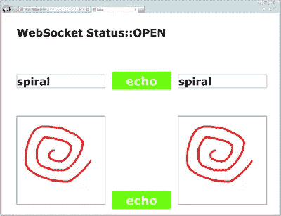
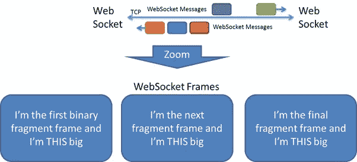
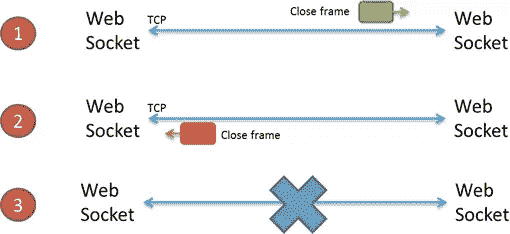
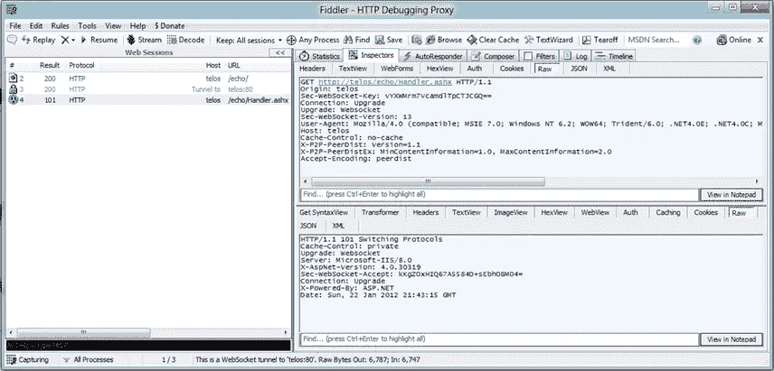
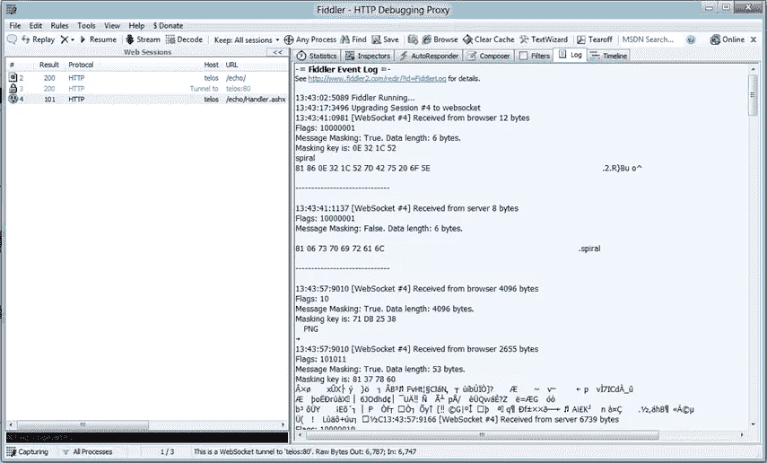

# WebSockets:稳定且可供开发者使用

> 原文：<https://www.sitepoint.com/websockets-stable-and-ready-for-developers/>

WebSockets 是稳定的，开发人员可以开始创建创新的应用程序和服务。本教程提供了对 W3C [WebSocket API](https://www.w3.org/TR/websockets/) 及其底层 [WebSocket 协议](http://www.rfc-editor.org/rfc/rfc6455.txt)的简单介绍。更新的[动画书演示](https://websockets.interop.msftlabs.com/flipbook/)使用最新版本的 API 和协议。

工作组已经取得了重大进展，WebSocket API 是 W3C 的候选推荐标准。 [Internet Explorer 10](http://www.ietestdrive.com/) 实现了这个版本的规范。你可以在这里了解[规格的演变。](http://blogs.msdn.com/b/ie/archive/2011/09/15/site-ready-websockets.aspx)

WebSockets 使 Web 应用程序能够在浏览器中传递实时通知和更新。开发人员在解决浏览器原始 HTTP 请求-响应模型中的限制时遇到了问题，该模型不是为实时场景设计的。WebSockets 使浏览器能够打开与服务的双向、全双工通信通道。然后，每一端都可以使用该通道立即向另一端发送数据。现在，从社交网络和游戏到金融网站的网站可以提供更好的实时场景，最好是在不同的浏览器上使用相同的标记。

## 使用 Echo 示例介绍 WebSocket API

下面的代码片段使用了一个用 ASP。NET 的[系统。Web.WebSockets](http://msdn.microsoft.com/en-us/library/hh160729(v=vs.110).aspx) 名称空间来回显从应用程序发送的文本和二进制消息。该应用程序允许用户键入要作为文本消息发送和回显的文本，或者绘制可以作为二进制消息发送和回显的图片。



对于一个更复杂的例子，允许您试验 WebSockets 和 HTTP 轮询之间的延迟和性能差异，请参见[动画书演示](https://websockets.interop.msftlabs.com/flipbook/)。

## 连接到 WebSocket 服务器的详细信息

这个简单的解释基于应用程序和服务器之间的直接连接。如果配置了代理，那么 IE10 通过向代理发送 HTTP 连接请求来启动该过程。

创建 WebSocket 对象时，客户端和服务器之间会交换一次握手，以建立 WebSocket 连接。


IE10 通过向服务器发送 HTTP 请求来启动该过程:

```
GET /echo HTTP/1.1
Host: example.microsoft.com
Upgrade: websocket
Connection: Upgrade
Sec-WebSocket-Key: dGhlIHNhbXBsZSBub25jZQ==
Origin: http://microsoft.com
Sec-WebSocket-Version: 13
```

让我们来看看这个请求的每一部分。连接过程从一个标准的 HTTP GET 请求开始，该请求允许请求穿越防火墙、代理和其他中介:

```
GET /echo HTTP/1.1
Host: example.microsoft.com
```

HTTP 升级头请求服务器将应用层协议从 HTTP 切换到 WebSocket 协议。

```
Upgrade: websocket
Connection: Upgrade
```

服务器在其响应中转换 Sec-WebSocket-Key 头中的值，以证明它理解 WebSocket 协议:

```
Sec-WebSocket-Key: dGhlIHNhbXBsZSBub25jZQ==
```

IE10 设置了 Origin 报头，以允许服务器实施基于起源的安全性。

```
Origin: http://microsoft.com
```

Sec-WebSocket-Version 头标识所请求的协议版本。版本 13 是 IETF 建议标准的最终版本:

```
Sec-WebSocket-Version: 13
```

如果服务器接受升级应用层协议的请求，它将返回 HTTP 101 交换协议响应:


```
HTTP/1.1 101 Switching Protocols
Upgrade: websocket
Connection: Upgrade
```

为了证明它理解 WebSocket 协议，服务器对来自客户端请求的 Sec-WebSocket-Key 执行标准化转换，并在 Sec-WebSocket-Accept 头中返回结果:

```
Sec-WebSocket-Accept: s3pPLMBiTxaQ9kYGzzhZRbK+xOo=
```

IE10 然后将 Sec-WebSocket-Key 与 Sec-WebSocket-Accept 进行比较，以验证该服务器是一个 WebSocket 服务器，而不是一个夸大其词的 HTTP 服务器。

客户端握手在 IE10 和服务器之间建立了 HTTP-on-TCP 连接。在服务器返回它的 101 响应后，应用层协议从 HTTP 切换到使用先前建立的 TCP 连接的 WebSockets。

**HTTP 在这一点上完全出局了。**使用轻量级 WebSocket wire 协议，消息现在可以在任何时候由任一端点发送或接收。


## 编程连接到 WebSocket 服务器

WebSocket 协议定义了两个类似于 HTTP 方案的新的 URI 方案。

*   " ws:" "//"主机[":"端口]路径["？query ]是基于“http:”模式建模的。它的默认端口是 80。它用于不安全(未加密)的连接。
*   " wss:" "//"主机[":"端口]路径["？query ]是基于“https:”模式建模的。它的默认端口是 443。它用于通过[传输层安全](http://tools.ietf.org/html/rfc2818)隧道的安全连接。

当存在代理或网络中介时，安全连接成功的概率更高，因为中介不太倾向于尝试转换安全流量。

以下代码片段建立了一个 WebSocket 连接:

```
var host = "ws://example.microsoft.com";
var socket = new WebSocket(host);
```

## 就绪状态–就绪…设置…开始…

WebSocket.readyState 属性表示连接的状态:连接、打开、关闭或关闭。当首次创建 WebSocket 时，readyState 被设置为 CONNECTING。当连接建立后，readyState 被设置为 OPEN。如果连接建立失败，那么 readyState 被设置为 CLOSED。

## 注册开放事件

为了在创建连接时接收通知，应用程序必须注册 open 事件。

```
socket.onopen = function (openEvent) {
document.getElementById("serverStatus").innerHTML = 'Web Socket State::' + 'OPEN';
};
```

## 发送和接收消息背后的细节

成功握手后，应用程序和 Websocket 服务器可以交换 WebSocket 消息。消息由一个或多个消息片段或数据“帧”组成

每一帧包括如下信息:

*   帧长度
*   消息第一帧中的消息类型(二进制或文本)
*   指示这是否是消息中的最后一帧的标志(FIN)



IE10 将帧重组为完整的消息，然后将其传递给脚本。

## 编程发送和接收消息

`send` API 允许应用程序以 UTF 8 文本、数组缓冲区或 Blobs 的形式向 Websocket 服务器发送消息。

例如，这个代码片段检索用户输入的文本，并将其作为 UTF-8 文本消息发送给服务器，以便得到回应。它验证 Websocket 是否处于打开的就绪状态:

```
function sendTextMessage() {
	if (socket.readyState != WebSocket.OPEN)
		return;
	var e = document.getElementById("textmessage");
	socket.send(e.value);
}

```

该代码片段检索用户在画布上绘制的图像，并将其作为二进制消息发送给服务器:

```
function sendBinaryMessage() {
	if (socket.readyState != WebSocket.OPEN)
		return;
	var sourceCanvas = document.getElementById('source');
	// msToBlob returns a blob object from a canvas image or drawing
	socket.send(sourceCanvas.msToBlob());
	// ...
}

```

## 注册消息事件

要接收消息，应用程序必须注册消息事件。事件处理程序接收包含 MessageEvent.data 中的数据的 MessageEvent。数据可以作为文本或二进制消息接收。

收到二进制消息时，WebSocket.binaryType 属性控制消息数据是作为 Blob 还是 ArrayBuffer 数据类型返回。该属性可以设置为“blob”或“arraybuffer”以下示例使用默认值“blob”

这个代码片段从 websocket 服务器接收回显的图像或文本。如果数据是一个 Blob，则返回一个图像并在目标画布中绘制；
否则，将返回 UTF-8 文本消息，并显示在文本字段中。

```
socket.onmessage = function (messageEvent) {
	if (messageEvent.data instanceof Blob) {
		var destinationCanvas = document.getElementById('destination');
		var destinationContext = destinationCanvas.getContext('2d');
		var image = new Image();
		image.onload = function () {
			destinationContext.clearRect(0, 0, destinationCanvas.width, destinationCanvas.height);
			destinationContext.drawImage(image, 0, 0);
		}
		image.src = URL.createObjectURL(messageEvent.data);
	} else {
		document.getElementById("textresponse").value = messageEvent.data;
	}
};
```

## 关闭 WebSocket 连接的详细信息

和开场握手类似，还有收尾握手。任一端点(应用程序或服务器)都可以发起这个握手。一种特殊的帧——封闭帧——被发送到另一个端点。关闭框架可能包含可选的状态代码和关闭原因。协议为状态代码定义了一组适当的值。关闭帧的发送方不得在关闭帧之后发送进一步的应用程序数据。
当另一个端点收到关闭帧时，它会以自己的关闭帧作为响应。它可以在用关闭帧响应之前发送未决消息。



## 编程关闭 WebSocket 并注册关闭事件

应用程序使用 close API 在打开的连接上启动关闭握手:

```
socket.close(1000, "normal close");
```

要在连接关闭时接收通知，应用程序必须注册 close 事件。

```
socket.onclose = function (closeEvent) {
	document.getElementById("serverStatus").innerHTML = 'Web Socket State::' + 'CLOSED';
};
```

close API 接受两个可选参数:由协议定义的状态代码和描述。状态代码必须是 1000 或在 3000 到 4999 的范围内。执行 close 时，readyState 属性设置为 CLOSING。IE10 收到来自服务器的关闭响应后，readyState 属性被设置为 CLOSED，并触发一个关闭事件。

## 使用 Fiddler 查看 WebSockets 流量

[Fiddler](http://www.fiddler2.com/fiddler2/) 是一个流行的 HTTP 调试代理。最新版本对 WebSocket 协议有一些支持。您可以检查在 WebSocket 握手中交换的头:



还记录了所有 WebSocket 消息。在下面的截图中，你可以看到“螺旋”作为 UTF-8 的文本信息被发送到服务器，并被回显:



## 结论

如果您想了解更多关于 WebSockets 的信息，您可以观看 2011 年 9 月 Microsoft //Build/ conference 上的这些会议:

*   [使用 HTML5 WebSockets 构建实时 Web 应用](http://channel9.msdn.com/events/BUILD/BUILD2011/PLAT-373C)
*   [使用 IIS、ASP.NET 和 WCF 通过 WebSockets 构建实时 Web 应用](http://channel9.msdn.com/events/BUILD/BUILD2011/SAC-807T)
*   [构建 Windows 运行时套接字应用](http://channel9.msdn.com/Events/BUILD/BUILD2011/PLAT-580T)

如果你对使用微软技术创建 WebSocket 服务感兴趣，这些帖子是很好的介绍:

*   [Windows 8 开发者预览版 WebSockets 入门](http://www.paulbatum.com/2011/09/getting-started-with-websockets-in.html)
*   [了解系统。一个简单的 ASP.NET 回应服务器](http://www.paulbatum.com/2011/10/getting-to-know-systemnetwebsockets.html)

立即开始使用 WebSockets 进行开发！
<small>[电插座](http://www.shutterstock.com/cat.mhtml?lang=en&search_source=search_form&version=llv1&anyorall=all&safesearch=1&searchterm=sockets&search_group=#id=34520161&src=45c66e58381057476152b535894b1502-1-25)图像快门</small>

## 分享这篇文章