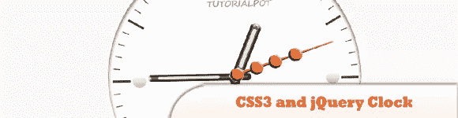
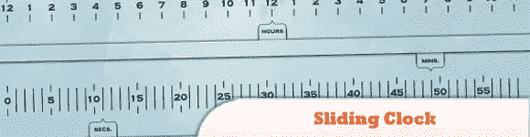
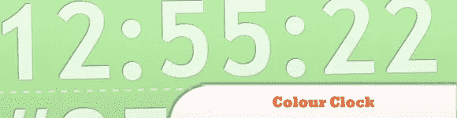
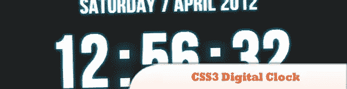
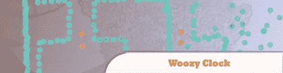
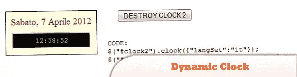
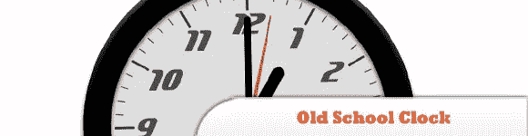
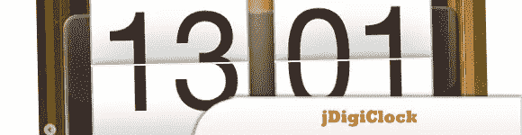
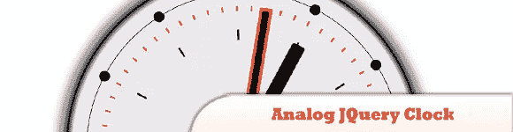
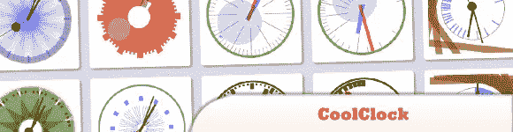

# 10+酷 jQuery 时钟教程(模拟和数字)

> 原文：<https://www.sitepoint.com/10-cool-jquery-clock-tutorials-analog-digital/>

今天的帖子是我们认为最酷的 **jQuery 模拟和数字时钟教程**的综述，通过这些教程，你可以让你的网站变得现代并且总是准时！享受吧。

**相关帖子:**

*   [**10 jQuery 日历和时钟选择器插件**](http://www.jquery4u.com/jquery-date-and-time-2/10-jquery-calendar-clock-picker-plugin-collections/)
*   [**创建自己的 jQuery 数字钟**](http://www.jquery4u.com/snippets/create-jquery-digital-clock-jquery4u/)

## 1.CSS3 和 jQuery 时钟

我们将简单地在 Photoshop 中创建一个时钟图像，并为每只手提供不同的图像。jQuery 脚本将每 1000 毫秒更新一次旋转位置，因此在三只手的每一只手上都创建了旋转效果。

  
[来源](http://tutorialpot.com/2011/09/creating-a-css3-and-jquery-clock/) [演示](http://demo.tutorialpot.com/jQueryclock/)

## 2.使用 JavaScript 和 CSS 旋转的 HTML 时钟

没有 Adobe Flash 文件或我心爱的画布，只有普通的 div 和 img 标签。它的工作方式是在一个{ overflow: hidden } div 中获取这些图像，并通过 JavaScript 使用建议的 CSS transform 属性旋转它们。

  
[源+演示](http://joncom.be/code/css-clocks/)

## 3.jQuery 滑动时钟

这是我做的一个 html/jQuery 时钟，它根据当前的日期和时间沿着刻度移动幻灯片。

  
[来源](http://doodleaday.wordpress.com/2009/10/03/doodle-231-jquery-sliding-clock/) [演示](http://home.comcast.net/~vonholdt/test/clock_slide/index.htm)

## 4.带有 CSS 和 jQuery 的彩色时钟

我们将制作一个丰富多彩的 jQuery 和 CSS 时钟，它将帮助您跟踪一年中宝贵的最后几秒钟。

  
[来源](http://tutorialzine.com/2009/12/colorful-clock-jquery-css/) [演示](http://demo.tutorialzine.com/2009/12/colorful-clock-jquery-css/demo.html)

## 5.彩色时钟–jQuery/CSS3 重建

最初的彩色时钟是杰克·休斯用十六进制数值表示时间的绝妙想法。我用 jQuery/CSS3 重建了彩色时钟。

  
[来源](http://www.joelpeterson.com/blog/2011/03/colour-clock-jquerycss3-rebuild/) [演示](http://www.joelpeterson.com/clock/)

## 6.带 jQuery 的 CSS3 数字钟

在本教程中，我想在 jQuery 脚本和 CSS3 的帮助下创建一个简单的带日期和时间的数字时钟，并制作一个小动画，理解各种方法并以最佳方式使用您的创造力并不难。

  
[来源](http://www.alessioatzeni.com/blog/css3-digital-clock-with-jquery/) [演示](http://www.alessioatzeni.com/wp-content/tutorials/jquery/CSS3-digital-clock/index.html)

## 7.jQuery Woozy 时钟

jQuery woozy clock 是一个数字时间动画表示..

  
[源+演示](http://www.sabiland.net/Home/JQueryPlugins)

## 8.jQuery 动态时钟插件

将给定的 div 元素变成每秒更新一次的动态时钟，与其他类似的插件相比，这个插件的主要优点是它还可以使用初始时间戳而不是客户端系统时间。

  
[来源](https://github.com/Lwangaman/jQuery-Clock-Plugin) [演示](http://jsbin.com/ugapo3/72)

## 9.带有 CSS3 和 jQuery 的老式时钟

变换:旋转是 CSS 3 的一个新特性，可以让你…嗯，旋转东西。Transform 还允许您缩放、倾斜和平移(移动)网页中的对象。所有这些都可以通过 Transition 属性来设置动画(包括缓动和持续时间)。

  
[来源](http://css-tricks.com/css3-clock/) [演示](http://css-tricks.com/examples/CSS3Clock/)

## 10.jDigiClock

是一个 jQuery 插件，其灵感来自独特的 HTC Hero Clock 小部件。对于这样一个看起来复杂的插件，安装起来非常容易，并且提供了…

  
[源+演示](http://www.radoslavdimov.com/jquery-plugins/jquery-plugin-digiclock/)

## 11.模拟 JQuery 时钟

在本教程中，我们将使用 JQuery 和一个名为 jQueryRotate 的插件。制作这款腕表的主要理念是根据实际时间 tt/mm/ss 旋转三幅图像。…

  
[来源](http://d-zig.com/Desc.aspx?item=74) [演示](http://d-zig.com/demo/46e3ec48-0f71-4615-8798-61cd83266659/)

## 12.jQuery 中的酷时钟

CoolClock 是一个可定制的 JavaScript 模拟时钟。虽然这个插件使用 SVG 来绘制模拟时钟，但是使用 jQuery 来绘制。它有很多皮肤可供选择。也支持数字钟。

  
[来源](http://randomibis.com/coolclock/) [演示](http://randomibis.com/coolclock/demos/demo2.html)

## 分享这篇文章