# 如何设计一个有效的公司吉祥物

> 原文：<https://www.sitepoint.com/how-to-design-an-effective-company-mascot/>

在当今不断发展的经济中，越来越多的企业正在寻求创新的方式来联系潜在的客户和顾客。虽然一些集团仍然坚持传统的广告方法，但其他集团正在使用 Twitter 和 YouTube 等最新的社交媒体向新的潜在客户介绍自己，并使他们的公司“人性化”。虽然这些方法可能非常有效，但还有一种趋势正在成为一种流行而强大的方式，让你的品牌人性化，并与你的支持者建立友好关系——这些角色是企业的吉祥物。

一些公司可能没有意识到这一点，但如今拥有一个吉祥物和拥有一个标志一样重要(而且可能更重要)。为你的企业使用吉祥物不仅能增加你被注意的机会，还能让你的企业更加令人难忘。不相信我？然后想想像麦当劳和汉堡王这样著名的公司，它们都使用吉祥物来创造更大的品牌知名度。Geico 壁虎甚至米老鼠是另外两个广受欢迎、广为人知的吉祥物。吉祥物不仅仅是大公司的专利；即使是最小的公司也能从拥有一个有趣、友好的业务代言人中受益。二月份，DesignFestival 刊登了 Jean-Pierre Gassin 的一篇文章，展示了 [30 个拥有令人敬畏的吉祥物](https://www.sitepoint.com/30-websites-with-awesome-mascots/)的网站，今天我将向你展示如何通过 Photoshop 创建一个你自己的角色。

出于本教程的目的，我将创建一个角色，作为一家名为“设计怪兽”的专门从事数字设计的虚假在线企业的吉祥物现在我知道了企业的名称和他们选择的行业，我可以开始了。这是最终设计的样子:

[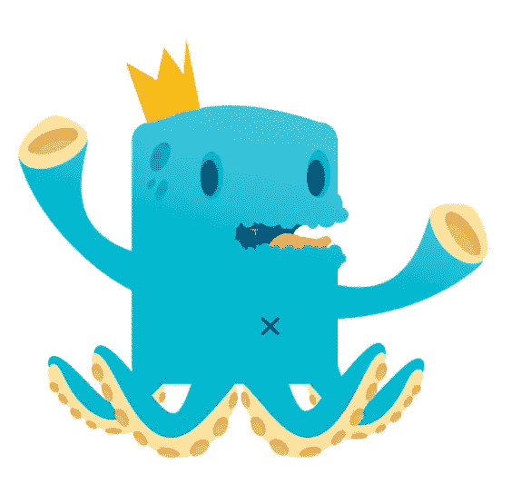](https://www.sitepoint.com/wp-content/uploads/2012/04/step-18.png)

### 步骤 1:画布设置

首先设置你的画布，我的分辨率是 1200 x 900，设置为 314。

[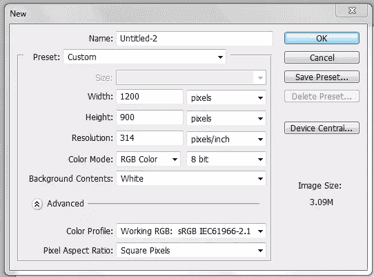](https://www.sitepoint.com/wp-content/uploads/2012/04/step-1.png)

### 第二步:基本形状

如果我不用草图，我总是用基本的形状来创作我的角色。要开始创建角色的基本形状，请选择钢笔工具或按键盘上的“P”。完成后，在工具栏的顶部选择“圆角矩形工具”

[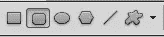](https://www.sitepoint.com/wp-content/uploads/2012/04/step-2-1.png)

使用你选择的颜色(或者在我的例子中是#39cce2)，在画布中央创建一个中等大小的圆角矩形。

[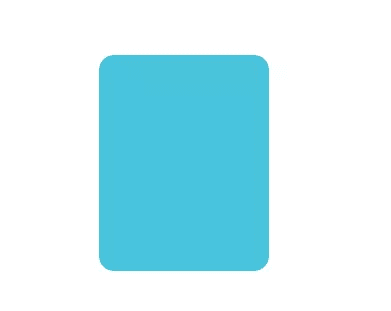](https://www.sitepoint.com/wp-content/uploads/2012/04/step-2-2.png)

### 步骤 3:钢笔工具锚定

为了给我们的角色一个更明确的形状，我们需要在我们角色的头顶添加一个驼峰。要做到这一点，点击你的钢笔工具图标，保持鼠标在那里，直到你的菜单弹出，并选择“添加锚点工具。”

[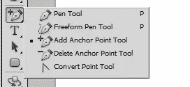](https://www.sitepoint.com/wp-content/uploads/2012/04/step-3.png)

在你的形状顶部创建一个锚点，然后向上拖动锚点，直到你有一个驼峰。

### 第四步:嘴型

为了开始创造我们的嘴，我们需要先剪下一部分蓝色。但是，在我们这样做之前，我们需要栅格化我们的矢量形状。右键点击你的图层，选择“栅格化图层”

采取选框工具，确保它是在默认的矩形。选择要为嘴剪切的部分，然后按 delete 键。你可以在下面看到你现在应该有的。

[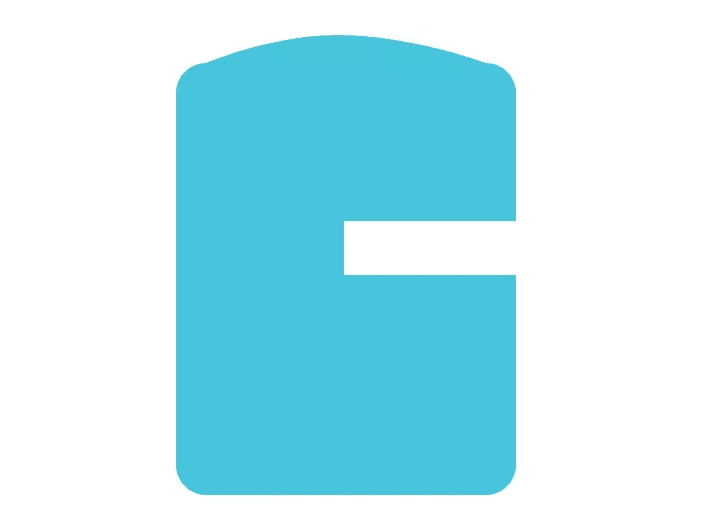](https://www.sitepoint.com/wp-content/uploads/2012/04/step-4-1.png)

### 嘴唇

现在我们已经有了大致的口型，我们可以开始制作嘴唇了。要做到这一点，只需使用椭圆工具(你可以像使用圆角矩形工具一样使用它)，开始在嘴部周围画一些小圆圈。

重复这个动作，直到嘴的周围被完全覆盖。

### 第六步:手臂

我将赋予这个角色长长的波浪形手臂，为了做到这一点，我不仅需要使用圆角矩形工具，还需要使用扭曲工具。从制作一个从身体延伸出来的细长矩形开始。

[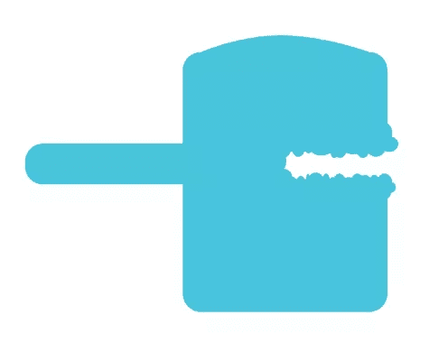](https://www.sitepoint.com/wp-content/uploads/2012/04/step-6.png)

接下来，转到“编辑”>“变换”>“扭曲”，开始操纵手臂，直到它弯曲。记得在你把你的手臂弯曲到你想要的程度后，按下“回车”键。

[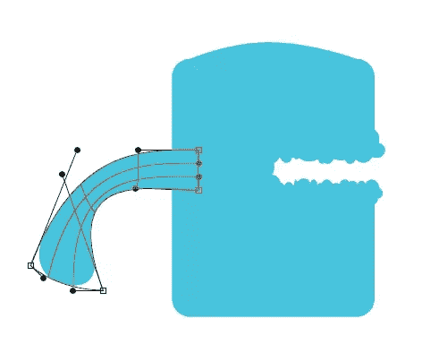](https://www.sitepoint.com/wp-content/uploads/2012/04/step-6-1.png)

### 步骤 7:复制和旋转

复制你的手臂，这样你现在有两个相同的形状，然后旋转双臂，这样“拳头”就直立起来了。

[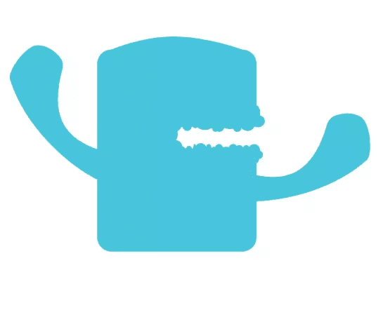](https://www.sitepoint.com/wp-content/uploads/2012/04/step-7.png)

### 第八步:腿

正如你所看到的，我正在构建的吉祥物是一个怪物，所以我想保持怪物类型的主题，并创建更像触角的腿。为了达到这个效果，我们将使用与创建手臂相同的方法，但是我将使用椭圆而不是圆角矩形。

### 步骤 9:栅格化

现在我们已经有了角色的大致形状，我们需要栅格化所有的矢量形状并将它们合并在一起。确保不要合并背景；为了防止这种情况发生，请隐藏背景图层，并在栅格化完成后使其再次可见。

[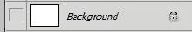](https://www.sitepoint.com/wp-content/uploads/2012/04/step-9.png)

### 第十步:渐变

有些人喜欢在他们完成后做阴影和细节，但是因为我们已经有了完整的基本形状并合并为一层，我现在想添加我的渐变。右键单击或双击你的层，使混合选项提示出现。选择“渐变叠加”框，然后点击渐变，这样会出现一个单独的菜单。选择用于创建角色的颜色，然后单击“确定”。

[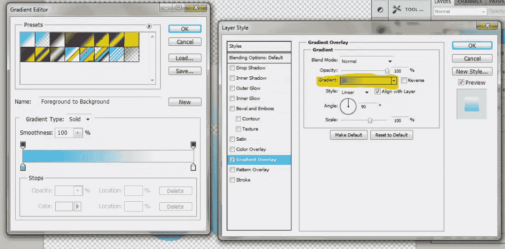](https://www.sitepoint.com/wp-content/uploads/2012/04/step-10-1.png)

改变你的混合模式为乘法，然后点击确定。

[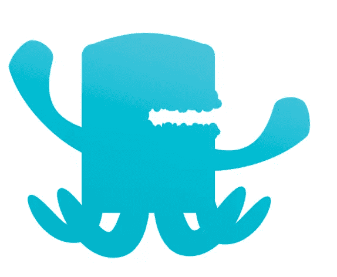](https://www.sitepoint.com/wp-content/uploads/2012/04/step-10-2.png)

### 第十一步:口腔内部

选择颜色#006084，创建一个椭圆形的嘴。完成后，将这一层移动到身体层下面，这样它就在所有东西的后面。这是我们角色嘴巴内部的开始。

[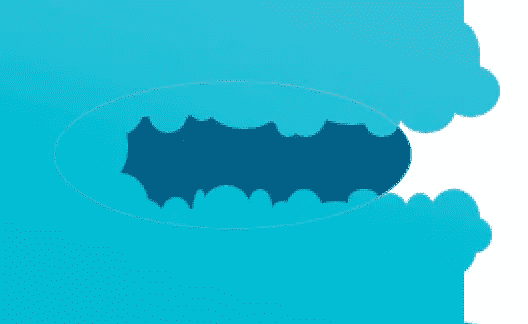](https://www.sitepoint.com/wp-content/uploads/2012/04/step-11.png)

添加一个锚，如步骤 3 所示，向内拉椭圆的边缘，这样你就有了一条曲线。

[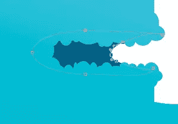](https://www.sitepoint.com/wp-content/uploads/2012/04/step-11-1.png)

### 第十二步:修整口腔

使用钢笔工具创建喉咙口和悬雍垂来完成口腔内部。确保打开了“形状层”选项。

[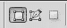](https://www.sitepoint.com/wp-content/uploads/2012/04/step-12.png)

[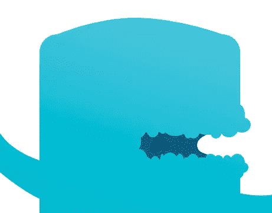](https://www.sitepoint.com/wp-content/uploads/2012/04/step-12-2.png)

### 第十三步:触角

现在，因为我们的角色基础的触角相互融合，我需要让它们看起来像独立的实体。要做到这一点，我将创建一个对比下部分与#ffe29e 重复的方法使用矢量形状和扭曲工具，以获得我想要的形状。

[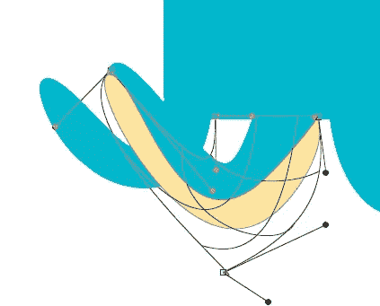](https://www.sitepoint.com/wp-content/uploads/2012/04/step-13-1.png)

将这种技术应用到所有的腿上，这样你就有了类似下图的东西。请注意，为了做后腿，你需要栅格化你的矢量形状，并删除前面两条腿重叠的部分。

[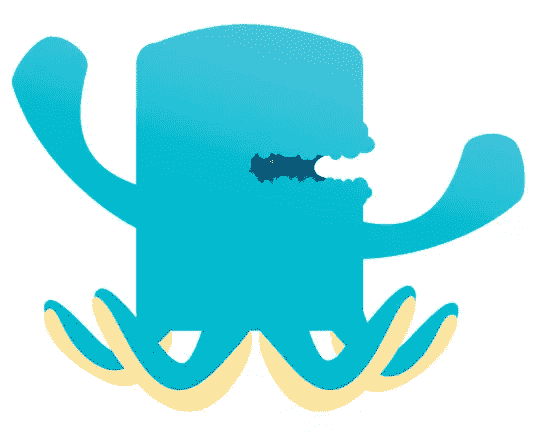](https://www.sitepoint.com/wp-content/uploads/2012/04/step-13-2.png)

### 第十四步:手

我们将为我们的角色的“拳头”的触须使用与触须下面相同的颜色。再次，使用椭圆和扭曲工具，操纵你的椭圆，直到它符合“拳头”的形状两个拳头都这样做。

[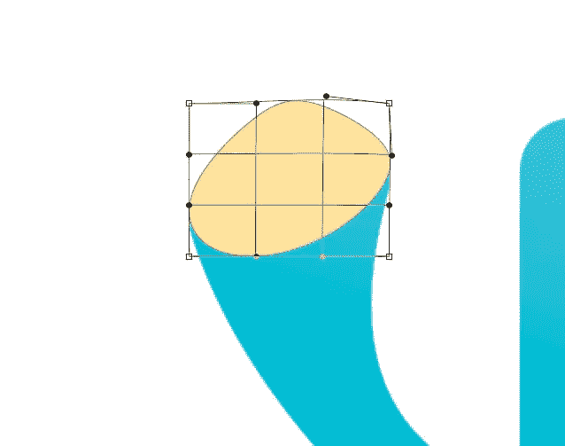](https://www.sitepoint.com/wp-content/uploads/2012/04/step-14.png)

### 第十五步:眼睛

用#009dd1 为眼睛创建两个椭圆。

[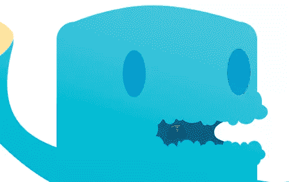](https://www.sitepoint.com/wp-content/uploads/2012/04/step-15.png)

使用#026085 创建两个较小的椭圆，如下图所示，给怪物的眼睛添加深度。

[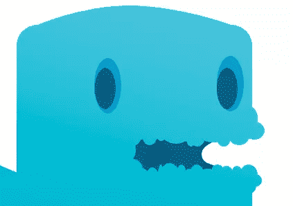](https://www.sitepoint.com/wp-content/uploads/2012/04/step-15-1.png)

### 触手吸盘

在触须的下方创建小椭圆；这些将成为你的吸盘。

[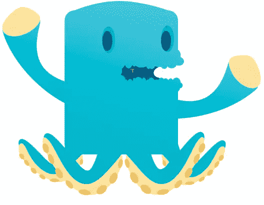](https://www.sitepoint.com/wp-content/uploads/2012/04/step-16.png)

为了让吸盘看起来不那么平，我们将使用混合选项。选择内阴影，改变颜色为#d49e29，根据下图改变设置。

[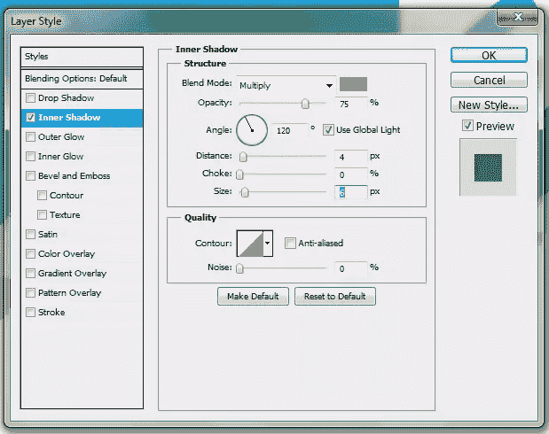](https://www.sitepoint.com/wp-content/uploads/2012/04/step-16-1.png)

[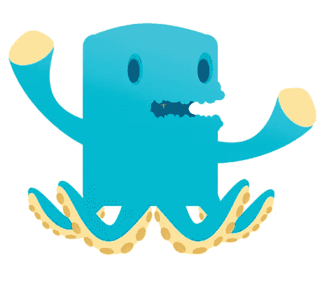](https://www.sitepoint.com/wp-content/uploads/2012/04/step-16-2.png)

### 手吸盘

重复相同的步骤，在触手的腿上创建吸盘，但这次只创建两个大椭圆放在手上。打开混合选项菜单，改变如下所示的设置。

[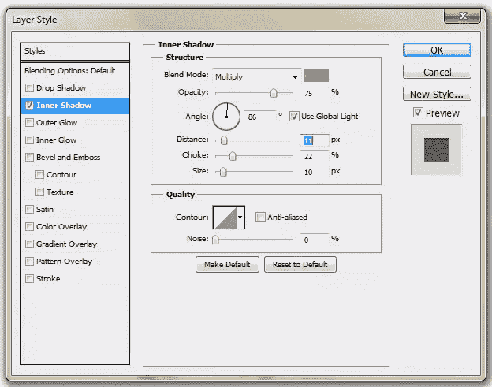](https://www.sitepoint.com/wp-content/uploads/2012/04/step-17.png)

完成后，它应该是这样的:

[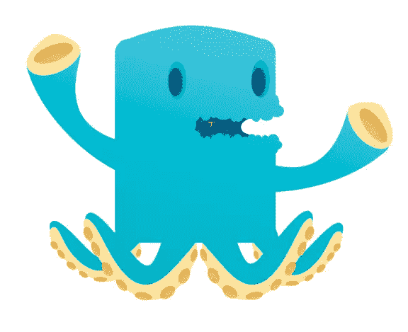](https://www.sitepoint.com/wp-content/uploads/2012/04/step-17-1.png)

### 步骤 18:完成细节

完成添加您想要的任何其他细节和收尾工作。我创建了一些斑点，添加了一个舌头，在怪物的头上放置了一个皇冠，并添加了一个肚脐，以获得我的最终图像。

### 第 19 步:把你的角色添加到你的网站上

[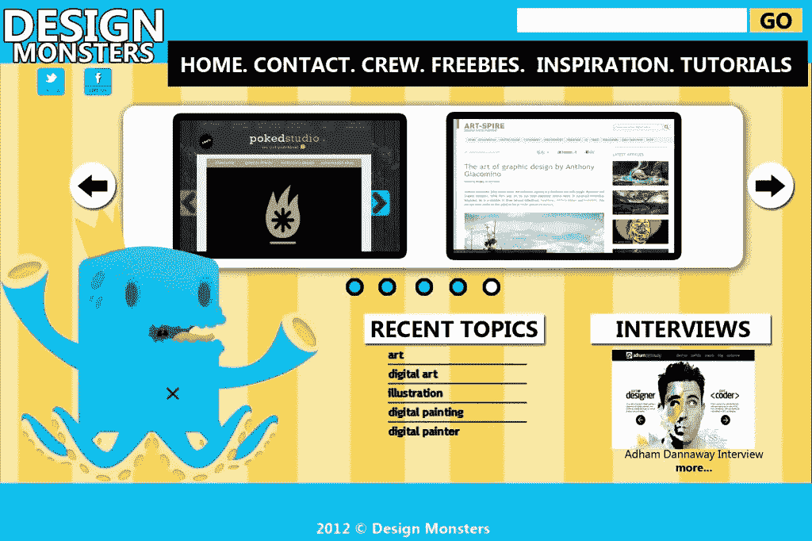](https://www.sitepoint.com/wp-content/uploads/2012/04/design-monster-layout.jpg)

### 结论

为你的网站创造角色是吸引好奇访客的一种有趣而有效的方式。有大量的方法可以使用各种方法来创建它们；我只给你看了一个。如果你发现自己在为企业设计角色，这里有一些有用的建议。利用企业的名称或服务来创造你的吉祥物。尝试勾画出各种缩略图，直到你得到你喜欢的东西。别担心，你不必拘泥于你画的东西；这种方法只是让你的创造力源源不断的一种方式。如果你喜欢使用矢量图像，你总是可以把你的 PSD 转换成。eps 或者。ai 文件如果你有 Illustrator，或者你可以用 Illustrator 代替 Photoshop 直接设计你的角色，选择权在你。我希望你已经学会了一些新技术，并将自己进行实验。如果你有任何问题或想分享你自己的角色，我很乐意看到他们。快乐人物设计大家！

你有什么可以炫耀的角色设计吗？你认为吉祥物是昙花一现的时尚，还是昨日标志的更难忘、更友好的版本？

## 分享这篇文章