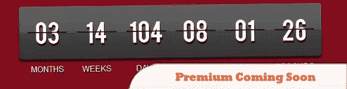
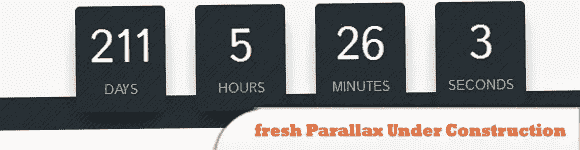
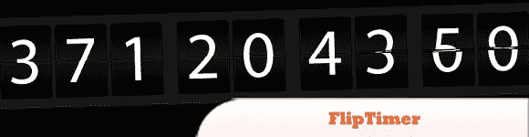
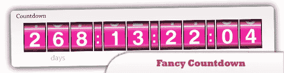
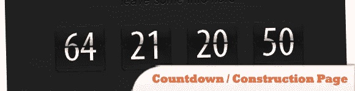
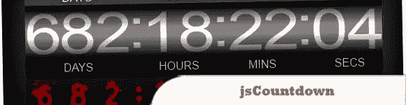

# 10 个超酷的 jQuery 倒计时脚本

> 原文：<https://www.sitepoint.com/10-cool-premium-jquery-countdown-scripts/>

今天的帖子收集了 10 个很酷的“premium”**jQuery 倒计时脚本**，你肯定会发现它们在某个时候对你的网页很有用。享受吧。

**相关帖子:**

*   [**10 个牛逼的 jQuery 倒计时脚本**](http://www.jquery4u.com/image-scripts/10-awesome-jquery-count-scripts/)
*   [**10 jQuery Word/Text 计数器插件**](http://www.jquery4u.com/plugins/10-jquery-wordtext-counter-plugins/)

## 1.5 秒维护模式

6 个漂亮有趣的模板，让你的访问者在你离线时不那么生气。

  
[来源](http://codecanyon.net/item/5sec-maintenance-mode/217881?ref=lvraa)
[演示](http://codecanyon.net/item/5sec-maintenance-mode/full_screen_preview/217881)

## 2.Premium 即将推出——WordPress 插件

新的，现代的，用户友好的倒计时页面，让您的访问者知道你什么时候将推出您的网站。它有一个自定义的倒计时计数器，并有可能创造无限数量的新主题，因为你请。

  
[来源](http://codecanyon.net/item/premium-coming-soon-wordpress-plugin/273445?ref=lvraa)
[演示](http://codecanyon.net/item/premium-coming-soon-wordpress-plugin/full_screen_preview/273445)

## 3.即将推出的登录页面

JavaScript 在建网站专柜！

  
[来源](http://codecanyon.net/item/coming-soon-landing-page/135441?ref=lvraa)
[演示](http://codecanyon.net/item/coming-soon-landing-page/full_screen_preview/135441)

## 4.施工倒计时中的新视差

建设中的新鲜视差升级你的“即将到来”的动态三维多云的天空与你的标志或选择项目的焦点页面。

  
[来源](http://codecanyon.net/item/fresh-parallax-under-construction-countdown/758105?ref=lvraa)
[演示](http://www.version-four.com/choosr/index_frame.php?item=underconstruction)

## 5.FlipTimer

FlipTimer 1.2 有 8 个现成的颜色主题和一个漂亮的模板，包括工作联系表。

  
[来源](http://codecanyon.net/item/fliptimer/106012?ref=lvraa)
[演示](http://codecanyon.net/theme_previews/106012-fliptimer)

## 6.奇特的倒计时——jQuery 插件

这是一个高度可定制的 jQuery 插件，可以让你创建一个出色的倒计时。它非常容易使用。您可以设置自己的时区目标日期。该插件带有一个扩展的 API。

  
[来源](http://codecanyon.net/item/fancy-countdown-jquery-plugin/163489?ref=lvraa)
[演示](http://codecanyon.net/item/fancy-countdown-jquery-plugin/full_screen_preview/163489)

## 7.倒计时/施工页面

易于适应的倒计时，正在建设中。包括便于安装的手册。

  
[来源](http://codecanyon.net/item/countdown-construction-page/310456?ref=lvraa)
[演示](http://codecanyon.net/item/countdown-construction-page/full_screen_preview/310456)

## 8.JavaScript 动画计数器

简单的动画 JavaScript 计数器，它可以让你显示快速增加或减少的数值，如注册用户数，总收入等。

  
[来源](http://codecanyon.net/item/javascript-animated-counter/233648?ref=lvraa)
[演示](http://codecanyon.net/item/javascript-animated-counter/full_screen_preview/233648)

## 9.js 倒计时

包括 14 种不同的皮肤可供选择，还有一个模板文件(png 格式)可以让你自己制作。

  
[来源](http://codecanyon.net/item/jscountdown/91064?ref=lvraa)
[演示](http://codecanyon.net/item/jscountdown/full_screen_preview/91064)

## 10.直播倒计时模块

漂亮的基于 jQuery 的倒计时器。取决于倒计时状态(倒计时或完成)的标题文本。有很多选择。

  
[来源](http://codecanyon.net/item/live-brodcast-countdown-module/1207265?ref=lvraa)
[演示](http://codecanyon.net/item/live-brodcast-countdown-module/full_screen_preview/1207265)

## 分享这篇文章