# 使用 Instagram for Android 拍摄、编辑和分享照片

> 原文：<https://www.sitepoint.com/snap-edit-and-share-photos-with-instagram/>

Instagram 于 2010 年 10 月首次推出，一炮而红。到 2010 年 12 月，它已经有 100 万注册用户，六个月后，他们达到了 500 万用户。现在，Instagram 拥有超过 3000 万注册用户，并被博柏利、耐克甚至格莱美等顶级品牌使用。苹果甚至将 Instagram 评为 2011 年“年度应用”。

Instagram 的流行很大程度上是因为他们充满活力的 iOS 用户社区。现在，Android 用户可以通过 Google Play 上最近推出的 Instagram 应用程序加入照片分享的乐趣。让我们一起来看看 Android 上的 Instagram 是如何工作的。

* * *

* * *

### 首轮放映

当您第一次使用该应用程序时，会出现一个欢迎屏幕。从这里，您可以登录(如果您有一个现有的 iOS 设备 Instagram 帐户)，或者注册该服务。与安卓上的大多数相机共享应用不同，你必须创建一个账户才能使用这个应用。注册该应用需要您的电子邮件以及您选择的用户名和密码。此时，添加您的电话号码或设置个人资料图片是可选的，但是一旦注册完成，您可以将其添加到您的个人资料中。如果您已经有了用户名和密码，登录将直接进入主屏幕。

* * *

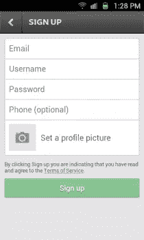

* * *

一旦你注册了，Instagram 会给你三个选项来寻找朋友。您可以从联系人列表、脸书好友或 Twitter 好友中进行选择。无论使用哪种方式，你都会看到 Instagram 上的好友列表。轻按每行上的“关注”按钮来单独关注您的朋友，或者轻按页面右上角的“关注所有人”按钮来关注搜索结果中的每个人。一旦你添加了你的朋友，你会被带到另一个屏幕，有更多的朋友需要添加——insta gram 的推荐用户。您可以点击右上角的“完成”按钮跳过此屏幕。

* * *

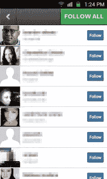

* * *

### 主屏幕

Instagram 的主屏幕分为五个选项卡，下面将详细介绍每个选项卡。

### 你的饲料

* * *

* * *

第一个标签(用主页图标表示)显示您和您朋友的图片。您可以垂直滚动列表，阅读评论，或在每张照片上留下您自己的评论(只需轻按评论气泡按钮)。轻按每张照片下方的心形按钮，将其标记为“喜欢”每张照片的右下角有一条水平线，上面有三个点。如果你点击每张照片下面的这些点，你可以选择删除照片或使用默认的 Android 共享选项来共享照片。轻按朋友照片上的三个圆点，你就可以选择标记它以供查看。我发现这有点不一致。如果你想分享你朋友的照片呢？似乎不太清楚你如何能做到这一点。轻按右上角的“刷新”按钮可刷新您的订阅源，以获取任何新照片。

### 流行的

* * *

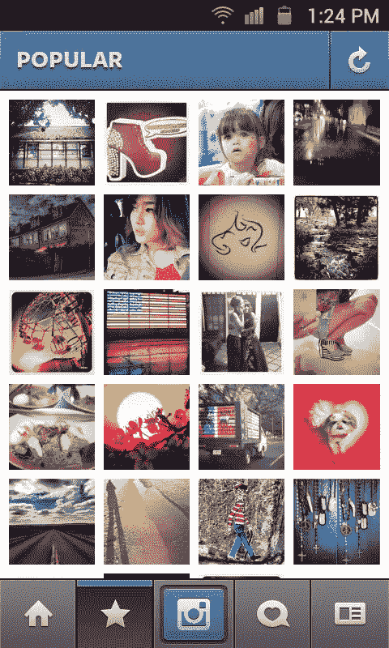

* * *

第二个选项卡(用星形图标表示)显示了 Instagram 上当前最受欢迎的图片的网格。轻按每张照片会将您带到单张照片的页面。在这里，你可以点击心形按钮来“喜欢”照片，你可以点击评论气泡按钮来留下评论，或者你可以点击三个点来标记图像以供查看。在“热门”选项卡和个人照片页面上，点击右上角的“刷新”按钮可刷新页面以获取新信息。

### 照相机

* * *

 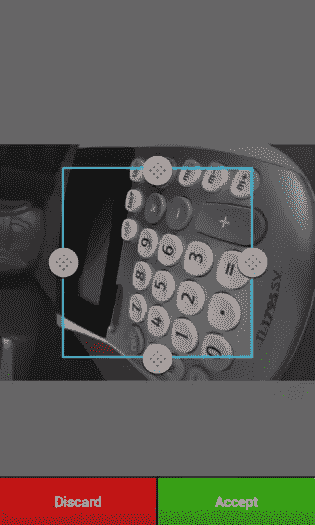

* * *

拍照是 Instagram 的主要特色之一。标签行中间的蓝色按钮可以让你选择 Instagram 的相机或手机上的任何相机应用程序。如果你使用另一个相机应用程序，你可以使用该应用程序拍摄照片，并自动导入 Instagram，在那里你可以添加滤镜，然后将其发布到你的订阅源。Instagram 的“高级相机”(这是它在设置中的说法)的功能与任何普通的相机应用程序一样。如果你的设备有闪光灯或前置摄像头，你会在右上角有图标来访问它们。点击右下角的照片图标，您可以将存储在设备上的照片导入 Instagram 进行编辑。所有图像都被裁剪成正方形，因此您不能包含广角镜头或完整的纵向/横向视图。

* * *

 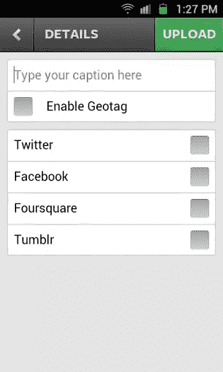

* * *

一旦你有了你的照片，现在你可以开始进行创造性的编辑。顶部的图标允许您切换照片的框架(每个镜头有不同的框架)，调整亮度和对比度(每个镜头也不同)，或顺时针旋转照片(每次轻按 90 度)。在底部，你有 18 个滤镜可以选择，模仿某些怀旧的相机和电影组合。

| 

*   **Normal**
*   **amaro**
*   **Rise**
*   **Hudson**
*   **Sierra**
*   **X-Pro**
*   **低保真**
*   **Early bird**
*   **Sutro**

 | 

*   **Toaster**
*   **brannan**
*   **Ink bottle**
*   **Walden**
*   **Huff**
*   **Valencia**
*   **Nashville**
*   **1977**
*   **Kelvin**

 |

应用镜头和框架后，你可以给照片添加说明或地理标记，然后上传到 Instagram feed 或社交网络(Twitter、脸书、Foursquare、Tumblr)。

### 新闻

* * *

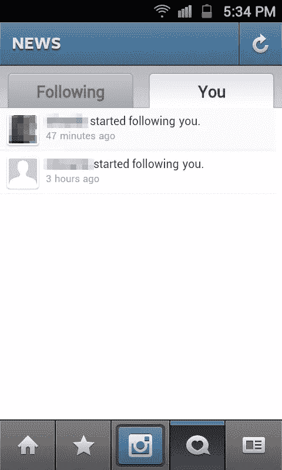

* * *

第四个标签是“新闻”标签，尽管你不会真的从图标中看出来(一个有心形的评论气泡)。在此选项卡上，您可以看到您的关注者的活动源(包括关注他们的人和他们喜欢的照片)以及您自己的活动。点击右上角的刷新按钮可以刷新两个提要。

### 轮廓

* * *

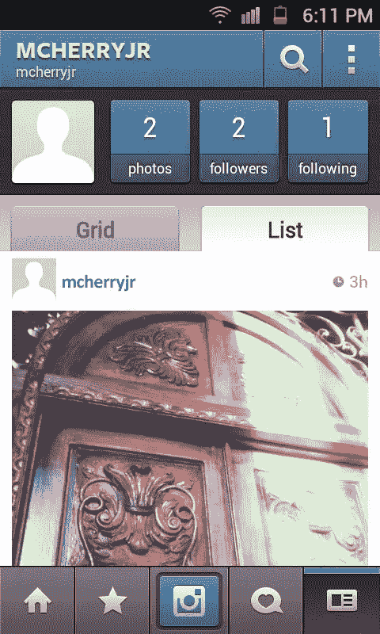

* * *

这里的最后一个选项卡是您的个人资料。从这里你可以看到你的个人资料照片，并检查你的追随者数量。您的照片也可以在这里以网格或列表格式。本页顶部的放大镜可以让你通过用户名或标签搜索 Instagram。标签是使用 hashmark(例如#buildmobile)添加到评论中的超链接单词。

### 设置

点击个人资料页面右上角的按钮，您将进入设置菜单。你可以使用你的地址簿、脸书帐户或 Twitter 帐户在这里找到更多朋友。您可以查看您“喜欢”的照片还可以在这里编辑您的个人资料，添加更多信息(生日、主页网址、性别、简短简历等)。)，编辑你的分享设置和照片隐私，或者启用 Instagram 的“高级相机”。您也可以从该页面上的应用程序中注销。

* * *

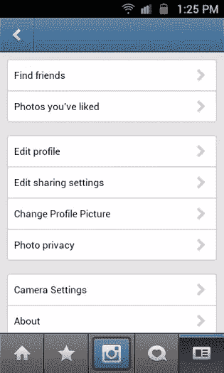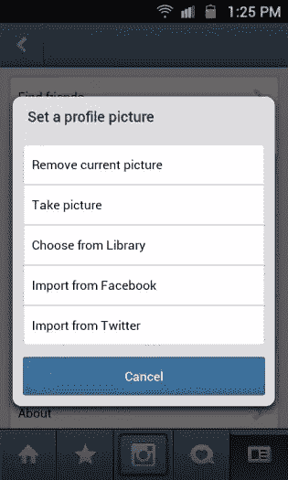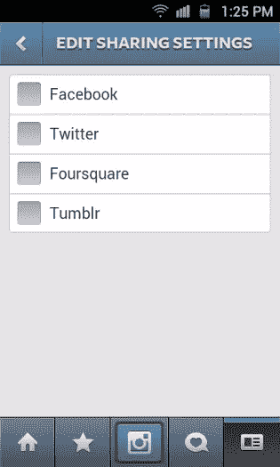
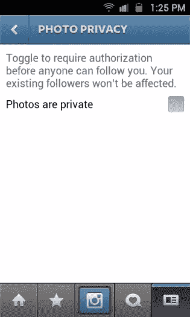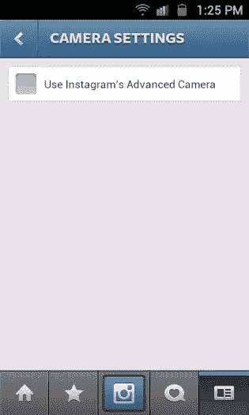

* * *

### 缺点

通过查看这些截图，你可能已经注意到了一件事，那就是对 [Android 设计环境](https://developer.android.com/design/index.html)缺乏关注。Android 有自己的一套模式，比如长按、滑动和多窗格视图。当使用 Android 版 Instagram 应用时，你会有一种感觉，在为用户设计用户界面时，这些都没有被考虑在内。

Android 设计包含一套核心原则，称为“[纯 Android](https://developer.android.com/design/patterns/pure-android.html) ”Instagram 应用程序在其界面中打破了所有这些原则。UI 元素和特定于平台的图标模仿了 iOS 版本的应用程序，有一个持久的底部标签栏，几乎每个页面的左上角都有一个带标签的后退按钮，菜单选项(像在设置页面上)在行项目上使用右指按钮。没有考虑到 Android 专用的搜索软键，在应用程序中后退，甚至菜单按钮。这使得在 Android 上使用该应用程序变得很麻烦，你将花更多的时间在屏幕之间敲击，而不是拍照。

Android 上 Instagram 的其他缺点包括照片的强制裁剪，缺乏像 iOS 中那样的 Flickr 集成，以及无法像关注其他用户一样关注标签。鉴于这是在 Android 上，我也很惊讶该应用程序没有利用 Android 的原生共享菜单。用户只能通过脸书、Twitter、Foursquare 或 Tumblr 分享照片。

当然，Instagram 在 Android 上的最大缺点是，对于当前的 Android 用户来说，它已经晚了一年左右。Google Play 上有几十个模仿 Instagram 的相机应用程序，在大多数情况下，它们改进了其独特的滤镜和镜头。对于那些已经热衷于 Android 相机应用的人来说，Instagram 在安装时可能会有一些最初的新鲜感，但最终实用才是最重要的。

### 结论

Instagram 为 Android 用户带来了艺术镜头、滤镜和照片共享的独特组合。不幸的是，它带来的只有这些。随着 iOS 界面提示和行为被硬塞进 Android 应用程序，用户可能会发现屏幕之间的不断导航是乏味和不必要的。有许多其他(和更好的)相机应用程序可用于 AndroidAndroid 上的 Instagram 提供的太少，而且来得太晚。

* * *

Instagram 在 Google Play 上免费提供，需要 Android OS v2.2 或更高版本才能运行。从下面的谷歌 Play 商店链接或点击提供的 Google Play 徽章下载该应用程序。

[下载 Instagram](https://play.google.com/store/apps/details?id=com.instagram.android)

## 分享这篇文章