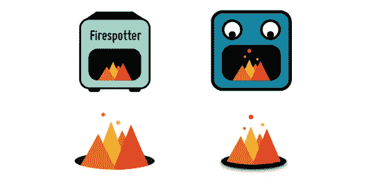
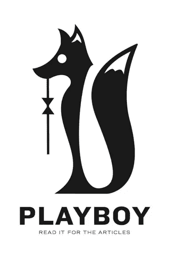
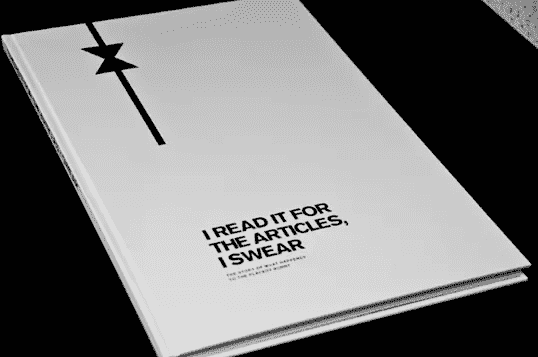
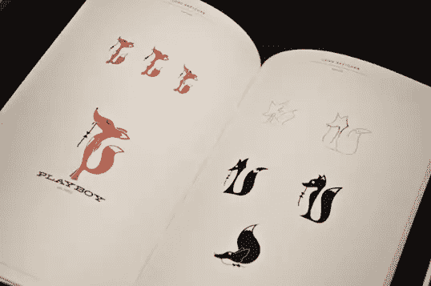

# 特色读者:费尔斯波特实验室的亚历克斯·康奈尔

> 原文：<https://www.sitepoint.com/featured-reader-alex-cornell-of-firespotter-labs/>

亚历克斯·康奈尔是加利福尼亚州旧金山的平面设计师和音乐家。在杜克大学和旧金山艺术学院学习后，亚历克斯加入了谷歌语音的联合创始人克雷格·沃克，成立了谷歌合资企业火石实验室，最近发布了移动应用程序 T2 Nosh T3 和 T4 joly T5。

Alex 的作品组合提供了各种项目，包括图像、视频和交互式多媒体。你可以在亚历克斯的网站上了解他的更多信息，你也可以在推特上关注他。

### 费尔斯波特实验室品牌和身份

### 花花公子品牌重塑实验

 

### Nosh 404 错误页面

[https://player.vimeo.com/video/26858445?title=0&byline=0&portrait=0&color=ffffff](https://player.vimeo.com/video/26858445?title=0&byline=0&portrait=0&color=ffffff)

## 分享这篇文章