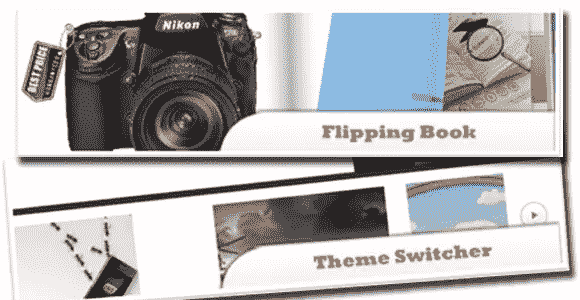
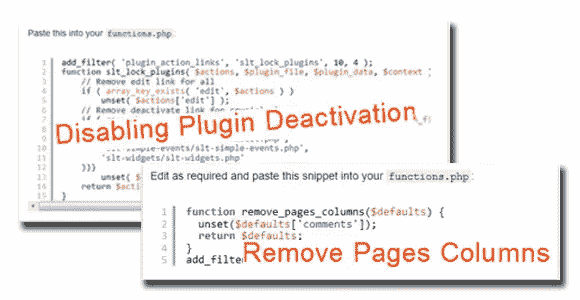
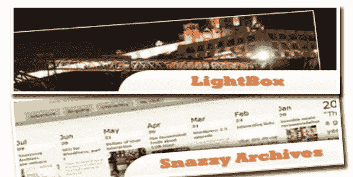
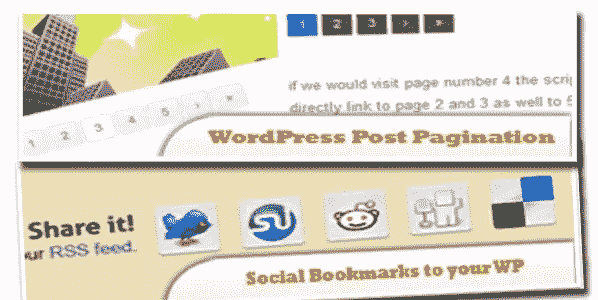
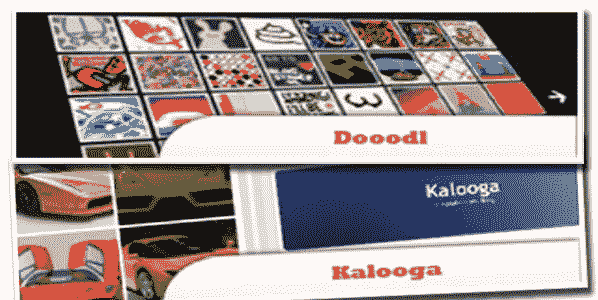
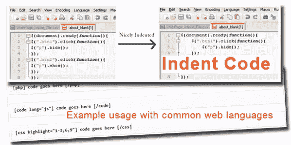
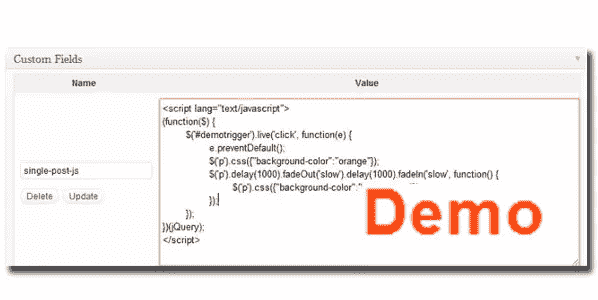

# 100 个 jQuery WordPress 插件

> 原文：<https://www.sitepoint.com/100-jquery-wordpress-plugins/>

我们正在挖掘档案，为你提供用 jQuery 补充 WordPress 所需的资源。尽情享受吧！

**相关帖子:**

*   [**100 个图片/内容的 jQuery 滑块**](http://www.jquery4u.com/plugins/100-jquery-sliders-part1/)
*   [**2500+流行 jQuery 插件目录**](http://www.jquery4u.com/plugins/)

## WordPress 的 10 个最佳 jQuery 插件

结合 WordPress CMS 和 jQuery 的能力，在设计和制作功能丰富的网页方面会给我们带来无限的可能性。这是我们认为的使用 jQuery 的 10 个最好的 WordPress 插件。

  
[来源](http://www.jquery4u.com/plugins/10-jquery-plugins-wordpress/)

## 让 WordPress 对你的客户更友好的 20 个片段和技巧(第 1 部分)

当然，有许多插件可以实现与这些代码片段相同的功能，但是通过代码，您可以获得额外的控制和安全性，并且在大多数情况下，不需要更新。

  
[来源](http://www.jquery4u.com/wordpress/10-wordpress-user-hacks-tips/)

## 10 个终极 jQuery WordPress 插件

jQuery 以其酷和吸引眼球的效果而闻名，WordPress 被认为是最好的博客内容管理系统。最近，我浏览了不同的网站，搜集了一些为 WordPress 定制的最好的 jQuery 插件。所以他们来了！

  
[来源](http://www.jquery4u.com/plugins/10-ultimate-jquery-wordpress-plugins/)

## 10 插件替换 WordPress 教程

下面是一些使用 PHP 和 jQuery 的 WordPress 插件！

  
[来源](http://www.jquery4u.com/plugins/10-plugin-replacing-tutorials-wordpress/)

## 10 个基于图片的 WordPress 插件

这些又酷又酷的图片插件就是为你的网页而设计的！玩得开心！

  
[来源](http://www.jquery4u.com/plugins/10-image-based-wordpress-plugins/)

## 10 个基于滑块的 WordPress 插件

一个基于滑块的 WordPress 插件的集合，它将使你的博客更加动态。

  
[来源](http://www.jquery4u.com/plugins/10-slider-based-wordpress-plugins/)

## 10 个基于 jQuery 的 WordPress 插件

WordPress 开发者最近给我们带来了大量的 jQuery 插件来改进这个奇妙的 CMS！所以我们给你带来了 10 个基于 jQuery 的 WordPress 插件！

  
[来源](http://www.jquery4u.com/plugins/10-jquery-based-wordpress-plugins/)

## 在你的 WordPress 博客中显示 jQuery 源代码

想要在你的 WordPress 博客中包含 jQuery 源代码，而不需要通过一行行的格式编辑来显示源代码片段吗？在这里学习如何！

  
[来源](http://www.jquery4u.com/plugins/show-jquery-source-code-wordpress-blog/)

## 如何给单个 WordPress 帖子添加 JavaScript

如果你想在你的博客上做需要 JavaScript 或 jQuery 运行的演示页面，这可能非常有用。

  
[来源](http://www.jquery4u.com/tutorials/add-javascript-single-wordpress-posts/)

## 免费 jQuery 移动 WordPress 主题

免费的 jQuery Mobile WordPress 主题供您下载和使用！

[来源](Free%20jQuery%20Mobile%20WordPress%20themes%20for%20you%20to%20download%20and%20use!)

## 分享这篇文章